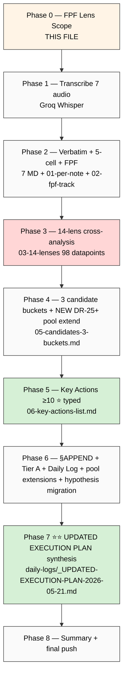

# Phase 0 — FPF Lens Scope (Batch-9)

> Foundation-Pillar-Frame (FPF) lens declaration per `design/JETIX-FPF.md` B.3 — mandatory pre-substrate processing. Per memory `feedback_fpf_lens_first.md`. Per Ruslan ack morning 21.05 — «давай заметки обработаем как обычно, новое блять достать, ебашь».

---

## §1 Object

**Voice Batch-9 corpus** = 7 Ruslan voice notes 21.05 утро→день (04:56 → 13:29), totalling ~50-55 min dictation substrate post-overnight-builds (Hypothesis Architecture 7-layer + KA-03 CRM 169 contacts) + post-Execution-Plan-FINAL-v2 + day-of one-pager goal.

| # | Audio | Date | Time | Size | Context |
|---|---|---|---|---|---|
| 1 | audio_707 | 21.05 | 04:56 | 3.27 MB ⭐ | early-morning long item; likely deep reflection post overnight builds |
| 2 | audio_708 | 21.05 | 11:06 | 1.99 MB | mid-morning kickoff after sleep |
| 3 | audio_709 | 21.05 | 11:39 | 4.11 MB ⭐⭐ | longest item — deep dictation likely strategic |
| 4 | audio_710 | 21.05 | 13:05 | 0.96 MB | lunchtime burst |
| 5 | audio_711 | 21.05 | 13:10 | 0.68 MB | follow-up |
| 6 | audio_712 | 21.05 | 13:17 | 0.82 MB | follow-up |
| 7 | audio_713 | 21.05 | 13:29 | 0.30 MB | short closure |

**Total: ~50-55 min / 12.13 MB / 7 files.**

Cross-ref existing batches (batch-4..8) PRESERVED untouched. Read-only cross-cite only.

---

## §2 FPF layer

- **B.3 F-grade surface:** F2 verbatim (Ruslan voice direct quotes) + F2-F4 brigadier substrate analysis.
- **IP-1 strict:** Foundation роли = U.Episteme abstract; Ruslan = RUSLAN-LAYER instance owner; processing this corpus = abstraction substrate; NOT executor binding.
- **A.6.B append-only:** new namespace `reports/voice-pipeline-2026-05-21-batch-9/`; existing canonical docs §APPEND only (REFLECTION-INBOX, inventory §29, Daily Log 21.05, pool docs).
- **A.14 provenance:** R6 per claim — `[src: audio_NNN claim N]` mandatory.
- **B.3 cross-link = mapping:** corroboration к **14 lenses** including L13 NEW Hypothesis Architecture 7-layer + L14 NEW KA-03 CRM 169 contacts.

---

## §3 Acceptance predicate

Phase 0 + 9 phases complete WHEN:

1. ✅ 9 phases all commit'нуты per-phase + pushed (Phase 0..8)
2. ✅ 7 transcripts generated (Phase 1)
3. ✅ 7 verbatim+5-cell per-audio MD generated (Phase 2) → **35 cell analyses** (7 × 5) в `01-per-note-breakdown.md`
4. ✅ **98 datapoints** (7 × 14 lenses) в `03-14-lenses-cross-analysis.md` (Phase 3) — 14 lenses (12 from batch-8 + L13 Hypothesis arch + L14 KA-03 CRM)
5. ✅ 3 candidate buckets surfaced (Phase 4) с NEW DR candidates appended к research pool DR-25+ (NOT auto-launch)
6. ✅ **≥10 key actions** extracted с per-action metadata + `type:` tag (Phase 5) — P1/P2/P3 ranked + Phase-7-input flagged + Day-goal-21.05 flagged
7. ✅ §APPEND inventory §29 + REFLECTION-INBOX batch-9 (D9-* decisions) + Daily Log 21.05 §APPEND-batch-9 + pool extensions (Phase 6)
8. ✅ **⭐⭐ Updated Execution Plan synthesis** `daily-logs/_UPDATED-EXECUTION-PLAN-2026-05-21.md` (Phase 7) ~3000-4000w integrating ALL substrate sprint 20-21.05 + batch-9 findings
9. ✅ Summary ≤1500w (Phase 8) + final push origin main

**Refuted IF:**
- Any audio mis-attributed (wrong audio_NNN tag)
- Key actions count < 10
- LOCK content (Foundation v1.0 / Pillar C / 8 Octagon LOCK / 5 concept docs F2 / 6 K-research / Platform v2 / Левенчук inventory v2 / Sprint-Synthesis-v2 / 12+2 Tier A/B wikis + 4 §APPEND batch-8 / Distribution Plan master / Левенчук distillation outputs / Hypothesis arch 7-layer / KA-03 CRM) modified outside §APPEND
- Strategic prose written by brigadier (R1 violation)
- SKIP-list O-62 (Fund-of-Humanity) / O-66 (Triple-win) / O-67 (Здесь-и-сейчас) / O-68 (Multi-Modal) автономно promoted to Tier A
- Research-pool pattern broken (any DR auto-launched)
- Phase 7 Updated Execution Plan missing OR not integrating Hypothesis arch + KA-03 + Daily Log 21.05 goal-of-day

---

## §4 Constitutional posture (per-rule)

| Rule | Posture | Application |
|---|---|---|
| **R1** AI does NOT strategize | surface only | brigadier surfaces options; Ruslan = sole strategist; verbatim quotes preserve Ruslan voice |
| **R2** AI does NOT execute architectural decisions автономно | read-only LOCK | Foundation v1.0 / Pillar C / 8 Octagon LOCK / 5 concept docs / Distribution Plan / Левенчук outputs / Hypothesis arch / KA-03 CRM = read-only cross-cite; только §APPEND voice substrate sections |
| **R6** No unstructured long-term memory aggregation | provenance per claim | `[src: audio_NNN claim N]` mandatory per claim |
| **R11** Default-Deny novel actions | active | SKIP-list (O-62/O-66/O-67/O-68) honored — если повторно surface → flag bucket A.3 high-risk SKIP-confirmed; NO autonomous promotion |
| **R12** Anti-extraction paired-frame | enforced | per-outreach/monetization claim → flag если extraction pattern detected; paired-frame discipline в Phase 7 IA items |
| **IP-1** Role≠Executor STRICT | enforced | substrate = U.Episteme abstract; Ruslan = RUSLAN-LAYER instance |
| **EP-5** F-grade explicit | enforced | F2 verbatim / F2-F4 substrate analysis explicit per claim |
| **FPF lens FIRST** | enforced | this Phase 0 file = lens-FIRST mandate |
| **append-only** | enforced | new namespace + §APPEND existing |
| **AP-6** dissent preservation | enforced | если Ruslan surface conflicting positions across audio → preserve both, не resolve автономно |
| **Research-pool pattern** | enforced | NEW DR candidates → append к `_RESEARCH-CANDIDATES-POOL-2026-05-20.md` DR-25+; NO auto-launch |

---

## §5 SKIP-list honor

Per PLAN-OF-DAY 20.05 + batch-6/7/8 acks:

- ❌ **O-62 Fund-of-Humanity** — acked SKIP 19.05 evening (constitutional review pending)
- ⏸️ **O-66 Triple-win positioning** — additional gate required
- ⏸️ **O-67 «Здесь-и-сейчас» systemic pause** — additional gate required
- ⏸️ **O-68 Multi-modal methods palette** — additional gate required

**Если повторно surface** в batch-9 → flag в bucket A.3 (high-risk SKIP-confirmed) с verbatim quote preservation, NO autonomous promotion.

---

## §6 LOCK-preservation manifest (read-only cross-cite source)

Files NEVER modified outside §APPEND substrate sections:

**Foundation / constitutional:**
- `swarm/wiki/foundations/` (Parts 1-11 + principles/) — Foundation v1.0 LOCKED 2026-04-28
- `decisions/JETIX-VISION-FUNDAMENTAL-2026-04-27.md`
- `design/JETIX-FPF.md`
- `shared/schemas/`
- `.claude/config/default-deny-table.yaml`

**8 Octagon LOCK records:**
- 8 H1-H8 strategic concept LOCKs

**5 acked concept docs F2 (+1 sense-of-measure):**
- `wiki/concepts/fpf-as-info-transfer-vocabulary.md`
- `wiki/concepts/mastery-formula.md`
- `wiki/concepts/persistence-beats-talent.md`
- `wiki/concepts/method-systems-thinking.md`
- `wiki/concepts/jetix-as-exokortex.md`
- `wiki/concepts/sense-of-measure.md`

**Tier A/B wikis (12 base + batch-8 §APPEND):**
- 9 Tier A wikis (sprint 16-19.05)
- 3 batch-6 Tier B wikis
- 3 batch-7 wikis (partnership-baseline / mastery-formula / persistence-beats-talent)
- 2 batch-7-fixation wikis (cheat-code-positioning / project-of-humanity-positioning)
- 4 §APPEND batch-8 voice substrate (education-meta-method / optimism / etc.)

**Distribution Plan substrate (Step 4 — locked 20.05 afternoon):**
- `decisions/strategic/DISTRIBUTION-PLAN-2026-05-20.md` (5000w master)
- `reports/distribution-plan-research-2026-05-20/` (5 research docs + 4 mermaid)

**Левенчук distillation substrate (Step 3 — locked 20.05 afternoon):**
- `research/levenchuk-books-distillation-2026-05-20/` (Summary + 5 per-book + cross-link matrix + DE-RU glossary + 3 mermaid)
- `raw/external/levenchuk-books-2026-05-20/converted/` (5 books full text)

**Sprint synthesis:**
- `reports/sprint-synthesis-v2-2026-05-19-evening/` (4 docs)
- `research/levenchuk-corpus-inventory-v2-2026-05-19-evening/`

**Overnight builds 20.05 evening (NEW LOCK substrate):**
- **Hypothesis Architecture 7-layer:** `hypotheses/` first-class dir + 9 schemas + 4 templates + 5 status dirs + 5 starter samples (H-001..H-005) + 9 skills (`/hypothesis-{add,update,close,dash,search,stuck,link,build-table,alpha-state}`) + 7 docs + 2 mermaid + Excel/CSV table layer + OMG Essence alpha-machinery + FPF F-G-R + CRM-style overlay + inline daily log integration
- **KA-03 CRM compile:** 93 NEW entries / 169 total (141 persons + 28 orgs); 7 L1 + 35 L2 + 51 L3 segmentation; Tier-1 ack queue 14 names (Karpathy / Olah / Kaplan / Gabdulin / Sapunov / Markov / Fridman / Naval / Buterin / Amodei / Berlin Senate / МИМ / Open Phil / etc.)

**Execution Plan predecessor:**
- `daily-logs/_EXECUTION-PLAN-FINAL-2026-05-20-evening.md` (7 A-actions A-1..A-7)

**Daily Log 21.05:**
- `daily-logs/_DAILY-LOG-2026-05-21.md` — goal-of-day: one-pager + детальные документы / пояснения / use cases / audience framings для продвижения

**Pool documents (extendable via append only — research-pool pattern):**
- `reports/voice-pipeline-2026-05-20-batch-7/_RESEARCH-CANDIDATES-POOL-2026-05-20.md` (DR-9..DR-24, 17 items)
- `reports/voice-pipeline-2026-05-20-batch-7/_TIER-B-CANDIDATES-POOL-2026-05-20.md` (22 candidates)

---

## §7 14 lenses substrate (Phase 3 input — was 12 in batch-8; ADDED 2 NEW)

| Lens | Source | Status |
|---|---|---|
| **L1** FPF Phase 0 corpus inventory | this document | this run |
| **L2** 5 acked concept docs F2 | wiki/concepts/ | LOCKED |
| **L3** 5 deep research outputs 18.05 + ML/AI engineers | research/ | LOCKED |
| **L4** batch-4/5/6/7/8 cross-refs | reports/voice-pipeline-* | LOCKED |
| **L5** 4 Octagon LOCKs H5/H6/H7/H8 | decisions/strategic/JETIX-*-2026-05-18.md | LOCKED |
| **L6** 6 K-research deep (K-1..K-6) | research/k-* | LOCKED |
| **L7** Tier A/B wikis (12 + 2 ideas batch-7-fixation + 4 §APPEND batch-8) | wiki/concepts/ + wiki/ideas/ | LOCKED |
| **L8** Platform v2 + Левенчук inventory v2 (189-cell matrix) | research/levenchuk-corpus-inventory-v2/ + Platform v2 | LOCKED |
| **L9** Sprint-Synthesis-v2 + Master Packaging Step 6 roadmap | reports/sprint-synthesis-v2-2026-05-19-evening/ | LOCKED |
| **L10** Master Map full state | reports/sprint-synthesis-v2-2026-05-19-evening/01-master-map.md | LOCKED |
| **L11** Distribution Plan master + 5 research docs | decisions/strategic/DISTRIBUTION-PLAN-2026-05-20.md + reports/distribution-plan-research-2026-05-20/ | LOCKED |
| **L12** Левенчук books distillation (5×8 matrix + DE-RU glossary + 5 per-book + 6 ⭐⭐⭐ chapters + 5 GAPS + 5 pitch hooks) | research/levenchuk-books-distillation-2026-05-20/ | LOCKED |
| **L13** ⭐ NEW Hypothesis Architecture 7-layer | hypotheses/ (overnight 20.05 evening) | LOCKED |
| **L14** ⭐ NEW KA-03 CRM 169 contacts | crm/ (overnight 20.05 evening) | LOCKED |

**7 audio × 14 lenses = 98 datapoints** в Phase 3.

---

## §8 Process flow (9-phase pipeline)

---

## §9 Research-pool pattern preservation (mandatory)

Per memory `feedback_research_pool_pattern.md` + Ruslan ack 21.05 morning:

- **NEW DR candidates** → append к `reports/voice-pipeline-2026-05-20-batch-7/_RESEARCH-CANDIDATES-POOL-2026-05-20.md` с **DR-25+ numbering** (continuing batch-7+8 sequence DR-9..DR-24)
- **Tier B candidates** → append к `reports/voice-pipeline-2026-05-20-batch-7/_TIER-B-CANDIDATES-POOL-2026-05-20.md` с **O-105+ numbering** (continuing batch-8 sequence O-97..O-104)
- **NO auto-launch** Whisper/Claude/etc DR runs from batch-9
- **Phase 7 Updated Plan §3** explicit lists pool extensions as backlog ack queue

---

## §10 Phase 7 ⭐⭐ special note (primary value-add)

Phase 7 = synthesis того что произошло в sprint 20-21.05 integrated с batch-9 findings:

Inputs:
1. Execution Plan FINAL v2 (7 A-actions A-1..A-7 — predecessor state)
2. Overnight builds: Hypothesis Architecture 7-layer (GAP-1 CLOSED — operational substrate)
3. Overnight builds: KA-03 CRM 169 contacts (Tier-1 ack queue 14 names)
4. Daily Log 21.05 goal-of-day (one-pager + детальные документы / use cases / audience framings)
5. Batch-9 NEW findings (this run — key actions + candidates + DR-25+ appended pool + hypothesis migration candidates)

Output: `daily-logs/_UPDATED-EXECUTION-PLAN-2026-05-21.md` (~3000-4000w):
- §0 TL;DR what changed since FINAL v2 evening 20.05
- §1 Inputs synthesised
- §2 Immediate-actionable items ≤7 days (A-1...A-NEW-N table)
- §3 Ack queue / Backlog (Tier B + DR-25+ pool extensions + hypothesis migration)
- §4 Updated roadmap timeline (Week 1 → Week 4+)
- §5 Dependency map (mermaid)
- §6 Risks update vs Distribution Plan §8 + closed/mitigated since FINAL v2
- §7 READY-FOR-RUSLAN-ACK D9-* quick queue
- §8 Mermaid gantt timeline Week 1-4+
- §9 What's after Phase 7 closure

Phase 7 = primary value-add of run; Phase 7 commit gate critical.

---

## §11 Day-goal-21.05 special focus

Per `daily-logs/_DAILY-LOG-2026-05-21.md` goal-of-day = **«one-pager + детальные документы / пояснения / use cases / audience framings для продвижения»**.

Batch-9 analysis MUST surface:
- Key actions tagged `Day-goal-21.05?: yes` если directly supports one-pager / pitch deck / tech brief / vision narrative / onboarding doc / use cases compilation
- Candidates что contribute substrate для детальных документов (3-tier audience framings: technical / strategic / humanitarian per Distribution Plan §1 L1/L2/L3)
- Phase 7 §2 explicit IA table должна выделить day-goal-supportive items first

---

*Phase 0 closure 2026-05-21. Acceptance predicate locked. Proceed Phase 1 — transcribe 7 audio.*
