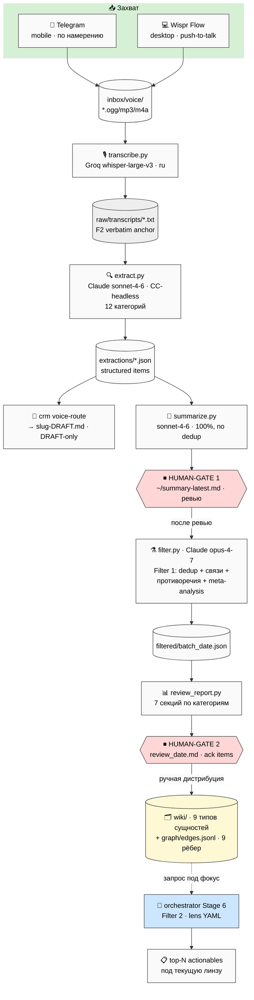
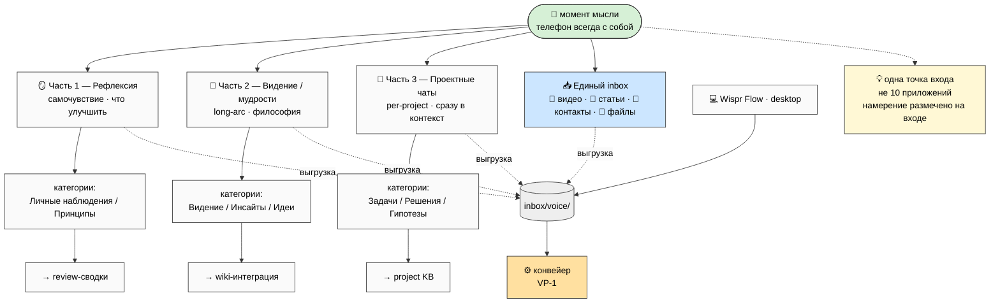
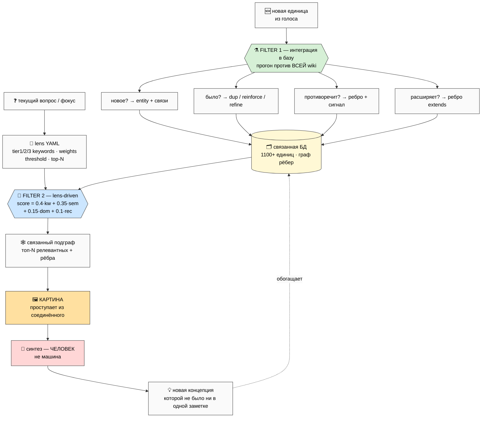
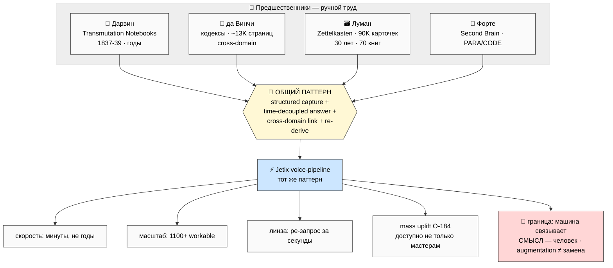
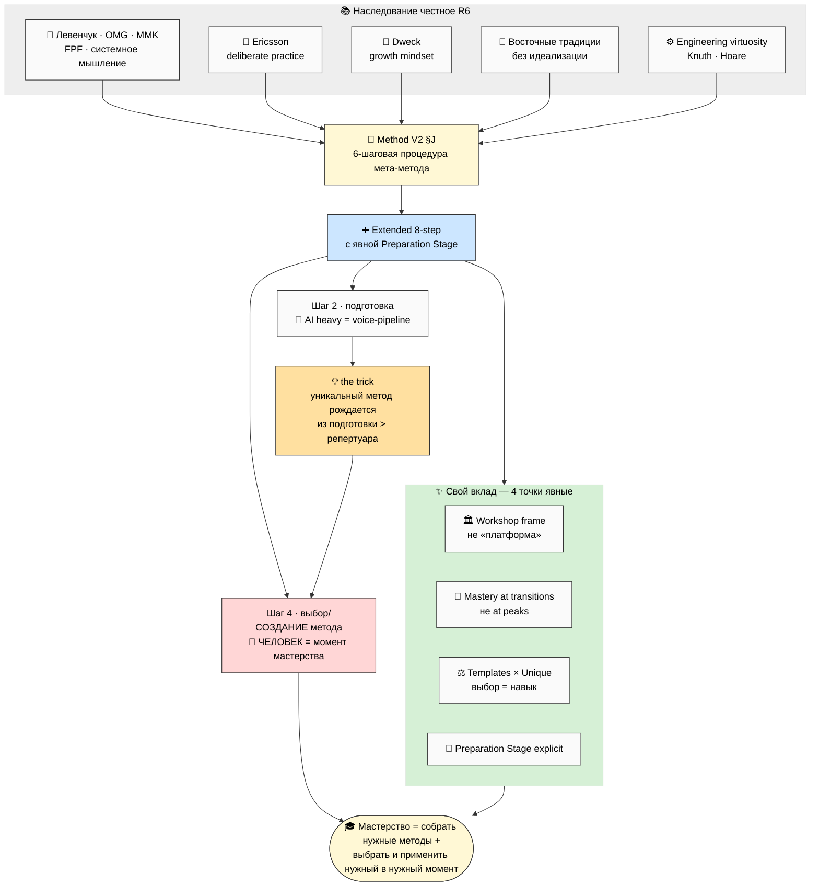
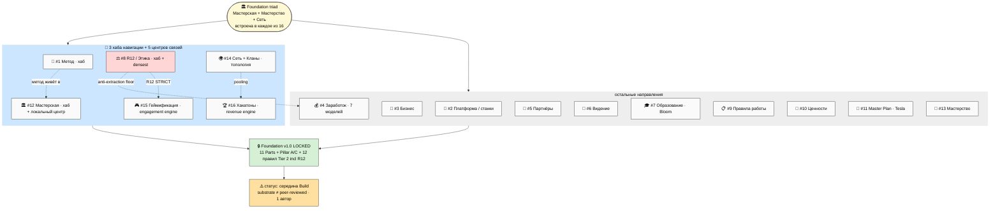
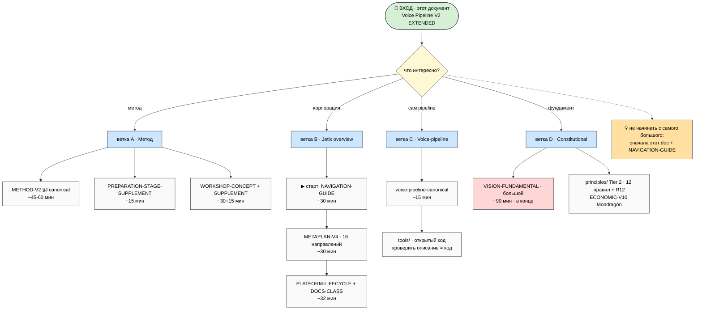

# Diagrams INDEX — VP-1..VP-4 + JM-1..JM-3

> Каталог 7 mermaid-схем публичного описания. **VP-1..VP-4** — сам voice-pipeline; **JM-1..JM-3** —
> overview метода и Jetix (Phase 7 EXTENDED). Все — light background (чёрный текст для копирования в
> Notion/PDF), ≥10 узлов, плотные. Стиль-инвариант совместим с WK-1..WK-8 и PREP-1..PREP-4. Все 7
> встраиваются inline в main doc.

| # | Имя | Показывает | Главная мысль | Inline |
|---|---|---|---|---|
| VP-1 | Полная архитектура | capture → транскрипция → extraction → 2 human-gate → filter → wiki → линза | весь путь от мысли до связанной единицы; 2 СТОП-точки | ✅ §G |
| VP-2 | Telegram inbox split | 3 части по намерению + единый inbox внешних материалов + Wispr | одна точка входа, разделённая по намерению | ✅ §B |
| VP-3 | Двойная фильтрация | Filter 1 (интеграция в базу) ⊕ Filter 2 (lens-driven доставание) | две разные оси; вместе = синтез, не поиск | ✅ §C |
| VP-4 | Исторический параллелизм | Дарвин / да Винчи / Луман / Форте → тот же паттерн + CC-ускорение | паттерн стар; ново только ускорение машиной | ✅ §D |
| JM-1 | Дерево метода | наследование → Method V2 §J → 8-step → AI/человек граница → 4 точки вклада → one-liner | мастерство = собрать методы + применить нужный; вклад честно небольшой | ✅ §N |
| JM-2 | Jetix 16 направлений | Foundation triad встроена в 16; 3 хаба + 5 центров связей; LOCKED фундамент | карта корпорации + честный статус (середина Build) | ✅ §N |
| JM-3 | Путь чтения для ассистента | вход (main) → 4 ветки A/B/C/D с приоритетами и временем | не начинать с самого большого; этот doc + NAVIGATION-GUIDE | ✅ §N |

**Стиль-инвариант:** `%%{init: {'theme':'base','themeVariables':{'primaryTextColor':'#000','textColor':'#000','lineColor':'#333','primaryBorderColor':'#333','primaryColor':'#fafafa','noteBkgColor':'#fff8d5'}}}%%`

---

## VP-1 — Полная архитектура voice-pipeline

> Весь путь: захват → транскрипция → извлечение → **human-gate 1** → фильтрация (Filter 1) →
> **human-gate 2** → ручная дистрибуция в базу; плюс линза (Filter 2) как боковой запрос.

---

## VP-2 — Telegram inbox split (захват по намерению)

---

## VP-3 — Двойная фильтрация (ядро)

---

## VP-4 — Исторический параллелизм (паттерн стар, ускорение ново)

---

## JM-1 — Дерево метода (наследование честное)

> Наследование (Левенчук-OMG-MMK / Ericsson / Dweck / восточные / engineering) → Method V2 §J →
> Extended 8-step → граница AI(подготовка)/человек(создание метода) → 4 точки своего вклада → one-liner.

---

## JM-2 — Jetix: 16 направлений + Foundation triad

> Foundation triad (Мастерская+Мастерство+Сеть) встроена в каждое из 16 направлений; 3 хаба навигации
> + 5 центров связей выделены; снизу — LOCKED фундамент и честный статус (середина Build, 1 автор).

---

## JM-3 — Путь чтения для AI-ассистента

> Вход (этот документ) → развилка по интересу → 4 ветки A/B/C/D с приоритетом и временем чтения.
> Правило: не начинать с самого большого (VISION-FUNDAMENTAL) — сначала main + NAVIGATION-GUIDE.

---

*INDEX closure 2026-05-26 (Phase 7 EXTENDED 2026-05-27). 7 схем: VP-1..VP-4 (voice-pipeline) +
JM-1..JM-3 (метод-дерево / 16 направлений / путь чтения для ассистента) — все inline в main. Light bg,
≥10 узлов, чёрный текст для Notion/PDF. VP-архитектура отражает реальный код: 2 human-gate, CC-headless
backend, whisper-large-v3, двойная фильтрация (Filter 1 + Filter 2 lens-driven). JM — honest inheritance
(Левенчук-OMG-MMK / Ericsson / Dweck / восточные) + Foundation triad + честный статус (середина Build).*
