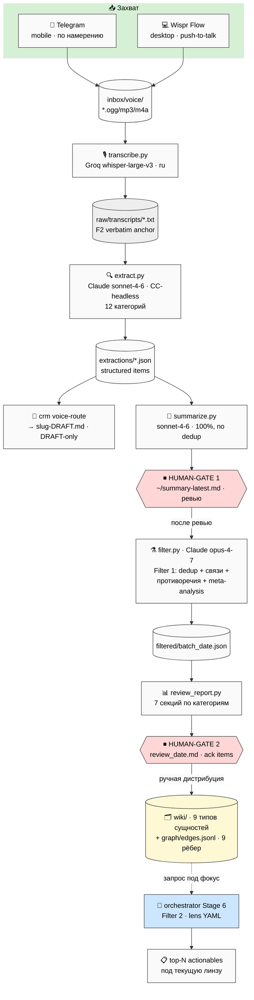
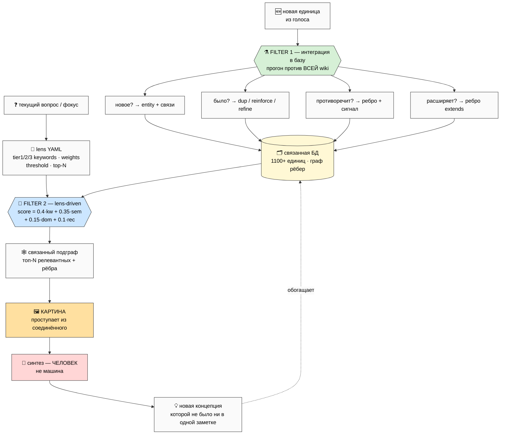
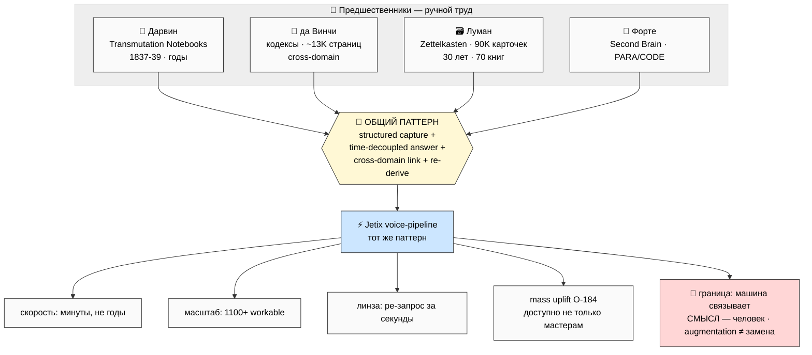

# Diagrams INDEX — VP-1..VP-4

> Каталог 4 mermaid-схем публичного описания voice-pipeline. Все — light background (чёрный текст
> для копирования в Notion/PDF), ≥10 узлов, плотные. Стиль-инвариант совместим с WK-1..WK-8 и
> PREP-1..PREP-4. Все 4 встраиваются inline в main doc.

| # | Имя | Показывает | Главная мысль | Inline |
|---|---|---|---|---|
| VP-1 | Полная архитектура | capture → транскрипция → extraction → 2 human-gate → filter → wiki → линза | весь путь от мысли до связанной единицы; 2 СТОП-точки | ✅ §G |
| VP-2 | Telegram inbox split | 3 части по намерению + единый inbox внешних материалов + Wispr | одна точка входа, разделённая по намерению | ✅ §B |
| VP-3 | Двойная фильтрация | Filter 1 (интеграция в базу) ⊕ Filter 2 (lens-driven доставание) | две разные оси; вместе = синтез, не поиск | ✅ §C |
| VP-4 | Исторический параллелизм | Дарвин / да Винчи / Луман / Форте → тот же паттерн + CC-ускорение | паттерн стар; ново только ускорение машиной | ✅ §D |

**Стиль-инвариант:** `%%{init: {'theme':'base','themeVariables':{'primaryTextColor':'#000','textColor':'#000','lineColor':'#333','primaryBorderColor':'#333','primaryColor':'#fafafa','noteBkgColor':'#fff8d5'}}}%%`

---

## VP-1 — Полная архитектура voice-pipeline

> Весь путь: захват → транскрипция → извлечение → **human-gate 1** → фильтрация (Filter 1) →
> **human-gate 2** → ручная дистрибуция в базу; плюс линза (Filter 2) как боковой запрос.

---

## VP-2 — Telegram inbox split (захват по намерению)

---

## VP-3 — Двойная фильтрация (ядро)

---

## VP-4 — Исторический параллелизм (паттерн стар, ускорение ново)

---

*INDEX closure 2026-05-26. 4 схемы VP-1..VP-4 (все inline в main). Light bg, ≥10 узлов, чёрный текст
для Notion/PDF. Архитектура отражает реальный код: 2 human-gate, CC-headless backend, whisper-large-v3,
двойная фильтрация (Filter 1 + Filter 2 lens-driven).*
