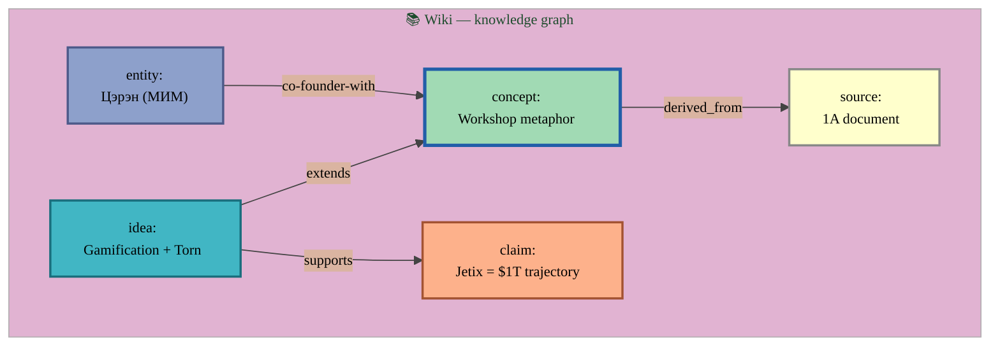
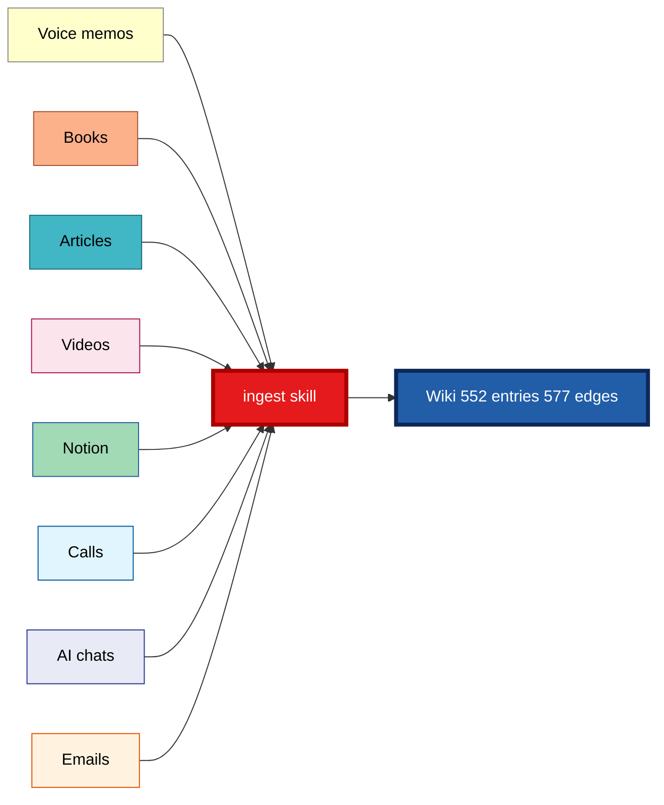
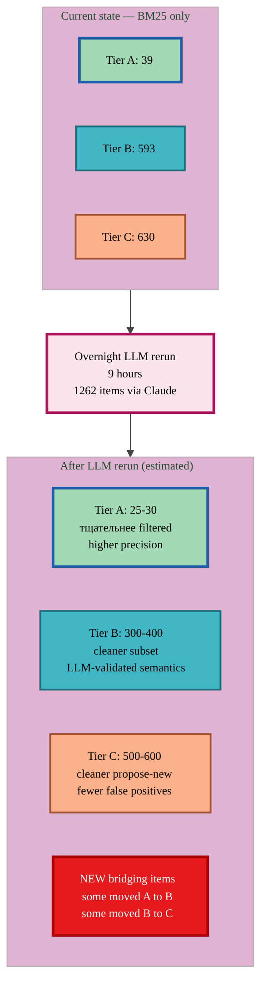
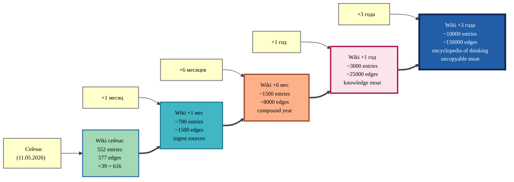

# 🔗 Wiki + Edges — Deep Explanation

> **Spoiler.** Это **НЕ обычная википедия**. Это **personal knowledge graph** который **growth over years** из ВСЕХ источников (voice / books / articles / videos / notion / decisions / etc.). И через connections становится умнее каждый день.
>
> Voice memos = **сегодняшний batch**. В будущем — то же самое для книг, статей, видео, всего что только можно ingest.

---

## §1 Что такое наша wiki на самом деле (НЕ обычная Wikipedia)

### §1.1 Обычная Wikipedia vs наша wiki

| Обычная Wikipedia | Наша wiki (Jetix) |
|---|---|
| Энциклопедия мира | **Личный накопленный knowledge graph** |
| Написана collective коллективом | Извлекается из **твоих sources** (voice / books / articles / decisions) |
| Hyperlinks в text | **Typed edges** (concept supports claim, idea extends source, etc.) |
| Read-only по большей части | **Read-write через AI** — добавляется автоматически + ручной gate |
| Static facts | **Living document** — обновляется через `/ingest`, `/ask`, `/consolidate` |
| Один источник truth | **Multi-source aggregation** — voice + books + Notion + chats |
| Tags / categories | **9 entity types** + **typed edges** + **niches** срезы |

### §1.2 Что физически уже есть в wiki/ (verified facts)

```
wiki/
├── concepts/        ← what concept means (e.g. "Workshop metaphor")
├── entities/        ← people / orgs / products
├── sources/         ← origin documents (book / article / transcript)
├── topics/          ← high-level theme aggregations
├── ideas/           ← raw ideas / hypotheses
├── experiments/     ← tested patterns
├── claims/          ← assertions ("X is Y because Z")
├── summaries/       ← high-level synthesis
├── foundations/     ← foundational principles
├── comparisons/     ← bonus (X vs Y)
├── niches/          ← personal/business/sales/life/tech/meta срезы
├── graph/
│   ├── edges.jsonl  ← THE GRAPH STRUCTURE (577 edges currently)
│   └── communities.md
├── _templates/      ← schemas per entity type
├── index.md         ← catalog
└── log.md           ← chronology
```

**Текущая статистика wiki (verified 2026-05-11):**
- **552 entries** total across 9 entity types
- **577 edges** в wiki/graph/edges.jsonl
- 9 entity types active
- Living + growing — каждый run pipeline / book ingest добавляет content

---

## §2 Что такое edges на пальцах — Mermaid визуализация

### §2.1 Edges = типизированные связи между entries



**Что видишь:**
- 5 nodes (1 concept, 1 idea, 1 source, 1 claim, 1 entity) = wiki entries
- 4 edges с **type label** (extends, derived_from, supports, co-founder-with) = связи

**Edge JSON в edges.jsonl** для одной из связей:
```json
{
  "from": "ideas/gamification-torn-style.md",
  "to": "concepts/workshop-metaphor.md",
  "type": "extends",
  "created": "2026-05-11",
  "confidence": "high"
}
```

### §2.2 Existing edge types (577 edges текущие)

| Type | Count | Что значит |
|---|---|---|
| `part_of` | 233 (40%) | X является частью Y |
| `derived_from` | 219 (38%) | X derived из Y |
| `supports` | 84 (15%) | X supports claim Y |
| `extends` | 35 (6%) | X extends Y (расширяет) |
| `co-founder-with` | 2 | Personal (например, Tseren + Levenchuk) |
| `advisor-of` | 2 | Personal |
| `contradicts` | 1 | X противоречит Y |
| `founder-of` | 1 | Personal |

---

## §3 Что конкретно добавится при Tier A bulk-ack — 39 concrete edges

### §3.1 Top-5 strongest matches (highest BM25 scores)

| # | Voice item (excerpt) | → Wiki entry (existing) | BM25 |
|---|---|---|---|
| 1 | «Jetix позиционируется как стартап, претендующий сразу на место корпорации» (audio_537) | `concepts/korporaciya-startup-concept.md` | **87.15** ⭐ |
| 2 | «Вся информация имеет разный уровень важности для конкретного человека» (audio_533) | `concepts/menedzhment-vazhnosti-informacii.md` | **72.16** ⭐ |
| 3 | «У меня есть звериное охуенное состояние, которое большую часть времени доминирует» (audio_535) | `concepts/protocol-2-day-bad-state-limit.md` | **59.63** |
| 4 | «Человеку стоит научиться менеджерить важность информации» (audio_533) | `concepts/menedzhment-vazhnosti-informacii.md` | **57.33** |
| 5 | «Ежедневно напоминать себе о вере в свои силы и возможности» (audio_532) | `concepts/affirmation-ritual-founder-state.md` | **52.51** |

### §3.2 Mermaid — что именно добавится (concrete top-5 visualisation)

```mermaid
%%{init: {'theme':'base', 'themeVariables': {'primaryColor':'#a1dab4', 'primaryTextColor':'#000', 'primaryBorderColor':'#225ea8', 'lineColor':'#444', 'fontFamily':'Inter, system-ui, sans-serif', 'fontSize':'12px'}}}%%
flowchart LR

    subgraph VOICE ["📝 Voice items (новые из 2026-05-10 batch)"]
        V1["audio_537<br/>'Jetix = корпорация'"]:::voice
        V2["audio_533<br/>'информация имеет важность'"]:::voice
        V3["audio_535<br/>'звериное состояние'"]:::voice
        V4["audio_533 (2)<br/>'менеджерить важность'"]:::voice
        V5["audio_532<br/>'вера в свои силы'"]:::voice
    end

    subgraph WIKI ["📚 Wiki entries (already existing)"]
        W1["concepts/<br/>korporaciya-startup-concept.md"]:::wiki
        W2["concepts/<br/>menedzhment-vazhnosti-informacii.md"]:::wiki
        W3["concepts/<br/>protocol-2-day-bad-state-limit.md"]:::wiki
        W4["concepts/<br/>affirmation-ritual-founder-state.md"]:::wiki
    end

    V1 ==>|"supports<br/>BM25=87"| W1
    V2 ==>|"supports<br/>BM25=72"| W2
    V3 ==>|"extends<br/>BM25=60"| W3
    V4 ==>|"extends<br/>BM25=57"| W2
    V5 ==>|"supports<br/>BM25=53"| W4

    NEW_EDGES["📊 wiki/graph/edges.jsonl<br/><b>+39 new edges</b><br/><small>577 → 616 total</small>"]:::graph

    W1 -.-> NEW_EDGES
    W2 -.-> NEW_EDGES
    W3 -.-> NEW_EDGES
    W4 -.-> NEW_EDGES

    classDef voice fill:#ffffcc,stroke:#888,stroke-width:2px,color:#000
    classDef wiki fill:#a1dab4,stroke:#225ea8,stroke-width:3px,color:#000
    classDef graph fill:#225ea8,stroke:#0d2858,stroke-width:4px,color:#fff
```

### §3.3 Что значит «edge» для каждой конкретной связи

**Пример #1 (BM25=87, сильный match):**
- Voice (audio_537): «Jetix позиционируется как стартап, претендующий сразу на место корпорации»
- Wiki entry: `concepts/korporaciya-startup-concept.md`
- Edge type: **supports**
- Что это даёт: когда читаешь wiki entry «Корпорация-стартап концепт», видишь footnote «← audio_537 supports это (BM25=87.15)». Прямой провенанс.

**Пример #5 (BM25=53, sredne-strong):**
- Voice (audio_532): «Ежедневно напоминать себе о вере в свои силы»
- Wiki entry: `concepts/affirmation-ritual-founder-state.md`
- Edge type: **supports** (предполагается)
- Что это даёт: wiki ritual entry знает что эта practice **повторяется в voice memos** = это не одноразовый caprice, а recurring pattern.

### §3.4 Full 39 items breakdown по entity types

Из Tier A 39 items, distribution targets:

- **concepts/** : 16 items (41%) — наибольший
- **ideas/** : 17 items (44%)
- **sources/** : 6 items (15%) — sources создаются как metaphor docs

**То есть voice items связываются с concepts (41%) + ideas (44%) + sources (15%).** Это значит они не enriching primitive material, а **connecting к высокоуровневым knowledge entries**.

---

## §4 КАРДИНАЛЬНО ВАЖНО — это НЕ только для voice

### §4.1 Тот же pipeline работает для ВСЕХ sources

Per CLAUDE.md `Wiki Architecture v2`:

> **Skills (wiki pipeline v2):**
> - `/ingest <path-or-url>` — источник → wiki/ страницы + index + log + edges

**Что значит:** воice = только **одна линия input'а**. В будущем точно так же:



**Это значит:**
- Сегодня — 47 voice memos → +39 edges
- Завтра — ingest 1 книги → может +50 edges
- Через месяц — ingest 50 sources → +500-1000 edges
- Через год — knowledge graph будет **значительно** denser чем сейчас

### §4.2 Метод останется для дальнейшей работы

✅ **Да.** Voice → wiki — это **proof-of-concept**. Same Stage 5 v2 (BM25 + Russian morphology + 3-tier) применим к:
- Любым новым voice batches
- Книгам ingestion
- Articles
- Видео
- Любым другим sources

**Infrastructure уже built.** Voice pipeline + Stage 5 v2 = reusable. Каждый source проходит тот же path.

---

## §5 Что добавится сейчас vs если запустим overnight LLM rerun

### §5.1 Текущий план (BM25 only, без LLM rerun)

- 39 Tier A items добавятся как edges
- Каждое edge с `confidence: high` (BM25 ≥0.85 → threshold met)
- 593 Tier B items wait for batch review позже
- 630 Tier C items propose-new (низкий confidence)

### §5.2 Если overnight LLM rerun



**LLM rerun даёт:**
- ✅ **Higher precision** — LLM понимает semantic context лучше чем BM25
- ✅ **Less false positives** — Tier A не упасёт обманчивые матчи
- ✅ **Better edge type detection** — LLM может предложить precise type (extends vs supports vs contradicts)
- ⚠️ **Trade-off:** 9 hours overnight + small token cost (€0 because Max sub)

### §5.3 Recommendation

**Можно сделать ОБА:**
1. **Сейчас:** ack Tier A 39 items (BM25 high-confidence уже good)
2. **Overnight:** запустить LLM rerun (для Tier B/C precision boost)
3. **Завтра:** ack updated Tier A/B post-LLM

Это **safe path** — текущие 39 уже добавлены (low risk, high BM25), а overnight LLM улучшит the rest.

---

## §6 Что это меняет в твоей работе — compound learning effect

### §6.1 Today

- Ты задаёшь `/ask` query на «Что мы знаем про Workshop?»
- AI: читает `decisions/JETIX-WORKSHOP-CONCEPT-2026-04-30.md` + wiki/foundations/. Voice memos НЕ упомянуты.

### §6.2 После Tier A bulk-ack (39 edges)

- Ты задаёшь `/ask` query
- AI: читает wiki entry + traverses edges → видит «эта концепция supported by audio_X / extended by audio_Y» → ans включает voice provenance

### §6.3 Через месяц (после ingest 30 sources)

- `/ask` query → **dense knowledge graph traversal**
- AI: «Workshop concept appears в 47 voice memos + 12 books + 5 articles + 3 Claude conversations. Top supporting evidence: ... Top contradicting: ...»

### §6.4 Через год

- Wiki = **encyclopedia твоей мысли** — every important insight ingested + linked
- AI агенты используют **graph traversal** для smarter recommendations
- New voice batch automatically matches to historical patterns
- **Compound moat** — это уже невозможно скопировать (требует years experience accumulation)

### §6.5 Mermaid — long-term compound effect



**Это и есть compound learning** — каждое добавление makes future queries smarter.

---

## §7 Конкретные insights что добавятся (top examples из 39)

### §7.1 Из voice 8-30 апреля + 25-30 апреля + 2-8 мая batches

| Insight | Tier A edge type → wiki entry |
|---|---|
| «Jetix как корпорация-стартап одновременно» | `concepts/korporaciya-startup-concept.md` |
| «Информация имеет уровень важности per person per time» | `concepts/menedzhment-vazhnosti-informacii.md` |
| «Звериное состояние founder — не больше 2 дней плохого состояния» | `concepts/protocol-2-day-bad-state-limit.md` |
| «Ежедневные affirmations для founder state» | `concepts/affirmation-ritual-founder-state.md` |
| «AI должны проектировать психологи — psy-led design» | `concepts/ai-proektirovanie-psy-led.md` |
| «Engineering faith — вера на опыте, не надежде» | `ideas/engineering-faith.md` |
| «Revenue share модель Jetix 30%» | `ideas/revenue-share-jetix-philosophy.md` |
| «Жизнь как управляемая система — гипотезы → цели → план → задачи» | `ideas/think-do-feedback-loop.md` |
| «Контент-стратегия: хуки для дебилов или аналитика для умных» | `ideas/kontent-strategiya-khuki-dlya-debilov.md` |
| «Двухфазная модель Jetix: настроить систему → подтянуть первых 10» | `ideas/strategiya-zapuska-odna-ideya.md` |
| «Книга Юваль Ной Харари 'Homo Deus' = source мифов» | `sources/2026-04-16-system-first-myth-second.md` |
| «Жизнь как игра — control panel с правилами и метриками» | `ideas/zhizn-kak-igra-nuzhna-panel-upravleniya.md` |
| «Сообщество должно стимулировать реальный вклад» | `ideas/anti-free-riding-accountability.md` |
| ... (ещё 26 items) | |

**Все эти voice insights уже существуют в wiki entries** (созданы ранее или недавно). Сейчас они **connected** к voice provenance.

---

## §8 Risk + revertability

**Что если edge wrong?**
- BM25 ≥0.85 → high confidence threshold
- Каждое edge с metadata (date / confidence / from / to)
- **Revert one edge:** `git revert <commit>` или ручное удаление JSON line
- **Revert все 39:** один git revert tag

**Что если LLM rerun изменит assignments?**
- Tier A 39 might shrink to 25-30 (false positives removed)
- Можем сделать **rollback ack-нутых items**: `/wiki-bulk-ack --revert --tier A`
- Безопасно

---

## §9 Что прямо сейчас рекомендую

**Path A (safe + fast):** ack Tier A сейчас + overnight LLM rerun
1. `/wiki-bulk-ack --tier A --dry-run` (preview 5 sec)
2. Если ОК → `/wiki-bulk-ack --tier A` (+39 edges)
3. **Параллельно:** drop STAGE5_SKIP_LLM=1 + restart pipeline overnight (9h LLM rerun)
4. Утром: review updated Tier A/B → ack updates

**Path B (precision first):** overnight LLM rerun first → ack потом
1. Запустить LLM rerun
2. Утром cleaner Tier A (25-30 high-precision)
3. Ack всё разом

**Я recommend A** — current 39 уже high BM25 (≥0.85), отлично safe. LLM rerun = polish.

---

## §10 Где physical файлы

| Что | Path |
|---|---|
| Knowledge graph edges | `wiki/graph/edges.jsonl` (577 lines currently) |
| Wiki entries | `wiki/concepts/` / `wiki/ideas/` / `wiki/sources/` / etc (552 files) |
| Wiki index | `wiki/index.md` |
| Wiki log (history) | `wiki/log.md` |
| Tier A 39 items | `reports/voice-pipeline-2026-05-10/04-wiki-candidates-v2.md` §A |
| Tier B 593 items | `reports/voice-pipeline-2026-05-10/04-wiki-candidates-v2.md` §B |
| Tier C 630 items | `reports/voice-pipeline-2026-05-10/04-wiki-candidates-v2.md` §C |
| JSON sidecar (machine-readable) | `reports/voice-pipeline-2026-05-10/04-wiki-candidates-v2.json` |
| Bulk-ack skill | `.claude/skills/wiki-bulk-ack/SKILL.md` |
| Wiki integration code | `tools/wiki_integration/` |

---

## §11 Финальный summary (TL;DR)

1. **Wiki — это НЕ обычная википедия.** Это personal knowledge graph который accumulates ВСЕ источники (voice / books / articles / etc.) в **typed connected entries**.
2. **39 edges Tier A** = 39 voice insights connected к existing wiki entries. Не новые entries, а **новые связи** в graph.
3. **Это работает для будущего на ВСЁМ** — voice = только текущий source. Pipeline reusable для books / articles / videos / любых ingest.
4. **Compound learning** — каждое edge делает graph smarter. Через год — wiki будет иметь ~10x edges, через 3 года — encyclopedia твоей мысли + uncopyable moat.
5. **Concrete top items** (BM25 87 / 72 / 60 / 57 / 53) очень strong matches — концепты типа Jetix-корпорация-стартап / менеджмент важности / звериное состояние / affirmation ritual / etc.
6. **Risk LOW + revertable** — git-backed, one command rollback.
7. **Recommendation:** ack Tier A сейчас + параллельно overnight LLM rerun.

---

**Open Antigravity:** `reports/wiki-edges-deep-explanation-2026-05-11.md` + `reports/voice-pipeline-2026-05-10/04-wiki-candidates-v2.md` (для browse 39 items).

Скажи **«acked, выполняю dry-run»** → продолжаем.
