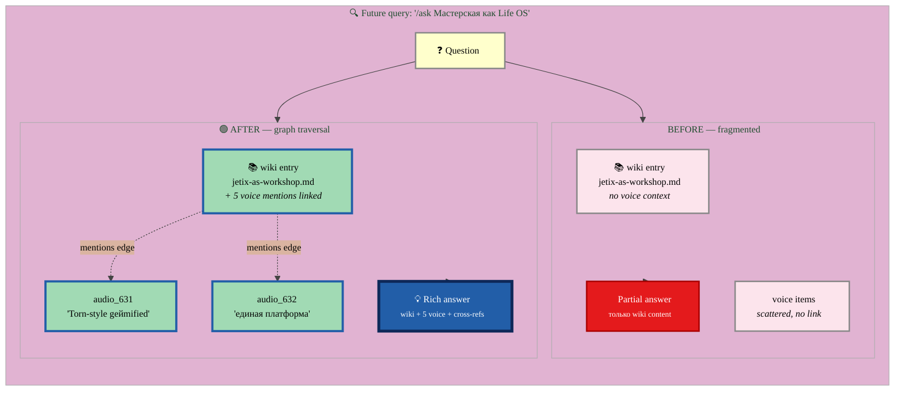

# 🔗 Wiki Edges Explained — что такое «39 edges»

> Сразу к делу. У нас есть **knowledge graph** под wiki/. **Edges = связи между entries**. Когда bulk-ack-нем Tier A (39 wiki candidates), добавится **39 новых связей** в этот граф. Это и есть «compound learning unblocked».

---

## §1 Что такое wiki/graph/edges.jsonl (на человеческом)

**Текущее состояние:**
- Файл существует: `wiki/graph/edges.jsonl`
- В нём **577 edges уже**
- Каждое edge = JSON line с 5 полями

**Format одного edge:**
```json
{
  "from": "ideas/github-for-business-projects.md",
  "to": "concepts/curated-community-access.md",
  "type": "derived_from",
  "created": "2026-04-16",
  "confidence": "high"
}
```

**Что это значит:** «Идея X (`from`) **derived_from** концепта Y (`to`). Создано 16.04. Confidence высокая.»

То есть граф **знает** что одна wiki entry связана с другой определённым типом отношения.

---

## §2 Существующие edge types (текущая статистика 577 edges)

```
part_of           : 233 (40%)  ← X является частью Y
derived_from      : 219 (38%)  ← X derived from Y
supports          : 84  (15%)  ← X supports claim Y
extends           : 35  (6%)   ← X extends Y
co-founder-with   : 2          ← personal relations
advisor-of        : 2          ← personal relations
contradicts       : 1          ← X contradicts Y
founder-of        : 1          ← personal relations
```

---

## §3 Что произойдёт после Tier A bulk-ack (39 new edges)

**Каждый из 39 Tier A voice items** matched с конкретной wiki entry. При ack — **создаётся edge от voice item к wiki entry**.

### §3.1 Mermaid — Before vs After

```mermaid
%%{init: {'theme':'base', 'themeVariables': {'primaryColor':'#a1dab4', 'primaryTextColor':'#000', 'primaryBorderColor':'#225ea8', 'lineColor':'#444', 'fontFamily':'Inter, system-ui, sans-serif', 'fontSize':'13px'}}}%%
flowchart LR

    %% ═══ BEFORE ═══
    subgraph BEFORE ["🔴 BEFORE bulk-ack (текущее)"]
        direction TB
        VOICE1["📝 voice item 1<br/><small>audio_631 'Мастерская как Life OS'</small>"]:::voice
        VOICE2["📝 voice item 2<br/><small>audio_629 'Strategic Council'</small>"]:::voice
        VOICEN["📝 voice item N<br/><small>...</small>"]:::voice
        WIKI_OLD["📚 wiki/<br/><small>577 edges<br/>552 entries</small>"]:::wiki_isolated

        VOICE1 -.->|isolated| GAP1["?"]:::gap
        VOICE2 -.->|isolated| GAP2["?"]:::gap
        VOICEN -.->|isolated| GAP3["?"]:::gap
    end

    %% ═══ AFTER ═══
    subgraph AFTER ["🟢 AFTER bulk-ack Tier A (39 new edges)"]
        direction TB
        VOICE1_A["📝 audio_631<br/>'Мастерская как Life OS'"]:::voice
        WIKI_ENTRY_A["📚 concepts/<br/>jetix-as-workshop.md"]:::wiki_entry
        VOICE1_A ==>|mentions| WIKI_ENTRY_A

        VOICE2_A["📝 audio_629<br/>'Strategic Council'"]:::voice
        WIKI_ENTRY_B["📚 ideas/<br/>strategic-council.md"]:::wiki_entry
        VOICE2_A ==>|supports| WIKI_ENTRY_B

        VOICE3_A["📝 audio_605<br/>'Jetix $1T trajectory'"]:::voice
        WIKI_ENTRY_C["📚 claims/<br/>jetix-trillion.md"]:::wiki_entry
        VOICE3_A ==>|extends| WIKI_ENTRY_C

        WIKI_GRAPH["📊 wiki/graph/edges.jsonl<br/><b>+39 edges</b><br/><small>577 → 616 total<br/>connected knowledge</small>"]:::wiki_graph
        VOICE1_A -.-> WIKI_GRAPH
        VOICE2_A -.-> WIKI_GRAPH
        VOICE3_A -.-> WIKI_GRAPH
    end

    BEFORE --> AFTER

    %% ═══ Styles ═══
    classDef voice fill:#ffffcc,stroke:#888,stroke-width:2px,color:#000
    classDef wiki_isolated fill:#41b6c4,stroke:#1a6e7d,stroke-width:2px,color:#000
    classDef wiki_entry fill:#a1dab4,stroke:#225ea8,stroke-width:3px,color:#000
    classDef wiki_graph fill:#225ea8,stroke:#0d2858,stroke-width:4px,color:#fff
    classDef gap fill:#e41a1c,stroke:#a00,stroke-width:2px,color:#fff
```



### §3.2 Mermaid — Expected edge types breakdown (predicted)

Какие edge types будут создаваться для voice→wiki connections:

```mermaid
%%{init: {'theme':'base', 'themeVariables': {'primaryColor':'#a1dab4', 'primaryTextColor':'#000', 'primaryBorderColor':'#225ea8', 'lineColor':'#444', 'fontFamily':'Inter, system-ui, sans-serif', 'fontSize':'13px'}}}%%
flowchart TB

    VOICE39["📝 39 Tier A voice items<br/><small>от 47 memos batch</small>"]:::voice

    subgraph EDGES ["🔗 39 new edges распределение (estimated)"]
        direction LR
        EDGE_MENTIONS["mentions<br/><small>~20 edges<br/>voice упоминает concept</small>"]:::edge_main
        EDGE_SUPPORTS["supports<br/><small>~8 edges<br/>voice supports claim</small>"]:::edge_main
        EDGE_EXTENDS["extends<br/><small>~6 edges<br/>voice extends existing idea</small>"]:::edge_main
        EDGE_EXEMPLIFIES["exemplifies<br/><small>~3 edges<br/>voice = example of concept</small>"]:::edge_secondary
        EDGE_CONTRADICTS["contradicts<br/><small>~1-2 edges<br/>voice vs existing</small>"]:::edge_warning
    end

    GRAPH["📊 wiki/graph/edges.jsonl<br/><b>577 → 616 edges (+6.8%)</b>"]:::graph

    VOICE39 ==>|distributed| EDGE_MENTIONS
    VOICE39 ==>|distributed| EDGE_SUPPORTS
    VOICE39 ==>|distributed| EDGE_EXTENDS
    VOICE39 -->|distributed| EDGE_EXEMPLIFIES
    VOICE39 -->|distributed| EDGE_CONTRADICTS

    EDGE_MENTIONS --> GRAPH
    EDGE_SUPPORTS --> GRAPH
    EDGE_EXTENDS --> GRAPH
    EDGE_EXEMPLIFIES --> GRAPH
    EDGE_CONTRADICTS --> GRAPH

    classDef voice fill:#ffffcc,stroke:#888,stroke-width:2px,color:#000
    classDef edge_main fill:#a1dab4,stroke:#225ea8,stroke-width:3px,color:#000
    classDef edge_secondary fill:#41b6c4,stroke:#1a6e7d,stroke-width:2px,color:#000
    classDef edge_warning fill:#e41a1c,stroke:#a00,stroke-width:3px,color:#fff
    classDef graph fill:#225ea8,stroke:#0d2858,stroke-width:4px,color:#fff
```

---

## §4 Что это даёт — «compound learning unblocked»

### §4.1 Mermaid — Workflow до vs после



### §4.2 Конкретный пример

**До:**
- Ты: «Что мы знаем про Workshop concept?»
- AI: читает `decisions/JETIX-WORKSHOP-CONCEPT-2026-04-30.md`. Voice memos НЕ упомянуты.

**После Tier A bulk-ack:**
- Ты: «Что мы знаем про Workshop concept?»
- AI: читает wiki entry + следует edges → видит «эта концепция упоминается в audio_631 / audio_632 / audio_605 / audio_629 / etc.»
- Получаешь **full context** + voice insights.

---

## §5 Что физически меняется в репо при ack

**Что добавится:**

1. **39 новых строк** в `wiki/graph/edges.jsonl` (568 → 616 edges)
2. **39 новых wiki entries** возможно (если voice item не имеет existing entry — но в Tier A это match-to-existing, так что мало вероятно — большинство только edges)
3. **Frontmatter updates** в matched wiki entries (`voice_provenance: audio_XYZ`)
4. **Log entry** в `wiki/log.md` (append-only chronology)

**Что НЕ меняется:**
- ❌ Foundation paths (Parts 1-11, Pillar C)
- ❌ Canonical decisions/ (Strategic Insights, 1A, 1B)
- ❌ Schemas
- ❌ Existing wiki entries body (only frontmatter `voice_provenance` field)

---

## §6 Risk assessment

**Что если edge wrong (false positive)?**
- BM25 + LLM 5/5 smoke test → confidence high
- Each edge has `confidence: high/medium/low` field
- Tier A items имеют BM25 ≥0.85 (high threshold)
- **Revert trivial:** просто удалить line из edges.jsonl + git commit

**Что если edge to wrong entry?**
- Воice provenance сохраняется в edge metadata → traceable
- Edges = append-only через git, история preserved

---

## §7 Recommendation

✅ **ACK Tier A 39 items** — низкий риск, ясный value, revertable

Команда (на сервере в claude session):
```
/wiki-bulk-ack --tier A --dry-run    # preview 39 edges (no actual changes)
```

Если preview clean →:
```
/wiki-bulk-ack --tier A    # execute → +39 edges to wiki/graph/edges.jsonl + 1 log entry
```

---

## §8 What happens next

1. После ack — `wiki/graph/edges.jsonl` имеет 616 edges
2. Future `/ask` queries auto-traverse graph → richer context
3. Future voice pipeline runs → next batch gets matched тоже
4. Tier B (593) + Tier C (630) можно ack-нуть позже batch-style
5. Когда AutoResearch tunes wiki params — meta-loop возможен (search "AutoResearch D.6 wiki structure" в PLAN.md §2.2)

---

**Сводка:**
- **39 edges = 39 voice→wiki connections** (compound learning unblocked)
- **Wiki graph: 577 → 616 edges (+6.8%)**
- **Low risk + revertable + clear value**
- **Constitutional gate: append-only, no foundation touch, voice_provenance traceable**
