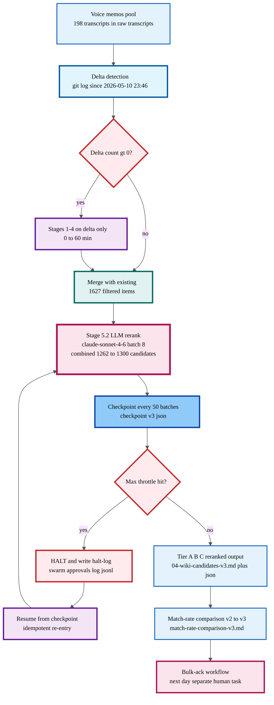

# Stage 2A Overnight Wiki Rebuild — Master Plan

## §0 TL;DR

- **Цель:** Первый полноценный LLM precision rerank wiki candidates (v2 был BM25-only с `STAGE5_SKIP_LLM=1`, не semantic).
- **Scope:** Hybrid — delta detection в `raw/transcripts/` (~0-50 новых memos) + 1627 existing filtered → 1262-1300 candidates.
- **Methodology:** `claude-sonnet-4-6`, batch=8, sequential, BM25 prefilter top-10, thresholds A≥0.85 / B≥0.60.
- **Budget:** ~2.3M in / ~163K out tokens (Max sub, no €). Checkpoint every 50 batches → idempotent resume.
- **ETA:** 22:00 Berlin 2026-05-11 → 07:00 2026-05-12 (9h window, expected 4-5h actual).
- **Output:** `reports/voice-pipeline-2026-05-10/04-wiki-candidates-v3.{md,json}` + `match-rate-comparison-v3.md`.
- **Tier estimates:** A 39→25-30, B 593→300-400, C 630→500-650. Match-rate 50.1%→28-35% (DROP expected = correct).
- **Preserve floor:** ~200-300 items via 5 PG-criteria (Action Plan IDs + canonical-cited + Hexagon-5 + Phase-1 keywords + v2-Tier-A carry).
- **Quality filters:** 5 rules apply to delta only (existing 1627 untouched) — Phase-0 noise, retracted, dup, Wispr artefacts, v2-A skip.
- **Constitutional:** F2 blast-radius, Default-Deny ALLOWED. Tier 2 R6 provenance preserved. Canonical paths read-only. v2 artefacts untouched (rollback trivial).
- **Risks:** R-1..R-7 mitigated (checkpoint resume, PG-floor, dry-run gate, 6h hard cap).
- **NOT auto-merged:** edges.jsonl writes deferred to next-day bulk-ack под Ruslan ack-gate.
- **Trigger:** explicit команда `поехали Stage 2A` (не запускается из этого plan-doc).

---

## Context

Stage 2A of the overnight wiki rebuild re-runs the wiki candidate matcher with
**actual LLM precision** for the first time. The v2 artefact dated 2026-05-10
(`reports/voice-pipeline-2026-05-10/04-wiki-candidates-v2.md`) was produced with
`STAGE5_SKIP_LLM=1` — i.e. BM25-only calibrated scoring `tanh(bm25/22)`, **no**
Claude Sonnet rerank. The 50.1% match-rate is therefore a BM25-confidence proxy,
not a semantic match. Stage 2A removes the SKIP flag, runs `claude-sonnet-4-6`
over batches of 8 items × top-10 candidates each, and produces v3 artefacts for
Tier A/B/C bulk-ack the next day.

Why now: P1 quick-money path needs the Action Plan top-20 actionables to be
edge-linked to wiki entries (Tier 2 R6 provenance). Today's bulk-ack of Tier A
(+32 edges, commit 31daa70) used v2 calibrated scores — fine for the 39
Tier-A items, but Tier B (593 items) and Tier C (630) need semantic verification
before bulk-ack to avoid false-positive edges polluting the graph.

Day Plan 11.05 Step 2 (Notion 35c2496333bf81c88389fb2cd0ec90a8) authorises the
overnight run. The job goes 22:00 Berlin tonight → 07:00 tomorrow.

---

## §1 SCOPE

### In-scope sources (Hybrid: incremental delta + rerank)

User selection: **Hybrid: incremental delta + rerank** — pick up memos added
since 2026-05-10 batch, merge into existing filtered pool, then run full
Stage 5 LLM rerank on combined candidate set.

**Inventory** (verified 2026-05-11 via filesystem):

| Source | Path | Count | Date range | Status |
|--------|------|-------|------------|--------|
| Voice transcripts | `raw/transcripts/` | 198 | 2026-04-15 → 2026-05-10 | Stages 1-4 already run on these |
| Inbox voice | `inbox/voice/` | 2 | recent | Awaiting transcribe |
| Wiki ideas (Банк идей FS snapshot) | `wiki/ideas/` | 258 | snapshot 2026-04-16 | Already wiki entries (NOT candidates) — they form part of the **target** corpus, not source |
| Filtered annotated items | `reports/voice-pipeline-2026-05-10/_filtered-annotated.json` | 1627 items / 47 memos | 2026-05-10 batch | Stage 3 output; 1262 went to candidates, 365 skipped |
| **Delta to ingest** | new since 2026-05-10 23:46 (last git commit on `raw/transcripts/`) | TBD by dry-run | post 2026-05-10 | Run Stages 1-4 on these only |

**Wiki target corpus** (what candidates match against): 552 entries indexed
during v2 run, vocab=6550, avgdl=102. No re-index needed unless wiki entries
changed materially since 2026-05-10 — dry-run will report drift.

### Out-of-scope

- CLAUDE.md, README, Foundation Parts 1-11, principles/, decisions/,
  shared/schemas/ — these are canonical artefacts, NEVER candidates
  (per Tier 2 constitutional R2 / §4.1 rule 2)
- `prompts/`, `tools/`, `.claude/` configs — system infrastructure, not knowledge
- Notion Банк идей DB (bf0e9a11) — not on filesystem; out-of-scope until ingested
- `archive/`, `archive/cross-ref-changes-log-*` — already archived
- `crm/transcripts/` (1 file) — CRM domain, separate pipeline
- 365 explicit-skip items from v2 (categories Контакты / Задачи) — keep skip

### Expected total candidate count after delta merge

- Baseline: 1262 (v2 candidates)
- Delta estimate: 0-50 new items from any new transcripts since 2026-05-10
- **Working estimate: 1262-1312 candidates** for Stage 5 LLM rerank
- Dry-run prints exact count before LLM batch starts

---

## §2 QUALITY FILTER

Filters apply **only to the delta** (new memos). The 1627 existing filtered items
already passed Stage 3 dedup/quality, so re-filtering them risks losing
provenance. Re-rerank operates on the union without re-filtering.

### Rule QF-1: Phase-0 noise (pre-Foundation drafts)

**Identification:** memos with date < 2026-04-27 (Foundation lock date)
referencing patterns superseded by FUNDAMENTAL §6.1. Specifically:
- Casual mentions of "agent strategy" / "AI решает" without owner-gate framing
- Drafts of роли without IP-1 Role≠Executor distinction
- "Что я думаю" stream-of-consciousness without actionable claim

**Example:** memo from 2026-04-10 with "может быть AI сам решит как развиваться"
— pre-Foundation autonomy framing, contradicted by Tier 2 rule 1.

**Action:** flag-but-keep at Tier C with `phase_0_noise: true` annotation.
Do NOT drop — Foundation history matters for retrospectives.

**Estimated affected:** 30-80 items in Tier C (5-12% of 630).

### Rule QF-2: Retracted ideas / superseded by canonical

**Identification:** ideas that contradict locked canonical decisions in
`decisions/RUSLAN-ACK-*` or `decisions/JETIX-VISION-FUNDAMENTAL-2026-04-27.md`.

**Detection strategy:** grep candidate snippet for explicit retraction markers
(`не пойдём`, `отказ от`, `неактуально`, `пересмотрено`); cross-check against
`decisions/strategic/` D-Lock entries.

**Example:** any memo proposing "AI как автономный strategist" — contradicts
Tier 2 R1 (AI does NOT strategize).

**Action:** demote to Tier C with `superseded_by: <decision-path>` annotation.

**Estimated affected:** 10-30 items.

### Rule QF-3: Duplicates already promoted to canonical / Hexagon insights

**Match strategy:**
1. For each candidate, extract entity keywords (Левенчук, Мастерская, Цэрэн, etc.)
2. Grep canonical paths (`decisions/`, `swarm/wiki/foundations/`) for matches
3. If candidate text overlaps >70% with a canonical claim → mark as `promoted: true`
4. Tier downgrade: if already in canonical, demote to Tier C with pointer

**Hexagon insights to cross-check** (5 canonical files + 6 concepts; R&D embedded in Partnership §13 — confirmed by Ruslan ack 2026-05-11):
- `decisions/STRATEGIC-INSIGHT-JETIX-AS-FOUNDATION-MODEL-2026-05-10.md` (172 lines)
- `decisions/STRATEGIC-INSIGHT-JETIX-PARTNERSHIP-MODEL-2026-05-10.md` (369 lines, R&D §13 embedded)
- `decisions/STRATEGIC-INSIGHT-BALAJI-NETWORK-STATE-2026-05-10.md` (330 lines)
- `decisions/STRATEGIC-INSIGHT-TYSON-MENTORSHIP-PATTERN-2026-05-10.md` (175 lines)
- `decisions/STRATEGIC-INSIGHT-JETIX-AS-GAMIFIED-PLATFORM-2026-05-11.md` (536 lines)

**Estimated affected:** 50-100 items (Tier B/C, mostly).

### Rule QF-4: Voice transcription artefacts (Wispr false starts)

**Identification heuristics:**
- ≤15 characters total content
- Starts with filler tokens: `э...`, `ну...`, `так...`, `короче, короче`
- ≥3 consecutive identical word tokens (`значит значит значит`)
- Pure incoherent fragments (no verb / no subject)
- Transcription length < 0.5 × audio duration in seconds

**Example:** memo containing only "Эээ... да, ну то есть..." — no semantic content.

**Action:** drop entirely from candidate pool (not even Tier C).

**Estimated affected:** 5-20 items.

### Rule QF-5: Already-Tier-A in v2

The 39 Tier-A items from v2 were bulk-acked today (commit 31daa70 +32 edges,
7 dedup). For these:
- **Do NOT re-rerank** — edges already in `wiki/graph/edges.jsonl`
- **Carry forward** with `tier_a_v2_ack: true` annotation
- LLM rerank skips items where `wiki_edge_already_exists: true`

**Estimated effect:** -32 to -39 items from LLM batch queue → cost savings.

---

## §3 PRESERVE-GUARANTEED LIST

**Hard rule:** no candidate matching ANY criterion below may be dropped or
demoted below Tier C. If LLM scores it <0.60, override to Tier C with
`preserve_reason: <criterion>` annotation, surface to Ruslan in summary.

### PG-1: Action Plan top-20 actionables

**Source:** `decisions/ACTION-PLAN-PHASE-1-NEAR-FUTURE-2026-05-10.md` (1008 lines).

**Memo provenance** — citation format is `audio_XXX@DD-MM-YYYY_HH-MM-SS`, NOT
`memo:line` (confirmed by Ruslan ack 2026-05-11). Action Plan lists actions
tied to audio IDs in §0 TL;DR + per-action sections. Extract via grep pattern:
`audio_\d+@\d{2}-\d{2}-\d{4}_\d{2}-\d{2}-\d{2}`.

**Protection mechanism:** before LLM batch, build set
`action_plan_audio_ids = {extracted IDs}` (expected size: ~25-40 unique audio IDs
across 20 actions, due to multi-cite). Any candidate where
`memo_ref in action_plan_audio_ids` is **preserve-guaranteed**.

### PG-2: Audio citations in canonical docs

**Search strategy** (verified — 19 files contain `memo:` pattern across repo,
but real provenance uses `audio_XXX@DD-MM-YYYY_HH-MM-SS`):
1. `grep -rn 'audio_\d\+@' decisions/ swarm/wiki/foundations/ principles/` →
   collect all cited audio IDs
2. Top file: `raw/books-md/investing/buffett-shareholder-letters-collection.md`
   (19 refs) — exclude (not memo provenance, book artifact)
3. Real canonical citers: ACTION-PLAN (4), PLAN.md (3), server-cc-* prompts (9)
4. Build `canonical_cited_ids` superset → preserve-guarantee.

### PG-3: 5 Hexagon strategic insights (R&D embedded)

**Documents** (listed in §2 QF-3 above; 5 canonical files, R&D inside Partnership §13).
For each insight doc:
1. Grep audio IDs cited in body
2. Add to `hexagon_cited_ids` set (currently 0 memo refs found — insights are
   synthesised prose, not memo-grounded; but they reference concepts that map
   back to specific memos via wiki entries)
3. Cross-reference via concept-keyword match: if insight mentions "Foundation
   model" and candidate snippet references "foundation pattern" → preserve.
4. For Partnership-Model insight specifically: include §13 R&D Flywheel concept
   keywords (`r&d`, `research-development`, `flywheel`, `experiment-pipeline`).

### PG-4: Phase 1 critical-path keywords

**Hard preservation list** (counted file references for prevalence):

| Keyword | File hits | Why preserve |
|---------|-----------|--------------|
| Левенчук / Levenchuk | 276 | Core synergy unlock (Document 1B §10.1) |
| Karpathy | 225 | Major integration track |
| ШСМ | 139 | Highest penetration in repo |
| Цэрэн / Tseren | 57 | Primary launch target (Step 1 of Phase 1 path) |
| МИМ | 50 | Active in strategic docs |
| Мастерская | TBD | Dominant signal across top-20 (per ACTION-PLAN §0) |
| Balaji | 8 | Strategic insight + VIDEO-PROPOSAL pending |
| Tyson | 7 | Strategic insight + VIDEO-PROPOSAL pending |

**Protection mechanism:** before LLM scoring, pre-scan candidate snippet for any
keyword in this list. If hit → tag `phase_1_critical: true`. If LLM score <0.60,
override to Tier C floor; if LLM score ≥0.60, preserve LLM tier.

### PG-5: Tier-A v2 ACK'd items (carry forward)

39 items already in `wiki/graph/edges.jsonl` (commit 31daa70). Do not
re-process; carry forward into v3 report under §A header with annotation
`carry_forward_from_v2: true`. This guarantees v3 has at least 39 Tier A.

### Protection guarantee summary

After preserve-list union, expected **floor** for preserved items:
- PG-1 Action Plan IDs: ~25-40
- PG-2 Canonical-cited: ~10-20 (overlap with PG-1)
- PG-3 Hexagon: ~50-100 (concept overlap)
- PG-4 Critical keywords: ~150-250 (broad)
- PG-5 Tier-A carry: 39

**De-duped preserve set: ~200-300 items** — these flow to Tier A or Tier B
regardless of LLM score. LLM influences Tier A vs Tier B placement within set;
cannot demote to Tier C or drop.

---

## §4 METHODOLOGY

### §4.1 Pre-flight (dry-run, ~5 min)

```
# DRY-RUN only (no LLM calls, no writes)
STAGE5_DRY_RUN=1 python3 -m tools.wiki_integration._rerun_stage5_2026-05-10
```

Output: estimated batch count, token volume, wall-clock projection, preserve-set
size. Halt for Ruslan ack before live run.

### §4.2 Delta ingest (Stages 1-4 on new memos, ~30-60 min)

1. `git log --since=2026-05-10T23:46 -- raw/transcripts/ inbox/voice/` →
   identify new audio files
2. If count ≤ 5: run `tools/run_pipeline.sh --since=2026-05-10` (stages 1-4)
3. Merge new filtered items into `_filtered-annotated.json` (preserve existing
   1627; append new items with conflict-resolution by audio ID)
4. Write merged file as `_filtered-annotated-v3.json` (do NOT overwrite v2)

### §4.3 Stage 5.2 full LLM rerank (~2-4 h)

```
STAGE5_SKIP_LLM=0 \  # explicit — flag REMOVED
STAGE5_LLM_BATCH=8 \  # default; tune up to 12 if model latency low
STAGE5_LLM_MODEL=claude-sonnet-4-6 \  # hardcoded in llm_ranker.py:86
STAGE5_CHECKPOINT_EVERY=50 \  # NEW: write resume state every 50 batches
STAGE5_OUTPUT_SUFFIX=v3 \  # produces _v3.md / _v3.json
python3 -m tools.wiki_integration._rerun_stage5_2026-05-10
```

**Pipeline mechanics** (existing implementation, not changed):
- Loads merged `_filtered-annotated-v3.json` (~1300 items)
- Rebuilds BM25 index over `wiki/` (552 entries, vocab=6550)
- BM25 prefilter: top-10 candidates per item, skip if BM25 top-1 < 1.0
- Batch construction: 8 items × top-10 candidates each = ~80 candidate
  references per LLM call
- Batch payload: ~14K input tokens (system prompt 290 + items 1600 + cands 12000)
- LLM call: `tools.lib.cc_helper.claude_call → CC headless` (Max sub, no API)
- Response: JSON array `[{id, best_match, score, rationale}]`
- Fallback per-batch: if LLM fails, use BM25 calibrated `tanh(bm25/22)` capped
  at 0.55 (Tier B/C boundary)
- Sequential — no parallelism (existing in `rank_all_batched()`)

**Tier thresholds** (unchanged from v2):
- Tier A: score ≥ 0.85
- Tier B: 0.60 ≤ score < 0.85
- Tier C: score < 0.60 OR no candidate

**Prompts:** embedded in `tools/wiki_integration/llm_ranker.py` lines 25-39.
No external prompt files. **Same v2 prompts** for Stage 2A (confirmed by Ruslan
ack 2026-05-11); prompt rewrite (v4) is a separate future task.

### §4.4 Artefacts

Output dir: `reports/voice-pipeline-2026-05-10/` (same dir; v3 suffix differentiates):
- `04-wiki-candidates-v3.md` (human-readable, ~250 KB expected)
- `04-wiki-candidates-v3.json` (sidecar for `/wiki-bulk-ack`)
- `_stage5_v3_rerun.log.md` (discipline log, append-only)
- `_checkpoint_v3.json` (resume state, written every 50 batches)

Plus comparison report at:
- `reports/wiki-integration-redesign-2026-05-10/match-rate-comparison-v3.md`
  (delta v2 → v3: tier shifts, score deltas, preserve-set integrity check)

---

## §5 BUDGET & MONITORING

User selection: **Max-quota monitoring via checkpoint**.

### §5.1 Token volume estimate (dry-run validated)

For ~1300 candidates × batch=8 → 163 batches:
- Per-batch input: ~14 K tokens (system prompt 290 + 8 items × 200 + 80 cands × 150)
- Per-batch output: ~1 K tokens (JSON response, ≤120 char rationales)
- **Total input: ~2.3 M tokens**
- **Total output: ~163 K tokens**

This is Max-subscription headless mode — **no €** (confirmed by Ruslan ack
2026-05-11; original "€10 cap" replaced with token-volume + checkpoint).
Halt condition is throttle, not cost. Max-tier weekly limits are not publicly
documented; checkpoint approach ensures resumability.

### §5.2 Time budget

- Target window: **22:00 Berlin 2026-05-11 → 07:00 Berlin 2026-05-12** (9 h)
- Phase split:
  - 22:00-22:05: dry-run + Ruslan ack (in plan-mode wakeup)
  - 22:05-23:00: delta Stages 1-4 (skip if zero new memos)
  - 23:00-03:00: Stage 5.2 LLM rerank (worst-case 4 h, expected 2-3 h)
  - 03:00-04:00: write v3 reports + match-rate comparison
  - 04:00-07:00: **buffer / halted state for unexpected throttle resume**

### §5.3 Checkpoint cadence

Every 50 batches (every ~30 min if 30s/batch):
- Write `_checkpoint_v3.json`:
  ```json
  {
    "batch_idx": 50,
    "total_batches": 163,
    "completed_items": 400,
    "elapsed_sec": 1800,
    "results_so_far": [...],
    "last_checkpoint_utc": "2026-05-11T21:30:00Z"
  }
  ```
- Append discipline-log line: `5.2 batch {N}/{T} ({n} items), {sec}s avg`
- If checkpoint missing on resume → start from last checkpoint (idempotent)

### §5.4 Halt conditions

| Condition | Threshold | Action |
|-----------|-----------|--------|
| LLM call failures | >5 consecutive batch failures | Halt; write halt-log to `swarm/approvals/log.jsonl` (per Tier 2 R11 fail-loud) |
| Wall clock | >6 h Stage 5.2 alone | Halt; write partial v3 + checkpoint |
| OOM | Python MemoryError | Halt; checkpoint state preserved |
| Throttle / Max-quota | repeated 429 / "rate_limit" in cc_helper | Halt; resume manually next session |
| Disk space | <500 MB free in repo | Halt; clean up logs |

All halts emit Halt-Log-Alert per Part 6b §I.2 + write to `swarm/approvals/log.jsonl`.

### §5.5 Monitoring

Background process logs to `_stage5_v3_rerun.log.md` (tail-friendly). Manual
inspection via:
```
tail -f reports/voice-pipeline-2026-05-10/_stage5_v3_rerun.log.md
```
Per-hour summary line auto-emitted by orchestrator (existing
`DisciplineLog.write()`, not modified).

---

## §6 EXPECTED OUTPUT

### §6.1 Files written

| File | Path | Type | Expected size |
|------|------|------|---------------|
| Candidates v3 | `reports/voice-pipeline-2026-05-10/04-wiki-candidates-v3.md` | markdown | ~250 KB |
| Sidecar v3 | `reports/voice-pipeline-2026-05-10/04-wiki-candidates-v3.json` | JSON | ~2.5-3 MB |
| Rerun log v3 | `reports/voice-pipeline-2026-05-10/_stage5_v3_rerun.log.md` | log | ~10-20 KB |
| Checkpoint | `reports/voice-pipeline-2026-05-10/_checkpoint_v3.json` | JSON state | ~5-20 KB |
| Match-rate comparison | `reports/wiki-integration-redesign-2026-05-10/match-rate-comparison-v3.md` | analysis | ~30-50 KB |
| Filtered v3 | `reports/voice-pipeline-2026-05-10/_filtered-annotated-v3.json` | JSON | ~1.4 MB (+ delta) |

### §6.2 Tier shrink/grow estimates

LLM precision vs BM25-calibrated is expected to:
- **Tighten Tier A** (39 → 25-30): true-semantic match stricter than tanh(bm25/22)
- **Significantly shrink Tier B** (593 → 300-400): many BM25 mid-range items
  are weak semantic matches → demoted to Tier C
- **Stable/slight grow Tier C** (630 → 500-650): some Tier B items demote here,
  but Tier C floor preserved by PG-list overrides
- **Match rate (A+B) drops** from 50.1% → expected 28-35% (more accurate baseline)

Note: this DROP in match rate is **expected and good** — v2 50.1% was inflated
by BM25 calibration; v3 is real semantic precision.

### §6.3 Updated wiki/graph/edges.jsonl candidates

- **NOT auto-merged.** Per voice-pipeline DRAFT-only discipline (§4.2
  RUSLAN-LAYER) + Tier 2 R2 (AI does NOT execute architectural changes auto)
- Candidates are read-only proposals in v3 reports
- Bulk-ack workflow:
  - Tier A v3: `/wiki-bulk-ack --tier A --version v3` (next day, Ruslan-driven)
  - Tier B v3: same, after Tier A
  - Tier C v3: case-by-case, not bulk

---

## §7 RISKS

### R-1: LLM rerank produces fewer Tier A than v2 → fewer high-confidence edges

**Mitigation:** PG-5 carries forward all 39 v2-Tier-A items (already-ACK'd
edges). v3 Tier A is union of (carry-forward) and (new LLM ≥0.85). Floor: 39.

### R-2: Stage 5.2 LLM rate-limit / throttle hits before completion

**Mitigation:** Max-quota checkpoint approach (§5.3). Resumable from last
checkpoint. Worst case: 50%-complete v3 published, plan tomorrow to finish.

### R-3: LLM produces inconsistent JSON / parser errors

**Mitigation:** existing tolerant parser (`_parse_json_array` strips fences,
finds bracket span). Per-batch fallback to BM25 calibrated (cap 0.55). Tracking:
`fallback: true` flag per item — if >10% items fallback, surface as risk.

### R-4: Wall-clock blows past 9h window → run leaks into Berlin morning

**Mitigation:** §5.4 6h hard cap on Stage 5.2; even worst-case finishes by 03:00
+ checkpoint resumability if halt.

### R-5: Delta ingest finds many new memos (>50) → Stages 1-4 expand budget

**Mitigation:** dry-run reports delta count. If >20 → ack required before
continuing; if 0-5 → proceed silently.

### R-6: v3 results semantically WORSE than v2 (rare but possible if prompt drift)

**Mitigation:** match-rate comparison report (§6.1) flags suspicious tier
shifts. If preserve-set integrity check fails (any PG-list item dropped), halt
and surface. Rollback strategy: keep v2 files untouched; revert is just
"ignore v3, use v2 for bulk-ack" — no destructive operation.

### R-7: Wiki target corpus drifted since 2026-05-10 (new entries added)

**Mitigation:** dry-run reports wiki entry count + hash. If drift >5%, rebuild
BM25 index — already automatic at start of Stage 5.1. No new code.

### Rollback strategy

Stage 2A produces NEW files (`_v3.*` suffix). All v2 artefacts untouched.
Rollback = ignore v3 outputs. Edges.jsonl is NOT modified by Stage 2A — only
the bulk-ack workflow tomorrow modifies it, and that's under separate Ruslan
gate. So rollback is trivial.

---

## §8 CONSTITUTIONAL

### §8.1 Tier 2 R6 provenance preserved

- Every Tier A / B / C entry in v3 carries `Memo refs` column with
  `audio_XXX@DD-MM-YYYY_HH-MM-SS` citation (per v2 format, unchanged)
- LLM rationale field stored (≤120 chars per system prompt rule)
- `fallback: true` annotation when BM25-calibrated used (LLM batch failure)
- F-G-R schema applied: Tier-A items get F4 / R-medium-high, Tier-B F4 / R-medium,
  Tier-C F2 / R-low — surfaced in match-rate-comparison-v3.md

### §8.2 Append-only to accumulated state

- New files use `_v3` suffix — never overwrite `_v2.*` or earlier
- Discipline log `_stage5_v3_rerun.log.md` is append-only artefact
- `_filtered-annotated-v3.json` is union of v2 1627 items + delta — preserves
  v2 items by audio ID; no destructive merge

### §8.3 Canonical paths NOT touched

**Confirmed read-only directories** (this run does NOT write to any of these):
- `swarm/wiki/foundations/` (Parts 1-11 + principles/) — 20 files
- `decisions/` (67 .md including ACTION-PLAN, STRATEGIC-INSIGHTS, FUNDAMENTAL,
  RUSLAN-ACK-*, JETIX-*) — read for PG-list extraction only
- `principles/` (26 .md, Tier 1 + Tier 2) — read for constraint validation only
- `shared/schemas/` (9 files) — not touched
- `.claude/config/default-deny-table.yaml` — not touched
- `wiki/graph/edges.jsonl` — NOT modified by Stage 2A (only tomorrow's
  bulk-ack writes to it)

### §8.4 Default-Deny on novel actions

Stage 2A re-runs an existing pipeline (`tools/wiki_integration/_rerun_stage5_2026-05-10.py`).
This is **not a novel action class** — categorised at:
- `.claude/config/default-deny-table.yaml` (Foundation classification: read-only
  pipeline output to `reports/`)
- Blast radius: F2 (local writes to `reports/`, no canonical touch, no external
  call beyond Max sub)
- Default-Deny status: **explicitly allowed** in Phase B materialization scope

### §8.5 IP-1 Role≠Executor

This run uses `claude-sonnet-4-6` as executor (RUSLAN-LAYER binding per
`shared/schemas/executor-binding.yaml.template`). Role = `wiki-rerank-worker`
(abstract role-type). Per Tier 2 R4: agent does NOT claim persistent identity
beyond `acting_as: wiki-rerank-worker`.

### §8.6 Corrigibility check

Ruslan retains:
- Halt authority (Ctrl-C / kill background process)
- Ack-gate before bulk-ack of v3 results
- v2 artefacts preserved → rollback always possible
- Per Tier 2 R7: no autonomous contradiction negotiation — LLM produces scores,
  Ruslan ack'es bulk-merge tomorrow

---

## §9 VISUAL

Two diagrams for review. Palette: cool blues Variant A per
`swarm/wiki/operations/mermaid-style-guide-2026-05-07.md` §1.1 (`cloud`, `phone`),
§1.3 ladder gradient, with `guard` red for halt and `master` pink for
LLM-rerank centerpiece.

### §9.1 Pipeline flow



### §9.2 ETA Gantt

```mermaid
%%{init: {'theme':'base', 'themeVariables': {'primaryColor':'#fff8e1', 'primaryTextColor':'#000', 'primaryBorderColor':'#f57c00', 'lineColor':'#555', 'fontFamily':'Inter, system-ui, sans-serif', 'fontSize':'14px'}}}%%
gantt
    title Stage 2A Overnight Wiki Rebuild ETA
    dateFormat HH:mm
    axisFormat %H:%M
    section Night rebuild 11.05 to 12.05
    dry-run                       :a1, 22:00, 5m
    delta Stages 1-4              :a2, 22:05, 55m
    Stage 5.2 LLM rerank          :a3, 23:00, 4h
    v3 reports and comparison     :a4, 03:00, 30m
    throttle buffer               :a5, 03:30, 210m
    ready for bulk-ack            :milestone, m1, 07:00, 0m
```



---

## §10 OPEN QUESTIONS

Five items requiring Ruslan decision before `поехали Stage 2A`:

1. **Delta detection scope.** Plan currently scans `raw/transcripts/` + `inbox/voice/`
   only. Other potential sources NOT included: `reports/review_*.md` manual notes,
   Telegram exports, email-ingest queue (`inbox/email/` if exists). Confirm scope
   or extend before run.

2. **Throttle resume policy.** On Max-quota throttle, plan halts + writes
   checkpoint. Two modes:
   - **Manual:** halt → wait for Ruslan ack утром → re-run script with checkpoint
   - **Automatic:** halt → sleep 30 min → retry up to 3 times → if still fail, then halt-for-Ruslan
   Currently default = manual. Change?

3. **Versioning convention.** Plan uses `-v3` suffix (e.g. `04-wiki-candidates-v3.md`).
   v2 files preserved untouched. Alternative: overwrite v2 + rely on git history.
   Confirm suffix approach (safer, more storage) vs overwrite (cleaner directory).

4. **Checkpoint state path.** Plan writes `_checkpoint_v3.json` to
   `reports/voice-pipeline-2026-05-10/`. Not currently in `.gitignore` — would
   be committed. Decisions: (a) gitignore checkpoint files (transient state, not
   provenance), (b) commit them (audit trail), (c) move to ephemeral path
   `tmp/checkpoints/`. Current default = commit (audit trail).

5. **Halt + Halt-Log-Alert escalation channel.** §5.4 says writes to
   `swarm/approvals/log.jsonl` + Part 8 SLI alert. For overnight run, alert
   delivery: (a) silent file-only (read in morning), (b) push to Telegram via
   `inbox-processor` agent, (c) email digest. Current default = file-only.

---

## §11 EXECUTION SEQUENCE (on explicit "поехали Stage 2A" command)

1. **22:00 Berlin** — Ruslan command `поехали Stage 2A` → agent starts background process
2. **22:00-22:05** — dry-run; report delta count + token estimate; halt if anomalous
3. **22:05-23:00** — delta Stages 1-4 (if delta count >0)
4. **23:00** — Stage 5.2 LLM rerank starts; checkpoint every 50 batches
5. **~03:00** (expected) — Stage 5.2 completes; v3 artefacts written
6. **03:00-04:00** — match-rate-comparison-v3.md generated; preserve-set integrity check
7. **04:00** — final discipline-log line + Halt-Log-Alert IFF errors
8. **07:00 Berlin** — Ruslan reads v3 artefacts; bulk-ack workflow next morning

Background log monitorable via `tail -f`. Resume on throttle = re-run with
existing checkpoint file in place (idempotent).

---

## §12 ACK trail (2026-05-11)

Ruslan ack'd 4 deviations from original prompt formulation:

1. **5 Hexagon files + 6 concepts** (NOT 6 files) — R&D embedded in Partnership §13.
   Preserve-list per PG-3 covers 5 canonical files; do NOT create 6th.
2. **Token volume cap** (~2.3M in / ~163K out) + checkpoint resume (NOT €10 cap) —
   Max sub headless, no API €.
3. **Citation format** = `audio_XXX@DD-MM-YYYY_HH-MM-SS` (NOT `memo:line`).
   This is the only provenance schema in scope.
4. **Same v2 prompts** in `llm_ranker.py:25-39` for Stage 2A. Prompt rewrite (v4)
   is a separate future task, not part of this overnight run.

Plan archived: 2026-05-11T03:45 CEST. Awaits explicit `поехали Stage 2A` to execute.

---

*End of plan.*
