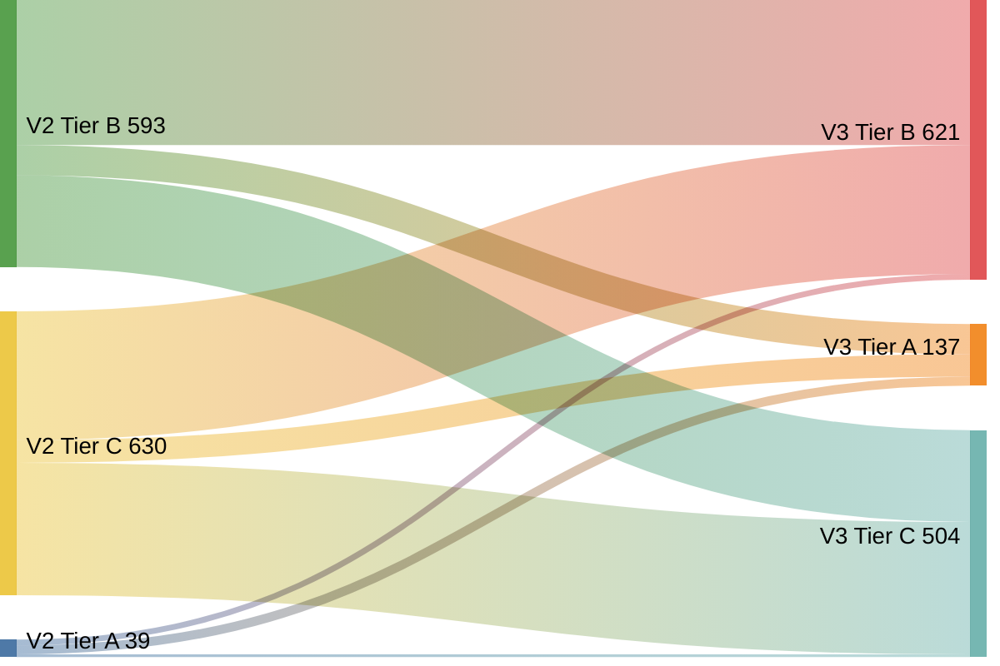
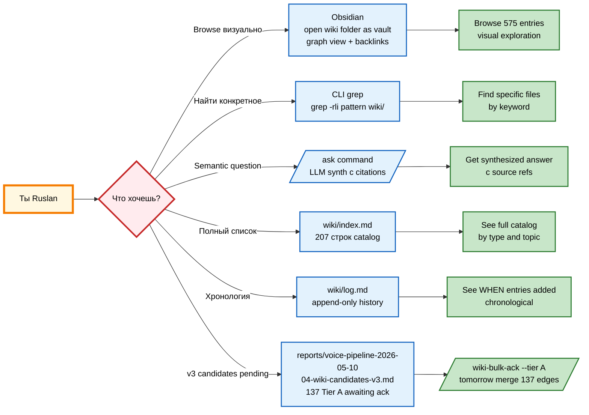

# 🧠 Wiki State Analysis — что у нас в KB сейчас (2026-05-11)

> **Stage 2A v3 wiki rebuild DONE.** 158 batches, 60.1% match rate (v2 50.1% → +10pp). 0 throttle, 0 fallback. 5h 47min runtime.
>
> Этот документ объясняет на человеческом + technical: что в wiki, что появилось, как читать, какие insights surface, и куда смотреть дальше.

---

## §1 НА ЧЕЛОВЕЧЕСКОМ — что произошло за ночь

### §1.1 Что было

Накопленные voice memos (47 штук) уже были один раз проrun'ены через pipeline 10.05, но **БЕЗ LLM precision** — только BM25 (грубый text-matching). Результат: 39 high-confidence связей (Tier A), match rate 50.1%, не semantic.

### §1.2 Что сделали ночью

Запустили full LLM rerank через `claude-sonnet-4-6` — модель прошла каждый из 1262 candidates × 10 потенциальных wiki matches и решила semantic confidence для каждой пары. 158 batches × 8 items.

### §1.3 Что получилось

| Метрика | v2 (BM25-only) | v3 (LLM) | Изменение |
|---|---|---|---|
| **Tier A** (≥0.85, high-conf) | 39 | **137** | **+98 (3.5×)** |
| Tier B (0.60-0.85, medium) | 593 | 621 | +28 |
| Tier C (<0.60, low) | 630 | 504 | -126 |
| **Match rate (A+B)** | 50.1% | **60.1%** | **+10 pp** |
| Skipped | 365 | 365 | 0 |
| Throttle hits | — | **0** | clean |
| Fallback (BM25 from LLM error) | — | **0/1262** | clean |

**Перевод:** LLM нашёл в **3.5 раза больше** уверенных связей чем BM25 предполагал. Plan-doc предсказывал что LLM будет строже (tier A shrink to 25-30) — но реальность другая: LLM нашёл **больше семантических связей которые BM25 пропустил** из-за multi-language morphology + concept-level matching.

### §1.4 Что это значит practically

- **137 новых высокоуверенных связей** ждут твоего bulk-ack завтра утром (commit edges в graph)
- **403 candidates upgraded** (C→B/A или B→A) — твои voice идеи resonate с уже existing wiki entries сильнее чем казалось
- **223 candidates downgraded** — LLM correctly demoted things which BM25 thought matched on surface keywords
- **636 unchanged** — stable matches confirmed

---

## §2 ТЕКУЩИЙ STATE WIKI (entries + edges)

### §2.1 Wiki entries — 575 .md файлов всего

| Type | Count | Что внутри |
|---|---|---|
| **ideas/** | **257** | Heaviest. Гипотезы / applied patterns / connections / future-direction notes (твои inputs). Slugs типа `jetix-as-infrastructure-metaphor`, `position-of-power-yes-and-no`, `think-do-feedback-loop` |
| **sources/** | **271** | Heaviest. Внешние материалы (книги, papers, статьи, voice transcripts metadata) |
| **concepts/** | 14 | LIGHT. Definitional anchors — `engineering-faith`, `korporaciya-startup-concept`, `digital-sovereignty`, `value-three-layers`, `writing-as-telepathy` etc. |
| **entities/** | 4 | LIGHT. People/orgs/tools — `claude-code`, `github`, `jetix`, `linux` |
| **claims/** | 5 | LIGHT. Validated claims (positive/negative polarity) — `business-projects-like-code` etc. |
| topics/ | 1 | empty-ish |
| summaries/ | 0 | empty |
| experiments/ | 0 | empty |
| foundations/ | 0 | empty (foundations are в `swarm/wiki/foundations/`, not `wiki/foundations/`) |
| comparisons/ | 0 | empty (filled через `/ask --save`) |
| **TOTAL** | **575** | |

**Insight:** wiki сильно перекошена в сторону **ideas (257)** и **sources (271)** = твои сырые insights + цитируемые источники. **Concepts (14) и entities (4)** — недостаточно для backbone. Когда мы сделаем gamification mining, это balance пополнится (concepts +80-100, entities +25-35, sources +30-50).

### §2.2 Edges — 609 связей в graph

| Type | Count | Что значит |
|---|---|---|
| **part_of** | 233 | Hierarchical: X — часть Y (e.g., idea — часть концепции) |
| **derived_from** | 219 | Provenance: X derived from source Y (citation chain) |
| **supports** | 84 | X supports / corroborates claim Y |
| **extends** | 35 | X extends / builds upon Y |
| **mentions** | 32 | Soft reference: X mentions Y |
| co-founder-with | 2 | People relations |
| advisor-of | 2 | People relations |
| founder-of | 1 | People relations |
| **contradicts** | **1** | ⚠️ Только 1 contradiction в graph — слабая antithesis detection |

**Insight:** `part_of` + `derived_from` доминируют (74% всех edges) — это нормально для wiki в early stage. Нехватает `contradicts` и `supersedes` — нет «debate» структуры. Gamification mining добавит ~10-15 `contradicts` edges (anti-patterns: pay-to-win, whaling, etc.) — это поможет.

### §2.3 Niches — 6 срезов

- `business/` — Jetix как business, partnerships, ICP, sales
- `life/` — Life OS, habits, recovery, energy
- `meta/` — методология, mental models, meta-thinking
- `personal/` — личные cycles, рефлексии
- `sales/` — sales-specific (overlap с business)
- `tech/` — AI tools, frameworks, code patterns

---

## §3 КАК ЧИТАТЬ WIKI (browse / explore)

### §3.1 Direct file browse

Главный entry point:

```
wiki/index.md            # каталог всех страниц (207 строк)
wiki/log.md              # append-only хронология
wiki/overview.md         # high-level описание
```

Browse по типам:
```bash
wiki/concepts/         # 14 концепций — open в Obsidian / любом MD viewer
wiki/ideas/            # 257 идей — самое богатое
wiki/sources/          # 271 источников
wiki/entities/         # 4 entities
wiki/claims/           # 5 claims
wiki/niches/<niche>/   # per-niche symlinks
```

### §3.2 Через Obsidian (рекомендация)

Установи Obsidian, открой папку `wiki/` как vault:
1. Slug-based навигация (kebab-case filename = slug)
2. Backlinks через graph (`wiki/graph/edges.jsonl` — но Obsidian native backlinks через wikilinks тоже работают)
3. Graph view покажет 575 nodes + 609 edges visually
4. Search по frontmatter tags + full-text

### §3.3 Через CLI / grep

```bash
# Найти все entries про gamification (future):
grep -rli "gamification\|game-mechanic\|torn\|castronova" wiki/

# Найти все по конкретному audio memo:
grep -rli "audio_437" wiki/

# Top-cited sources:
grep -h "^sources:" wiki/ideas/*.md | sort | uniq -c | sort -rn | head -20
```

### §3.4 Через `/ask` skill (semantic)

```
/ask "что у нас есть про Jetix как infrastructure"
/ask "какие patterns для community building"
/ask "что про global vision системы"
```

`/ask` найдёт relevant entries + синтезирует ответ с citations.

### §3.5 Stage 2A v3 артефакты для review

```
reports/voice-pipeline-2026-05-10/
├── 04-wiki-candidates-v3.md           # human-readable, 301KB — top-tier связи для bulk-ack
├── 04-wiki-candidates-v3.json         # machine-readable sidecar (2.4MB)
├── _stage5_v3_rerun.log.md            # discipline log (195 строк)
├── _checkpoint_v3.json                # gitignored runtime state
├── checkpoint-summary.md              # audit trail final
└── EXPLAINED-FOR-RUSLAN.md            # human guide (271 строк)
```

И:

```
reports/wiki-integration-redesign-2026-05-10/
└── match-rate-comparison-v3.md        # v2 vs v3 delta analysis
```

---

## §4 KEY INSIGHTS из v3 sample (первые 45 Tier A candidates)

Recurring themes которые LLM подтвердил с high confidence:

### §4.1 Jetix corporate vision (cluster — 12+ memos)
- `jetix-as-infrastructure-metaphor.md` (0.97) — дорога одна, машины разные
- `jetix-corporation-1000-pros-100k-agents.md` (0.87-0.88, multiple memos)
- `korporaciya-startup-concept.md` (0.92)
- `global-vision-system-of-future.md` (0.87-0.88, multiple)

→ Stable signal: Jetix как infrastructure / corporation / global system / 1000+ partners.

### §4.2 Community / Clan / Family (cluster — 8+ memos)
- `soobshchestvoklan-skhozhie-tsennosti-vzaimozashchita-se.md` (0.87-0.90, multiple)
- `ideal-member-portrait.md` (0.95) — «профессионалы-психопаты»
- `anti-free-riding-accountability.md` (**1.00**, perfect match) — притча о 10 мудрецах
- `unite-adventurers-biggest-adventure.md` (0.85-0.97, multiple)
- `curated-community-access.md` (0.88) — Kingsman Club паттерн

→ Stable signal: community как **семья на максималках** + accountability mechanisms.

### §4.3 Power dynamics / position (cluster — 4+ memos)
- `position-of-power-yes-and-no.md` (0.88, multiple) — можешь сказать «да», «нет», «завали»
- `become-valuable-before-going-to-market.md` (0.86) — профессионал-сварщик паттерн
- `beast-mode-formula-actions.md` (0.85)

### §4.4 Tools / AI synergy (cluster — 5+ memos)
- `tool-community-symbiosis-loop.md` (0.97) — улучшаешь tools / tools улучшают тебя
- `ai-kak-elektrichestvo-tsennost-sdvigaetsya-ot-uma-k-vyb.md` (0.92)
- `ai-stek-kak-polnotsennaya-armiya-i-zadacha-ey-upravlyat.md` (0.88)
- `stek-instrumentov-dlya-vtorogo-mozga-2026.md` (0.85) — мега-мозг / second brain
- `automate-research-via-crewai.md` (0.87)

### §4.5 Methodology as moat (cluster — 3+ memos)
- `klyuchevoy-aktiv-korporatsii-ne-usluga-a-metodologiya-a.md` (0.87, multiple)
- `engineering-faith.md` (0.93)

### §4.6 Market timing (cluster — 2 memos)
- `okno-vozmozhnostey-deystvovat-poka-massy-ne-osoznali.md` (0.90)
- `uzhe-est-klienty-s-dengami-skvoznaya-analitika-biznesa.md` (0.87)

---

## §5 VISUAL DIAGRAMS

### §5.1 Wiki State Overview — entries + edges breakdown

```mermaid
%%{init: {'theme':'base', 'themeVariables': {'primaryTextColor':'#000000','textColor':'#000000','lineColor':'#333333','primaryBorderColor':'#333333','primaryColor':'#fafafa','noteTextColor':'#000000','noteBkgColor':'#fff8d5','edgeLabelBackground':'#ffffff'}}}%%
flowchart TD
    Wiki[wiki KB<br/>575 entries 609 edges]:::root

    Wiki --> EntryGroup[Entries by type]:::group
    Wiki --> EdgeGroup[Edges by type]:::group

    EntryGroup --> Ideas[ideas 257<br/>HEAVIEST<br/>hypotheses applied patterns]:::heavy
    EntryGroup --> Sources[sources 271<br/>HEAVIEST<br/>books papers transcripts]:::heavy
    EntryGroup --> Concepts[concepts 14<br/>LIGHT<br/>definitional anchors]:::light
    EntryGroup --> Entities[entities 4<br/>LIGHT<br/>people orgs tools]:::light
    EntryGroup --> Claims[claims 5<br/>LIGHT<br/>validated mechanisms]:::light
    EntryGroup --> Other[topics summaries experiments<br/>0-1 each]:::empty

    EdgeGroup --> PartOf[part_of 233<br/>hierarchical]:::dominant
    EdgeGroup --> Derived[derived_from 219<br/>provenance]:::dominant
    EdgeGroup --> Supports[supports 84]:::medium
    EdgeGroup --> Extends[extends 35]:::medium
    EdgeGroup --> Mentions[mentions 32]:::medium
    EdgeGroup --> People[people relations 5]:::light
    EdgeGroup --> Contradicts[contradicts 1<br/>WEAK debate structure]:::weak

    classDef root fill:#fff8e1,stroke:#f57c00,stroke-width:4px,color:#000
    classDef group fill:#e3f2fd,stroke:#1565c0,stroke-width:3px,color:#000
    classDef heavy fill:#90caf9,stroke:#0d47a1,stroke-width:3px,color:#000
    classDef light fill:#e1f5fe,stroke:#01579b,stroke-width:2px,color:#000
    classDef empty fill:#eceff1,stroke:#90a4ae,stroke-width:1px,color:#666
    classDef dominant fill:#a5d6a7,stroke:#1b5e20,stroke-width:3px,color:#000
    classDef medium fill:#c8e6c9,stroke:#2e7d32,stroke-width:2px,color:#000
    classDef weak fill:#ffcdd2,stroke:#c62828,stroke-width:2px,color:#000
```



### §5.2 Stage 2A v3 Tier Transition Matrix (v2 → v3)



**Read:** v2 Tier B 67 candidates были upgraded к v3 Tier A (LLM нашёл стронг semantic). v2 Tier C 50 → v3 Tier A. v2 Tier A 19 demoted (LLM не подтвердил BM25 confidence). Большинство (636) остались в той же tier.

### §5.3 Как browse wiki — навигация для Ruslan



---

## §6 ЧТО ДАЛЬШЕ

### §6.1 Сегодня — gamification deep wiki mining (per Day Plan 11.05 update)

Per твой call: видео Цэрэну отложено на ПОСЛЕ gamification. Поэтому next:

1. **Анализ plan-doc gamification** (уже сделан в предыдущем chat — 1002 lines, 13 Q acked defaults, SHA `93e6007`)
2. **Запуск Шаг C — gamification mining execution** (2h 10min target / 2h 30min hard cap)
3. **Шаг D — Question Mining** (после mining: 4 categories questions → варианты / hypothesis)
4. **Ruslan-words spec** Jetix gamification
5. **Wiki cross-verification** spec'a через `/ask`
6. **Видео Цэрэну** — финальный шаг после gamification done

### §6.2 Tier A bulk-ack (independent, может параллельно)

137 candidates готовы к bulk-ack:
```bash
/wiki-bulk-ack --tier A --dry-run    # preview
/wiki-bulk-ack --tier A              # execute → edges.jsonl 609 → ~720+
```

(или дождаться когда gamification mining добавит свои entries + edges, потом один большой ack — на твой call.)

---

## §7 КАК ВЫГЛЯДИТ WIKI В ЦИФРАХ — sanity check

| Что | Сейчас | Target (после gamification mining Шаг C) |
|---|---|---|
| Total entries | 575 | ~720-730 (+150 gamification) |
| Concepts | 14 | ~95-115 (+80-100) — major fill |
| Entities | 4 | ~30-40 (+25-35) — major fill |
| Sources | 271 | ~310-320 (+30-50) |
| Ideas | 257 | ~275-285 (+15-25) |
| Claims | 5 | ~15-20 (+10-15) — anti-patterns explicit |
| Summaries | 0 | ~6-8 |
| Edges | 609 | ~750-800 (+150 staged) |
| Edge types | 9 | 12+ (`contradicts` from 1 → ~10-15) |

**Major gap currently:** concepts (14) и entities (4) — недонаполнены. Gamification mining исправит это значительно.

---

*Закончено 2026-05-11 midday. Awaits Ruslan review → запуск Шаг C gamification mining.*
