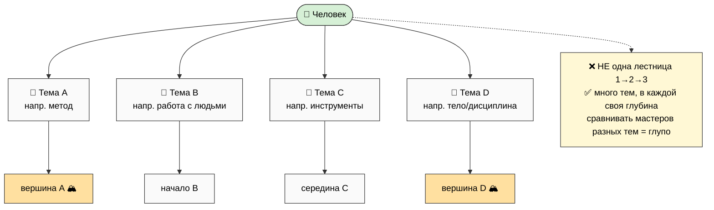

# Mastery Concept deepening

> **Что это.** Углубление концепции Мастерства из voice 26.05 Note 2. Это **дополнение** к
> existing Mastery spec (Phase 2 workshop-concept) — НЕ переписывает его (патчи интеграции — Phase 6).
> Четыре новых среза: (A) шаблоны × уникальные задачи · (B) 3 оси накопления · (C) темы vs уровни ·
> (D) уточнённое определение · (E) curiosity-driven вечная тренировка.
>
> **Voice-anchor (Note 2):** *«умение подобрать нужный метод собрать метод новый изобрести — это
> как раз мастерство и уровень развитости интеллекта... чем лучше это делаешь тем больше у тебя
> вариантов на жизнь».*

---

## §A Шаблоны × Уникальные задачи (дуализм мастерства) — S-08, S-09

Voice (Note 2): *«с одной стороны нужно как можно больше этих шаблонов накапливать... чтобы голову
не ебать... но с другой стороны... все задачи в жизни сложные и уникальные».*

Мастерство держится на **двух противоположных движениях одновременно**:

### §A.1 Сторона шаблонов (template what's templatable)

- **Что:** всё, что делается повторяемо — максимально **зашаблонить и автоматизировать**. Voice:
  *«всё что делается шаблонно — дальше продолжать делать шаблонно, чтобы голову не ебать»*.
- **Зачем:** шаблон = экономия внимания. Голова — дефицитный ресурс; рутина на шаблоне = голова
  свободна для уникального. Это прямая связь с **AI-стратификацией** (O-182, existing §F): шаблонное
  → AI/процедура; уникальное → человек.
- **Как:** распознал повтор → вынес в шаблон/чеклист/автоматизацию → больше не думаешь.
- **Граница:** шаблон хорош, пока ситуация **реально** повторяется. Шаблон, натянутый на уникальное
  = cargo-cult (existing anti-pattern §I).

### §A.2 Сторона уникального (embrace unique complexity)

- **Что:** Voice: *«сложных ситуаций в жизни миллиард... в основе все задачи жизни сложные и
  уникальные»*. Большинство значимых задач — уникальны, под них нет готового шаблона.
- **Пример из voice (S-09):** *«каждая работа с каждым клиентом уникальна, с каждым человеком
  уникально — каждому свой метод, подход, не со всеми по одному шаблону»*. Отношения = класс
  уникальных задач. Это прямое следствие для **CRM / partner-facing**: НЕ one-size-fits-all скрипт.
- **Почему это мастерство:** под уникальное нельзя «применить шаблон» — нужно **выбрать/собрать/
  изобрести метод** под конкретный случай (= meta-method, уровень 3, existing §C).
- **Voice про обучение:** *«такие учителя могут работать лучше... и ученики могут лучше запросы свои
  формулировать... такой стиль обучения адекватный»* — обучение тоже per-person, не по одному шаблону.

### §A.3 Balance mechanic (когда шаблон, когда уникальное — это и есть навык)

Сам **выбор** «здесь шаблон / здесь уникальное» — мастерский навык (judgment call). Ошибка в обе
стороны вредна:
- Зашаблонил уникальное → халтура, обидел клиента, cargo-cult.
- Уникализируешь шаблонное → жжёшь голову на ерунде, нет масштаба.

```
Шаблон ←──────── judgment (мастерский навык) ────────→ Уникальное
 повторяется?                                          сложно/неповторимо?
 → шаблон/AI/чеклист          ← мастер решает →        → выбрать/собрать/изобрести метод
 (голову освободить)                                   (где живёт мастерство)
```

**Связь:** это уточняет existing §C «Выбор метода» — первый под-выбор meta-method'а = «это вообще
шаблонная задача или уникальная?». Default vs deliberate quadrant (existing §C.4) = этот же выбор.

### §A.4 Vivid примеры (R11: role-types)

- **Клиентская работа:** онбординг = шаблон (одинаковые шаги); сам разбор задачи клиента =
  уникальное (его контекст не повторить). Мастер шаблонит онбординг, чтобы голова была свободна для
  уникального разбора.
- **Разговор с партнёром:** структура (8 вопросов R12) = шаблон-рамка; **что** сказать этому
  человеку = уникальное (per-person, S-09).
- **Решение проблемы:** known-класс (видел 100 раз) → шаблон; novel-класс (Cynefin complex/chaotic)
  → уникальный метод.

---

## §B Накопление мастерства — 3 оси (S-11)

Voice (Note 2): *«накапливает и базу знаний и навыков и людей»*. Мастерство копится по **трём
осям параллельно**:

| Ось | Что | Как растёт | Где живёт в мастерской |
|---|---|---|---|
| **(а) База знаний** | что ты знаешь (методы, факты, модели) | захват + переработка (existing §B) | Wiki / стена инструментов |
| **(б) Навыки** | что ты умеешь делать (применить, исполнить) | deliberate practice (existing §D) | зона мастерства / тренировочный зал |
| **(в) Люди (network)** | кого знаешь / можешь привлечь | встречи, совместные проекты | зона встреч / Сеть (#14) |

**Cross-axis multiplication:** ценность = знания × навыки × сеть, **не** сумма. Знание без навыка =
теория; навык без сети = соло-потолок; сеть без знаний/навыков = пустые контакты. Мастер растит все
три, и они **перемножаются** (compound leverage). Это встраивает **Network direction (#14)** прямо
в Мастерство: накопление людей = третья ось прокачки, не отдельная активность.

**Связь:** дополняет existing §B (информационный слой — это ось (а)) + §H (активности — ось (б)) +
Network §F (pooling — ось (в) на уровне сети).

---

## §C Темы vs Уровни (нелинейная прогрессия) — S-12, S-13

Voice (Note 2): *«нахуй перепрыгивать с уровня на уровень — это больше как с темы на тему...
развитость может быть вверх-вниз на простое направление, а вот тема — очень много топиков разных...
если один в одном топике хорош, другой в другом — сравнивать глупо».*

Это **корректирует** existing вертикаль (Workshop §D Visitor→Master of Masters): вертикаль валидна
**внутри одной темы**, но мастерство в целом — **не одна лестница**, а **множество тем, в каждой
своя вершина**.


*(WK-S-3 — темы vs уровни: дерево тем, не лестница уровней.)*

Следствия:
- **Multiple valid peaks.** Можно быть глубоко в теме A и в начале темы B — это норма, не «отставание».
- **Сравнивать глупо (S-13).** Мастер метода и мастер работы с людьми — несравнимы (разные темы).
  → **anti-ranking culture** в Сети: нет единого «рейтинга мастеров».
- **Вертикаль остаётся — но локально.** Внутри темы есть глубина (Apprentice→Master по теме). Между
  темами — горизонталь (исследуешь новые темы). Развитость = и вглубь (тема), и вширь (темы).
- **Welcome-frame усиление:** раз нет единой лестницы, нет «я внизу» — есть «я в начале вот этой
  темы, и в глубине вон той». Это снимает иерархическую тревогу.

**Связь:** это **новая секция** для Mastery spec (предлагаю §M «Нелинейная прогрессия по темам» —
т.к. §J уже «Reference deep»; патч — Phase 6). Корректирует, не отменяет, вертикаль Workshop §D.

---

## §D Уточнённое определение мастерства (S-14, S-15)

Voice (Note 2): *«описание мастерства — это умение выбирать методы, создавать новые, решать
уникальные задачи... чем больше уникальных задач может решить и чем они тяжелее — тем прокаченнее
мастер».*

### §D.1 Operational definition (refinement existing §A)

Existing one-liner: «мастерство = накопление методов + выбор нужного в нужный момент». **Уточнение**
(добавляет creation + unique-tasks):

> **Мастерство = умение (1) выбрать нужный метод + (2) собрать/изобрести новый, когда готового нет +
> (3) решать всё более уникальные и тяжёлые задачи.**

Три глагола: **выбрать** (из накопленного) · **создать** (когда не из чего) · **решить** (уникальное).
Это полнее, чем просто «выбор» — добавляет **creation** (изобретение метода) как высший регистр.

### §D.2 Measurable proxy (anti-credentialism, S-15)

Как измерить мастерство **без дипломов и титулов**? Voice даёт прокси:
> **количество × тяжесть уникальных задач, которые человек способен решить.**

- Не «сколько курсов прошёл» (credential), а «какие уникальные задачи реально решил» (portfolio).
- Не «какой уровень/титул», а «насколько тяжёлые и непохожие задачи берёт и закрывает».
- **Portfolio > diploma** (existing anti-pattern «mastery ≠ диплом» — теперь с позитивным прокси).

**Связь:** усиливает existing §I anti-pattern (anti-credentialism) + Workshop §F («не bootcamp с
дипломами») — даёт **чем заменить** диплом: track record уникальных решённых задач.

---

## §E Curiosity-driven вечная тренировка (S-10, S-16)

Voice (Note 2): *«ты решаешь каждый раз новые задачи, и тебе интересно от этого, и ты от этого
прокачиваешься и учишься, чтобы эти новые задачи решать... повышать сложность задач — пожалуйста,
welcome... бесконечные развития, улучшения».*

### §E.1 Curiosity loop (механизм вечной тренировки)

```
новая задача → интересно → решаешь (прокачиваешься) → учишься для следующей →
   → берёшь задачу сложнее → снова интересно → ... (бесконечно)
```

Ключевое: двигатель — **интерес (intrinsic motivation)**, не долг (duty). Это уточняет existing §D
«вечная тренировка»: она вечна **не из дисциплины через силу**, а потому что **новые задачи
интересны сами по себе**. Связь с SDT (existing §J): competence + autonomy → внутренняя мотивация
> внешней. Связь с Flow: повышение сложности задач = поддержание challenge ≈ skill (зона flow).

### §E.2 Infinity-frame (S-16) — anti-finishing-line

Voice: *«бесконечные развития, улучшения»*. **Нет финишной черты.** Усиливает existing §D growth
mindset (Dweck) + Workshop = lifelong residence, не graduation. Мастерская — место, где **живут**,
а не «оканчивают».

- **Anti-finishing-line:** нет «я выучился, всё». Каждая решённая задача открывает следующую, сложнее.
- **«Welcome» к сложности:** повышение сложности = приглашение (voice «пожалуйста welcome»), не
  угроза. Сложнее = интереснее = больше прокачки.
- **Связь с founder-as-exhibit (Phase 1):** founder тоже бесконечно учится («поехал... учиться») —
  exhibit показывает, что мастерство не заканчивается даже у основателя.

### §E.3 «Больше вариантов на жизнь» (зачем всё это)

Voice (Note 2 начало): *«чем лучше это делаешь, тем больше у тебя вариантов на жизнь, и просто лучше
живёшь»*. Конечная цель мастерства — **не титул и не деньги**, а **больше вариантов** (степеней
свободы) и **лучшая жизнь**. Прямая связь с триадой O-138 (жить чтобы жить + развиваться). Мастерство
= инструмент жизни, не самоцель-достижение.

---

## §F Сводка — что Phase 3 добавляет к existing Mastery

| Новое | Куда интегрируется (патч Phase 6) | S-идеи |
|---|---|---|
| Шаблоны × уникальное дуализм | existing §C «Выбор метода» extended | S-08, S-09 |
| 3 оси накопления (знания/навыки/люди) | existing §D «Вечная тренировка» extended | S-11 |
| Темы vs уровни (нелинейность) | NEW §M «Нелинейная прогрессия по темам» | S-12, S-13 |
| Определение refinement (выбрать+создать+решить) | existing §A definition | S-14 |
| Measurable proxy (уникальные задачи) | existing §I anti-patterns (anti-credentialism) | S-15 |
| Curiosity loop + infinity-frame | existing §D + §E | S-10, S-16 |

---

*Phase 3 closure. Mastery deepening: §A шаблоны×уникальное (+ balance mechanic + vivid) · §B 3 оси
накопления (знания×навыки×люди = compound) · §C темы vs уровни (нелинейность, WK-S-3, anti-ranking) ·
§D определение refinement (выбрать+создать+решить) + measurable proxy (anti-credentialism) · §E
curiosity-driven вечная тренировка + infinity-frame + «больше вариантов на жизнь». Дополняет
existing Mastery spec, НЕ модифицирует. Переход к Phase 4 — Vision augmentation patches.*
