# Diagram 01 — Landscape map

> Visualizes the 7 clusters as a constellation of adjacent fields с Jetix position в центре.

```mermaid
graph TB
    JETIX(("**JETIX**<br/>FPF + Workshop + H1-H8<br/>Russian+English<br/>methodology + AI substrate"))

    subgraph C1["§1.1 Universal Language"]
        C1A[Lojban / Ithkuil<br/>Toki Pona / E-Prime]
        C1B[TLA+ / Lean / Coq<br/>formal specs]
        C1C[Attempto ACE<br/>controlled natural lang]
        C1D[Schema.org / JSON-LD<br/>semantic web]
    end

    subgraph C2["§1.2 Intelligence as Tool"]
        C2A[Bush 1945 / Engelbart 1962<br/>Memex / H-LAM/T]
        C2B[Kay Dynabook / Bret Victor Dynamicland]
        C2C[Clark+Chalmers<br/>Extended Mind 1998]
        C2D[Karpathy LLM Wiki<br/>Apr 2026]
        C2E[Beer VSM / Ashby<br/>Friston FEP]
    end

    subgraph C3["§1.3 Platforms"]
        C3A[Network State / Praxis<br/>Próspera]
        C3B[Are.na / Obsidian<br/>Logseq]
        C3C[Substack / Patreon<br/>creator economy]
        C3D[Mastodon / DAOs<br/>Gitcoin]
    end

    subgraph C4["§1.4 Engineering Communities"]
        C4A[INCOSE / OMG SysML]
        C4B[SEMAT Essence<br/>Ivar Jacobson]
        C4C[Cynefin / TRIZ / TOC]
        C4D[Agile / Lean<br/>Levenchuk ШСМ]
    end

    subgraph C5["§1.5 Trust beyond Money"]
        C5A[TimeBanks / Cahn<br/>LETS / Ithaca HOURS]
        C5B[PGP WoT<br/>Stack Overflow karma]
        C5C[W3C VC v2.0<br/>SBT DeSoc 2022]
        C5D[Mondragón / Graeber<br/>RxC Plurality]
    end

    subgraph C6["§1.6 Virtual Tribes"]
        C6A[e/acc / d/acc<br/>Andreessen / Buterin]
        C6B[EVE Online corps<br/>NixOS / Debian]
        C6C[Kibbutz / Quaker<br/>Benedictine]
    end

    subgraph C7["§1.7 Methodology Distribution"]
        C7A[Alexander Pattern Lang<br/>→ Beck → GoF → Wiki]
        C7B[GTD / TOC / Six Sigma<br/>certification economies]
        C7C[Toyota Production System<br/>cross-industry transfer]
        C7D[Anthropic courses<br/>Karpathy LLM Wiki Gist]
    end

    JETIX -.->|directly inherits| C1C
    JETIX -.->|adopts substrate| C2D
    JETIX -.->|H4 LOCKED| C3A
    JETIX -.->|R12 anti-extract| C5D
    JETIX -.->|FPF parallel| C4B
    JETIX -.->|H8 substrate options| C5C
    JETIX -.->|vision/04 first Clan| C6C
    JETIX -.->|cross-domain transfer| C7A
    JETIX -.->|tribe positioning| C6A
    JETIX -.->|H-LAM/T parent| C2A
    JETIX -.->|Russian baseline| C4D
    JETIX -.->|distribution lessons| C7D

    style JETIX fill:#ff6b6b,stroke:#000,stroke-width:3px,color:#fff
    style C1 fill:#e8f4f8
    style C2 fill:#fff3cd
    style C3 fill:#d4edda
    style C4 fill:#f8d7da
    style C5 fill:#d1ecf1
    style C6 fill:#e2e3e5
    style C7 fill:#cfe2ff
```

---

## Legend

- **Center red node** — Jetix as integrating substrate
- **Dotted arrows** — direct adjacency / inheritance / lesson source per cluster docs
- **Subgraph clusters** — 7 research clusters per §1.1-§1.7 in prompt

## Reading

Jetix не uniquely invents any single cluster element. Jetix **integrates across all 7 clusters** в single coherent substrate:
- FPF (Cluster 1) + Karpathy substrate (Cluster 2) + Network State framing (Cluster 3) + methodology lineage (Cluster 4) + role-attestation trust (Cluster 5) + first-Clan tribal pattern (Cluster 6) + Pattern Language distribution lesson (Cluster 7)

The **uniqueness claim** = the integration, not any single element (per 09-jetix-positioning-sharpened.md).
