# Diagram 02 — Influence tree (intelligence-as-tool + methodology lineages)

> Visualizes 80-year intellectual lineage from Bush 1945 → Karpathy 2026 + adjacent methodology streams.

```mermaid
%%{init: {'theme':'base', 'themeVariables': {'primaryTextColor':'#000000','textColor':'#000000','lineColor':'#333333','primaryBorderColor':'#333333','primaryColor':'#fafafa','noteTextColor':'#000000','noteBkgColor':'#fff8d5','edgeLabelBackground':'#ffffff'}}}%%
graph TD
    Bush["**Vannevar Bush 1945**<br/>'As We May Think'<br/>Memex"]
    Wiener["**Norbert Wiener 1948**<br/>Cybernetics"]
    Ashby["**W. Ross Ashby 1956**<br/>Law of Requisite Variety"]
    Engelbart["**Doug Engelbart 1962**<br/>'Augmenting Human Intellect'<br/>H-LAM/T = trained human + artifacts + language + methodology"]
    Nelson["**Ted Nelson 1960+**<br/>Project Xanadu<br/>hypertext"]
    McCarthy["**McCarthy 1958**<br/>Lisp"]
    Kay68["**Alan Kay 1968+**<br/>Dynabook + Smalltalk<br/>personal dynamic media"]
    Beer["**Stafford Beer 1971**<br/>VSM + Project Cybersyn"]
    Mauss["**Marcel Mauss 1925**<br/>The Gift"]
    Korzybski["**Korzybski 1933**<br/>General Semantics<br/>'map is not territory'"]
    Bourland["**David Bourland 1965**<br/>E-Prime"]
    Loglan["**Loglan 1955**<br/>James Cooke Brown"]
    Lojban["**Lojban 1987**<br/>Logical Language Group"]
    Alexander["**Christopher Alexander 1977**<br/>A Pattern Language"]
    Cunningham95["**Ward Cunningham 1995**<br/>WikiWikiWeb<br/>first wiki"]
    Beck87["**Beck + Cunningham 1987**<br/>Patterns → programming"]
    GoF["**Gang of Four 1994**<br/>Design Patterns"]
    Zimmermann["**Phil Zimmermann 1992**<br/>PGP Web of Trust"]
    Lamport94["**Leslie Lamport 1994**<br/>TLA+"]
    Quijada["**Quijada 1978+**<br/>Ithkuil"]
    Lang01["**Sonja Lang 2001**<br/>Toki Pona"]
    Goldratt["**Eli Goldratt 1984**<br/>Theory of Constraints<br/>The Goal"]
    Toyota50["**Toyoda + Ohno 1950s**<br/>Toyota Production System"]
    Womack["**Womack et al 1990**<br/>'Machine That Changed the World'<br/>Lean Manufacturing"]
    Altshuller["**Altshuller 1946+**<br/>TRIZ Russia"]
    Levenchuk["**Anatoly Levenchuk<br/>ШСМ → EEM Institute**<br/>Russian methodology"]
    Snowden99["**Dave Snowden 1999**<br/>Cynefin IBM"]
    Jacobson["**Ivar Jacobson 2009+**<br/>SEMAT Essence Kernel"]
    Agile01["**Agile Manifesto 2001**<br/>17 signatories"]
    Clark98["**Clark + Chalmers 1998**<br/>Extended Mind"]
    Allen01["**David Allen 2001**<br/>GTD book"]
    Friston06["**Karl Friston 2006+**<br/>Free Energy Principle<br/>Active Inference"]
    Buterin13["**Buterin + ETH 2013-14**<br/>Ethereum"]
    Andreessen11["**Andreessen 2011**<br/>'Software Is Eating the World'"]
    Balaji22["**Balaji 2022**<br/>Network State book"]
    Weyl18["**Glen Weyl 2018**<br/>RadicalxChange"]
    SBT22["**Buterin + Weyl + Ohlhaver May 2022**<br/>DeSoc / SBT paper"]
    Andreessen23["**Andreessen 2023**<br/>Techno-Optimist Manifesto = e/acc"]
    Vitalik23["**Vitalik Nov 2023**<br/>d/acc 'My Techno-Optimism'"]
    Karpathy26["**Karpathy April 2026**<br/>LLM Wiki Gist"]
    Tang24["**Tang + Weyl 2024**<br/>Plurality book"]
    Praxis19["**Dryden Brown 2019+**<br/>Praxis"]
    Prospera17["**Brimen 2017+**<br/>Próspera Honduras"]
    Cahn80["**Edgar Cahn 1980**<br/>TimeBanks"]
    Mauss --> Cahn80
    Mauss --> Graeber11["**Graeber 2011**<br/>'Debt: 5000 Years'"]

    Bush --> Engelbart
    Engelbart --> Nelson
    Engelbart --> Kay68
    Wiener --> Ashby
    Ashby --> Beer
    Korzybski --> Bourland
    Bourland --> Lojban
    Loglan --> Lojban
    Alexander --> Beck87
    Beck87 --> GoF
    Beck87 --> Cunningham95
    Cunningham95 --> Karpathy26
    Karpathy26 --> JETIX(("**JETIX**<br/>2026-05-17"))
    Toyota50 --> Womack
    Womack --> Agile01
    Goldratt --> Agile01
    Altshuller --> Levenchuk
    Snowden99 --> Jacobson
    Allen01 --> JETIX
    Jacobson --> JETIX
    Levenchuk --> JETIX
    Clark98 --> JETIX
    Friston06 --> JETIX
    Engelbart --> JETIX
    Lamport94 --> JETIX
    Quijada --> JETIX
    Lang01 --> JETIX
    Beer --> JETIX
    Cahn80 --> JETIX
    Graeber11 --> JETIX
    Zimmermann --> JETIX
    SBT22 --> JETIX
    Balaji22 --> JETIX
    Weyl18 --> JETIX
    Andreessen23 --> JETIX
    Vitalik23 --> JETIX
    Tang24 --> JETIX
    Praxis19 --> JETIX
    Prospera17 --> JETIX
    Snowden99 --> JETIX
    Alexander --> JETIX
    Agile01 --> JETIX
    Womack --> JETIX
    Goldratt --> JETIX
    GoF --> Cunningham95
    Buterin13 --> SBT22
    Buterin13 --> Vitalik23
    Weyl18 --> SBT22
    Weyl18 --> Tang24
    Andreessen11 --> Andreessen23
    Balaji22 --> Praxis19

    style JETIX fill:#ff6b6b,stroke:#000,stroke-width:3px,color:#fff
    style Engelbart fill:#fff3cd,stroke:#000,stroke-width:2px
    style Alexander fill:#fff3cd,stroke:#000,stroke-width:2px
    style Cunningham95 fill:#fff3cd,stroke:#000,stroke-width:2px
    style Karpathy26 fill:#fff3cd,stroke:#000,stroke-width:2px
    style SBT22 fill:#d4edda,stroke:#000,stroke-width:2px
```

---

## Key lineages converging into Jetix

1. **Augmentation lineage (yellow):** Bush 1945 → Engelbart 1962 (H-LAM/T 4-tuple = parent of FPF) → Kay 1968 → Alexander 1977 → Cunningham 1995 (first wiki ever) → Karpathy April 2026 (LLM Wiki pattern adopted) → **Jetix 2026-05-17**

2. **Trust lineage (green):** Mauss 1925 → Korzybski 1933 → Cahn 1980 → Zimmermann 1992 → Buterin/Weyl/Ohlhaver SBT May 2022 → **Jetix H8 2026-05-17**

3. **Methodology lineage:** Toyota 1950s → Goldratt 1984 → Altshuller 1946+ → Snowden 1999 → Allen 2001 → Agile 2001 → Jacobson SEMAT 2009 → Levenchuk EEM Institute → **Jetix FPF**

4. **Cybernetics lineage:** Wiener 1948 → Ashby 1956 → Beer 1971 (VSM + Cybersyn) → Foundation Part 4 citation → **Jetix governance**

5. **Conlangs lineage:** Loglan 1955 → Lojban 1987 + Korzybski-Bourland E-Prime + Quijada Ithkuil + Lang Toki Pona → **Jetix FPF as universal language**

6. **Network State + crypto lineage:** Andreessen 2011 → Buterin 2013 → Weyl 2018 → Balaji 2022 → e/acc + d/acc 2023 → Tang/Weyl Plurality 2024 → Edge City Lanna → **Jetix H4 + tribal positioning**

The Jetix node is **integration point** — not invention of any individual lineage.
