# Diagram 03 — Trust mechanism evolution (1925 → 2026)

> Timeline of trust-mechanism precedents — anchors H8 Octagon LOCKED 2026-05-17.

```mermaid
timeline
    title Trust-mechanism evolution (1925-2026) — H8 Adjacency Timeline

    section Pre-WW2 foundations
        1925 : Marcel Mauss
              : "Essai sur le don" / "The Gift"
              : Anthropology of non-monetary exchange
        1933 : Alfred Korzybski
              : "Science and Sanity"
              : General Semantics; "map is not territory"

    section Cooperative scale
        1956 : Mondragón Founded
              : Basque Spain
              : Worker cooperative federation
        1980 : Edgar Cahn TimeBanks
              : Time Dollar = 1 hour labor
              : Tax-exempt complementary currency
        1984 : Mondragón Cooperative Congress
              : Umbrella governance restructure

    section Cryptographic origins
        1991 : Phil Zimmermann PGP
              : Public key cryptography democratized
        1992 : PGP Web of Trust v2.0
              : Decentralized trust through key signing
              : Strong set 18K (2003) → 60K (2018)

    section Online reputation
        1995 : eBay feedback
              : Bilateral commerce reputation
              : 30-year working pattern
        2008 : Stack Overflow
              : Karma points + asymmetric voting
              : Privilege gating by reputation
        2011 : David Graeber
              : "Debt: The First 5000 Years"
              : Human economies = obligations not debt

    section Mechanism design + plural
        2013 : Buterin Ethereum
              : Programmable trust contracts
        2018 : Glen Weyl RadicalxChange
              : Quadratic Voting + Funding
              : 501(c)(3) foundation
        2017 : Coordinape (early)
              : Peer-allocated contributor rewards
        2022 : Buterin + Weyl + Ohlhaver
              : "Decentralized Society Finding Web3's Soul"
              : Soulbound Tokens (SBT) paper May 2022

    section W3C standards
        2022 : W3C DID v1.0 Recommendation
              : Decentralized Identifiers
        2024 : W3C VC v2.0 CR
              : Verifiable Credentials data model
        2025 : W3C VC v2.0 Recommendation May 2025
              : Production at TruAge / CA DMV / SpruceID / ETRI

    section Network State + tribes
        2022 : Balaji Network State Book
              : Sovereignty via networked communities
        2023 : Nov - d/acc by Buterin
              : Decentralized defensive accelerationism
        2024 : Tang + Weyl Plurality Book
              : Future of Collaborative Technology
        2024 : Praxis $525M raise
              : Crypto-friendly city funding
        2025 : Jan - d/acc one year later
              : Buterin retrospective

    section Jetix integration
        2026 : May 17 - Jetix H8 Octagon LOCKED
              : Trust Infrastructure (8th vertex)
              : Role-attestation via FPF + open data
              : Substrate-agnostic (VC/SBT/PGP/wiki options)
              : R12 anti-extraction positive face
```

---

## Key inflection points

- **1925** — Mauss frames non-money exchange academically; intellectual foundation
- **1956-1984** — Mondragón proves cooperative trust at industrial scale (70K workers 2024)
- **1980** — Cahn TimeBanks operationalize «time = trust» mechanism (still niche)
- **1992** — PGP Web of Trust = first decentralized cryptographic trust at internet scale (still niche)
- **2011** — Graeber academic peak articulates «human economies» distinction (debt = ending, obligation = ongoing)
- **2022** — Soulbound Tokens paper (May 2022) = crypto-native role-attestation framing
- **2025 May** — W3C VC v2.0 Recommendation = production-ready substrate
- **2026 May 17** — Jetix H8 Octagon LOCKED = synthesis attempt — substrate-agnostic, methodology-anchored, AI-readable

## What Jetix H8 adds

Per 09-jetix-positioning-sharpened.md §4: **substrate-agnosticism** (escape crypto-tribe coupling) + **methodology-anchored** (FPF as legitimacy backing) + **AI-co-readable** + **constitutional governance** (R12 anti-extraction, Corrigibility, Default-Deny).

None individually novel; the combination at this date positions Jetix differently from each adjacent precedent.
