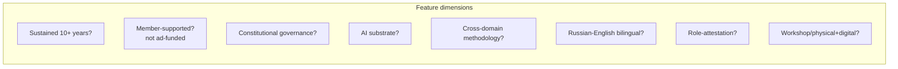
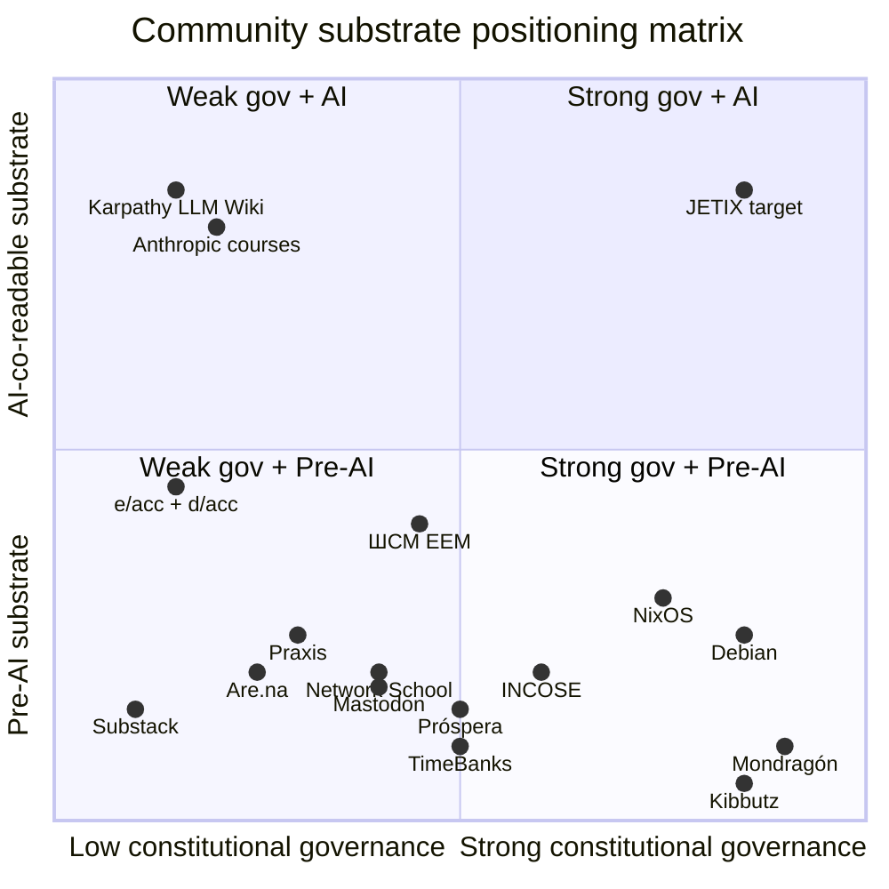

# Diagram 04 — Community substrate comparison (platforms feature matrix)

> Cross-platform feature comparison — anchors vision/03 Jetix-as-Workshop decisions.

---

## Feature matrix (manual table)

| Platform / Community | 10+ yr | Member-supported | Constitutional | AI substrate | Cross-domain method | Bilingual RU+EN | Role-attest | Phys+digital |
|---|---|---|---|---|---|---|---|---|
| **Are.na** | Yes (10+) | Yes (subscriptions) | No formal | No | No | No | No | Digital only |
| **Substack** | No (8yr; $1.1B Series C 2025) | Yes (subscriptions) | No | No | No | No | No | Digital only |
| **Patreon** | Yes (12yr; $10B paid) | Yes | No | No | No | No | No | Digital only |
| **Mastodon** | Yes (10yr); 10M+ users 2024 | Mixed (donations) | Pleroma-Mastodon split = governance debate | No | No | No | No | Digital only |
| **NixOS community** | Yes (20yr) | Yes (volunteer) | Yes (steering committee) | No | Limited | No | No (yes-ish: maintainer) | Digital |
| **Debian** | Yes (32yr) | Yes (volunteer) | Yes (Constitution 1998) | No | No | No | Maintainer status | Digital |
| **EVE Online** | Yes (22yr) | Yes (sub) | Game-internal | No | No | No | In-game Alliance | Digital game |
| **Praxis** | No (5yr+) | No (VC) | Unclear | No | No | No | "citizenship" claim | Hybrid intent |
| **Próspera** | Yes (8+yr) | No (investors) | ZEDE legal | No | No | No | Resident status | Physical Honduras |
| **Network School (Balaji)** | No (recent 2024+) | Yes (fees) | No | No | No | No | No | Physical Malaysia |
| **TimeBanks** | Yes (45yr) | Yes (member) | No formal | No | No | No | Time credits | Digital + IRL |
| **Mondragón** | Yes (68yr) | Yes (member) | Yes (Cooperative Congress 1984) | No | Limited | No | Membership | Physical (Basque) |
| **Kibbutz (Degania lineage)** | Yes (115yr) | Yes | Yes (direct democracy) | No | No | No | Member | Physical (Israel) |
| **INCOSE** | Yes (35yr) | Yes (member) | Bylaws | No | Yes (cross-eng) | Limited | CSEP/ESEP/ASEP | Digital + IRL conf |
| **ШСМ (EEM Institute)** | Yes (15+ yr) | Yes (courses) | Sole-author dep | No (recent) | Yes | Yes (Russian primary) | Course completion | Digital + IRL |
| **Karpathy LLM Wiki community** | No (1 month) | No formal | No | YES | No | No | No | Digital only |
| **Anthropic courses** | No (1.5 yr) | Free | No | YES | No | No | No | Digital only |
| **e/acc + d/acc** | No (3yr) | Loose substack | No formal | No (ideology) | No | No | None formal | Digital + pop-up |
| **Jetix (target)** | Phase 0 (1mo) | Yes (member intent) | YES (Foundation 11pts + Pillar A/B/C) | YES (CLAUDE.md) | YES (FPF) | YES (RU+EN bilingual) | YES (H8 design) | YES (Workshop hybrid) |

---

## Reading

---

## Key observations

1. **Empty quadrant 1 (Strong governance + AI substrate):** Currently nearly empty. **Jetix target position.** No active competitor at this intersection in mid-2026.

2. **NixOS / Debian = strong-governance reference** — useful constitutional pattern templates (covered Cluster 6) but pre-AI substrate.

3. **Karpathy LLM Wiki / Anthropic courses = AI-substrate reference** — useful technical pattern templates but minimal governance.

4. **Mondragón / Kibbutz = sustained-governance reference** — 70-115 years of cooperative trust at scale, but pre-AI + physical-bound.

5. **Praxis / Network School = recent-experimental references** — capital + ambition but governance + substrate immature.

6. **ШСМ EEM Institute = closest predecessor для Jetix** — methodology + Russian + recent AI overlap — Jetix extends with constitutional Foundation + Workshop hybrid + AI substrate explicit.

## Implications для Jetix Phase 0-2

- **No direct competitor at empty quadrant 1** — opportunity window
- **Constitutional governance patterns proven** (NixOS, Debian, Mondragón) — can adopt + adapt
- **AI substrate patterns proven** (Karpathy, Anthropic) — can adopt + extend with governance
- **Risk:** trying to optimize all 8 features = scope creep (Xanadu failure mode). Phase 0-1 must prioritize.
