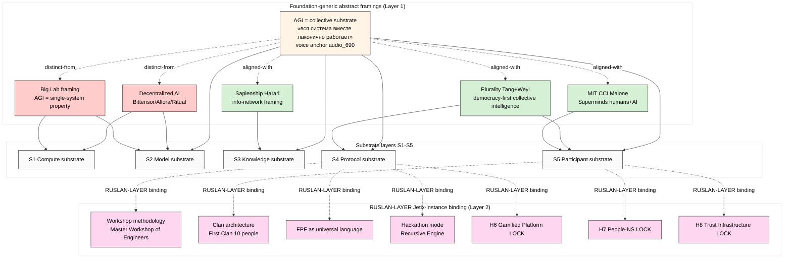

# Phase 2 — «AGI = collective substrate» framing analysis

> Deep analysis voice-anchor framing («когда вся система вместе лаконично работает» — audio_690 Ruslan 2026-05-19) против contemporary advocates. IP-1 STRICT preserved: §1-3 = abstract framing space; §4 explicitly maps RUSLAN-LAYER Jetix-instance binding; §5 = visual diagram of scope.

## §1 Who else uses similar framing? (Adjacent advocates inventory)

### §1.1 Plurality (Tang + Weyl) — **CLOSEST contemporary parallel** [layer: Foundation-generic]

**Core thesis (verbatim from book + papers 2024-2025):**
- «⿻ Plurality: The Future of Collaborative Technology and Democracy»
- «Technology that channels potential energy in social diversity»
- «Pluralistic intelligence emerges from bridging social difference»
- «Tools amplify human collective — not replace it»

**Overlap with audio_690 framing:**
- ✅ Collective intelligence as primary unit (not single AGI)
- ✅ Humans + AI + protocols co-substrate
- ✅ Effective coordination as mechanism
- ✅ Anti-mega-computer framing

**Divergence from audio_690 framing:**
- Plurality emphasizes **democratic governance** as the function
- Audio_690 emphasizes **effective think+act protocol** as the function
- Plurality: «bridging difference» as goal
- Audio_690: «решение задач для развития» (problem-solving for development) as goal
- Plurality: Taiwan civic-tech lineage (Audrey Tang vTaiwan)
- Audio_690: engineering+workshop+ML/NAS-loop lineage

**Citation surface:**
- Cross-citable as ally (collective intelligence umbrella)
- Distinguishable on goal-function axis (democracy vs effective-action)

**F-G-R:** F3/global/high; [src: plurality.institute + Stanford Digital Economy Lab retrieved 2026-05-19]

### §1.2 MIT CCI / Thomas Malone «Superminds» [layer: Foundation-generic]

**Core thesis (Malone 2018 + MIT CCI ongoing):**
- «Superminds» = collectives of humans+AI smarter than any individual
- Academic predecessor to Plurality framing
- Five types: hierarchies, democracies, markets, communities, ecosystems

**Overlap with audio_690:**
- ✅ Human+AI collective as primary unit
- ✅ Tools amplify collective cognition

**Divergence:**
- Academic framing; less «protocol-design-as-mechanism» specificity
- Less «engineering-workshop» tactical layer
- Limited public-discourse loudness 2024-2026

**F-G-R:** F3/academic/medium-high; [src: cci.mit.edu + Superminds 2018 retrieved-stable]

### §1.3 Sapienship (Harari) [layer: Foundation-generic]

**Core thesis («Nexus» 2024 + interviews):**
- AI agents = new actors in info-networks
- Humanity must consciously direct co-evolution
- Info-network = primary substrate (humans + machines)

**Overlap with audio_690:**
- ✅ Information-substrate hypothesis (everything = info processing) — DIRECT OVERLAP с Ruslan «всё есть информация»
- ✅ AI as participant in human info-networks (not replacement)

**Divergence:**
- Harari = directional cultural commentary (NOT product/lab/protocol-builder)
- Audio_690 = action-oriented («давайте за годик поменяли мировой порядок»)
- Pace: Harari decadal; audio_690 1-year ambition

**F-G-R:** F2-3/global/medium-high; cross-cite ally potential STRONG

### §1.4 Decentralized AI movement (Bittensor / Allora / Ritual.net / Gensyn) [layer: Foundation-generic]

**Core thesis 2024-2026:**
- AI substrate = decentralized network of compute + models + incentives
- Web3-aligned: token-incentivized compute/data/model markets
- Bittensor «$TAO» subnets ≈ market-driven model architecture exploration

**Overlap with audio_690:**
- ✅ Substrate framing (NOT single corp = AGI)
- ✅ Network-of-participants thesis

**Divergence — IMPORTANT:**
- Decentralized AI = **agent/model markets** — humans mostly as token-holders / labelers
- Audio_690 = humans-IN-the-substrate as thinking+acting participants (Workshop methodology)
- Crypto-baggage HEAVY (Web3 connotation — friction для non-crypto audiences L2/L3)

**F-G-R:** F2/crypto-native/medium; cross-cite WITH CAUTION (Web3 friction for institutional reception)

### §1.5 E. Glen Weyl additional writings (RadicalxChange, Plural Tech Collaboratory) [layer: Foundation-generic]

- «Mechanism Design + Plurality»
- «Prosocial Media» research 2025 (Weyl, Thorburn, Siddarth, Tang) — cross-cite candidate
- Adjacent to Vitalik Buterin / Jaron Lanier intellectual neighborhood

### §1.6 Surowiecki «Wisdom of Crowds» (2004) — historical predecessor

- Foundation thesis: aggregated diversity > individual experts (under conditions)
- Pre-AGI-era; provides citable lineage anchor

### §1.7 Stigmergy / swarm-intelligence literature

- Termite mound / ant-colony intelligence biology lineage
- Self-organizing collective behavior
- Adjacent — biological substrate parallel (not human+AI specifically)

### §1.8 Network-effect intelligence economics

- Reed's Law (group-forming networks scale 2^N)
- Metcalfe's Law (network value scales N^2)
- Mathematical substrate for collective amplification claim

## §2 «Substrate» semantic precision

### §2.1 «Substrate-as-what?» (5 candidate substrate layers) [layer: Foundation-generic]

From audio_690 verbatim («интеллект + AI + наработки всех людей + эффективный протокол»):

| # | Substrate layer | Component | Function |
|---|---|---|---|
| S1 | Compute substrate | GPUs / data-centers / chips | execution surface |
| S2 | Model substrate | LLMs / world-models / RL-agents | trained capability |
| S3 | Knowledge substrate | «наработки всех людей» — all human work, books, code, methods | accumulated content |
| S4 | Protocol substrate | «эффективный протокол» — coordination mechanism | how-to-collaborate |
| S5 | Participant substrate | humans + AI agents in active collaboration | who-is-collaborating |

**Multi-substrate claim** (audio_690 implicit): AGI = simultaneous orchestration across S1-S5. NO single layer claims the title alone.

**Compare:**
- OpenAI claim: S1 + S2 (compute + model) primary
- Anthropic: S2 + safety governance (model + alignment)
- DeepMind: S1 + S2 + S3 (compute + model + science-data)
- Plurality: S4 + S5 (protocol + participants) primary
- Audio_690: S2 + S3 + S4 + S5 (multi-substrate, intentionally pluralistic)

### §2.2 Substrate vs platform vs infrastructure (terminology hygiene)

- «Substrate» = the carrier of process (biological metaphor)
- «Platform» = product/business framing (commercial connotation)
- «Infrastructure» = engineering layer (technical connotation)

**Audio_690 уtilizes «substrate»** = neutral / philosophical / non-product. This is **strategically important** for IP-1 (abstract framing vs Jetix-product-claim).

### §2.3 Cross-link к К-1 philosophy lineage [layer: Foundation-generic, cross-ref]

- John Wheeler «It from bit» (1990) — information substrate primacy
- Stephen Wolfram «Computational universe» — computation as substrate
- Floridi «Philosophy of Information» — info-substrate ontology
- Gregory Bateson «Mind and Nature» — pattern-which-connects
- Wiener «Cybernetics» — feedback-loop substrate

→ Cross-link к К-1 research output (`research/method-systems-thinking-deep-2026-05-19/`) для philosophical depth substantiation.

## §3 Framing strengths + vulnerabilities (abstract layer)

### §3.1 Strengths of «AGI = collective substrate» framing [layer: Foundation-generic]

1. **Cuts через AGI hype-cycle.** Big Labs racing к «single corp AGI»; collective-substrate framing reframes the game itself.
2. **Ties к alignment + safety + collective benefit.** R12 anti-extraction natural alignment.
3. **Engineering-credible.** Workshop methodology + protocol-design = тactically concrete.
4. **Human-positive.** Anti-replacement narrative; humans remain primary actors.
5. **Honest redefinition.** «AGI is when system works together» = arguably what AGI always meant before corporate hype reframed it.
6. **Substrate-multiplicity** = defensible против single-architecture critics (LeCun JEPA vs LLM debate sidestepped).
7. **Allies available.** Plurality + Sapienship + MIT CCI = friendly precedent cluster.

### §3.2 Vulnerabilities of «AGI = collective substrate» framing [layer: Foundation-generic]

1. **«Collective» = political baggage (US audience).** Reads as collectivist/anti-individualist в right-leaning audiences. Wording must avoid «collectivism» tropes.
2. **«Already done» — Plurality precedent.** Risk: «Tang+Weyl already say this; what's new?»
3. **Vague-sounding — «system works together».** Risk: «sounds like consultantware»; needs concrete protocol-mechanics.
4. **Anti-Big-Lab posture** = could antagonize potential allies (OpenAI/Anthropic/DeepMind employees могут видеть это как dismissive).
5. **Moving-goalposts critique.** «You're redefining AGI to fit Jetix» — common L1 objection.
6. **Measurability deficit.** No single benchmark; «when does collective work?» — fuzzy success criteria.
7. **Crypto-adjacency risk.** Bittensor/decentralized-AI overlap → Web3 baggage stickiness.
8. **«Coordination is hard» — historical track record.** Many collective-intelligence projects failed; needs concrete differentiation from past failures.

### §3.3 Strengths/vulnerabilities balance per audience tier (preview, deep в Phase 3-5)

| Audience | Strengths resonate | Vulnerabilities surface |
|---|---|---|
| L1 engineers | Honest redefinition, multi-substrate, engineering-credible | Vague-sounding without code, measurability deficit |
| L2 founders | Cuts through hype, market-positioning | «Already done» Plurality, anti-Big-Lab posture |
| L3 investors | Anti-extraction (R12), substrate depth | «Coordination is hard» track record, fuzzy success criteria |

## §4 Jetix-instance binding [layer: RUSLAN-LAYER — explicit marker]

> ⚠️ IP-1 STRICT — следующее = RUSLAN-LAYER binding. Abstract framing §1-3 = Foundation-generic claim. Jetix is ONE possible executor binding для этой abstract pattern.

### §4.1 Jetix RUSLAN-LAYER unique substrate composition

Audio_690 framing × existing Jetix substrate components (cross-ref vision/* + 8 Octagon LOCKs):

| Substrate layer | Jetix-RUSLAN-LAYER specific binding | Reference |
|---|---|---|
| S2 Model | Claude / GPT / open-source LLM toolkit | engineering-level |
| S3 Knowledge | Jetix wiki + FPF + ailev IWE + ML-engineering lineage | research/* + raw/external/ailev-FPF/ |
| S4 Protocol | **FPF as universal language + Workshop methodology + Clan architecture + Hackathon mode** | vision/01 + vision/03 + vision/04 |
| S5 Participant | Engineers + founders + investors (L1/L2/L3 cohorts) | vision/04 First Clan + Master Workshop |

### §4.2 Jetix-RUSLAN-LAYER framing positioning options (BREADTH — not selection)

**Framing option A: «We're not AGI — we're substrate»**
- Anchor: Jetix as protocol-designer for collective effective work
- Hook: «AGI = когда система работает; мы делаем чтобы система работала»
- Risk: «scope-collapse» — sounds like just consulting

**Framing option B: «AGI is happening — and it's a system, not a computer»**
- Anchor: AGI redefinition as positioning move
- Hook: «AGI ≠ mega-computer; AGI = эффективная коллективная работа»
- Risk: «messianic overreach» if too bold

**Framing option C: «Jetix is the workshop that makes collective intelligence work»**
- Anchor: Workshop methodology as concrete artifact
- Hook: Engineering-credible tactical specificity
- Risk: under-claims (sounds like a service)

**Framing option D: «Substrate layer for the collective intelligence stack»**
- Anchor: Infrastructure framing (FPF + protocols + community)
- Hook: «We're the standard library; you're the application»
- Risk: B2B abstraction obscures human-positive narrative

→ **All four = candidate options for Phase 7 hypothesis bank.** NOT selection here. Per breadth discipline.

### §4.3 Cross-link к 8 Octagon LOCKs (Jetix-RUSLAN-LAYER substrate already authored)

- **H6 Gamified Platform** (LOCKED 2026-05-11) — game-theory substrate for participation incentive
- **H7 People-NS (Network State)** (LOCKED 2026-05-12) — community-as-substrate
- **H8 Trust Infrastructure** (LOCKED 2026-05-17) — trust as substrate

→ 3 of 8 Octagon LOCKs already operate at substrate layer. Pitch framing can cite these as Jetix-RUSLAN-LAYER substrate components ALREADY built.

### §4.4 Cross-link к Platform v2 (RUSLAN-LAYER monetization)

`reports/jetix-platform-v2-2026-05-19/08-monetization-variants.md` — 15 monetization options. Substrate framing compatible с several monetization options (Workshop fees, Clan dues, Hackathon prize-economy, Master Workshop facilitator income). NOT compatible с «sell-the-AGI» monetization (we don't sell AGI; we build substrate).

## §5 Mermaid framing map

## §6 Phase 2 acceptance check + handoff

- [x] ≥3 closest precedents deeply analyzed (Plurality / MIT CCI / Sapienship / Decentralized AI / Surowiecki = 5+)
- [x] Differentiation surface per precedent (§1.1-1.4)
- [x] «Substrate» semantic precision (§2) — 5 substrate layers identified
- [x] Strengths + vulnerabilities (§3) — 7+7
- [x] IP-1 STRICT: §1-3 abstract; §4 explicit RUSLAN-LAYER markers
- [x] Mermaid framing map (§5)
- [x] Cross-link 8 Octagon LOCKs + Platform v2 без modification
- [x] F-G-R per claim where applicable

**Phase 2 → Phase 3 handoff:**
- L1/L2/L3 reception simulation will reference Phase 2 framing-options A-D as candidate hooks
- Vulnerabilities §3.2 inform expected critiques per audience tier
- §4.2 framing options → Phase 7 hypothesis bank candidates

— Brigadier-scribe 2026-05-19.
