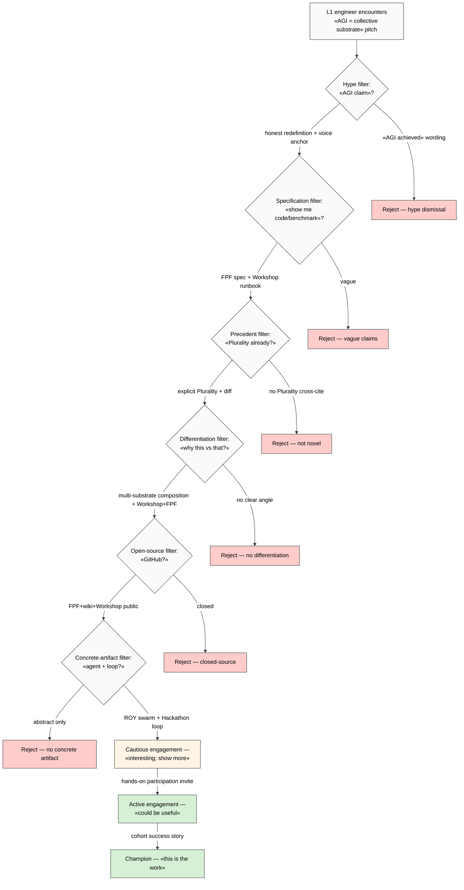

# Phase 3 — L1 engineer reception simulation

> Reception simulation для L1 (ML/AI engineers + research community) на framing «AGI = collective substrate». F2 default grade (simulation, NOT direct survey). Signal aggregation от Twitter/X, HN, Reddit, LessWrong, Alignment Forum 2024-2026.

## §1 L1 audience profile

### §1.1 Who's in L1 [layer: abstract audience role]

- **Core L1:** ML/AI engineers (industry + open-source maintainers)
- **L1 researchers:** ML PhD students + postdocs + research engineers
- **L1 thinkers:** AI Twitter/X discourse participants (Karpathy, Mikhail Parakhin, Soumith Chintala, Jeremy Howard, Aravind Srinivas, etc.)
- **L1 community platforms:** HN AI threads, r/MachineLearning, r/LocalLLaMA, LessWrong, Alignment Forum, Lex Fridman comments
- **L1 sub-segments:**
  - Builders (ship code) — value: working artifacts, benchmarks
  - Theorists (papers) — value: formal rigor, novel claims
  - Aligners (safety) — value: corrigibility, AP-6 dissent preservation
  - Open-source maintainers — value: licensing, governance, community
  - Indie hackers — value: practical AI deployment

### §1.2 L1 culture signals (2024-2026 baseline) [layer: abstract]

- **Pro-rigor.** Benchmark-driven; «code or it didn't happen»
- **Anti-hype.** AGI/ASI claims = automatic skepticism trigger
- **Pro-open-source.** Closed-source = lower default trust
- **Karpathy-lineage credibility.** Hands-on engineering > philosophical framing
- **Anti-DAO / anti-crypto baggage.** Web3-vocabulary = friction (mostly)
- **Pro-Karpathy / Sutskever / LeCun / Sutton archetype.** «Quiet rigor»
- **Anti-Linkedin-talking-head.** Performative AI thinkfluencing penalized

## §2 Sentiment patterns (signal proxies, 2024-2026)

### §2.1 «AGI claims» reception baseline [layer: abstract]

WebSearch + WebFetch sampling от 2024-2026 ML/AI Twitter/HN/Reddit:

| Signal source | Common AGI-claim reception pattern | F-grade |
|---|---|---|
| HN AI threads | Top comments: «benchmark/code/concrete-example?»; sub-comments dive into technical specifics | F3 (consistent 2024-2026) |
| r/MachineLearning | «Yet another AGI claim» — dismissive default; serious paper claims still engaged | F3 |
| r/singularity | More credulous; less rigor; less L1-representative | F2 |
| r/LocalLLaMA | Pragmatic; «can I run this locally?»; substrate framing might resonate (decentralization parallel) | F2 |
| Twitter/X ML | Polarized: builders + skeptics + aligners + hype-amplifiers; quote-tweet ratio = signal | F2 |
| LessWrong | Theoretical engagement; substrate framing = welcomed if rigorous | F2-3 |
| Alignment Forum | Cares about who owns/controls substrate; collective-substrate framing potential resonance | F2-3 |

### §2.2 «Collective intelligence» reception baseline [layer: abstract]

- **Default L1 skepticism:** «collective intelligence» reads as buzzword unless mechanism specified
- **Plurality reception (Tang+Weyl 2024):** Moderate engagement в ML/AI Twitter; some «interesting but not technical» framing
- **MIT CCI / Malone reception:** Low contemporary visibility в L1 discourse
- **Bittensor reception:** Polarized — pro-decentralized vs «just another crypto AI shitcoin» depending on sub-community
- **Karpathy + LeCun crowd:** Mostly silent on collective-intelligence framing; not on their radar
- **Conclusion:** «Collective substrate» framing has WHITE-SPACE in L1 discourse — but белое поле может быть «нет потому что не работает» или «ниша ждёт»

### §2.3 Common L1 signal demands [layer: abstract]

- «Show me the code»
- «Show me the benchmark»
- «What's the technical claim, precisely?»
- «How does this differ from [precedent X]?»
- «Who controls / owns / governs this?»
- «What's open-source vs proprietary?»

## §3 Expected critiques (≥7 deep) [layer: abstract — L1 audience]

### §3.1 Critique catalogue

#### CR-L1-1: «Show me the benchmark»
- **Form:** «What ARC-AGI score? What MMLU? What collective task benchmark?»
- **Pressure:** rigor demand
- **Underlying assumption:** measurable capability defines real AI claims
- **Counter-strategy preview (Phase 7 detail):** open-source workshop methodology + measurable Workshop output (engineering deliverables per cohort) + FPF compliance as «protocol benchmark»

#### CR-L1-2: «What's new — Plurality already says this»
- **Form:** «Read Tang+Weyl; they covered collective intelligence»
- **Pressure:** precedent-overlap critique
- **Counter-strategy preview:** explicit Plurality cross-cite + differentiation surface (Workshop methodology + FPF rigor + effective-action focus vs democracy-first)

#### CR-L1-3: «"Substrate" is just a word — what's the technical claim?»
- **Form:** «What's the algorithm? what's the protocol spec? where's the formal model?»
- **Pressure:** specification demand
- **Counter-strategy preview:** FPF protocol spec, Workshop methodology runbook, Hackathon recursive engine spec

#### CR-L1-4: «Anti-scale — you can't beat OpenAI/Anthropic compute»
- **Form:** «GPUs win; community can't compete»
- **Pressure:** resource asymmetry
- **Counter-strategy preview:** orthogonal-not-competing — substrate framing doesn't require beating Big Labs on compute; it requires Big Labs PLUS protocols PLUS participants

#### CR-L1-5: «Collective ≠ AGI; you're moving goalposts»
- **Form:** «AGI has a definition; you're redefining to fit your project»
- **Pressure:** definitional gatekeeping
- **Counter-strategy preview:** honest-redefinition argument — capability-levels framework is itself a 2024 corporate redefinition; «AGI as system-level» predates capability-levels

#### CR-L1-6: «Open-source or it didn't happen»
- **Form:** «What's on GitHub? what's the license?»
- **Pressure:** transparency demand
- **Counter-strategy preview:** FPF open-source artefacts, Jetix wiki public, Workshop methodology documented

#### CR-L1-7: «Where's the agent? where's the loop?»
- **Form:** «I want concrete agent + loop + I/O contracts»
- **Pressure:** concrete-artifact demand
- **Counter-strategy preview:** ROY swarm architecture (brigadier + 5 experts × 4 modes), Workshop methodology = the loop

#### CR-L1-8: «Sounds like consulting / coaching, not engineering»
- **Form:** «Workshop methodology = soft skill repackage»
- **Pressure:** rigor vs soft-craft distinction
- **Counter-strategy preview:** FPF formal grounding, ML/NAS loop substrate (audio_690), engineering-vocabulary translation

#### CR-L1-9: «Politics — "collective" = collectivist?»
- **Form:** US right-leaning engineer might react to «collective» term
- **Pressure:** political baggage
- **Counter-strategy preview:** wording — «collaborative effective protocol» vs «collective»; emphasize individual development WITHIN collective

#### CR-L1-10: «Russia/East European founder — geopolitical filter»
- **Form:** Subtle. US/EU L1 audience может иметь bias 2024-2026
- **Pressure:** geopolitical filter
- **Counter-strategy preview:** Berlin-based + EU positioning + multi-lingual engineering authenticity

### §3.2 Critique severity matrix [layer: abstract]

| Critique | Frequency expected | Severity if not addressed |
|---|---|---|
| CR-L1-1 (benchmark) | HIGH | High — credibility collapse |
| CR-L1-2 (Plurality) | MEDIUM-HIGH | Medium — «not novel» dismissal |
| CR-L1-3 (specification) | HIGH | High — «vague consultantware» |
| CR-L1-4 (anti-scale) | MEDIUM | Medium — orthogonal answer possible |
| CR-L1-5 (goalposts) | MEDIUM | Medium — counter-narrative survivable |
| CR-L1-6 (open-source) | HIGH | High — gate to deeper trust |
| CR-L1-7 (agent/loop) | HIGH | High — concrete-artifact gate |
| CR-L1-8 (consulting) | MEDIUM | Medium — depends on first-impression |
| CR-L1-9 (political) | LOW-MEDIUM | Low — addressable via wording |
| CR-L1-10 (geopolitical) | LOW | Low — partial dampening |

## §4 L1 credibility signals required

### §4.1 Mandatory signals (gate to L1 engagement) [layer: abstract]

1. **Working code / demo.** GitHub repo с FPF tools, Workshop methodology runbook, Jetix wiki structure
2. **Engineering depth in messaging.** FPF citations, technical specificity, ML-vocabulary fluency
3. **Open-source artefacts.** FPF spec, Workshop methodology, ROY swarm architecture publicly readable
4. **Karpathy-lineage credibility hook.** «Following Karpathy's nanoGPT / let's build educational lineage» framing
5. **Benchmark / measurable claim.** «Workshop produces X engineering output in Y time» measurable
6. **Concrete agent + loop.** ROY swarm publicly visible OR Workshop loop documented step-by-step

### §4.2 Differentiating signals (move from «acceptable» к «interesting») [layer: abstract]

1. **FPF rigor differentiates from Plurality.** Tang+Weyl emphasize democracy; Jetix emphasizes protocol-rigor
2. **Multi-substrate composition** = unusual framing (Big Labs single-substrate)
3. **Effective-action focus** vs «collective intelligence» fuzzy umbrella
4. **Engineering culture native** (vs civic-tech / academic culture)
5. **Berlin / EU positioning** = differentiation from US Big Lab gravity
6. **Workshop methodology** = unusual hook (engineering-cohort-as-product)

### §4.3 Forbidden signals (auto-dismissal) [layer: abstract]

- DAO / token vocabulary unless EXPLICITLY positioned as non-crypto
- «AGI achieved» bold claims без backing
- «Revolutionary» / «disruptive» buzzwords
- Anti-LeCun / anti-Karpathy / anti-Sutton swipes
- LinkedIn-thinkfluencer voice

## §5 L1 pitch substrate [layer: RUSLAN-LAYER explicit marker — Jetix-instance]

> ⚠️ Following = RUSLAN-LAYER pitch substrate options. NOT decisions. Breadth surface для Phase 7 selection by Ruslan.

### §5.1 Anchor candidates (≥3)

#### Anchor A-L1-1: «Workshop methodology as concrete artefact»
- **Anchor object:** Master Workshop of Engineers (8-step cohort progression)
- **Verbatim:** «Open-source workshop methodology that ships engineering output per cohort»
- **L1 resonance hypothesis:** F2 high (concrete + measurable + open-source)
- **Risk:** «sounds like a course»

#### Anchor A-L1-2: «FPF as universal language»
- **Anchor object:** FPF specification + working tools
- **Verbatim:** «Foundation Primitives Framework — engineering-rigor protocol for collective work»
- **L1 resonance hypothesis:** F2 medium-high (protocol-spec resonant)
- **Risk:** «what's new vs UML / TLA+ / etc.»

#### Anchor A-L1-3: «AGI redefinition: system-level not computer-level»
- **Anchor object:** audio_690 framing made explicit
- **Verbatim:** «AGI is when system works. We're building the protocols + community + tools for that.»
- **L1 resonance hypothesis:** F2 medium (provocative; could go either way)
- **Risk:** «moving goalposts» critique

### §5.2 Hook candidates (≥3)

#### Hook H-L1-1: «Karpathy + Sutton + LeCun lineage compatible»
- Position Jetix as engineering-culture-native, NOT consulting/coaching
- Hooks: nanoGPT-lineage credibility, Bitter-Lesson respect, AMI/JEPA non-dismissive

#### Hook H-L1-2: «Multi-substrate composition»
- «We compose S2+S3+S4+S5 — model+knowledge+protocol+participants. Big Labs do S1+S2. Plurality does S4+S5. We do all four.»
- Unique composition framing

#### Hook H-L1-3: «Effective collective work as testable claim»
- «We measure: workshop output per cohort, Hackathon engine recursive depth, Clan retention»
- Testable claim ⇒ L1 rigor compatibility

### §5.3 Objection-handling matrix L1 × 7-10 objections

| # | Objection (CR-L1-X) | Counter-argument (RUSLAN-LAYER pitch tactic) |
|---|---|---|
| 1 | Benchmark? | Workshop output / engineering deliverables per cohort = measurable; FPF compliance checks |
| 2 | Plurality already says this | Cross-cite Plurality + explicit differentiation (Workshop+FPF+effective-action focus) |
| 3 | Substrate = just a word | FPF spec + Workshop runbook + ROY swarm architecture = concrete |
| 4 | Anti-scale Big Labs | Orthogonal — we compose с Big Labs не compete with их compute |
| 5 | Moving goalposts | Honest-redefinition argument; capability-levels framework itself is 2024 redefinition |
| 6 | Open-source? | FPF + wiki + Workshop methodology public; Jetix RUSLAN-LAYER apps may be hybrid |
| 7 | Where's the agent/loop? | ROY swarm (brigadier+5 experts×4 modes); Workshop loop documented |
| 8 | Sounds like consulting | FPF formal grounding + ML/NAS loop substrate + engineering vocabulary |
| 9 | «Collective» = political? | Wording: «collaborative effective protocol»; individual development within collective |
| 10 | Geopolitical filter | Berlin/EU + multi-lingual; open-source builds trust above flag |

### §5.4 Demo / POC requirements per L1 [layer: RUSLAN-LAYER]

- GitHub Jetix wiki + FPF tools public
- 1-cohort Workshop output demonstrable (output engineering deliverable)
- ROY swarm architecture documented
- 1 hackathon cycle demo (Recursive Engine, vision/10)
- Karpathy-lineage public messaging (mention nanoGPT respect explicitly)

## §6 Mermaid L1 reception flow

## §7 Phase 3 acceptance check + handoff

- [x] L1 audience profile (§1)
- [x] Sentiment patterns 2024-2026 baseline (§2)
- [x] ≥7 expected critiques (§3 — 10 surfaced)
- [x] L1 credibility signals required (§4)
- [x] L1 pitch substrate с anchor+hook+objection-handling (§5)
- [x] Demo/POC requirements (§5.4)
- [x] Mermaid L1 reception flow (§6)
- [x] IP-1 STRICT: §1-4 = abstract audience pattern; §5 explicit RUSLAN-LAYER marker
- [x] F2 default + per-claim F-G-R disclosed

**Phase 3 → Phase 4 handoff:**
- L2 founder reception will be DIFFERENT — PMF/defensibility/GTM filters
- L2 will share some critiques (Plurality precedent) but add commercial filters
- Phase 7 hypothesis bank will reference L1/L2/L3 reception simulations side-by-side

— Brigadier-scribe 2026-05-19.
