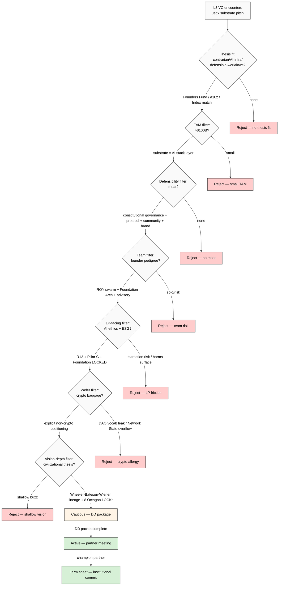

# Phase 5 — L3 investor reception simulation

> Reception simulation для L3 (Tier-1 VCs / strategic investors / sovereign+family-office / LPs) на framing «AGI = collective substrate». Institutional thesis fit + due diligence + LP sentiment dominate. F2 default. Cross-link к K-1 Vision narrative L3 framing recommendation.

## §1 L3 audience profile

### §1.1 Who's in L3 [layer: abstract audience role]

- **Tier-1 VC partners:** a16z, Sequoia Capital, Founders Fund, Khosla Ventures, Benchmark, Index, Accel
- **Strategic investors:** Microsoft, Google, Amazon AI-bets divisions (M&A + corporate strategy)
- **Sovereign / family-office AI exposure:** GIC Singapore, Mubadala, Saudi PIF (LIV / Neom AI), Norwegian Sovereign Wealth Fund
- **LPs:** Foundation endowments (Stanford, Yale, Harvard, MIT), pension funds, fund-of-funds
- **EU-specific L3:** EIF (European Investment Fund), German + Berlin VC scene (Cherry, Project A, La Famiglia)
- **Crypto-adjacent VC** (separate sub-tier): Paradigm, a16z crypto, Multicoin, Variant — DIFFERENT lens

### §1.2 L3 culture signals (2024-2026 baseline) [layer: abstract]

- **Thesis-driven.** Each VC has explicit thesis; pitch must fit OR provocatively reframe
- **Defensibility-obsessed.** Moat questions dominate; «what's the 10X advantage» mantra
- **Capital-efficiency-aware (2024-2026 shift).** Post-ZIRP era; burn-rate vs milestone discipline
- **AI-fatigue 2025+.** Many «AI substrate» pitches landed; differentiation hard
- **LP-facing risk-aware.** ESG / safety / governance posture matters for LP reporting
- **«Either monopoly or losing»** (Founders Fund Thiel framing)
- **Exit-pathway oriented.** IPO viability OR strategic acquisition feasibility
- **Anti-«lifestyle business»** — recurring revenue OK only at scale + venture velocity

### §1.3 L3 sub-segment thesis 2024-2026 (signal proxies) [layer: abstract]

| VC | Thesis (2024-2026 public-facing) | Jetix fit hypothesis |
|---|---|---|
| **a16z** | «AI infrastructure + applications» + Web3 separate fund | NEUTRAL — fits «AI app stack» framing; community angle could resonate |
| **Sequoia** | «Defensible workflows on AI» + Sonnet integration depth | MIXED — defensibility focus + workflow framing partial fit |
| **Founders Fund** | Contrarian + monopoly + 10-year + Peter Thiel framing | POSITIVE potential — substrate-bet matches contrarian thesis |
| **Khosla** | Hard-tech + AI fundamentals + science | NEUTRAL — partial fit if substrate framed as deep-tech |
| **Benchmark** | Pure venture; ~10X-on-cohort thesis | NEUTRAL — depends on team + market |
| **Index** | Europe-friendly; pragmatic | POSITIVE potential — Berlin/EU base + pragmatic positioning |
| **Project A** | Berlin venture, operational | POSITIVE — geo-affinity + execution focus |

### §1.4 Strategic investors lens [layer: abstract]

- **Microsoft (OpenAI investor):** would consider Jetix only via M&A lens if scale + complementary
- **Google (DeepMind):** unlikely direct unless Jetix demonstrates protocol layer they want
- **Amazon:** AWS-distribution angle (if Jetix substrate runs on AWS Bedrock)
- **EU strategic (EIB / EIF / Bundesregierung):** EU AI sovereignty narrative could align

### §1.5 Crypto-adjacent VC separate lens [layer: abstract — note]

- Paradigm + a16z crypto + Multicoin + Variant = different filter
- «Collective substrate» could be heavily resonant if framed via token-economy
- BUT: Web3 baggage = NEGATIVE для standard L3
- **Trade-off:** crypto-VC capital comes с positioning constraints

## §2 Institutional thesis fit deep [layer: abstract]

### §2.1 Per-VC thesis × Jetix positioning matrix

| VC | Strengths Jetix has for thesis | Mismatch risks |
|---|---|---|
| a16z | Community/network effects narrative | Compute-less substrate may not match «AI infrastructure» frame |
| Sequoia | Workflow defensibility | Cohort-business may read as «not venture-scale» |
| Founders Fund | Contrarian substrate-bet, anti-extraction (R12) | «Where's the monopoly path?» |
| Khosla | Deep-tech FPF rigor | «Is this hard-tech or coordination?» |
| Index/Atomico | Europe + pragmatic | Vision-scale ambition vs cohort velocity |
| Project A | Berlin + operational | Lifecycle stage match needed |

### §2.2 Vision narrative L3 framing requirements [layer: abstract — strong dependence on K-1]

- L3 institutional capital requires **Vision narrative depth** — philosophical anchors + civilizational thesis
- K-1 research output (`research/method-systems-thinking-deep-2026-05-19/`) provides philosophical lineage citation surface (Wheeler / Floridi / Bateson / Wiener / Beer VSM / Ashby / Meadows)
- **Without** vision narrative depth, L3 reception defaults to L2 founder filter (PMF/defensibility/GTM) — wrong tier

### §2.3 «AGI = collective substrate» L3 reception variants

| Variant | Reception hypothesis | F-grade |
|---|---|---|
| «We're AGI» bold claim | NEGATIVE — overreach, credibility collapse | F3 |
| «We're substrate for AGI» measured | POSITIVE-NEUTRAL — bold-but-defensible | F2 |
| «Collective intelligence platform» | NEGATIVE — community-pitches LP-skeptical | F2 |
| «Engineering coordination infrastructure» | NEUTRAL — under-claims; «just an enterprise tool» | F2 |
| Honest-redefinition framing + philosophical depth | POSITIVE potential for Founders-Fund-like contrarian VC | F2 |

## §3 Due diligence concerns (≥7) [layer: abstract — L3 audience]

### §3.1 DD concerns catalogue

#### DD-L3-1: «Market size? TAM?»
- **Expected pressure:** $100B+ TAM expected for venture-scale check sizes
- **Jetix challenge:** «AI engineering cohort + community» reads as $1-10B TAM; substrate framing tries to capture larger
- **Counter:** TAM = total AI deployment economy IF Jetix is substrate layer (orders of magnitude larger)

#### DD-L3-2: «Defensibility / moat?»
- **Expected pressure:** what protects against incumbent OR copycat?
- **Jetix candidates:** community network effects + FPF protocol adoption + Workshop brand + Clan alumni network + Hackathon recurring engine
- **Risk:** all moats individually attackable

#### DD-L3-3: «Team credentials / signaling»
- **Expected pressure:** founder pedigree + advisory cluster + track record
- **Jetix challenge:** Berlin-based East European founder + community-builder track record may need amplification
- **Counter:** advisory cluster + community evidence + open-source artefacts

#### DD-L3-4: «Capital efficiency / burn rate vs milestone»
- **Expected pressure:** 2024-2026 post-ZIRP discipline
- **Jetix strength:** lean operation (substrate framing implies low burn for protocol+community layer)

#### DD-L3-5: «Exit pathway»
- **Expected pressure:** IPO viability OR strategic acquisition
- **Jetix challenge:** substrate / community businesses harder to acquire-clean
- **Counter options:** strategic acquisition by OpenAI/Anthropic/Google for «engineering coordination layer»; or IPO via community-scale revenue if achieves 100K+ paying cohort members

#### DD-L3-6: «AI ethics / safety posture»
- **Expected pressure:** LP-facing AI risk
- **Jetix strength:** R12 anti-extraction explicit + AP-6 dissent preservation + Foundation Architecture v1.0 LOCKED governance + Pillar C principles
- **= STRONG L3 differentiator** (most AI startups lack constitutional governance)

#### DD-L3-7: «Regulatory exposure»
- **Expected pressure:** EU AI Act compliance, GDPR, content moderation
- **Jetix challenge:** community products = regulatory surface
- **Counter:** Foundation Architecture provides governance scaffold; Workshop methodology = clear legal entity

#### DD-L3-8: «Substrate framing reception risk»
- **Expected pressure:** «will pitch land с LP audiences too?»
- **Jetix challenge:** «collective» term + AGI redefinition = LP-friendliness uncertain
- **Counter:** careful wording в LP-facing materials; vision narrative L3 framing

#### DD-L3-9: «Network State precedent (H7) — crypto-adjacency»
- **Expected pressure:** «is this DAO? web3?»
- **Jetix challenge:** H7 People-NS LOCKED 2026-05-12 references Network State (Balaji)
- **Counter:** explicit non-crypto positioning + Network State as pattern not protocol; Ethereum substrate Phase-2-deferred (per memory: Balaji outreach Phase-2+)

#### DD-L3-10: «Founder solo-or-team»
- **Expected pressure:** «is this Ruslan-alone OR team?»
- **Counter:** ROY swarm operational + Foundation Architecture documented + community advisory cluster

### §3.2 DD severity matrix [layer: abstract]

| DD concern | LP-facing severity | DD-stage severity |
|---|---|---|
| TAM | HIGH | HIGH |
| Defensibility | HIGH | HIGH |
| Team | MEDIUM | HIGH |
| Capital efficiency | LOW | MEDIUM |
| Exit pathway | MEDIUM | HIGH |
| AI ethics / safety | HIGH (LP) | MEDIUM (DD) |
| Regulatory | MEDIUM | MEDIUM |
| Substrate framing | HIGH | MEDIUM |
| Web3 baggage | HIGH | HIGH |
| Founder solo | MEDIUM | HIGH |

## §4 LP sentiment proxies (2024-2026) [layer: abstract]

### §4.1 Foundation + endowment AI exposure signals

- 2024-2026 mixed — some foundations adding AI mandates (Stanford, MIT endowment increasing AI VC allocation); others pulling back (post-2022 over-allocation cooling)
- **«Beneficial AI» framing** = LP-friendly (cross-link к Anthropic's «Machines of Loving Grace» fundraising leverage)

### §4.2 Anti-AI backlash signals

- AI labor displacement narrative HOT 2024-2026
- Climate / energy concerns с large compute
- «Existential risk» discourse polarized
- **Jetix strength:** anti-extraction R12 + human-centric framing (humans IN substrate, not replaced) = aligns with LP «pro-social AI» preference

### §4.3 ESG / impact-investing AI patterns

- ESG AI funds emerging 2025-2026
- «AI for governance», «AI for community», «AI for collective benefit» = LP-friendly framings
- Jetix collective-substrate framing = STRONG potential ESG/impact alignment

### §4.4 Crypto-adjacency LP sentiment

- LP allergy к crypto strong (post-FTX, post-Terra)
- Network State narrative split — academic/think-tank LPs cautiously interested; pension/endowment LPs allergic
- **Jetix risk surface:** if Network State pattern surfaced too prominently, LP friction

## §5 L3 pitch substrate [layer: RUSLAN-LAYER explicit]

> ⚠️ Following = RUSLAN-LAYER L3 pitch substrate options. Breadth surface для Phase 7 selection.

### §5.1 Anchor candidates (≥3)

#### Anchor A-L3-1: «Substrate layer for the AI engineering economy»
- **Anchor object:** Jetix as infrastructure layer (FPF + Workshop + Clan + protocols)
- **Verbatim:** «As AI deployment scales, coordination protocols + engineering communities become the bottleneck. We're building that substrate.»
- **L3 resonance hypothesis:** F2 medium-high (infrastructure narrative VC-comfortable)
- **Risk:** «boring infra» vs «exciting AI» mismatch

#### Anchor A-L3-2: «Honest AGI redefinition + civilizational thesis»
- **Anchor object:** audio_690 framing + K-1 philosophical lineage + 1-year ambition
- **Verbatim:** «AGI is the whole system working together — humans + AI + protocols. We're the substrate enabling that emergence»
- **L3 resonance hypothesis:** F2 medium (Founders-Fund-like contrarian fit)
- **Risk:** «overreach» perception если pitched к thesis-narrow VCs

#### Anchor A-L3-3: «Network State precedent + EU sovereignty + community substrate»
- **Anchor object:** H7 People-NS LOCKED + Berlin / EU positioning + community-as-substrate
- **Verbatim:** «We're building the operating substrate for distributed engineering communities — Network State pattern, EU-sovereign, anti-extraction by design»
- **L3 resonance hypothesis:** F2 LOW-MEDIUM (Network State = mixed LP reception; depends on VC fund composition)
- **Risk:** crypto-adjacency overflow; LP friction

### §5.2 Hook candidates (≥3)

#### Hook H-L3-1: «Defensibility = constitutional governance + community network + protocol moat»
- Foundation Architecture v1.0 LOCKED + Pillar C principles + R12 anti-extraction explicit
- Unique L3 differentiator: most AI startups lack constitutional governance
- L3 resonance: HIGH (LP-friendly + DD-friendly + ESG-friendly)

#### Hook H-L3-2: «Vision narrative L3 framing — philosophical depth»
- Cross-link К-1 (Wheeler / Floridi / Bateson / Wiener / Beer / Ashby / Meadows lineage)
- Substrate framing + civilizational thesis (1-year world order ambition from audio_690 + 8 Octagon LOCKs)
- L3 resonance: HIGH (Founders-Fund + contrarian-thesis VCs respond to civilizational framing)

#### Hook H-L3-3: «Anti-extraction R12 + ESG / impact alignment»
- R12 programmable enforcement Option D Hybrid Ethereum substrate ack 2026-05-18
- Mondragón ratio cap + QF revenue distribution + fork-and-leave exit tokens
- L3 resonance: STRONG для ESG/impact LPs; risk для traditional pension/endowment LPs

### §5.3 Objection-handling matrix L3 × 7-10 objections

| # | DD concern (DD-L3-X) | Counter-argument (RUSLAN-LAYER) |
|---|---|---|
| 1 | TAM? | Substrate = AI deployment coordination economy ($100B+ if Jetix is layer 4 of AI stack) |
| 2 | Defensibility? | Constitutional governance + community network + FPF protocol + Workshop brand stack |
| 3 | Team? | ROY swarm operational + Foundation Architecture LOCKED + advisory cluster + community |
| 4 | Capital efficiency? | Lean substrate-business; community + protocol = low CAC at scale |
| 5 | Exit pathway? | Strategic acquisition (OpenAI/Anthropic engineering-coordination layer) OR IPO-scale community (100K+ cohort) |
| 6 | AI ethics / safety? | R12 + Pillar C + AP-6 + Foundation Architecture LOCKED = constitutional governance |
| 7 | Regulatory? | EU AI Act native + GDPR-compliant by EU positioning |
| 8 | Substrate framing reception? | Honest-redefinition + vision narrative depth + Big Lab orthogonal positioning |
| 9 | Web3 / DAO? | Explicit non-crypto в primary positioning; Ethereum substrate Phase-2+ deferred (per packet) |
| 10 | Founder solo? | ROY swarm + Foundation Architecture + advisory cluster + community = systemic not solo |

### §5.4 Due-diligence packet requirements [layer: RUSLAN-LAYER]

- Vision narrative document (cross-link к K-1 Vision narrative recommendation)
- Foundation Architecture v1.0 LOCKED documentation
- Pillar C principles documentation
- Constitutional governance evidence (Octagon LOCKs H1-H8, R12 anti-extraction ack)
- Track record: Workshop cohorts, Clan retention, Hackathon outputs
- Financial model + 15 monetization variants
- Competitive analysis (Phase 6 output)
- Team + advisory cluster
- Open-source artefacts inventory
- Regulatory + legal entity structure (EU)
- LP-friendly impact narrative

## §6 Mermaid L3 reception flow

## §7 Phase 5 acceptance check + handoff

- [x] L3 audience profile с tier-1 VC / strategic / sovereign / LP sub-segments
- [x] Per-VC thesis × Jetix positioning matrix (§2.1)
- [x] Vision narrative L3 framing requirements explicit (§2.2)
- [x] ≥7 DD concerns (10 surfaced)
- [x] LP sentiment proxies (§4)
- [x] L3 pitch substrate (3 anchors + 3 hooks + 10-row objection matrix + DD packet)
- [x] Mermaid L3 reception flow (§6)
- [x] IP-1 STRICT: §1-4 abstract; §5 RUSLAN-LAYER explicit
- [x] Cross-link К-1 (philosophical lineage) + 8 Octagon LOCKs (constitutional governance) preserved

**Phase 5 → Phase 6 handoff:**
- Competitive landscape Phase 6 will tie back L3 thesis-fit matrix (per-VC differentiation needs)
- L3 specific differentiators (R12 + Pillar C + Foundation LOCKED + constitutional governance) = unique competitive surface

— Brigadier-scribe 2026-05-19.
