# Phase 6 — Competitive landscape + differentiation

> Competitor inventory ≥5 + per-competitor analysis + white-space mapping + Jetix unique angle inventory ≥5. PITCH-BLOCKING substrate для C.1 one-pager competitive 1-liner + C.2 pitch deck market slide.

## §1 Competitor inventory (8 mined)

### §1.1 Direct competitors / closest precedents (Tier-A — collective intelligence umbrella)

#### COMP-A1: Plurality (Tang + Weyl + community)
- **Positioning:** Pluralistic intelligence = collaborative tech + democracy
- **Main claim:** «Bridging social difference via digital tools — not replacement»
- **Reception status 2024-2026:** Influential в academic + civic-tech + Microsoft Research circles; book widely cited; Stanford / ACM CI 2025 keynotes
- **Funding state:** Plurality Institute (501(c)(3) nonprofit) + Microsoft Research Plural Technology Collaboratory + RadicalxChange Foundation
- **Community size:** ~10K+ active contributors (open-source book + plurality.institute network) [src: plurality.institute retrieved 2026-05-19]
- **Geo:** Taiwan (Tang) + Microsoft Research Seattle (Weyl) + global community
- **Strengths:** academic credibility, civic-tech track record (Audrey Tang vTaiwan), Microsoft Research backing, Vitalik Buterin / Jaron Lanier intellectual neighborhood, open-source book
- **Vulnerabilities:** democracy-first framing may not fit AI-engineering audience; non-profit/foundation structure limits monetization velocity; geographic spread может dilute community execution
- **Overlap с Jetix:** S4+S5 substrate layers (protocol + participant)
- **Differentiation surface:** Plurality = democracy-first; Jetix = engineering-effective-action-first + Workshop methodology

#### COMP-A2: Sapienship (Harari)
- **Positioning:** Directional commentary on AI-in-info-networks
- **Main claim:** «Humanity must consciously direct AI agents в info networks»
- **Reception status 2024-2026:** Wide cultural reception («Nexus» 2024 bestseller); LP-friendly framing
- **Funding state:** Author/speaker platform + Sapienship social-impact org
- **Community size:** Mass-market readership (millions); not engineering-cohort
- **Geo:** Israel + global
- **Strengths:** mass cultural reach, LP-friendly framing, info-network metaphor power
- **Vulnerabilities:** NOT a product/lab/protocol-builder; pure commentary
- **Overlap с Jetix:** information-substrate hypothesis (DIRECT overlap с audio_690 «всё есть информация»)
- **Differentiation surface:** Sapienship = commentary; Jetix = builder of substrate + community + protocol

#### COMP-A3: MIT CCI / Thomas Malone «Superminds»
- **Positioning:** Academic predecessor to collective-intelligence framing
- **Main claim:** «Superminds = collectives of humans+AI smarter than individuals»
- **Reception status 2024-2026:** Academic; less public visibility than Plurality 2024-2026
- **Funding state:** MIT Sloan endowed center
- **Community size:** ~1K-10K academic + corporate research community
- **Strengths:** academic rigor, 20+ years lineage (CCI founded 2009)
- **Vulnerabilities:** academic-only platform; no community/protocol product surface
- **Overlap с Jetix:** S5 participant substrate framing
- **Differentiation surface:** MIT CCI = academic research; Jetix = active community + workshop + monetized

### §1.2 Big Lab competitors (Tier-B — AGI defining authority)

#### COMP-B1: OpenAI «AGI roadmap»
- **Positioning:** «AGI = highly autonomous systems outperforming humans» + 5-level capability framework
- **Main claim:** «We are L2 Reasoners; pushing L3 Agents 2025-2027»
- **Reception status 2024-2026:** Dominant public AGI framing reference; ChatGPT consumer brand reaches ~700M+ users
- **Funding state:** $157B valuation 2024-10; $500B Stargate infrastructure deal 2025
- **Community size:** Developer platform ~1M+; consumer reach ~700M MAU
- **Geo:** SF
- **Strengths:** scale moat, consumer brand, developer ecosystem, capability levels framework recognition
- **Vulnerabilities:** safety controversies, leadership turbulence, commoditization risk vs Claude/Gemini, governance opacity
- **Overlap с Jetix:** AGI definition territory (Jetix offers alternative redefinition)
- **Differentiation surface:** Jetix = orthogonal — protocol+community layer NOT compute+model layer; complementary не competing
- **F-G-R:** F3/global/high

#### COMP-B2: Anthropic «Powerful AI»
- **Positioning:** Safety-first + «Machines of Loving Grace» upside narrative
- **Main claim:** «Constitutional AI + responsible scaling = beneficial powerful AI»
- **Reception status 2024-2026:** Strong technical credibility; Dario Amodei essays widely cited; ASL safety-levels framework recognized
- **Funding state:** $40B+ valuation 2025; Amazon $4B + Google $2B investments
- **Community size:** Claude developers ~500K+; enterprise growing
- **Geo:** SF
- **Strengths:** safety credibility, Constitutional AI rigor, enterprise positioning, LP-friendly
- **Vulnerabilities:** commoditization risk vs OpenAI/Google models; safety-positioning may slow capability progress
- **Overlap с Jetix:** governance framing (Constitutional AI ~ Foundation Architecture + Pillar C principles)
- **Differentiation surface:** Anthropic = single AI lab + Constitutional internal governance; Jetix = multi-substrate + protocol layer for ecosystem of teams

#### COMP-B3: DeepMind «AGI through science»
- **Positioning:** AGI = system that solves science problems
- **Main claim:** «50% chance AGI by 2030» + automated science laboratory
- **Reception status 2024-2026:** AlphaFold 3 + Genie 3 + Gemini progression; UK government scientific lab partnership 2026
- **Funding state:** Google subsidiary; unlimited compute
- **Community size:** Research community; lower direct community-product surface
- **Geo:** London + global
- **Strengths:** science rigor, AlphaFold legacy, Google compute, government partnerships
- **Vulnerabilities:** parent-company-Google strategy dependencies; less consumer-brand visibility
- **Overlap с Jetix:** science-AGI framing partial overlap (AGI = real outputs not just demos)
- **Differentiation surface:** DeepMind = single lab science-AGI; Jetix = community-substrate for distributed engineering coordination

#### COMP-B4: SSI (Sutskever)
- **Positioning:** «Straight-shot Safe Superintelligence»
- **Main claim:** «Single mission, single product — SSI»
- **Reception status 2024-2026:** Zero public product; pure positioning play; $30B valuation 2025-03
- **Funding state:** $1B 2024-09 + $30B valuation 2025-03 (Greenoaks-led)
- **Community size:** Internal team only; no public community
- **Geo:** Palo Alto + Tel Aviv
- **Strengths:** Sutskever credibility, capital, focus
- **Vulnerabilities:** zero public roadmap, zero papers, governance opacity, single-team monolith risk
- **Overlap с Jetix:** minimal — different layer entirely (SSI = SI lab; Jetix = substrate)
- **Differentiation surface:** SSI = capability concentration; Jetix = community substrate distribution

### §1.3 Decentralized AI competitors (Tier-C — substrate-overlapping but crypto-baggage)

#### COMP-C1: Bittensor ($TAO subnets)
- **Positioning:** Decentralized AI = subnets с token incentives
- **Main claim:** «Decentralized intelligence emerges from market-driven subnet competition»
- **Reception status 2024-2026:** Major crypto-AI darling 2024; «AI agent of agents» framing
- **Funding state:** $TAO token market cap ~$2-5B range 2024-2025
- **Community size:** ~50K+ active wallets; large crypto-native community
- **Strengths:** decentralization narrative, large funded community, novel mechanism (Yuma consensus)
- **Vulnerabilities:** crypto-baggage HEAVY (Web3 friction для non-crypto audiences), governance/regulatory uncertainty
- **Overlap с Jetix:** substrate framing (NOT single corp = AI)
- **Differentiation surface:** Bittensor = token-incentivized agent market; Jetix = human-engineering-community + non-crypto + Workshop methodology

#### COMP-C2: Ritual.net + Allora + Gensyn (collected)
- **Positioning:** «Modular AI infra» / «prediction-network ML» / «decentralized compute»
- **Reception status 2024-2026:** Crypto-VC funded; mostly crypto-audience
- **Funding state:** Series A-B range each; tens of millions
- **Strengths:** crypto-VC capital, modular architecture
- **Vulnerabilities:** crypto-only audience; product-market-fit uncertain
- **Overlap / differentiation:** similar to Bittensor lens — substrate parallel but crypto-bound

### §1.4 Adjacent positioning (Tier-D — non-competing but related)

#### COMP-D1: Stuart Russell / CHAI «Provably Beneficial AI»
- **Positioning:** «Control framing» — AI uncertain about objectives, deferring to humans
- **Overlap с Jetix:** safety + alignment principles, не substrate framing
- **Differentiation:** Russell = single-agent control framing; Jetix = multi-substrate composition

#### COMP-D2: Anthropic «Constitutional AI» Foundation
- (Partial COMP-B2 overlap.) Constitutional governance angle parallel к Jetix Foundation Architecture v1.0; potential ally framing

#### COMP-D3: a16z portfolio AI-cohort businesses (Lambda School / Maven / Reforge AI / Section)
- **Positioning:** «AI engineering cohort education»
- **Overlap с Jetix:** Workshop methodology (cohort business)
- **Differentiation:** Maven/Reforge = generic cohort + experts; Jetix = FPF + protocol + Clan community + Hackathon engine recursive composition

#### COMP-D4: Karpathy «Eureka Labs»
- **Positioning:** «AI-native education» starting 2024
- **Reception status 2024-2026:** High L1 engineering credibility (Karpathy founder)
- **Funding state:** $1B+ valuation 2024-2025 reported
- **Overlap с Jetix:** AI engineering education (L1 audience overlap)
- **Differentiation:** Karpathy = AI tutor product + content; Jetix = community + protocol + Workshop methodology + recursive engine
- **⭐ Potential cross-cite / ally framing** — adjacent NOT competing

## §2 Per-competitor analysis: positioning + strengths + vulnerabilities

### §2.1 Reception status synthesis table (8 competitors)

| Competitor | Tier | Positioning | Reception status | Funding | Community |
|---|---|---|---|---|---|
| Plurality | A | Collaborative tech + democracy | Influential academic+civic | Non-profit + MSR | ~10K+ |
| Sapienship | A | AI in info-networks (commentary) | Mass cultural reach | Author platform | Mass-market |
| MIT CCI | A | Academic collective intelligence | Academic only | MIT endowed | ~1-10K |
| OpenAI | B | AGI capability levels | Dominant brand | $157B | ~700M MAU |
| Anthropic | B | Constitutional AI safety | Strong credibility | $40B | ~500K dev |
| DeepMind | B | AGI via science | Research authority | Google sub | Research community |
| SSI | B | Straight-shot SSI | Positioning play | $30B | Internal |
| Bittensor | C | Decentralized AI subnets | Crypto-AI darling | $2-5B TAO mkt | ~50K wallets |
| Eureka Labs (Karpathy) | D | AI-native education | High L1 credibility | $1B+ | Growing |
| Maven/Reforge AI | D | AI cohort education | Established cohort biz | Series A-C | ~5-10K |

## §3 White-space mapping [layer: abstract]

### §3.1 Coverage matrix: competitors × dimensions

| Dimension | Plurality | Sapienship | MIT CCI | OpenAI | Anthropic | DeepMind | SSI | Bittensor | Karpathy | Maven |
|---|---|---|---|---|---|---|---|---|---|---|
| Substrate philosophy | ✓ | ~ | ✓ | ✗ | ✗ | ✗ | ✗ | ~ | ✗ | ✗ |
| Workshop methodology | ✗ | ✗ | ✗ | ✗ | ✗ | ✗ | ✗ | ✗ | ~ | ✓ |
| Hackathon engine recursive | ✗ | ✗ | ✗ | ✗ | ✗ | ✗ | ✗ | ✗ | ✗ | ✗ |
| Engineering community-native | ✗ | ✗ | ~ | ~ | ~ | ✓ | ✗ | ✓ | ✓ | ✓ |
| Constitutional governance | ✗ | ✗ | ✗ | ~ | ✓ | ~ | ~ | ✗ | ✗ | ✗ |
| Anti-extraction R12 | ~ | ~ | ~ | ✗ | ~ | ~ | ~ | ✗ | ✗ | ✗ |
| FPF rigor (or equivalent) | ✗ | ✗ | ✗ | ✗ | ✓ | ✓ | ✗ | ~ | ✗ | ✗ |
| Multi-substrate composition | ✓ | ~ | ~ | ✗ | ✗ | ✗ | ✗ | ~ | ✗ | ✗ |
| EU positioning | ✗ | ✗ | ✗ | ✗ | ✗ | ✓ | ✗ | ~ | ✗ | ✗ |
| Non-crypto | ✓ | ✓ | ✓ | ✓ | ✓ | ✓ | ✓ | ✗ | ✓ | ✓ |
| Honest AGI redefinition | ~ | ~ | ✓ | ✗ | ✗ | ✗ | ✗ | ~ | ✗ | ✗ |

Legend: ✓ strong; ~ partial; ✗ absent

### §3.2 White-space identified

**No single competitor combines ALL of:**
1. Substrate philosophy (S2+S3+S4+S5 multi-substrate composition)
2. Workshop methodology (engineering-cohort productized)
3. Hackathon engine recursive (community engine compounding)
4. Engineering community-native (vs civic-tech / academic culture)
5. Constitutional governance (R12 + Pillar C + Foundation LOCKED)
6. FPF rigor (protocol formalization)
7. Non-crypto positioning
8. EU + Berlin geo
9. Honest AGI redefinition framing
10. Anti-extraction R12 explicit programmable enforcement

**Closest combination:** Karpathy (Eureka Labs) + Anthropic governance + Plurality substrate philosophy — but no single actor unifies all dimensions.

→ Jetix unique-angle composition surfaces from intersection (see §4).

### §3.3 Avoid head-to-head positioning surface

**AVOID head-to-head with:**
- OpenAI / Anthropic / DeepMind on capability or compute (different layer)
- Bittensor on decentralized agent markets (different audience; crypto vs non-crypto)
- Plurality on civic-tech (different audience; democracy vs effective-engineering)
- SSI on superintelligence (different scope; substrate vs capability)
- Sapienship on cultural commentary (different role; builder vs commentator)

**ALLY / cross-cite candidates:**
- Plurality (substrate framing umbrella)
- Sapienship (information-substrate philosophical lineage)
- MIT CCI (academic predecessor)
- Anthropic (constitutional governance parallel)
- Karpathy Eureka Labs (AI-engineering lineage; potential cross-cite)
- Stuart Russell CHAI (safety alignment parallel)

## §4 Jetix unique angle inventory [layer: RUSLAN-LAYER explicit] ⭐

> Following = RUSLAN-LAYER unique-angle hypotheses. Each = candidate differentiation surface для pitch framing Phase 7.

### §4.1 ANGLE-1: «FPF + Workshop + Clan + Hackathon-engine recursive composition»
- **Component:** Foundation Primitives Framework + Master Workshop methodology + First Clan community architecture + Recursive Engine hackathon mode
- **Differentiation:** No competitor combines 4 components в single composed substrate
- **Defensibility F-grade:** F2 medium (composition originality; individual components reproducible)
- **Erosion risk:** copycat composition possible at 12-24 month horizon
- **Audience resonance hypothesis:** L1 high (engineering rigor), L2 medium-high (cohort + community moat), L3 medium (substrate framing)

### §4.2 ANGLE-2: «Constitutional governance + R12 anti-extraction + Foundation Architecture v1.0 LOCKED»
- **Component:** Pillar C principles + R12 anti-extraction (programmable Ethereum substrate Phase-2+ deferred) + Foundation Architecture v1.0 LOCKED + AP-6 dissent preservation
- **Differentiation:** Most AI startups lack constitutional governance; Anthropic Constitutional AI is closest but internal-to-Claude
- **Defensibility F-grade:** F2-3 medium-high (governance hard to backport; institutional credibility moat)
- **Erosion risk:** copycat governance possible but слабо unless co-designed with operational discipline
- **Audience resonance hypothesis:** L1 medium (governance interest growing), L2 medium (defensibility narrative), L3 HIGH (LP-friendly + ESG)

### §4.3 ANGLE-3: «Honest AGI redefinition + voice anchor authenticity»
- **Component:** «AGI = collective substrate» (audio_690) + dictation-as-evidence + 1-year-world-order ambition
- **Differentiation:** Authentic voice anchor distinguishes from corporate AGI framing
- **Defensibility F-grade:** F2 low-medium (authenticity hard to forge but framing reproducible)
- **Erosion risk:** other founders могут adopt «AGI = system» framing once it gains traction
- **Audience resonance hypothesis:** L1 medium (resonates if backed by code), L2 medium (provocative wedge), L3 medium-high (vision narrative depth)

### §4.4 ANGLE-4: «EU + Berlin + multi-lingual engineering authenticity»
- **Component:** Berlin geo + EU AI Act native + multi-lingual (Russian/German/English) + non-SF/SV positioning
- **Differentiation:** EU sovereignty narrative + non-US AI substrate
- **Defensibility F-grade:** F2 medium (geo positioning; not deep moat alone)
- **Erosion risk:** other EU substrate plays may emerge (Mistral, AMI Labs LeCun)
- **Audience resonance hypothesis:** L1 medium (geo doesn't matter much), L2 medium-high (some founders care), L3 HIGH for EU L3 (EIF, Project A, etc.)

### §4.5 ANGLE-5: «Information-substrate hypothesis + philosophical lineage depth»
- **Component:** Wheeler «it from bit» + Floridi info-philosophy + Bateson + Wiener + Beer VSM + Ashby + Meadows leverage points (cross-link K-1 K-6)
- **Differentiation:** Most AI startups lack philosophical lineage citation; Sapienship is commentary-only
- **Defensibility F-grade:** F2 low (lineage publicly available; but composition + curation = soft moat)
- **Erosion risk:** lineage citation cheap; but lived-thinking-philosophy hard to fake
- **Audience resonance hypothesis:** L1 LOW (engineers skeptical of philosophy unless backed by code), L2 LOW-MEDIUM, L3 HIGH (contrarian VC + LP-friendly civilizational thesis)

### §4.6 ANGLE-6: «Engineering-culture-native (not academic / civic-tech)»
- **Component:** ML/NAS loop substrate (audio_690) + Karpathy-lineage credibility + engineering vocabulary fluency + AI tooling depth
- **Differentiation:** Plurality + MIT CCI are academic/civic-tech; Jetix native to engineering culture
- **Defensibility F-grade:** F2 medium (culture native; hard to backport from outside)
- **Erosion risk:** Karpathy Eureka Labs has similar L1 culture but different product (education vs substrate)
- **Audience resonance hypothesis:** L1 HIGH (cultural fit critical), L2 medium-high (engineering-culture brands respected), L3 medium (depends on VC)

### §4.7 ANGLE-7: «Cohort + community + protocol = triple-moat composition»
- **Component:** Workshop cohort (revenue) + Clan community (network effects) + FPF protocol (lock-in)
- **Differentiation:** Maven/Reforge has cohort; Plurality has community; nobody has all three integrated
- **Defensibility F-grade:** F2-3 medium-high (integrated stack)
- **Erosion risk:** competitor composition possible at 18-36 month horizon
- **Audience resonance hypothesis:** L1 medium, L2 HIGH (founder-friendly moat narrative), L3 HIGH

### §4.8 Unique angle composition summary

7 unique angles identified. Each individually attackable; **composition** = defensible. Phase 7 hypothesis bank will surface pitch framings tied to specific angle combinations.

## §5 Competitive differentiation matrix [layer: RUSLAN-LAYER]

| Competitor | Jetix orthogonal-or-allied? | Pitch framing tactic per-competitor |
|---|---|---|
| Plurality | ALLY — cross-cite | «Plurality describes the vision; we build engineering-protocol substrate» |
| Sapienship | ALLY — philosophical lineage | «Information substrate hypothesis — we operationalize via FPF» |
| MIT CCI | ALLY — academic predecessor | «Building on Malone's Superminds with engineering-cohort discipline» |
| OpenAI | ORTHOGONAL — different layer | «They build models, we build coordination protocols» |
| Anthropic | ALLY-ORTHOGONAL — governance parallel | «Constitutional AI inside their model; we apply constitutional governance to community substrate» |
| DeepMind | ORTHOGONAL — different scope | «Their AGI lab; our substrate enables distributed engineering teams» |
| SSI | ORTHOGONAL — single-monolith vs substrate | «Concentration vs distribution; different bet» |
| Bittensor | ORTHOGONAL — Web3 vs non-crypto | «Crypto-incentivized vs community-of-engineers; different audience» |
| Karpathy/Eureka | ADJACENT — potential cross-cite | «AI education complementary to engineering coordination community» |
| Maven/Reforge AI | OVERLAP — different scope | «Generic cohort + experts; we add FPF protocol + Clan continuity + Hackathon recursive» |

## §6 Mermaid competitive landscape map

```mermaid
%%{init: {'theme':'base', 'themeVariables': {'primaryTextColor':'#000000','textColor':'#000000','lineColor':'#333333','primaryBorderColor':'#333333','primaryColor':'#fafafa','noteTextColor':'#000000','noteBkgColor':'#fff8d5','edgeLabelBackground':'#ffffff'}}}%%
graph TB
    subgraph "Tier-A — Collective intelligence umbrella (ALLIES + ORTHOGONAL precedents)"
        Plurality[Plurality<br/>Tang+Weyl<br/>democracy-first]
        Sapien[Sapienship<br/>Harari commentary]
        MITCCI[MIT CCI Malone<br/>academic Superminds]
    end

    subgraph "Tier-B — Big Lab AGI authorities (ORTHOGONAL — different layer)"
        OpenAI[OpenAI<br/>capability-levels<br/>$157B]
        Anthropic[Anthropic<br/>Constitutional AI<br/>$40B]
        DeepMind[DeepMind<br/>science-AGI<br/>Google]
        SSI[SSI Sutskever<br/>straight-shot<br/>$30B]
    end

    subgraph "Tier-C — Decentralized AI (Crypto-baggage; non-overlap audiences)"
        Bittensor[Bittensor<br/>$TAO subnets]
        Ritual[Ritual/Allora/Gensyn]
    end

    subgraph "Tier-D — Adjacent (potential allies)"
        Karpathy[Karpathy<br/>Eureka Labs<br/>AI education]
        Maven[Maven/Reforge<br/>AI cohort biz]
        Russell[Stuart Russell<br/>CHAI control framing]
    end

    subgraph "JETIX — RUSLAN-LAYER instance"
        Jetix[Jetix substrate<br/>FPF + Workshop + Clan +<br/>Hackathon-engine recursive +<br/>Constitutional governance R12 +<br/>EU/Berlin + engineering-native]
    end

    Plurality -.ally cross-cite.-> Jetix
    Sapien -.ally philosophical lineage.-> Jetix
    MITCCI -.ally academic predecessor.-> Jetix
    Anthropic -.constitutional governance parallel.-> Jetix
    Karpathy -.adjacent cross-cite.-> Jetix
    Russell -.safety alignment parallel.-> Jetix

    OpenAI -.orthogonal layer.-> Jetix
    DeepMind -.orthogonal scope.-> Jetix
    SSI -.orthogonal concentration.-> Jetix
    Bittensor -.orthogonal crypto.-> Jetix
    Ritual -.orthogonal crypto.-> Jetix

    Maven -.overlap scope.-> Jetix

    style Jetix fill:#fff4e6
    style Plurality fill:#d6f0d6
    style Sapien fill:#d6f0d6
    style MITCCI fill:#d6f0d6
    style Anthropic fill:#d6f0d6
    style Karpathy fill:#d6f0d6
    style Russell fill:#d6f0d6
    style OpenAI fill:#fff8d5
    style DeepMind fill:#fff8d5
    style SSI fill:#fff8d5
    style Bittensor fill:#ffcccc
    style Ritual fill:#ffcccc
    style Maven fill:#fff8d5
```

## §7 Phase 6 acceptance check + handoff

- [x] ≥5 competitors deeply mined (10 surfaced across 4 tiers)
- [x] Per-competitor analysis: positioning + claim + reception + funding + community + strengths + vulnerabilities + overlap + differentiation
- [x] White-space mapping (coverage matrix dimension-by-dimension)
- [x] ≥5 Jetix unique angles inventoried (7 surfaced ANGLE-1..7)
- [x] Competitive differentiation matrix per-competitor pitch tactic
- [x] Mermaid competitive landscape map
- [x] IP-1 STRICT: §1-3 external-actor; §4-5 RUSLAN-LAYER explicit
- [x] F-G-R per major claim

**Phase 6 → Phase 7 handoff:**
- Unique angles ANGLE-1..7 = candidate pitch differentiator components
- Per-competitor positioning tactic = candidate objection-handling counter-arguments
- White-space matrix = pitch deck market-slide substrate

— Brigadier-scribe 2026-05-19.
