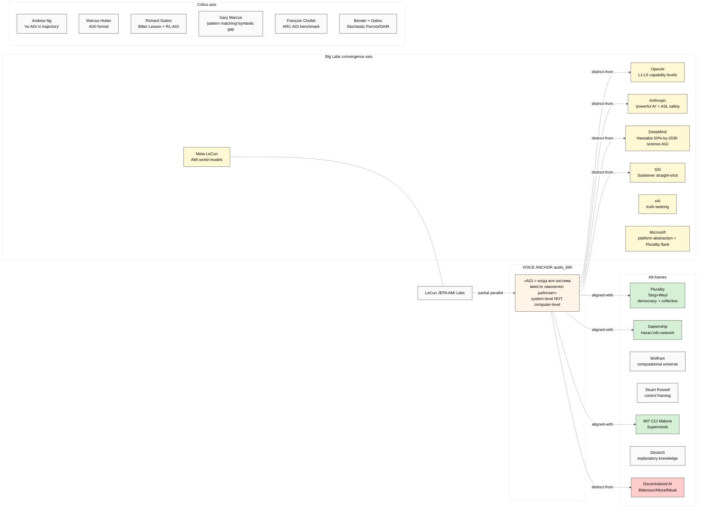

# Diagram 01 — AGI discourse landscape 2024-2026

```mermaid
%%{init: {'theme':'base', 'themeVariables': {'primaryTextColor':'#000000','textColor':'#000000','lineColor':'#333333','primaryBorderColor':'#333333','primaryColor':'#fafafa','noteTextColor':'#000000','noteBkgColor':'#fff8d5','edgeLabelBackground':'#ffffff'}}}%%
graph LR
    subgraph "Big Labs convergence axis"
        OpenAI[OpenAI<br/>L1-L5 capability levels]
        Anthropic[Anthropic<br/>'powerful AI' + ASL safety]
        DeepMind[DeepMind<br/>Hassabis 50%-by-2030 science-AGI]
        SSI[SSI<br/>Sutskever straight-shot]
        xAI[xAI<br/>truth-seeking]
        Meta[Meta-LeCun<br/>AMI world-models]
        MS[Microsoft<br/>platform abstraction + Plurality flank]
    end

    subgraph "Critics axis"
        Ng[Andrew Ng<br/>'no AGI in trajectory']
        Hutter[Marcus Hutter<br/>AIXI formal]
        Sutton[Richard Sutton<br/>Bitter Lesson + RL-AGI]
        Marcus[Gary Marcus<br/>'pattern matching'/symbolic gap]
        Chollet[François Chollet<br/>ARC-AGI benchmark]
        Bender[Bender + Gebru<br/>Stochastic Parrots/DAIR]
    end

    subgraph "Alt-frames"
        Plurality[Plurality<br/>Tang+Weyl<br/>democracy + collective]
        Sapien[Sapienship<br/>Harari info-network]
        Wolfram[Wolfram<br/>computational universe]
        Russell[Stuart Russell<br/>control framing]
        MITCCI[MIT CCI Malone<br/>Superminds]
        Deutsch[Deutsch<br/>explanatory knowledge]
        Decent[Decentralized AI<br/>Bittensor/Allora/Ritual]
    end

    subgraph "VOICE ANCHOR audio_690"
        Jetix[«AGI = когда вся система<br/>вместе лаконично работает»<br/>system-level NOT computer-level]
    end

    Jetix -.aligned-with.-> Plurality
    Jetix -.aligned-with.-> MITCCI
    Jetix -.aligned-with.-> Sapien
    Jetix -.distinct-from.-> OpenAI
    Jetix -.distinct-from.-> Anthropic
    Jetix -.distinct-from.-> DeepMind
    Jetix -.distinct-from.-> SSI
    Jetix -.distinct-from.-> Decent

    LeCun_link[LeCun JEPA AMI Labs] -.partial parallel.-> Jetix
    Meta -.- LeCun_link

    style Jetix fill:#fff4e6
    style Plurality fill:#d6f0d6
    style Sapien fill:#d6f0d6
    style MITCCI fill:#d6f0d6
    style OpenAI fill:#fff8d5
    style Anthropic fill:#fff8d5
    style DeepMind fill:#fff8d5
    style SSI fill:#fff8d5
    style xAI fill:#fff8d5
    style MS fill:#fff8d5
    style Decent fill:#ffcccc
    style Meta fill:#fff8d5
```
