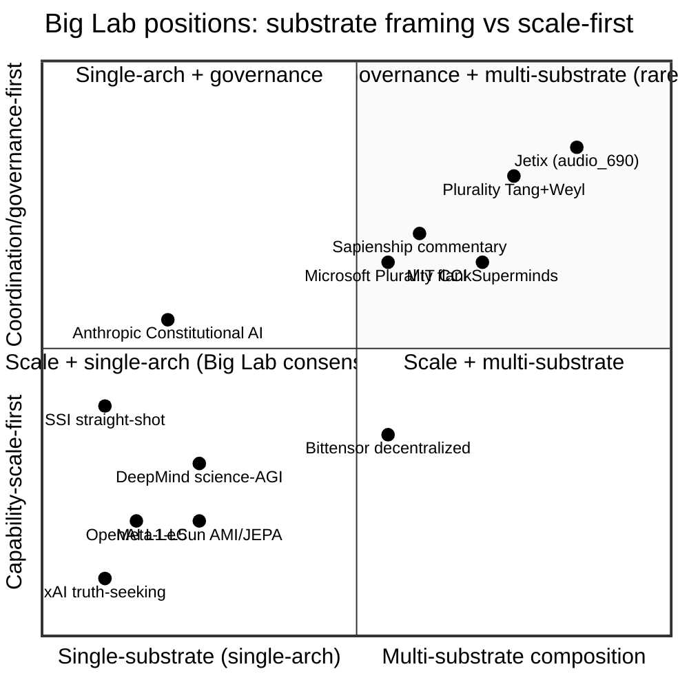

# Diagram 02 — Big Lab positions matrix

```mermaid
%%{init: {'theme':'base', 'themeVariables': {'primaryTextColor':'#000000','textColor':'#000000','lineColor':'#333333','primaryBorderColor':'#333333','primaryColor':'#fafafa','noteTextColor':'#000000','noteBkgColor':'#fff8d5','edgeLabelBackground':'#ffffff'}}}%%
quadrantChart
    title Big Lab positions: substrate framing vs scale-first
    x-axis "Single-substrate (single-arch)" --> "Multi-substrate composition"
    y-axis "Capability-scale-first" --> "Coordination/governance-first"
    quadrant-1 "Governance + multi-substrate (rare)"
    quadrant-2 "Single-arch + governance"
    quadrant-3 "Scale + single-arch (Big Lab consensus)"
    quadrant-4 "Scale + multi-substrate"
    "OpenAI L1-L5": [0.15, 0.20]
    "Anthropic Constitutional AI": [0.20, 0.55]
    "DeepMind science-AGI": [0.25, 0.30]
    "SSI straight-shot": [0.10, 0.40]
    "xAI truth-seeking": [0.10, 0.10]
    "Meta-LeCun AMI/JEPA": [0.25, 0.20]
    "Microsoft Plurality flank": [0.55, 0.65]
    "Jetix (audio_690)": [0.85, 0.85]
    "Plurality Tang+Weyl": [0.75, 0.80]
    "MIT CCI Superminds": [0.70, 0.65]
    "Sapienship commentary": [0.60, 0.70]
    "Bittensor decentralized": [0.55, 0.35]
```
