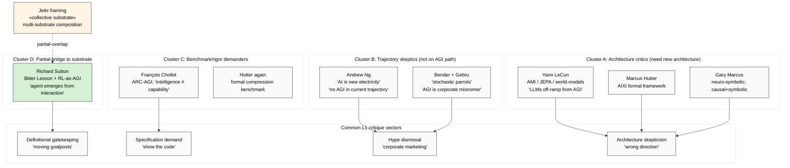

# Diagram 03 — Critics inventory + position clusters

```mermaid
%%{init: {'theme':'base', 'themeVariables': {'primaryTextColor':'#000000','textColor':'#000000','lineColor':'#333333','primaryBorderColor':'#333333','primaryColor':'#fafafa','noteTextColor':'#000000','noteBkgColor':'#fff8d5','edgeLabelBackground':'#ffffff'}}}%%
graph TB
    subgraph "Cluster A: Architecture critics (need new architecture)"
        LeCun[Yann LeCun<br/>AMI / JEPA / world-models<br/>'LLMs off-ramp from AGI']
        Hutter[Marcus Hutter<br/>AIXI formal framework]
        Marcus[Gary Marcus<br/>neuro-symbolic; causal+symbolic]
    end

    subgraph "Cluster B: Trajectory skeptics (not on AGI path)"
        Ng[Andrew Ng<br/>'AI is new electricity'<br/>'no AGI in current trajectory']
        Bender[Bender + Gebru<br/>'stochastic parrots'<br/>'AGI is corporate misnomer']
    end

    subgraph "Cluster C: Benchmark/rigor demanders"
        Chollet[François Chollet<br/>ARC-AGI; 'intelligence ≠ capability']
        Hutter_alt[Hutter again<br/>formal compression benchmark]
    end

    subgraph "Cluster D: Partial-bridge to substrate"
        Sutton[Richard Sutton<br/>Bitter Lesson + RL-as-AGI<br/>'agent emerges from interaction']
    end

    subgraph "Common L1 critique vectors"
        V1[Definitional gatekeeping<br/>'moving goalposts']
        V2[Specification demand<br/>'show the code']
        V3[Hype dismissal<br/>'corporate marketing']
        V4[Architecture skepticism<br/>'wrong direction']
    end

    LeCun --> V4
    Hutter --> V4
    Marcus --> V4
    Ng --> V3
    Bender --> V3
    Chollet --> V2
    Sutton --> V1

    Jetix[Jetix framing<br/>«collective substrate»<br/>multi-substrate composition] -.partial-overlap.-> Sutton

    style Jetix fill:#fff4e6
    style Sutton fill:#d6f0d6
```
