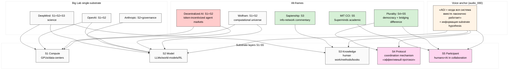

# Diagram 04 — Alternative frames bridges + substrate layers

```mermaid
%%{init: {'theme':'base', 'themeVariables': {'primaryTextColor':'#000000','textColor':'#000000','lineColor':'#333333','primaryBorderColor':'#333333','primaryColor':'#fafafa','noteTextColor':'#000000','noteBkgColor':'#fff8d5','edgeLabelBackground':'#ffffff'}}}%%
graph TB
    subgraph "Voice anchor (audio_690)"
        VA[«AGI = когда вся система<br/>вместе лаконично работает»<br/>+ информация-substrate hypothesis]
    end

    subgraph "Substrate layers S1-S5"
        S1[S1 Compute<br/>GPUs/data-centers]
        S2[S2 Model<br/>LLMs/world-models/RL]
        S3[S3 Knowledge<br/>human work/methods/books]
        S4[S4 Protocol<br/>coordination mechanism<br/>«эффективный протокол»]
        S5[S5 Participant<br/>humans+AI in collaboration]
    end

    subgraph "Alt-frames"
        Plurality[Plurality: S4+S5<br/>democracy + bridging difference]
        MITCCI[MIT CCI: S5<br/>Superminds academic]
        Sapien[Sapienship: S3<br/>info-network commentary]
        Wolfram[Wolfram: S1+S2<br/>computational universe]
        Decent[Decentralized AI: S1+S2<br/>token-incentivized agent markets]
    end

    subgraph "Big Lab single-substrate"
        BigLab1[OpenAI: S1+S2]
        BigLab2[Anthropic: S2+governance]
        BigLab3[DeepMind: S1+S2+S3 science]
    end

    VA --> S2
    VA --> S3
    VA --> S4
    VA --> S5

    Plurality --> S4
    Plurality --> S5
    MITCCI --> S5
    Sapien --> S3
    Wolfram --> S1
    Wolfram --> S2
    Decent --> S1
    Decent --> S2

    BigLab1 --> S1
    BigLab1 --> S2
    BigLab2 --> S2
    BigLab3 --> S1
    BigLab3 --> S2
    BigLab3 --> S3

    style VA fill:#fff4e6
    style S4 fill:#ffd6f0
    style S5 fill:#ffd6f0
    style Plurality fill:#d6f0d6
    style MITCCI fill:#d6f0d6
    style Sapien fill:#d6f0d6
    style Decent fill:#ffcccc
```
