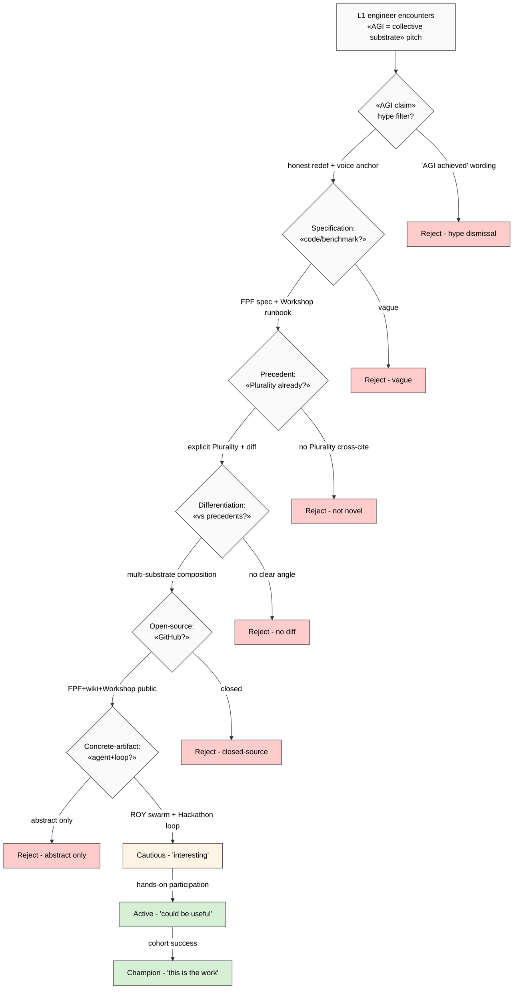

# Diagram 05 — L1 engineer reception flow

```mermaid
%%{init: {'theme':'base', 'themeVariables': {'primaryTextColor':'#000000','textColor':'#000000','lineColor':'#333333','primaryBorderColor':'#333333','primaryColor':'#fafafa','noteTextColor':'#000000','noteBkgColor':'#fff8d5','edgeLabelBackground':'#ffffff'}}}%%
flowchart TB
    Start[L1 engineer encounters<br/>«AGI = collective substrate» pitch]

    Filter1{«AGI claim»<br/>hype filter?}
    Filter2{Specification:<br/>«code/benchmark?»}
    Filter3{Precedent:<br/>«Plurality already?»}
    Filter4{Differentiation:<br/>«vs precedents?»}
    Filter5{Open-source:<br/>«GitHub?»}
    Filter6{Concrete-artifact:<br/>«agent+loop?»}

    R1[Reject - hype dismissal]
    R2[Reject - vague]
    R3[Reject - not novel]
    R4[Reject - no diff]
    R5[Reject - closed-source]
    R6[Reject - abstract only]

    E1[Cautious - 'interesting']
    E2[Active - 'could be useful']
    E3[Champion - 'this is the work']

    Start --> Filter1
    Filter1 -->|'AGI achieved' wording| R1
    Filter1 -->|honest redef + voice anchor| Filter2

    Filter2 -->|vague| R2
    Filter2 -->|FPF spec + Workshop runbook| Filter3

    Filter3 -->|no Plurality cross-cite| R3
    Filter3 -->|explicit Plurality + diff| Filter4

    Filter4 -->|no clear angle| R4
    Filter4 -->|multi-substrate composition| Filter5

    Filter5 -->|closed| R5
    Filter5 -->|FPF+wiki+Workshop public| Filter6

    Filter6 -->|abstract only| R6
    Filter6 -->|ROY swarm + Hackathon loop| E1

    E1 -->|hands-on participation| E2
    E2 -->|cohort success| E3

    style R1 fill:#ffcccc
    style R2 fill:#ffcccc
    style R3 fill:#ffcccc
    style R4 fill:#ffcccc
    style R5 fill:#ffcccc
    style R6 fill:#ffcccc
    style E1 fill:#fff4e6
    style E2 fill:#d6f0d6
    style E3 fill:#d6f0d6
```
