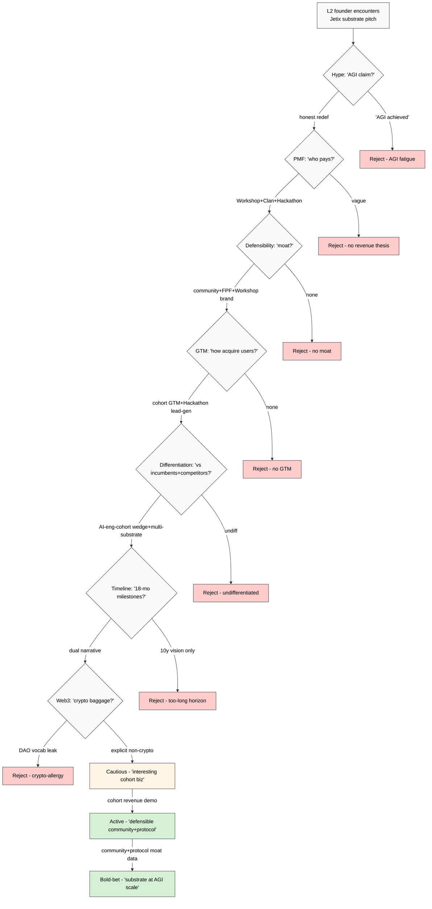

# Diagram 06 — L2 founder reception flow

```mermaid
%%{init: {'theme':'base', 'themeVariables': {'primaryTextColor':'#000000','textColor':'#000000','lineColor':'#333333','primaryBorderColor':'#333333','primaryColor':'#fafafa','noteTextColor':'#000000','noteBkgColor':'#fff8d5','edgeLabelBackground':'#ffffff'}}}%%
flowchart TB
    Start[L2 founder encounters<br/>Jetix substrate pitch]

    F1{Hype: 'AGI claim?'}
    F2{PMF: 'who pays?'}
    F3{Defensibility: 'moat?'}
    F4{GTM: 'how acquire users?'}
    F5{Differentiation: 'vs incumbents+competitors?'}
    F6{Timeline: '18-mo milestones?'}
    F7{Web3: 'crypto baggage?'}

    R1[Reject - AGI fatigue]
    R2[Reject - no revenue thesis]
    R3[Reject - no moat]
    R4[Reject - no GTM]
    R5[Reject - undifferentiated]
    R6[Reject - too-long horizon]
    R7[Reject - crypto-allergy]

    E1[Cautious - 'interesting cohort biz']
    E2[Active - 'defensible community+protocol']
    E3[Bold-bet - 'substrate at AGI scale']

    Start --> F1
    F1 -->|'AGI achieved'| R1
    F1 -->|honest redef| F2
    F2 -->|vague| R2
    F2 -->|Workshop+Clan+Hackathon| F3
    F3 -->|none| R3
    F3 -->|community+FPF+Workshop brand| F4
    F4 -->|none| R4
    F4 -->|cohort GTM+Hackathon lead-gen| F5
    F5 -->|undiff| R5
    F5 -->|AI-eng-cohort wedge+multi-substrate| F6
    F6 -->|10y vision only| R6
    F6 -->|dual narrative| F7
    F7 -->|DAO vocab leak| R7
    F7 -->|explicit non-crypto| E1
    E1 -->|cohort revenue demo| E2
    E2 -->|community+protocol moat data| E3

    style R1 fill:#ffcccc
    style R2 fill:#ffcccc
    style R3 fill:#ffcccc
    style R4 fill:#ffcccc
    style R5 fill:#ffcccc
    style R6 fill:#ffcccc
    style R7 fill:#ffcccc
    style E1 fill:#fff4e6
    style E2 fill:#d6f0d6
    style E3 fill:#d6f0d6
```
