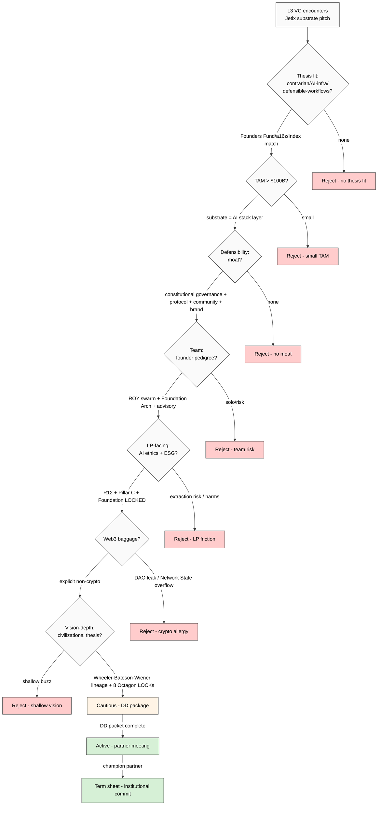

# Diagram 07 — L3 investor reception flow

```mermaid
%%{init: {'theme':'base', 'themeVariables': {'primaryTextColor':'#000000','textColor':'#000000','lineColor':'#333333','primaryBorderColor':'#333333','primaryColor':'#fafafa','noteTextColor':'#000000','noteBkgColor':'#fff8d5','edgeLabelBackground':'#ffffff'}}}%%
flowchart TB
    Start[L3 VC encounters<br/>Jetix substrate pitch]

    F1{Thesis fit:<br/>contrarian/AI-infra/<br/>defensible-workflows?}
    F2{TAM > $100B?}
    F3{Defensibility:<br/>moat?}
    F4{Team:<br/>founder pedigree?}
    F5{LP-facing:<br/>AI ethics + ESG?}
    F6{Web3 baggage?}
    F7{Vision-depth:<br/>civilizational thesis?}

    R1[Reject - no thesis fit]
    R2[Reject - small TAM]
    R3[Reject - no moat]
    R4[Reject - team risk]
    R5[Reject - LP friction]
    R6[Reject - crypto allergy]
    R7[Reject - shallow vision]

    E1[Cautious - DD package]
    E2[Active - partner meeting]
    E3[Term sheet - institutional commit]

    Start --> F1
    F1 -->|none| R1
    F1 -->|Founders Fund/a16z/Index match| F2
    F2 -->|small| R2
    F2 -->|substrate = AI stack layer| F3
    F3 -->|none| R3
    F3 -->|constitutional governance + protocol + community + brand| F4
    F4 -->|solo/risk| R4
    F4 -->|ROY swarm + Foundation Arch + advisory| F5
    F5 -->|extraction risk / harms| R5
    F5 -->|R12 + Pillar C + Foundation LOCKED| F6
    F6 -->|DAO leak / Network State overflow| R6
    F6 -->|explicit non-crypto| F7
    F7 -->|shallow buzz| R7
    F7 -->|Wheeler-Bateson-Wiener lineage + 8 Octagon LOCKs| E1

    E1 -->|DD packet complete| E2
    E2 -->|champion partner| E3

    style R1 fill:#ffcccc
    style R2 fill:#ffcccc
    style R3 fill:#ffcccc
    style R4 fill:#ffcccc
    style R5 fill:#ffcccc
    style R6 fill:#ffcccc
    style R7 fill:#ffcccc
    style E1 fill:#fff4e6
    style E2 fill:#d6f0d6
    style E3 fill:#d6f0d6
```
