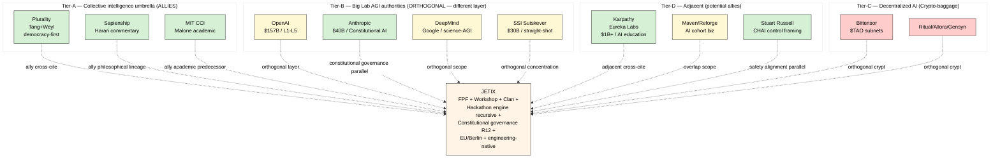

# Diagram 08 — Competitive landscape map (10 competitors × 4 tiers)

```mermaid
%%{init: {'theme':'base', 'themeVariables': {'primaryTextColor':'#000000','textColor':'#000000','lineColor':'#333333','primaryBorderColor':'#333333','primaryColor':'#fafafa','noteTextColor':'#000000','noteBkgColor':'#fff8d5','edgeLabelBackground':'#ffffff'}}}%%
graph TB
    subgraph "Tier-A — Collective intelligence umbrella (ALLIES)"
        Plurality[Plurality<br/>Tang+Weyl<br/>democracy-first]
        Sapien[Sapienship<br/>Harari commentary]
        MITCCI[MIT CCI<br/>Malone academic]
    end

    subgraph "Tier-B — Big Lab AGI authorities (ORTHOGONAL — different layer)"
        OpenAI[OpenAI<br/>$157B / L1-L5]
        Anthropic[Anthropic<br/>$40B / Constitutional AI]
        DeepMind[DeepMind<br/>Google / science-AGI]
        SSI[SSI Sutskever<br/>$30B / straight-shot]
    end

    subgraph "Tier-C — Decentralized AI (Crypto-baggage)"
        Bittensor[Bittensor<br/>$TAO subnets]
        Ritual[Ritual/Allora/Gensyn]
    end

    subgraph "Tier-D — Adjacent (potential allies)"
        Karpathy[Karpathy<br/>Eureka Labs<br/>$1B+ / AI education]
        Maven[Maven/Reforge<br/>AI cohort biz]
        Russell[Stuart Russell<br/>CHAI control framing]
    end

    Jetix[JETIX<br/>FPF + Workshop + Clan +<br/>Hackathon engine recursive +<br/>Constitutional governance R12 +<br/>EU/Berlin + engineering-native]

    Plurality -.ally cross-cite.-> Jetix
    Sapien -.ally philosophical lineage.-> Jetix
    MITCCI -.ally academic predecessor.-> Jetix
    Anthropic -.constitutional governance parallel.-> Jetix
    Karpathy -.adjacent cross-cite.-> Jetix
    Russell -.safety alignment parallel.-> Jetix

    OpenAI -.orthogonal layer.-> Jetix
    DeepMind -.orthogonal scope.-> Jetix
    SSI -.orthogonal concentration.-> Jetix
    Bittensor -.orthogonal crypto.-> Jetix
    Ritual -.orthogonal crypto.-> Jetix
    Maven -.overlap scope.-> Jetix

    style Jetix fill:#fff4e6
    style Plurality fill:#d6f0d6
    style Sapien fill:#d6f0d6
    style MITCCI fill:#d6f0d6
    style Anthropic fill:#d6f0d6
    style Karpathy fill:#d6f0d6
    style Russell fill:#d6f0d6
    style OpenAI fill:#fff8d5
    style DeepMind fill:#fff8d5
    style SSI fill:#fff8d5
    style Bittensor fill:#ffcccc
    style Ritual fill:#ffcccc
    style Maven fill:#fff8d5
```
