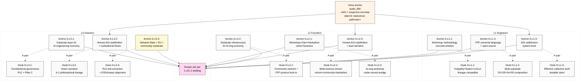

# Diagram 09 — Pitch framing recommendations 3-tier matrix (BREADTH surface)

```mermaid
%%{init: {'theme':'base', 'themeVariables': {'primaryTextColor':'#000000','textColor':'#000000','lineColor':'#333333','primaryBorderColor':'#333333','primaryColor':'#fafafa','noteTextColor':'#000000','noteBkgColor':'#fff8d5','edgeLabelBackground':'#ffffff'}}}%%
graph TB
    subgraph "L1 Engineers"
        L1A1[Anchor A-L1-1:<br/>Workshop methodology<br/>concrete artefact]
        L1A2[Anchor A-L1-2:<br/>FPF universal language<br/>+ open-source]
        L1A3[Anchor A-L1-3:<br/>AGI redefinition<br/>system-level]
        L1H1[Hook H-L1-1:<br/>Karpathy+Sutton+LeCun<br/>lineage compatible]
        L1H2[Hook H-L1-2:<br/>Multi-substrate<br/>S2+S3+S4+S5 composition]
        L1H3[Hook H-L1-3:<br/>Effective collective work<br/>testable claim]
    end

    subgraph "L2 Founders"
        L2A1[Anchor A-L2-1:<br/>Workshop+Clan+Hackathon<br/>cohort business]
        L2A2[Anchor A-L2-2:<br/>Substrate infrastructure<br/>for AI eng economy]
        L2A3[Anchor A-L2-3:<br/>Honest AGI redefinition<br/>+ dual narrative]
        L2H1[Hook H-L2-1:<br/>Community network +<br/>FPF protocol lock-in]
        L2H2[Hook H-L2-2:<br/>Multi-revenue stream<br/>cohort+community+hackathon]
        L2H3[Hook H-L2-3:<br/>AI-eng-workshop<br/>under-served wedge]
    end

    subgraph "L3 Investors"
        L3A1[Anchor A-L3-1:<br/>Substrate layer for<br/>AI engineering economy]
        L3A2[Anchor A-L3-2:<br/>Honest AGI redefinition<br/>+ civilizational thesis]
        L3A3[Anchor A-L3-3:<br/>Network State + EU +<br/>community substrate]
        L3H1[Hook H-L3-1:<br/>Constitutional governance<br/>R12 + Pillar C]
        L3H2[Hook H-L3-2:<br/>Vision narrative<br/>K-1 philosophical lineage]
        L3H3[Hook H-L3-3:<br/>R12 anti-extraction<br/>+ ESG/impact alignment]
    end

    Voice[Voice anchor<br/>audio_690<br/>«AGI = когда вся система<br/>вместе лаконично работает»]

    Voice --> L1A3
    Voice --> L2A3
    Voice --> L3A2

    L1A1 -.A-pair.-> L1H1
    L1A2 -.A-pair.-> L1H2
    L1A3 -.A-pair.-> L1H3
    L2A1 -.A-pair.-> L2H3
    L2A2 -.A-pair.-> L2H1
    L2A3 -.A-pair.-> L2H2
    L3A1 -.A-pair.-> L3H1
    L3A2 -.A-pair.-> L3H2
    L3A3 -.A-pair.-> L3H3

    Ack[Ruslan ack per<br/>C.1/C.2 drafting]

    L1A1 --> Ack
    L1A2 --> Ack
    L1A3 --> Ack
    L2A1 --> Ack
    L2A2 --> Ack
    L2A3 --> Ack
    L3A1 --> Ack
    L3A2 --> Ack
    L3A3 --> Ack

    style Voice fill:#fff4e6
    style Ack fill:#ffd6f0
    style L3A3 fill:#fff8d5
```
