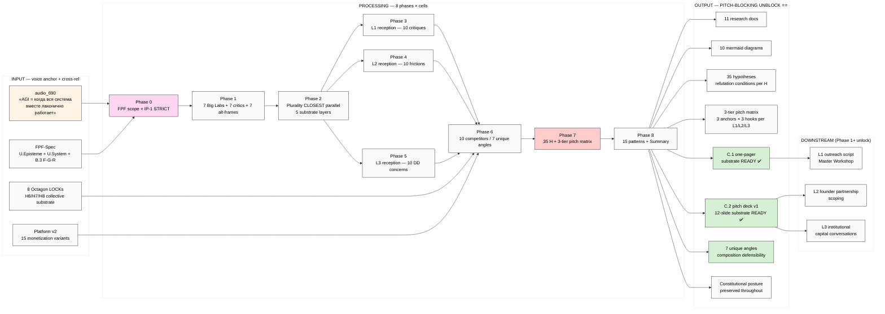

# Diagram 10 — Master TL;DR (entire K-2 run on one diagram)

```mermaid
%%{init: {'theme':'base', 'themeVariables': {'primaryTextColor':'#000000','textColor':'#000000','lineColor':'#333333','primaryBorderColor':'#333333','primaryColor':'#fafafa','noteTextColor':'#000000','noteBkgColor':'#fff8d5','edgeLabelBackground':'#ffffff'}}}%%
graph LR
    subgraph "INPUT — voice anchor + cross-ref"
        VA[audio_690<br/>«AGI = когда вся система<br/>вместе лаконично работает»]
        FPF[FPF-Spec<br/>U.Episteme + U.System + B.3 F-G-R]
        OCT[8 Octagon LOCKs<br/>H6/H7/H8 collective substrate]
        PLV[Platform v2<br/>15 monetization variants]
    end

    subgraph "PROCESSING — 8 phases × cells"
        P0[Phase 0<br/>FPF scope + IP-1 STRICT]
        P1[Phase 1<br/>7 Big Labs + 7 critics + 7 alt-frames]
        P2[Phase 2<br/>Plurality CLOSEST parallel<br/>5 substrate layers]
        P3[Phase 3<br/>L1 reception — 10 critiques]
        P4[Phase 4<br/>L2 reception — 10 frictions]
        P5[Phase 5<br/>L3 reception — 10 DD concerns]
        P6[Phase 6<br/>10 competitors / 7 unique angles]
        P7[Phase 7<br/>35 H + 3-tier pitch matrix]
        P8[Phase 8<br/>15 patterns + Summary]
    end

    subgraph "OUTPUT — PITCH-BLOCKING UNBLOCK ⭐⭐"
        O1[11 research docs]
        O2[10 mermaid diagrams]
        O3[35 hypotheses<br/>refutation conditions per H]
        O4[3-tier pitch matrix<br/>3 anchors × 3 hooks per L1/L2/L3]
        O5[C.1 one-pager<br/>substrate READY ✅]
        O6[C.2 pitch deck v1<br/>12-slide substrate READY ✅]
        O7[7 unique angles<br/>composition defensibility]
        O8[Constitutional posture<br/>preserved throughout]
    end

    subgraph "DOWNSTREAM (Phase 1+ unlock)"
        D1[L1 outreach script<br/>Master Workshop]
        D2[L2 founder partnership<br/>scoping]
        D3[L3 institutional<br/>capital conversations]
    end

    VA --> P0
    FPF --> P0
    P0 --> P1
    P1 --> P2
    P2 --> P3
    P2 --> P4
    P2 --> P5
    P3 --> P6
    P4 --> P6
    P5 --> P6
    OCT --> P6
    PLV --> P6
    P6 --> P7
    P7 --> P8

    P8 --> O1
    P8 --> O2
    P8 --> O3
    P8 --> O4
    P8 --> O5
    P8 --> O6
    P8 --> O7
    P8 --> O8

    O5 --> D1
    O6 --> D2
    O6 --> D3

    style VA fill:#fff4e6
    style O5 fill:#d6f0d6
    style O6 fill:#d6f0d6
    style O7 fill:#d6f0d6
    style P0 fill:#ffd6f0
    style P7 fill:#ffcccc
```
