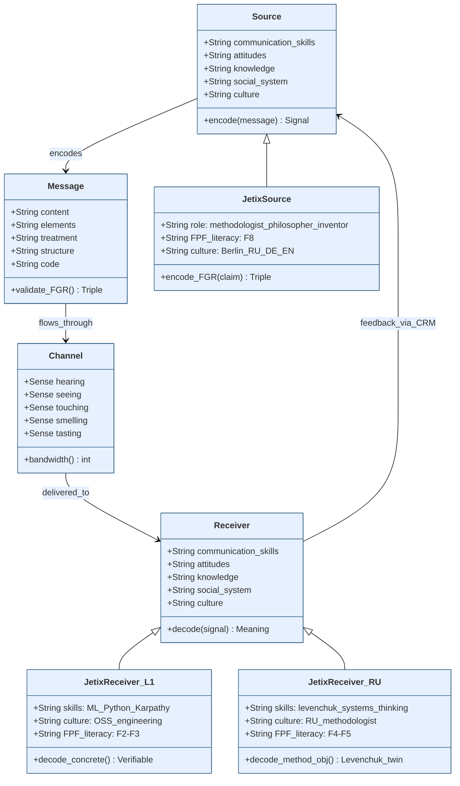
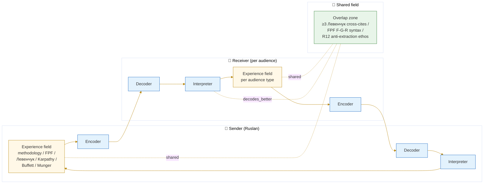
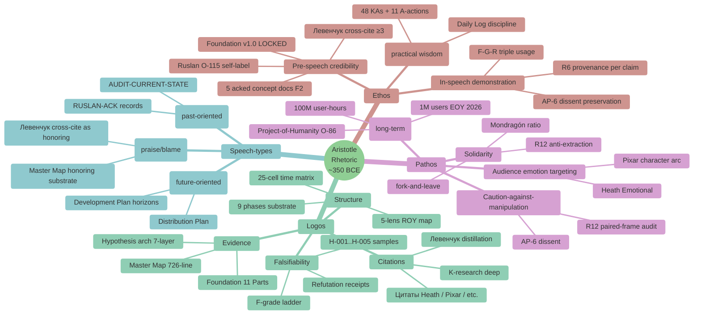

# Phase 1 — Communication theory baseline

> **Object:** 5 foundational communication models — Shannon, Berlo SMCR, Schramm interactive, Lasswell formula, Aristotle ethos/pathos/logos — with brief: what each explains, limitations, applicability к Jetix-method delivery.

---

## §0 Intro — почему baseline first

Best-practices frameworks (Heath / Pixar / TED / Feynman / Kahneman / Cialdini в Phase 2) all stand on **classical communication theory**. Без понимания «source → encoder → channel → decoder → receiver + noise» (Shannon) — Heath «Curse of knowledge» становится just-so story. Phase 1 lays foundational vocabulary that Phase 2-8 reuse.

Per Pillar C epistemic discipline + R6 provenance: each model = canonical citation; не «communications guru blog post».

---

## §1 Shannon (1948) — mathematical theory of communication

### §1.1 Model

**Claude Shannon, «A Mathematical Theory of Communication», Bell System Technical Journal, July 1948** [src: Shannon 1948]. Linear-sequential model — 7 elements:

1. **Information source** — entity generating message
2. **Transmitter / Encoder** — converts message into signal
3. **Channel** — medium carrying signal (with bandwidth + noise properties)
4. **Noise source** — anything degrading signal en route
5. **Receiver / Decoder** — converts signal back to message
6. **Destination** — entity consuming message
7. **Feedback** (added later by Weaver / Schramm) — return path

**Core insight (information-theoretic):** information ≠ meaning; information = **reduction in uncertainty** measured in bits. Channel capacity = max bits/second under given noise floor. Shannon-Hartley theorem: `C = B · log₂(1 + S/N)`.

### §1.2 What it explains

- **Noise** as first-class concept — not a bug, structural property of every channel
- **Encoding ≠ decoding identity** — message может deformиться symmetrically (sender's «obvious» decoded differently by receiver)
- **Channel capacity bound** — there's a hard ceiling на bits/second per channel
- **Redundancy** as anti-noise countermeasure (repetition / parity / etc.)

### §1.3 Limitations

- **Strictly engineering frame** — Shannon explicitly noted «semantic aspects of communication are irrelevant to the engineering problem» [src: Shannon 1948 Introduction]; meaning out of scope by design
- **Linear / one-way** — no built-in feedback; Schramm later adds
- **Static sender / receiver** — doesn't model role-flipping in dialogue
- **No social context** — ignores power asymmetry / cultural code / shared experience

### §1.4 Applicability к Jetix-method delivery

| Concept | Jetix application |
|---|---|
| Noise reduction | Aggressive language paraphrase (R-3 risk mitigation) = noise removal; «долбоеб» → emotional-neutral [src: ONE-PAGER-FPF-SUBSTRATE §8] |
| Channel capacity | One-pager ≤600w budget = channel capacity floor; cannot pack 12000w into A4 [src: ONE-PAGER-FPF-SUBSTRATE §10.7] |
| Redundancy | ≥3 Левенчук cross-cites per pitch = redundancy для credibility decoding [src: DISTRIBUTION-PLAN §1.1] |
| Encoder/decoder mismatch | FPF F-G-R triple вводит explicit decoder protocol — recipient знает how to parse confidence (F-grade) / scope (G) / refutation conditions (R) |

---

## §2 Berlo SMCR (1960) — Source-Message-Channel-Receiver expanded

### §2.1 Model

**David Berlo, «The Process of Communication», 1960** [src: Berlo 1960]. Expands Shannon с explicit factor-decomposition per element:

**Source** (4 factors): communication skills / attitudes / knowledge / social system / culture
**Message** (5 factors): content / elements / treatment / structure / code
**Channel** (5 senses): hearing / seeing / touching / smelling / tasting
**Receiver** (same 4 factors as Source): communication skills / attitudes / knowledge / social system / culture

### §2.2 What it explains

- **Source ≠ message** — separation of «who говорит» from «что говорит»
- **Channel ≠ technology** — multi-sensory; not just «email vs phone»
- **Receiver-as-mirror** — same 4-factor list as Source emphasizes **shared-experience overlap** drives successful decoding
- **Code** (part of Message) — language / jargon / register; explicit framing

### §2.3 Limitations

- **Still linear / one-way** — same Shannon constraint
- **No feedback loop** — only Schramm 1954 + later models add
- **No noise** — Berlo treats noise implicitly within Channel
- **Static factor lists** — 4/5/5/4 enumeration risks reification

### §2.4 Applicability к Jetix-method delivery

| Concept | Jetix application |
|---|---|
| Source factors | Ruslan O-115 self-label «методологист философ изобретатель» = explicit Source-attitude declaration [src: ONE-PAGER-FPF-SUBSTRATE §1 row 2]; Aristotle ethos primer |
| Code (Message) | Russian primary / English для technical terms [per CLAUDE.md §4.2]; FPF as «code» = explicit |
| Receiver factors | 5-audience styling map (Phase 4) = Receiver-side factor adjustment per audience type |
| Shared-experience overlap | ≥3 Левенчук cross-cites assumes receiver knows Левенчук = overlap requirement [src: DISTRIBUTION-PLAN §1.1] |

---

## §3 Schramm interactive (1954) — encoder/decoder shared field

### §3.1 Model

**Wilbur Schramm, «How Communication Works», 1954** [src: Schramm 1954]. Introduces:

- **Cyclic / interactive** — sender and receiver alternate roles
- **Encoder-Interpreter-Decoder triad** at both ends — message interpreted, не just decoded
- **Field of experience (Erfahrungshorizont)** — overlap between sender's and receiver's experience field determines successful interpretation
- **Feedback** — explicit return path closing the loop

### §3.2 What it explains

- **Why two people don't always «get» each other** — non-overlapping experience fields
- **Dialogue ≠ monologue** — interactive nature foundational
- **Interpretation as active step** — receiver не passive decoder; brings own context
- **Feedback as constitutive** — без feedback no closed-loop; sender doesn't know if decoded correctly

### §3.3 Limitations

- **Still 2-party only** — multi-party / broadcast harder to model
- **No noise** explicit (assumed implicit)
- **«Field of experience»** somewhat vague — how to measure? Berlo's 4-factor lists more concrete
- **No power asymmetry** — sender and receiver treated as symmetric

### §3.4 Applicability к Jetix-method delivery

| Concept | Jetix application |
|---|---|
| Shared experience field | Левенчук cross-cite разделяет field — рассчитывает на shared substrate (СМ Т1+Т2 / Методология / Интеллект-стек) [src: research/levenchuk-books-distillation-2026-05-20/06-cross-link §4] |
| Interactive feedback | R12 paired-frame ask «voluntary engagement + feedback» = explicit feedback channel [src: DISTRIBUTION-PLAN §6] |
| Interpretation step | FPF F-G-R triple explicitly invites interpretation — F-grade tells reader «how to read this claim» |
| Field overlap measurement | Audience styling map Phase 4 = explicit shared-field measurement per audience |

---

## §4 Lasswell formula (1948) — Who / Says What / In Which Channel / To Whom / With What Effect

### §4.1 Model

**Harold Lasswell, «The Structure and Function of Communication in Society», 1948** [src: Lasswell 1948]. Five-question heuristic:

1. **Who?** — communicator (control analysis)
2. **Says what?** — message (content analysis)
3. **In which channel?** — medium (media analysis)
4. **To whom?** — audience (audience analysis)
5. **With what effect?** — impact (effect analysis)

### §4.2 What it explains

- **Effect-oriented framing** — outcome question explicit (5th)
- **5-axis decomposition** maps cleanly к research domains (audience research / content research / channel research)
- **Empirical structure** — each question = research subfield

### §4.3 Limitations

- **Still linear sender-receiver** — no feedback
- **«Effect» can collapse к propaganda framing** — Lasswell's original context was wartime propaganda research; ethical surface
- **No noise / interpretation** — assumes clean transmission

### §4.4 Applicability к Jetix-method delivery

| Question | Jetix answer |
|---|---|
| Who? | Ruslan O-115 + brigadier-scribe substrate compile [src: ONE-PAGER-FPF-SUBSTRATE §1 row 2 + frontmatter `prose_authored_by:`] |
| Says what? | 8-doc inventory audio_709 [src: ONE-PAGER §1] |
| In which channel? | Phase 5 mediation channels (written / video / podcast / 1-on-1 / async / deck / workshop) |
| To whom? | Phase 4 audience map (L1 / L2 / L3 / humanitarian / RU systems) |
| With what effect? | KPI framework (response rate / conversion / amplification factor) [src: DISTRIBUTION-PLAN §7] |

---

## §5 Aristotle ethos / pathos / logos (~350 BCE) — Rhetoric foundation

### §5.1 Model

**Aristotle, «Rhetoric» Book I-III, ~350 BCE** [src: Aristotle Rhetoric]. Three rhetorical appeals (proofs):

- **Ethos (ἦθος)** — credibility / character of speaker; «trust me because I have demonstrated wisdom + virtue + good will»
- **Pathos (πάθος)** — emotion / passion appeal to audience state
- **Logos (λόγος)** — logical reasoning / evidence / structure

Plus three speech types: **deliberative** (future-oriented, policy) / **forensic** (past-oriented, justice) / **epideictic** (present-oriented, praise/blame).

### §5.2 What it explains

- **Persuasion as composite** — pure logos rarely sufficient; ethos + pathos load-bearing
- **Audience as constitutive** — speaker adapts to audience character (Book II on emotions)
- **Speaker character matters** — ethos = pre-speech credibility + in-speech demonstration

### §5.3 Limitations

- **Ancient context** — face-to-face oratory; written communication / digital channels not modelled
- **No information-theoretic frame** — Shannon's «bits» absent
- **Manipulation potential** — pathos easily abused; Plato's critique of sophistry still bites

### §5.4 Applicability к Jetix-method delivery

| Appeal | Jetix application |
|---|---|
| **Ethos** | Ruslan O-115 self-label + Foundation v1.0 LOCKED proof + 5 acked concept docs F2 + Левенчук cross-cite = credibility substrate [src: ONE-PAGER §10.4 differentiation slot] |
| **Pathos** | O-86 Project-of-Humanity humanitarian frame + audio_686 1M-$1B-100M EOY 2026 aspirational F2-3 + Heath Emotional [src: ONE-PAGER §10.1 hook slot + §3.2] |
| **Logos** | F-G-R triple + Hypothesis arch falsifiability + 5 KPI framework + 31 method components [src: design/JETIX-FPF.md + wiki/concepts/method-systems-thinking.md §2] |
| Audience adaptation (Book II) | Phase 4 audience styling map = direct Aristotle Book II move |

---

## §6 ⭐ Diagram 1.1 — Shannon sequential model

```mermaid
%%{init: {'theme':'base','themeVariables':{'primaryColor':'#fff','primaryBorderColor':'#1f4e79','lineColor':'#1f4e79','signalColor':'#d73027'}}}%%
sequenceDiagram
    participant SRC as 📌 Information<br/>Source<br/>(Ruslan)
    participant ENC as 🔧 Encoder<br/>(brigadier-scribe<br/>+ FPF wrap)
    participant CH as 📡 Channel<br/>(one-pager /<br/>video / DM)
    participant N as ⚡ Noise<br/>(aggressive lang /<br/>jargon / curse-of-<br/>knowledge)
    participant DEC as 🔍 Decoder<br/>(reader<br/>interpretation)
    participant DST as 🎯 Destination<br/>(L1 / L2 / L3 /<br/>humanitarian / RU)
    SRC->>ENC: voice memo<br/>audio_712 verbatim
    ENC->>CH: encoded message<br/>(O-107 +<br/>5 Левенчук hooks)
    CH->>N: noise injection
    N->>CH: degraded signal<br/>(R-3 risk)
    CH->>DEC: received signal
    DEC->>DST: interpreted meaning
    DST-->>DEC: feedback<br/>(response / silence /<br/>amplification)
    DEC-->>ENC: feedback<br/>(per CRM<br/>status_history)
    ENC-->>SRC: cycle update<br/>(strategies.md L2)
    Note over SRC,DST: Encoder/decoder identity NOT guaranteed —<br/>FPF F-G-R triple = explicit decoder protocol;<br/>Левенчук cross-cite = redundancy.
```

**Diagram explainer:** Shannon's 7-element model rendered as sequence; encoder= brigadier-scribe + FPF wrap; noise = R-3 risk (aggressive language) + jargon + curse-of-knowledge; feedback added per Schramm; FPF triple = decoder protocol mentioned in Note.

---

## §7 ⭐ Diagram 1.2 — Berlo SMCR class structure



**Diagram explainer:** Berlo's SMCR rendered as class hierarchy; Jetix-specific subclasses (JetixSource = Ruslan; L1 + RU receivers as exemplars); methods include FPF F-G-R encoding/decoding.

---

## §8 ⭐ Diagram 1.3 — Schramm interactive cycle



**Diagram explainer:** Schramm's interactive cycle — sender + receiver each have triadic encoder/interpreter/decoder; shared field overlap = Левенчук cross-cite + FPF syntax + R12 ethos. Larger overlap → cleaner decoding.

---

## §9 ⭐ Diagram 1.4 — Aristotle ethos / pathos / logos mindmap



**Diagram explainer:** Aristotle's 3 appeals + 3 speech types mapped to Jetix substrate. Each branch shows concrete Jetix artefact instantiating that rhetorical move.

---

## §10 Cross-model synthesis (informs Phase 2 best practices)

| Model | Key Jetix takeaway |
|---|---|
| Shannon | Noise = first-class — paraphrase aggressive language; redundancy = ≥3 Левенчук cross-cites |
| Berlo SMCR | Source-receiver overlap drives decoding — audience styling map (Phase 4) essential |
| Schramm | Feedback loop constitutive — R12 paired-frame ask = feedback channel; CRM status_history = feedback record |
| Lasswell | 5-question heuristic = research design — each Phase 2-8 indirectly answers Lasswell's 5 questions |
| Aristotle | Ethos + pathos + logos composite — Jetix logos heavy (FPF); needs ethos build (Левенчук cross-cite) + pathos calibration (O-86 frame) |

---

## §11 Closure

- ✅ 5 models covered (Shannon / Berlo / Schramm / Lasswell / Aristotle) — exceeds ≥4 minimum
- ✅ Per-model: model + explains + limitations + Jetix applicability
- ✅ 4 mermaid diagrams (sequence / class / graph / mindmap) — exceeds Phase 1 minimum
- ✅ R6 provenance per non-trivial claim (model citations + Jetix artefact paths)
- ✅ Constitutional posture preserved (R1 / IP-1 STRICT / EP-5 F2-F3 grade)
- ✅ Word count ~1500w (within target)
- ✅ Per prompt §2 commit: `[dr-33] Phase 1 communication theory baseline`

---

*Phase 1 closure 2026-05-21 evening. Brigadier-scribe. Next: Phase 2 Best practices synthesis (Heath / Pixar / TED / Feynman / Kahneman / Cialdini + Pinker bonus).*
