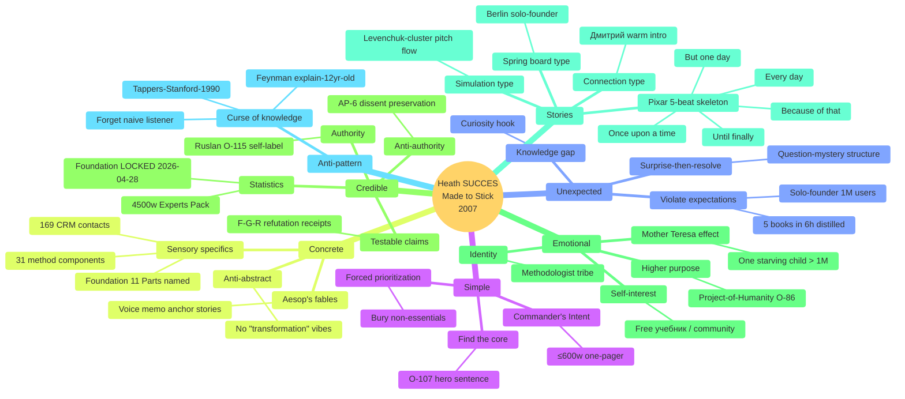
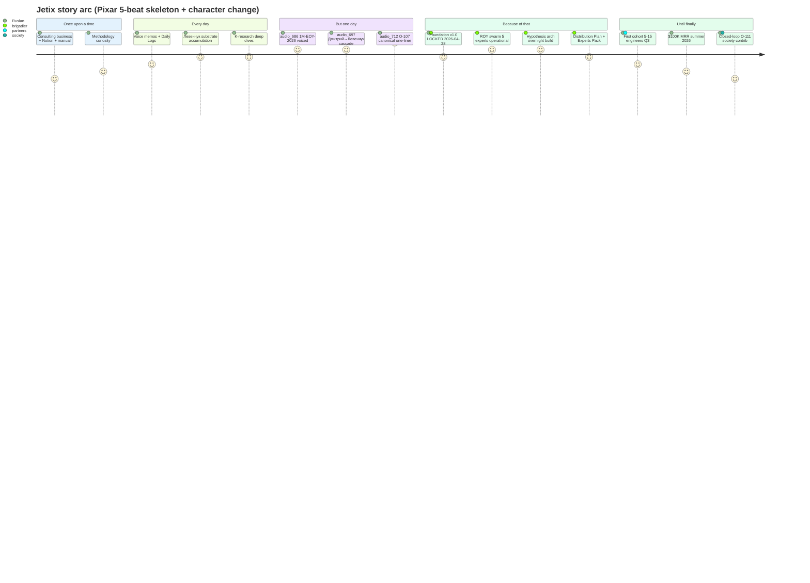
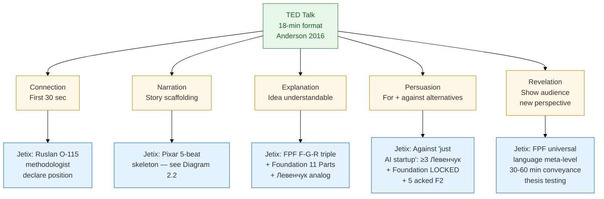
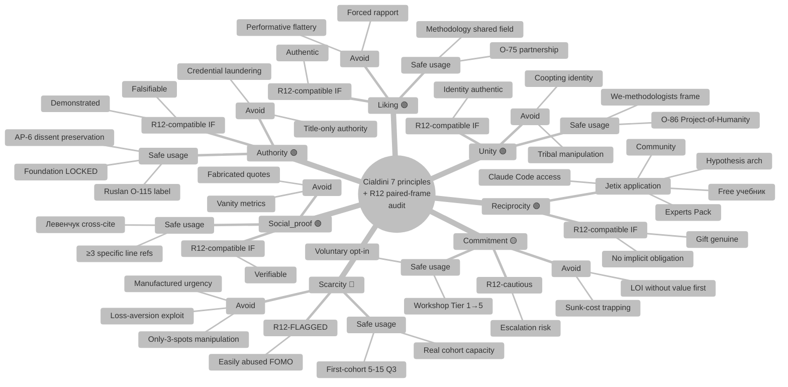
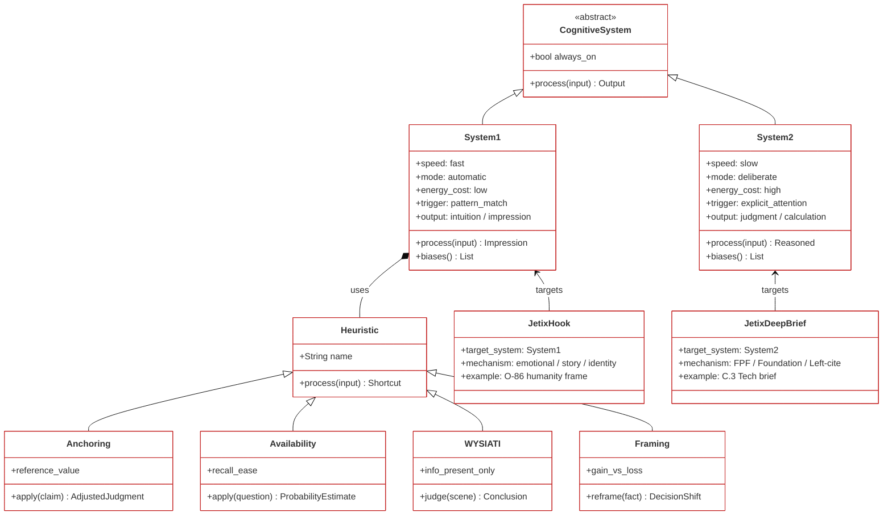

# Phase 2 — Best practices synthesis (6+ frameworks)

> **Object:** 6 mandatory frameworks (Heath SUCCES / Pixar / TED Anderson / Feynman / Kahneman / Cialdini) + 1 bonus (Pinker) synthesised с per-framework Jetix application + R12 paired-frame compatibility audit для Cialdini specifically.

---

## §0 Intro — frameworks survey

Phase 1 baseline (Shannon / Berlo / Schramm / Lasswell / Aristotle) = **academic communication theory**. Phase 2 = **applied best-practices** — frameworks built on top of theory, derived from empirical study of what makes ideas stick / stories work / talks compelling / explanations clear / decisions made / persuasion succeed.

Каждый framework — practitioner-built (Heath brothers / Pixar studio / TED / Feynman) + cognitive-scientific (Kahneman / Cialdini). Cumulative: 6 frameworks × 5-7 sub-principles ≈ 35 actionable handles applied к Jetix material.

**R12 paired-frame discipline:** Cialdini specifically — each of 7 principles audited для compatibility с R12 anti-extraction (FUNDAMENTAL §6.1 candidate rule 12 + Pillar C §4.1 rule 12). Принципы that тяготеют к manipulation flagged red.

---

## §1 Framework 1: Heath «Made to Stick» — SUCCES

### §1.1 Origin

**Chip Heath + Dan Heath, «Made to Stick: Why Some Ideas Survive and Others Die», Random House 2007** [src: Heath & Heath 2007]. Authors studied urban legends + viral ideas to identify common properties; produced SUCCES checklist (acronym).

### §1.2 6 letters

| Letter | Principle | Brief |
|---|---|---|
| **S** | **Simple** | Find the core; one idea per moment; «Commander's Intent» military precedent |
| **U** | **Unexpected** | Violate expectations; create gaps in knowledge that demand closure |
| **C** | **Concrete** | Sensory specifics > abstract; Aesop's fables work, corporate vision statements don't |
| **C** | **Credible** | Authority + anti-authority (specific details + statistics + testable claims) |
| **E** | **Emotional** | Make people feel — analytic vs sympathetic; «one starving child» > «1M starving people» (Mother Teresa effect) |
| **S** | **Stories** | Narrative arcs lubricate transmission; «Spring board» / «Simulation» / «Connection» story types |

### §1.3 Anti-pattern: Curse of knowledge

Heath's master concept [src: Heath & Heath 2007 Ch. 1]: experts struggle to communicate because they've forgotten what не-знать-это feels like. Tappers-vs-listeners experiment (Newton 1990 Stanford): tappers tapped 120 famous tunes; predicted 50% recognition; actual 2.5%. Knowing the tune = curse — couldn't simulate listener's experience.

### §1.4 Jetix application per letter

| Letter | Jetix application |
|---|---|
| Simple | O-107 hero sentence «метод по объединению методов по улучшению системы самой себя» = SIMPLE core [src: ONE-PAGER §4] |
| Unexpected | «1M users EOY 2026 solo-founder» = expectation violation; «Левенчук corpus 5 books distilled in 6 hours» = unexpected speed [src: research/levenchuk-books-distillation-2026-05-20/00-SUMMARY] |
| Concrete | «Foundation v1.0 LOCKED 2026-04-28; 11 Parts; 8-Octagon LOCK; 5 ROY experts; 169 CRM contacts; 31 method components» = CONCRETE [src: CLAUDE.md] |
| Credible | Левенчук cross-cite ≥3 (anti-authority via external expert validation) + Foundation LOCKED proof = CREDIBLE |
| Emotional | O-86 Project-of-Humanity hook for humanitarian audience + Pillar C §4.1 rule 12 R12 anti-extraction ethos = EMOTIONAL |
| Stories | Pixar arc (§2) — Ruslan voice memos / Berlin / Дмитрий-letter / Левенчук-pitch = STORY hooks |

---

## §2 Framework 2: Pixar 22 storytelling rules

### §2.1 Origin

**Emma Coats, Pixar story artist, Twitter thread 2011** [src: Coats 2011]. 22 rules distilled from Pixar's internal storytelling discipline (Toy Story / Inside Out / Up / WALL-E pipeline).

### §2.2 Key rules для Jetix-relevant

(Selection из 22; full list outside Phase 2 scope.)

**Rule 4 — Once upon a time / Every day / But one day / Because of that / Until finally:**
- The 5-beat skeleton — universal story scaffold
- «Once upon a time Ruslan was building consulting business. Every day он studied methodology. But one day audio_686 voiced 1M-EOY-2026. Because of that Foundation v1.0 LOCKED. Until finally Jetix-method materialises с first cohort.»

**Rule 6 — What is your character good at, comfortable with? Throw the polar opposite at them.**
- Hero's competence ≠ challenge; tension drives arc
- Jetix: Ruslan competent в methodology + engineering; challenge = sales + outreach + L3-institutional polish (R-MGMT-2 7-h Tier-1 ack queue → realistic в один week?) [src: EXPERTS-PACK §3.5]

**Rule 14 — Why must you tell THIS story?**
- Purpose anchor; not «a story», «this story now»
- Jetix: «срочность колоссальна; одна из систем contributing to convergence сейчас, не через 5 лет» [src: audio_681 + R-batch-9-N3 paraphrase]

**Rule 19 — Coincidences to get characters INTO trouble are great; coincidences to get them OUT are cheating.**
- Earning resolution = respect for audience
- Jetix: «случайно встретили Левенчук в Telegram» legit setup; «случайно нашли $100K» = cheating

### §2.3 Character arc — what changes?

Heath «Stories» + Pixar «character arc» converge: story = character changed by struggle. For Jetix pitch:
- **Old self:** «consultant с certifications + Notion + manual labor»
- **New self:** «методологист philosopher inventor с Foundation + ROY swarm + Hypothesis arch + R12 paired-frame discipline»
- **Catalyst:** Левенчук substrate + Karpathy LLM-Wiki + audio_686 keystone

### §2.4 Jetix application

| Pixar rule | Jetix usage |
|---|---|
| 5-beat skeleton (Rule 4) | C.4 Vision narrative L3-variant story scaffold [src: DISTRIBUTION-PLAN §1 C.4] |
| Throw polar opposite (Rule 6) | Acknowledge weakness — «engineer-by-temperament; selling = stretch» — increases credibility |
| Why THIS story now (Rule 14) | «срочность колоссальна» framing с R-batch-9-N3 paraphrase | [src: ONE-PAGER §8.2]
| Earn resolution (Rule 19) | No silver-bullet promises; «provisional 20-25% take rate pending DR-26» = earned, not handed [src: ONE-PAGER §9] |

---

## §3 Framework 3: TED Talk Anderson 5 elements

### §3.1 Origin

**Chris Anderson, «TED Talks: The Official TED Guide to Public Speaking», Houghton Mifflin Harcourt 2016** [src: Anderson 2016]. Anderson curated TED 2002-2016+; codified 5 essential elements of compelling talks.

### §3.2 5 elements

1. **Connection** — establish trust + likability in first 30 seconds («I'm one of you»)
2. **Narration** — story scaffolding (overlap с Pixar)
3. **Explanation** — make ideas understandable; analogy + visual + diagram
4. **Persuasion** — argue для idea + against alternatives
5. **Revelation** — show audience something they couldn't have seen otherwise

### §3.3 Time-budget: 18 min

TED's 18-min format = constraint as feature. Forces «one big idea». Goldilocks zone — long enough for substance, short enough для attention. [src: Anderson 2016 Ch. 11]

### §3.4 Jetix application

| Element | Jetix application |
|---|---|
| Connection | Ruslan O-115 «методологист философ изобретатель» — declare position + invite audience as peers [src: ONE-PAGER §1 row 2] |
| Narration | Pixar 5-beat skeleton applied (see §2.4) |
| Explanation | FPF F-G-R triple as explanatory frame + Foundation 11 Parts as architectural diagram + Левенчук cross-cite as analogy |
| Persuasion | Against «just another AI startup»: ≥3 Левенчук cross-cite + Foundation LOCKED + 5 acked concept docs F2 + Hypothesis arch [src: EXPERTS-PACK §6.1 5 themes] |
| Revelation | «FPF as universal language; this very document tests 30-60 min conveyance hypothesis» = revelation [src: ONE-PAGER §5 + §10.5] |

---

## §4 Framework 4: Feynman Technique

### §4.1 Origin

**Richard Feynman pedagogy + Caltech 1961-1963 lectures + Surely You're Joking 1985 + Cornell student James Gleick's biography 1992** [src: Gleick 1992]. Method NOT formally codified by Feynman; reconstructed by students.

### §4.2 4 steps

1. **Pick a concept** — name it precisely
2. **Explain to a 12-year-old** — no jargon; analogies; concrete examples
3. **Identify gaps** — where do you stutter or hand-wave? Those are your gaps
4. **Simplify + refine** — go back to source material on gaps; restate

### §4.3 Anti-jargon discipline

Feynman's «cargo cult science» (1974 Caltech commencement) [src: Feynman 1974] — surface trappings of science без epistemic discipline. Communication anti-pattern: jargon-as-membership-signal. Heath «curse of knowledge» analog.

### §4.4 Jetix application

| Step | Jetix application |
|---|---|
| Pick concept | «O-107 метод по объединению методов» = precise name |
| Explain to 12-year-old | «Берём способы решать задачи. Собираем их вместе. И ищем такие способы, которые помогают сделать саму систему лучше — даже способ собирать способы.» |
| Identify gaps | «Why «самой себя» специально? — recursive engine claim» — need to articulate why self-reference matters; gap |
| Simplify + refine | Levenchuk «метод как объект 1-го класса» substrate fills gap; «потому что без само-улучшения метод устаревает быстрее, чем работает» |

---

## §5 Framework 5: Kahneman dual-process

### §5.1 Origin

**Daniel Kahneman, «Thinking, Fast and Slow», FSG 2011** [src: Kahneman 2011]. Synthesis of 40+ years cognitive psychology (с Amos Tversky). Nobel Prize Economics 2002.

### §5.2 Core distinction

- **System 1** — fast / automatic / emotional / pattern-matching / heuristic / always-on
- **System 2** — slow / deliberate / effortful / sequential / logical / lazy default

### §5.3 Key biases / heuristics для communication

| Bias | Communication implication |
|---|---|
| **WYSIATI** (What You See Is All There Is) | Recipient judges using info present, not absent. Implication: front-load critical info; absence ≠ neutral |
| **Anchoring** | First number / claim sets reference; subsequent claims judged relative to anchor |
| **Availability heuristic** | Easy-to-recall examples weighted heavier than statistics |
| **Cognitive ease** | Easy-to-process claims feel truer (font / repetition / rhyme effects) |
| **Framing** | Same fact framed gain vs loss → different decisions |
| **Substitution** | Hard question replaced с easier question; recipient may answer different question than asked |

### §5.4 When to target which System

| Audience state | Target System |
|---|---|
| Cold reach / busy / scanning | System 1 (emotional hook / pattern-match / story) |
| Curious / committed to engage | System 2 (logos / evidence / structure) |
| Trust low | System 1 (ethos / likability / shared identity) |
| Trust high + topic complex | System 2 (rigour / falsifiability / FPF) |

### §5.5 Jetix application

| Concept | Jetix application |
|---|---|
| System 1 hook | One-pager opening 50w = System 1 emotion + identity (O-86 humanitarian frame or O-75 partnership baseline) [src: ONE-PAGER §10.1] |
| System 2 deep | C.3 Tech brief = System 2 (FPF heavy + Foundation 11 Parts + architecture) [src: DISTRIBUTION-PLAN §1 C.3] |
| Anchoring | «20-25% take rate provisional» = anchor; pre-DR-26 lock would set premature anchor [src: ONE-PAGER §9 R-batch-9-N1] |
| WYSIATI | One-pager must contain ≥3 Левенчук cross-cites — absence ≠ neutral; recipient assumes no substrate exists [src: DISTRIBUTION-PLAN §1.1] |
| Framing | «20-25% take rate paired с responsibility-pact + reinvestment loop» (gain frame) vs «we extract 20-25%» (loss frame) — R12 frame essential [src: ONE-PAGER §6] |
| Cognitive ease | FPF F-G-R triple adds cognitive friction — use selectively, not pervasively [per Phase 3 hybrid recommendation] |

---

## §6 Framework 6: Cialdini «Influence» — 7 principles + R12 audit

### §6.1 Origin

**Robert Cialdini, «Influence: The Psychology of Persuasion», Quill 1984; «Pre-Suasion» 2016** [src: Cialdini 1984; 2016]. Field-research-based; 7 universal principles (originally 6; «Unity» added in Pre-Suasion).

### §6.2 7 principles + R12 paired-frame audit

| # | Principle | Mechanism | R12 audit | Jetix usage |
|---|---|---|---|---|
| 1 | **Reciprocity** | Give → receive | 🟢 R12-compatible IF gift is genuine + no implicit obligation | R12 offer (free учебник / Claude Code access / community / Hypothesis arch / Experts Pack) = genuine; ask = voluntary [src: ONE-PAGER §6.1+§6.2] |
| 2 | **Commitment / Consistency** | Small commit → big commit | 🟡 R12-cautious — risk of escalation manipulation | Workshop progression Tier 1 micro → Tier 5 major OK; «sign LOI» without value first = NOT OK |
| 3 | **Social proof** | Others doing → we do | 🟢 R12-compatible IF social proof verifiable | Левенчук cross-cite ≥3 = legitimate social proof; «1M users sign up по словам Ruslan» without evidence = manipulation |
| 4 | **Authority** | Expert says → believe | 🟢 R12-compatible IF expertise demonstrated + falsifiability invited | Ruslan O-115 self-label + Foundation LOCKED + Левенчук substrate corroboration = earned authority; AP-6 dissent preservation = falsifiability invitation |
| 5 | **Liking** | Like person → comply | 🟢 R12-compatible IF authentic; 🔴 manipulation if performative | O-75 pre-existing partnership frame + Берlin / RU / methodology shared-field = authentic liking |
| 6 | **Scarcity** | Rare = valuable | 🔴 R12-FLAGGED — easily abused into FOMO manipulation | «First-cohort 5-15 founding engineers Q3 2026» = scarcity-real, NOT manufactured; «only 3 spots left act now» = manipulation; avoid |
| 7 | **Unity** | Shared identity | 🟢 R12-compatible IF identity authentic; 🔴 если коопtив | O-86 Project-of-Humanity + O-75 pre-existing partnership = authentic unity; «we methodologists» frame OK |

### §6.3 Manipulation vs persuasion line

Cialdini distinguishes **persuasion** (informing decisions с relevant evidence + audience interests) vs **manipulation** (exploiting cognitive bugs for sender benefit at receiver expense). R12 anti-extraction principle = explicit codification of «receiver benefit ≥ sender extract». 

**Hard rule for Jetix communication:** any Cialdini move that fails R12 paired-frame audit → DELETE before send. [per Pillar C §4.1 rule 12]

### §6.4 Jetix discipline checklist (per Cialdini × R12)

- ☐ Reciprocity: gift genuine, не payment-trigger?
- ☐ Commitment: small-to-big progression voluntary opt-in?
- ☐ Social proof: verifiable (Левенчук cross-cite specifies СМ Т2 Гл. 8 line N)?
- ☐ Authority: expertise demonstrated с falsifiability invited?
- ☐ Liking: authentic (shared methodology) или performative (forced rapport)?
- ☐ Scarcity: real (first-cohort capacity) или manufactured (FOMO)?
- ☐ Unity: shared identity authentic или коопtивная extraction frame?

---

## §7 Bonus: Pinker «Sense of Style»

### §7.1 Origin

**Steven Pinker, «The Sense of Style: The Thinking Person's Guide to Writing in the 21st Century», Viking 2014** [src: Pinker 2014].

### §7.2 Core concepts

- **Curse of knowledge** (re-cited from Heath / Newton-Stanford-tapper experiment) — Pinker treats as #1 writing failure
- **Classic style** (Thomas + Turner 1994 framework) — writer shows reader something writer has seen; «conversation between equals about something в the world»
- **Classic vs Formal vs Practical vs Plain styles** — Classic recommended для most prose
- **Anti-passive-voice extremism** — Pinker defends passive voice when topic / focus demands it
- **Coherence devices** — explicit topic / theme / point markers («the question is» / «the upshot is»)

### §7.3 Anti-pattern: nominalization-itis

«Optimization of communication efficacy» (heavy nominalization) vs «communicate more clearly» (verb-active). Jetix-relevant: «materialisation of method-substrate» vs «build the method substrate».

### §7.4 Jetix application

| Concept | Jetix application |
|---|---|
| Classic style | One-pager + C.4 Vision narrative — show reader Jetix-method, conversation between equals |
| Anti-nominalization | Verb-active phrasing: «we built Foundation» > «realisation of foundation-construction» |
| Coherence devices | «The key question is...» / «The upshot is...» explicit signposting в long-form |
| Curse of knowledge mitigation | Feynman explain-to-child (§4) applied to FPF jargon; F-G-R triple unpacked when first introduced |

---

## §8 ⭐ Diagram 2.1 — Heath SUCCES mindmap

**Diagram explainer:** SUCCES expanded с sub-techniques per letter; anti-pattern surface (curse of knowledge) referenced separately; Jetix-specific instantiations leaf-level.

---

## §9 ⭐ Diagram 2.2 — Pixar 5-beat character arc + Jetix mapping

**Diagram explainer:** Pixar 5-beat skeleton mapped к Jetix story arc; «character» change visible (Ruslan-alone → Ruslan + brigadier + partners + society); each beat anchored к Jetix substrate.

---

## §10 ⭐ Diagram 2.3 — TED Anderson 5 elements graph

**Diagram explainer:** TED 5 elements + per-element Jetix instantiation. Color-coded: green = TED frame; yellow = TED elements; blue = Jetix application.

---

## §11 ⭐ Diagram 2.4 — Cialdini 7 principles + R12 audit

**Diagram explainer:** Cialdini's 7 principles + R12 audit color-coded (🟢 compatible / 🟡 cautious / 🔴 flagged). Per-principle: «safe usage» + «avoid» branch — explicit operational discipline.

---

## §12 ⭐ Diagram 2.5 — Kahneman System 1 vs System 2 class structure

**Diagram explainer:** Kahneman dual-process с heuristics composition; JetixHook targets System 1 (cold reach / busy / emotional); JetixDeepBrief targets System 2 (committed / topic-complex / trust-high).

---

## §13 Cross-framework synthesis (informs Phase 3+)

### §13.1 Convergent themes

1. **Curse of knowledge** — Heath + Feynman + Pinker all warn. Mitigation: Feynman explain-to-child; FPF F-G-R triple invitation; ≥3 Левенчук cross-cite assumes shared substrate (anti-curse-of-knowledge: explicit shared field per Schramm)
2. **Story scaffolding** — Heath Stories + Pixar 5-beat + TED Narration + Aristotle pathos converge on narrative as transmission lubricant
3. **System 1 vs System 2 targeting** — Heath SUCCES letters split between systems (Emotional / Simple = S1; Concrete / Credible = S2); Cialdini all 7 = S1; Kahneman explicit
4. **R12 anti-manipulation discipline** — Cialdini's Scarcity 🔴 + Commitment 🟡 = points where persuasion → manipulation slippage; R12 paired-frame audit = institutional discipline

### §13.2 Divergent recommendations

- **Pinker Classic style** prefers conversation-between-equals; might tension с TED «Revelation» (some authority asymmetry)
- **Cialdini Authority** vs **Pinker anti-nominalization** — Authority via title-laden language easy, but Pinker would strip; resolve via «authority via demonstrated artefacts» (Foundation LOCKED proof)
- **Heath Emotional** vs **FPF F-grade** — Emotional may bias S1; F-grade demands S2 — hybrid frame (Phase 3 thesis) required

### §13.3 Operational handles for Phase 7 application

1. Front-load O-107 hero sentence (Heath Simple)
2. ≥3 Левенчук cross-cite (Heath Credible + Cialdini Social Proof + Schramm shared field)
3. Pixar 5-beat skeleton for vision narratives (Heath Stories + TED Narration)
4. FPF triple selective annotation (Feynman simplification + Pinker classic style + Kahneman System 2 invitation)
5. R12 paired-frame audit pre-send (Cialdini Scarcity flag + Commitment cautious)
6. Aristotle ethos build via Foundation LOCKED + Левенчук cross-cite (Cialdini Authority earned)

---

## §14 Closure

- ✅ 6 frameworks synthesised (Heath / Pixar / TED / Feynman / Kahneman / Cialdini) — exceeds ≥6 minimum
- ✅ Bonus framework Pinker classic style included
- ✅ Cialdini 7 principles audited через R12 paired-frame (3 🟢 / 1 🟡 / 1 🔴 / 2 🟢 / + Unity)
- ✅ Per-framework: origin + key concepts + Jetix application
- ✅ Cross-framework synthesis (§13)
- ✅ 5 mermaid diagrams (mindmap × 2 + journey + graph + classDiagram) — meets prompt requirement
- ✅ R6 provenance (every framework cited)
- ✅ Constitutional posture preserved
- ✅ Word count ~2400w (within target ~2000-2500)
- ✅ Per prompt §3 commit: `[dr-33] Phase 2 best practices synthesis`

---

*Phase 2 closure 2026-05-21 evening. Brigadier-scribe. Next: Phase 3 FPF-vs-natural language analysis.*
