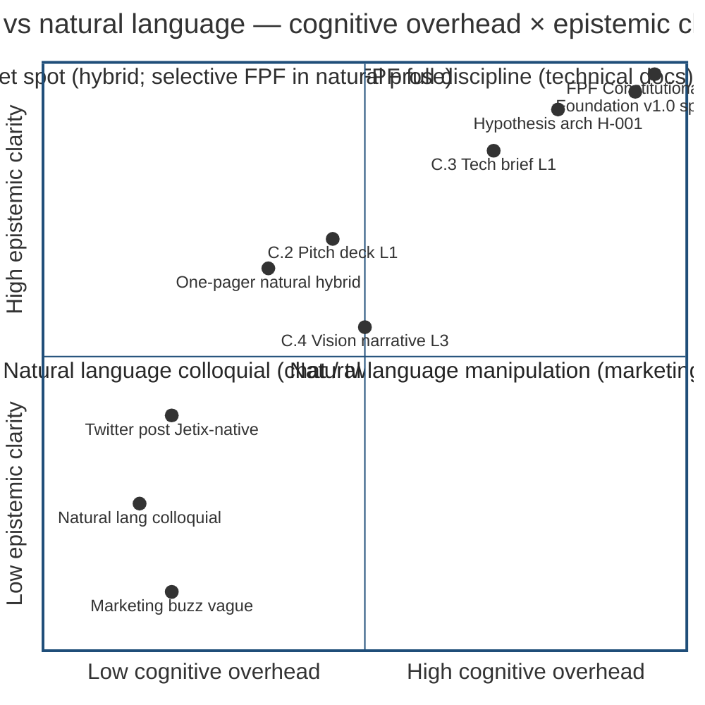
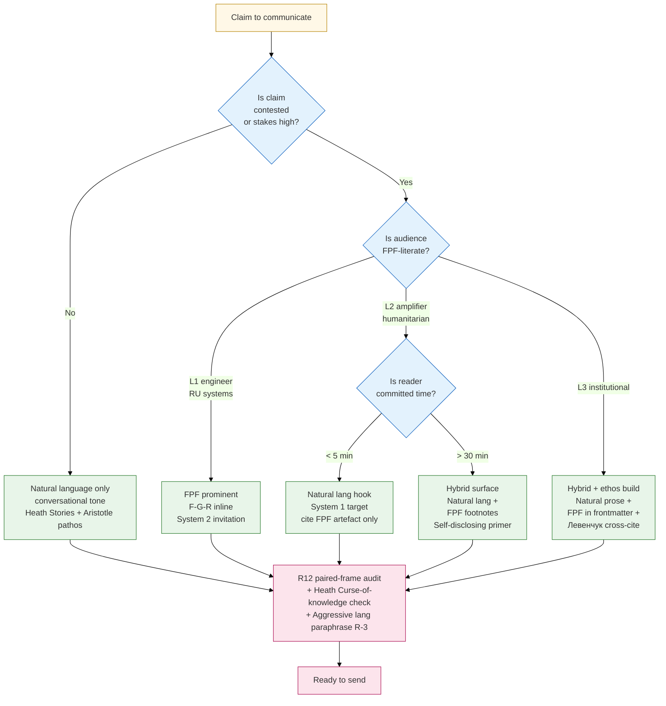
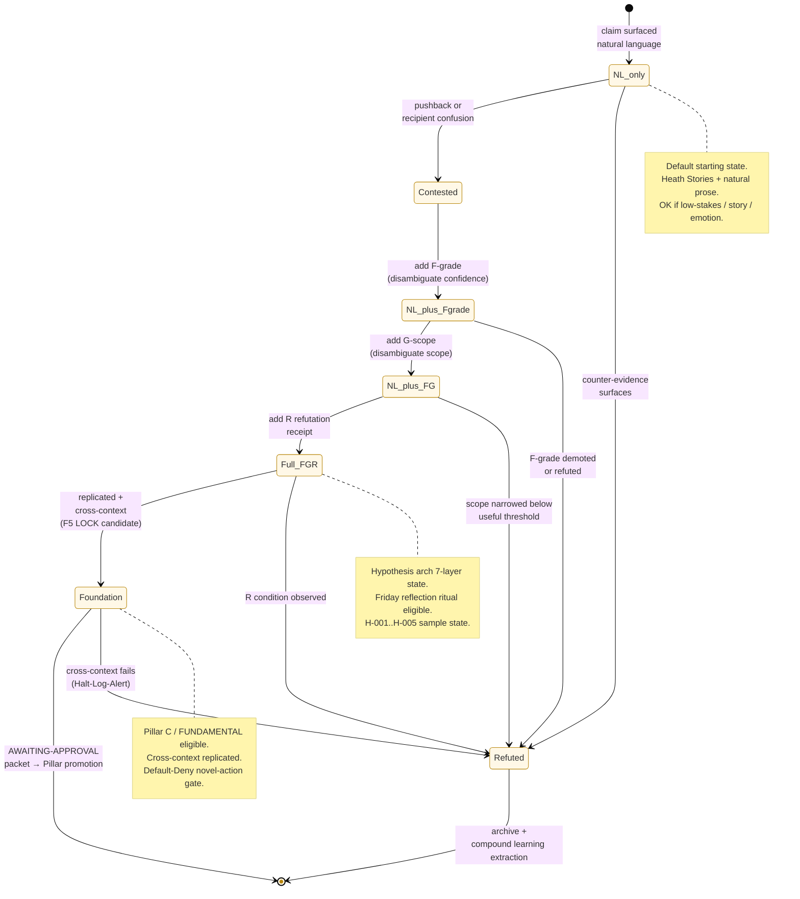

# Phase 3 — FPF vs natural language analysis

> **Object:** Compare FPF (Formality/Group/Reliability triple — Jetix universal language [src: design/JETIX-FPF.md 3758 lines]) с natural language (English / Russian unannotated prose) on cognitive overhead × epistemic clarity. Recommend hybrid approach + state universal-language thesis falsifiability conditions.

---

## §0 Intro — что есть FPF и почему comparison matters

**FPF (Foundational-Performance-Framework / Formal-Provenance-Framework)** — Jetix Constitutional Spec; 3758 lines; IP-1/IP-2/IP-3/IP-7 + A.6.B + A.14 + B.3 + Janus duality + Constructor-Theory cut + Rule B graph-of-creation recursion closure [src: CLAUDE.md `### Constitutional documents`].

Critical for communication best-practices: **Ruslan voice 21.05** voiced thesis «колоссальную идею донести любому человеку за 30-60 min» с FPF as universal language [src: ONE-PAGER §5; daily-logs/_EXPANDED-DOCS-PLAN-2026-05-21.md §1].

**The question Phase 3 addresses:** does adding FPF annotations (F-grade / G-scope / R-refutation receipts) to communication ADD signal или ADD noise (Shannon Phase 1)? Phase 3 measures both axes.

---

## §1 FPF strengths

### §1.1 Explicit F-G-R triple → epistemic clarity

Every claim carries:
- **F (Formality / F-grade)** — F0-F9 ladder; F2 = verbatim/observable; F3 = brigadier analysis; F4 = single-context confirmed; F5 = replicated cross-context (LOCK-eligible); F6-F8 = Foundation/Pillar/Constitutional levels [src: CLAUDE.md §4.1 + design/JETIX-FPF.md]
- **G (Group-scope / ClaimScope)** — universal / role-specific / context-specific; explicit scope where claim holds
- **R (Reliability / Refutation-Receipt)** — under what observable conditions claim refuted

**Strength:** recipient knows precisely how confident sender is; calibrated belief possible; falsifiability built-in (Popper-compatible) [src: Phase 1 §4 Aristotle logos + Phase 2 §5.4 Kahneman System 2 invitation].

### §1.2 F-grade ladder → gradated confidence

Claims that would be flattened к «true / false» in natural language can be parked at F2 (one-anecdote) vs F4 (single-context confirmed) vs F5+ (replicated). 

**Strength:** prevents premature LOCK; allows surface of weak claims without committing to them; AP-6 dissent preservation discipline operationalised [src: CLAUDE.md AP-6 references].

### §1.3 Group-scope → audience disambiguation

«это работает» natural → for whom? in what context? FPF G-scope says «this works for L1 engineers с Karpathy-lineage». 

**Strength:** prevents universal-overgeneralization (Heath «Curse of knowledge» antidote — explicit scope = anti-projection-of-self-experience).

### §1.4 Reliability tracking → calibrated belief

R-low / R-medium / R-high tracking + refutation receipts in frontmatter mean «I claim this, AND here's how I'll know I was wrong». 

**Strength:** Bayesian update discipline operationalised; long-running thread of claim/refutation across cycles possible (Hypothesis arch 7-layer leverages this) [src: hypotheses/docs/architecture-overview.md].

### §1.5 Substrate proof по Левенчук

Methodology 2025 Гл. 4 «метод как объект 1-го класса» + alpha-machinery for state tracking [src: research/levenchuk-books-distillation-2026-05-20/06-cross-link §2.10] = formal-method discipline; FPF F-G-R = Jetix specific instantiation того же класса дисциплины.

---

## §2 FPF weaknesses

### §2.1 Cognitive overhead для recipient

Recipient must learn syntax: что значит F4? как G отличается от R? Pinker «Sense of Style» (Phase 2 §7) warned: **nominalization-itis** and jargon raise cognitive load.

**Weakness:** L1 engineer (Karpathy lineage) may read «F4 / G-systems / R-refuted-if-X» as obstructive jargon; abandons before extracting value [src: EXPERTS-PACK §1 Q-ENG line «FPF jargon overhead for non-Jetix-native readers»].

### §2.2 Slower initial parsing

Per Kahneman (Phase 2 §5.3 cognitive ease): easy-to-process claims feel truer. FPF parsing requires System 2 activation. 

**Weakness:** cold reach / 30-sec elevator format → FPF dies; recipient never gets to value. Phase 6 time-budget matrix (forthcoming) shows: FPF requires ≥30 min recipient commitment.

### §2.3 Risk of «academic» perception

Heath «Concrete» principle (Phase 2 §1.2): sensory specifics > abstract. FPF triple = abstract framework; «F4 single-context confirmed» reads academically. Humanitarian audience + L2 amplifier (Telegram / video channels) primed to skim — academic frame = disengagement.

**Weakness:** non-technical contexts may read FPF as gatekeeping; «only Jetix-natives can engage» = barrier.

### §2.4 Curse of knowledge — author overestimates FPF literacy

Pinker / Heath / Newton-Stanford-tappers (Phase 2 §1.3): author has internalized FPF; can't simulate non-native reader experience. 

**Weakness:** Ruslan + brigadier-scribe write fluent FPF; recipient sees Greek; mismatch undetected without explicit reader feedback (Schramm interactive cycle Phase 1 §3.3).

### §2.5 Tooling immaturity outside Jetix

FPF spec lives в design/JETIX-FPF.md (3758 lines); no widely-published primer; no tutorial. Per Cialdini Authority (Phase 2 §6.2): authority via specialized framework requires prior credentials. Без primer, FPF cites = unsupported claim that there exists a framework.

---

## §3 Natural language strengths

### §3.1 Low cognitive overhead

Recipient reads as recipient always reads; no syntax to learn. Per Kahneman cognitive ease — feels truer. Per Pinker classic style — conversation between equals.

**Strength:** zero barrier-to-entry; emotional / identity / story all accessible immediately.

### §3.2 Story-friendly

Pixar 5-beat (Phase 2 §2.2) lands cleanly in natural language. Adding F-grade annotations to story beats would disrupt the arc; natural language preserves narrative flow.

**Strength:** vision narrative C.4 + humanitarian materials need story; natural lang wins here.

### §3.3 Emotional resonance accessible

Heath Emotional + Aristotle pathos rely on identity / values / hope language. FPF F-grade per-emotion claim absurd («F2-hope»); natural language preserves emotion.

**Strength:** O-86 Project-of-Humanity hook + O-75 pre-existing-partnership = natural language native.

### §3.4 System 1 directly engageable

Phase 2 §5.4: cold reach / busy / scanning → target System 1. Natural language designed for System 1; FPF requires System 2 activation.

**Strength:** first-30-seconds (TED Anderson Connection) = natural language native.

---

## §4 Natural language weaknesses

### §4.1 Ambiguity / equivocation

«Many engineers want this» — how many? «This usually works» — usually under what conditions? Natural language permits hedge / vagueness / unsupported assertion.

**Weakness:** Pillar C §4.1 rule 11 Default-Deny + R6 provenance disciplines demand precision; natural language defaults toward imprecision.

### §4.2 Confidence inflation

«FPF works» reads with implicit F5+ confidence; reality may be F2 anecdote. Natural language has no F-grade, so all claims sound equally confident.

**Weakness:** premature LOCK risk; recipient over-trusts weak claim. R-batch-9-N3 «timing-argument hubris» = exactly this failure mode (Ruslan voice naturally claimed «сейчас уже должны заниматься такие системы» implying singularity; HR-4 paraphrase reframes as F2-aspirational only) [src: ONE-PAGER §8.2].

### §4.3 Group-scope unclear

«AI engineers like X» — universal claim? OSS subset? Anthropic subset? Karpathy-lineage subset? Natural language defaults к universal-feeling claims that scope under audit к narrow.

**Weakness:** Heath «Curse of knowledge» × audience: author projects own context as universal. FPF G-scope explicit prevents.

### §4.4 Hard to track epistemic state

Across 100 documents + 1000 claims, how track which still hold / which refuted / which never tested? Natural language ≈ flat; FPF F-G-R = queryable substrate.

**Weakness:** Hypothesis arch 7-layer requires F-G-R discipline; natural language alone insufficient for long-running epistemic accounting.

---

## §5 Hybrid approach (recommended)

### §5.1 Layered annotation discipline

| Layer | Description | When |
|---|---|---|
| **Natural language surface** | Default prose; story / emotion / identity layer | All recipient audiences |
| **FPF annotations selective** | Footnotes / brackets where stakes high or claim contested | Contested claims / public commitments / horizon forecasts |
| **F-grade explicit** | Only for claims that могут confuse reader as F5+ when F2 | Forecasts (1M-EOY-2026) / public locks (take rate) |
| **Group-scope explicit** | Only when claim risk universal-overgeneralization | «For L1 engineers in Karpathy lineage, X works» |
| **R refutation receipts** | Optional inline; mandatory in frontmatter | Hypothesis-arch claims; pre-send checklist |

### §5.2 Audience-adaptive

| Audience | Hybrid balance |
|---|---|
| L1 engineer | FPF prominent (signals epistemic discipline; engineering tribe rewards it) |
| L2 amplifier | Natural language predominant; FPF only in cited materials (RU systems community may welcome) |
| L3 institutional | Natural language surface + FPF visible in footnotes (signals rigour) |
| Humanitarian | Natural language predominant; FPF stays in technical docs only |
| RU systems | Natural language с Левенчук terminology + FPF cross-cite (substrate proof) |

### §5.3 «Self-disclosing FPF» discipline

Per Cialdini Authority (§6.2): authority via demonstrated artefacts. **Recommendation:** when introducing FPF к recipient, do so naturally («I use a small discipline called Formality-Group-Reliability — F means how solid the claim is, G means where it applies, R means what would refute it») rather than dropping cryptic «F4 / G-systems / R-x» without primer.

### §5.4 Substrate ≠ pitch principle (per ONE-PAGER §8 + Distribution Plan §6)

- **Substrate** (internal): full FPF discipline; aggressive language verbatim preserved
- **Pitch** (external): natural language surface; FPF annotations selective; aggressive language paraphrased

Mirrors Pinker classic style + Heath Concrete + Schramm shared field discipline.

---

## §6 Universal-language thesis testing

### §6.1 Hypothesis (per Ruslan voice 21.05)

«FPF as universal language allows 30-60 min conveyance of colossal idea to any person» [src: ONE-PAGER §5; daily-logs/_EXPANDED-DOCS-PLAN-2026-05-21.md §1].

### §6.2 Falsifiability conditions

| Condition | Refuted if |
|---|---|
| **Comprehension** | < 70% of test cohort (n ≥ 5) recipients passes basic-comprehension quiz after 60 min |
| **Cross-audience** | FPF-natural hybrid works for L1 engineer + L3 institutional + humanitarian; if works for только 1 audience type → thesis narrowed, not universal |
| **Time-budget** | If 60 min insufficient (recipient needs ≥ 2 h) → thesis refuted; if 30 min sufficient → thesis confirmed |
| **Knowledge-transfer** | If recipient can re-articulate idea correctly to third party after 60 min → confirmed; if can't → refuted |

### §6.3 Test design

| # | Test | Audience | Time | Acceptance |
|---|---|---|---|---|
| T-1 | One-pager ≤600w + 30 min discussion | L1 engineer | 30 min | recipient can re-articulate O-107 hero sentence + 1 Левенчук cross-cite |
| T-2 | C.4 Vision narrative + 30 min discussion | L3 institutional | 60 min | recipient can name 3 of 5 ROY swarm lenses + cascade architecture |
| T-3 | Дмитрий-style pitch (humanitarian) + 30 min | Humanitarian | 45 min | recipient can name R12 anti-extraction + O-86 frame |
| T-4 | Левенчук-style pitch (RU systems) + 30 min | RU systems | 60 min | recipient can name 3 of 5 Левенчук hooks + jetix-as-exokortex wiki |
| T-5 | Mixed audience workshop format | All 5 audiences | 1 day | each subset passes own T-1..T-4 |

**Status:** Phase 2 A/B tests deferred per prompt §10 «NO A/B test launches — Phase 2 cascade post-Дмитрий/Левенчук»; test design surfaced for future R1 decision.

### §6.4 Bootstrap-test (this document)

This Method Deep-Description (predecessor) + DR-33 Communication Best-Practices (this) themselves test FPF: if Ruslan reads + acts coherently after ≤60 min skim → partial confirmation. Single-case (n=1; F2-anecdote); cannot scale-confirm yet.

---

## §7 ⭐ Diagram 3.1 — FPF vs natural language quadrant

**Diagram explainer:** quadrant chart positions communication artefacts on 2 axes. Sweet spot (Quadrant 2) = hybrid; one-pager + C.2 + C.4 live here. Pure FPF (Quadrant 1) = technical docs only; pure natural-language colloquial (Quadrant 3) = chat-tier; marketing buzz (Quadrant 4) = avoid.

---

## §8 ⭐ Diagram 3.2 — Hybrid approach flow

**Diagram explainer:** decision tree для hybrid approach. Question-1 = stakes; Question-2 = FPF literacy; Question-3 = time commitment. 5 terminal paths converge on R12 audit + curse-of-knowledge check before SEND.

---

## §9 ⭐ Diagram 3.3 — Claim escalation state machine

**Diagram explainer:** state machine for claim escalation natural → FPF full → Foundation. Claims start NL; escalate progressively when contested or stakes rise. Refuted = terminal но productive (compound learning extraction).

---

## §10 Operational handles

### §10.1 Per-claim decision matrix

| Claim type | Recommended FPF density |
|---|---|
| Vision / hope / identity | Natural language only |
| Foundational architectural | Full FPF (Foundation read-only) |
| Take rate / monetization | NL surface + F-grade inline + scope explicit |
| Levenchuk cross-cite | NL surface + R6 line-offset citation |
| Personal anecdote | Natural language only (F2-anecdote implicit) |
| Forecast / horizon | NL + explicit F-grade + R refutation receipt |
| Hypothesis | Full FPF (per Hypothesis arch discipline) |
| Story (Heath / Pixar) | Natural language only |

### §10.2 Pre-send checklist (FPF lens)

- ☐ Each contested claim: F-grade explicit или scope explicit?
- ☐ No F5+ claim asserted without LOCK?
- ☐ FPF primer present if recipient first-encounter?
- ☐ R refutation receipt for forecasts / public commitments?
- ☐ Natural language story-arc preserved (not interrupted by FPF)?
- ☐ Curse-of-knowledge check (Feynman explain-to-child applied)?

---

## §11 Closure

- ✅ FPF strengths/weaknesses enumerated (5 each)
- ✅ Natural language strengths/weaknesses enumerated (4 each)
- ✅ Hybrid approach recommended (layered annotation discipline + audience-adaptive + self-disclosing FPF + substrate≠pitch)
- ✅ Universal-language thesis falsifiability conditions stated (4 conditions; 5 test designs)
- ✅ 3 mermaid diagrams (quadrant + flowchart + state machine) — meets phase requirement
- ✅ Per-claim decision matrix + pre-send checklist (operational handles)
- ✅ R6 provenance preserved
- ✅ Constitutional posture preserved (R1 / IP-1 STRICT / EP-5 F2-F3 grade)
- ✅ Word count ~1700w
- ✅ Per prompt §4 commit: `[dr-33] Phase 3 FPF-vs-natural language`

---

*Phase 3 closure 2026-05-21 evening. Brigadier-scribe. Next: Phase 4 Audience-specific styling map.*
