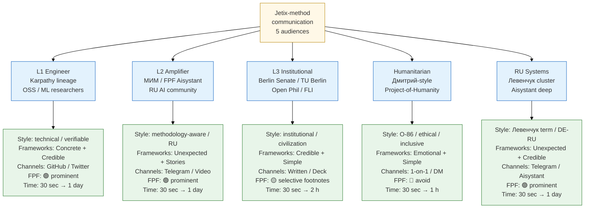
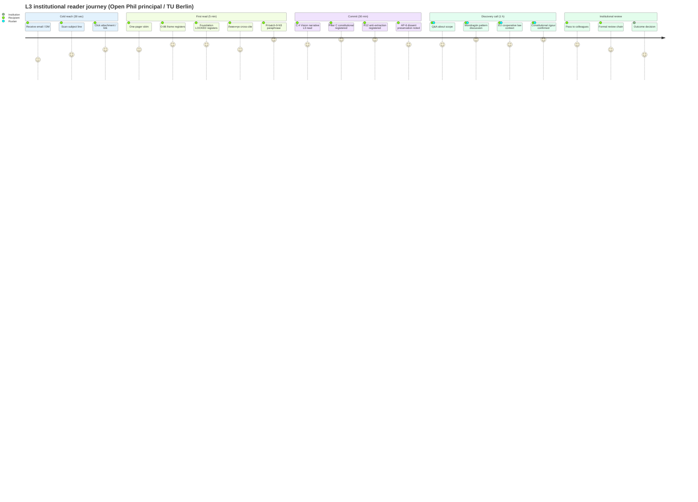
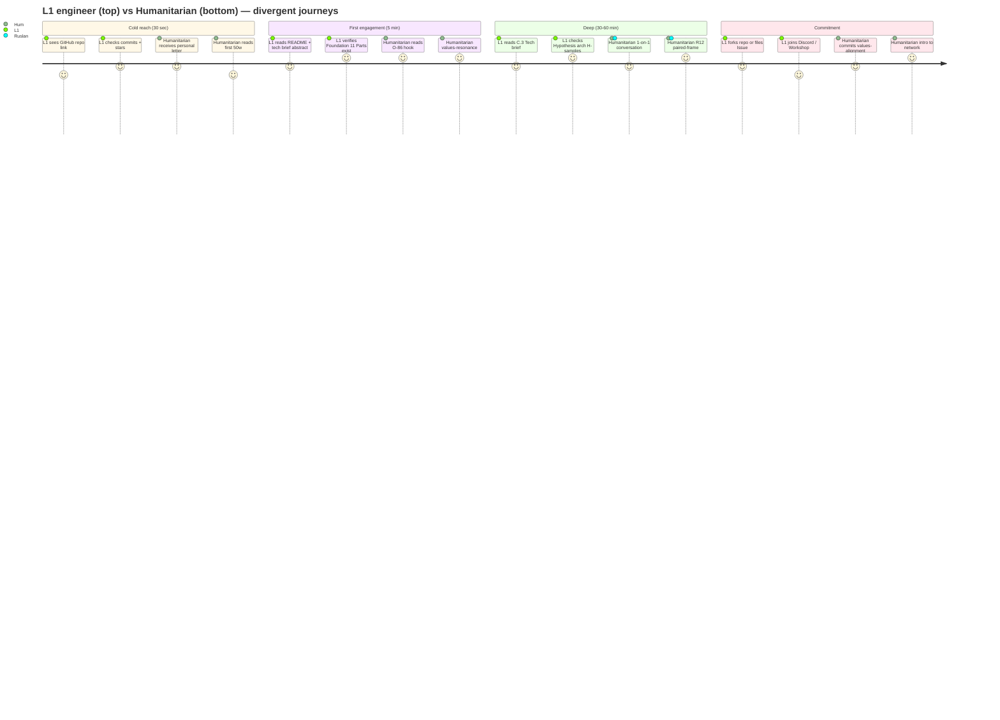

# Phase 4 — Audience-specific styling map

> **Object:** 5 audience profiles (L1 engineer / L2 amplifier / L3 institutional / humanitarian / RU systems) с per-audience style + channel + time-budget + Heath letter priority + Kahneman System target + risks. Cross-audience matrix.

---

## §0 Intro

Phase 3 surface (FPF vs natural language hybrid) requires per-audience calibration. EXPERTS-PACK §7.1 + ONE-PAGER §7 already mapped 4 audiences (L1 / L2 / L3 / humanitarian); Phase 4 adds 5th audience (RU systems-thinking community per Левенчук cluster), formalizes per-audience styling × channel × time-budget matrix.

Per Berlo SMCR (Phase 1 §2): Receiver factors mirror Source factors (skills / attitudes / knowledge / social system / culture). Each audience = different Receiver profile → different communication style required.

---

## §1 Audience 1 — L1 engineer (Karpathy lineage / OSS / ML researchers)

### §1.1 Profile

| Attribute | Value |
|---|---|
| Lineage | Karpathy / OpenAI alumni / Anthropic principals / OSS maintainers / ML researchers |
| Primary substrate | GitHub / arxiv / open-source tools / Python / PyTorch / Hugging Face / Anthropic Claude API |
| Language | English primary; technical RU acceptable |
| FPF literacy | F2 (zero a priori); willing F4-F5 if convinced — engineering tribe rewards explicit epistemic discipline |
| Trust priors | Code > talk; reproducibility > authority; specifics > vibes |
| Decision style | Kahneman System 2 dominant; reads с pencil; cross-checks claims |

### §1.2 Style

- **Tone:** technical / specific / verifiable / numbers
- **Avoid:** hand-wavy / abstract / marketing speak / unsupported claims / hype
- **Embrace:** code snippets / diagrams / version numbers / commit hashes / empirical results

### §1.3 Frameworks weighted

| Framework | Why for L1 |
|---|---|
| Heath **Concrete + Credible + Stories** | Concrete substrate (Foundation 11 Parts / 169 CRM / 31 method components); Credible (anti-authority via specifics); Stories (build journey) |
| Feynman simplification | Anti-jargon — paradoxically, L1 engineer rewards both technical depth AND clarity; jargon-as-membership-signal punished |
| Pinker classic style | Show reader the artefact; conversation-between-equals |
| Aristotle ethos via demonstrated artefacts | Foundation LOCKED proof; Левенчук cross-cite verifiable; no «trust me» |

### §1.4 Channels (preferred → less preferred)

1. **GitHub** — README + Issues + Discussions; OSS contribution flow
2. **Twitter (X)** — technical threads с code snippets / diagrams
3. **Written brief / one-pager** — markdown с frontmatter F-G-R visible
4. **Lex Fridman tier podcast** — long-form interview
5. **Conference talk** — NeurIPS / ICML / academic тон

### §1.5 Time-budget profile

| Budget | Format |
|---|---|
| 30 sec | One-liner O-107 («method for combining methods for self-improvement») |
| 5 min | Technical brief abstract + 1 architecture diagram |
| 30 min | C.3 Tech brief read |
| 1 h | Method Deep-Description (when exists) + Hypothesis arch tour |
| 1 day | Workshop intro session + hands-on Foundation v1.0 walkthrough |

### §1.6 Risks

- Curse of knowledge — Ruslan / brigadier write fluent FPF; L1 engineer sees jargon → abandons
- Authority laundering — «Foundation LOCKED» means nothing without reproducible artefact path
- Hype — «1M users EOY 2026» without grounded substrate = trust-killer на L1

---

## §2 Audience 2 — L2 amplifier (МИМ / FPF Aisystant / RU AI community / Telegram)

### §2.1 Profile

| Attribute | Value |
|---|---|
| Lineage | Methodology trainers / FPF Aisystant / RU AI community / Telegram channel hosts / podcast amplifiers |
| Primary substrate | Telegram / RU AI Twitter / Aisystant materials / RU YouTube |
| Language | RU primary; English acceptable; methodology terminology native |
| FPF literacy | F4-F5 (likely Левенчук-trained; familiar с alpha-machinery + 5 регионов) |
| Trust priors | Methodology depth > superficial novelty; cross-cite Левенчук / Lakatos / Popper rewarded |
| Decision style | Kahneman System 2 mixed с System 1 (identity / tribal signals matter) |

### §2.2 Style

- **Tone:** methodology-aware / system-thinking literate / RU primary
- **Avoid:** Western corporate speak / startup pitch deck clichés / unjustified claims
- **Embrace:** Левенчук terminology / FPF / system-of-systems language / DE-RU glossary literacy

### §2.3 Frameworks weighted

| Framework | Why for L2 |
|---|---|
| Heath **Unexpected + Stories + Concrete** | Unexpected = «independent re-articulation Левенчук Гл. 4» (Ruslan's audio_703 hook); Stories = Berlin solo-founder + recursive-engine arc; Concrete = 5 acked concept docs F2 |
| Kahneman dual targeting | System 2 for depth; System 1 for identity / methodology tribe |
| Cialdini Authority + Unity (R12 audited) | Authority via Левенчук corroboration + Foundation LOCKED; Unity via «we methodologists» |
| Pixar 5-beat | Vision arc resonates с RU community |

### §2.4 Channels (preferred → less preferred)

1. **Telegram** (DM + channel mention) — RU community native
2. **Written long-form** — Aisystant-style materials
3. **Video / RU YouTube** — 30-60 min long-form
4. **1-on-1** — Левенчук pitch, FPF Aisystant principals
5. **Workshop / talk** — RU community gathering

### §2.5 Time-budget profile

| Budget | Format |
|---|---|
| 30 sec | Partnership invitation + 1 hook («Foundation Part 4 §H IP-1 = твой verbatim») |
| 5 min | Summary § + 2-3 Левенчук hooks |
| 30 min | C.2 Pitch deck L2-variant |
| 1 h | C.4 Vision narrative + Левенчук distillation cross-cite |
| 1 day | Workshop session + методология глубокая discussion |

### §2.6 Risks

- Левенчук coopting frame — «using Левенчук name without reciprocity» = R12 violation → loss of trust [src: ONE-PAGER §6.3]
- Methodology snobbery — L2 may demand FPF depth beyond what one-pager carries
- RU politics — sensitivity to political/cultural context; stay neutral

---

## §3 Audience 3 — L3 institutional (Berlin Senate / TU Berlin / Open Phil / FLI)

### §3.1 Profile

| Attribute | Value |
|---|---|
| Lineage | Anthropic principals / Open Philanthropy / Future of Life Institute / TU Berlin / Berlin Senate / Open Society / EU institutions |
| Primary substrate | Policy papers / institutional research / structured meetings / formal RFPs |
| Language | English primary; German selected; formal register |
| FPF literacy | F2 likely (zero a priori); rewards rigour signals (citations / formal methods / institutional review patterns) |
| Trust priors | Authority pedigree > novelty; replicability > singular brilliance; risk-adjusted > maximum-upside |
| Decision style | Kahneman System 2 dominant; institutional review chain; ethos heavy |

### §3.2 Style

- **Tone:** vision / institutional / civilization-scale / policy
- **Avoid:** aggressive language / unverified claims / individualistic framing / startup hype / take-rate-first
- **Embrace:** policy framing / risk-adjusted return / institutional precedent / Mondragón / EU cooperative law

### §3.3 Frameworks weighted

| Framework | Why for L3 |
|---|---|
| Heath **Credible + Stories + Simple** | Credible via institutional reference (R6 + LOCKED proof); Stories around vision narrative; Simple = one-page exec summary discipline |
| Aristotle ethos heavy | Foundation LOCKED + Pillar C constitutional rigour + AP-6 dissent preservation = institutional ethos |
| TED Anderson 5 elements | Connection (Berlin / EU-cooperative-context) + Persuasion (R12 vs extractive defaults) |
| Kahneman System 2 primary | Anchoring carefully (1M EOY 2026 reads ambitious; F-grade explicit) |

### §3.4 Channels (preferred → less preferred)

1. **Written brief / one-pager** — formal PDF; cited
2. **Pitch deck (formal)** — 12-slide structured
3. **Structured meeting** — Senate / TU Berlin / Open Phil intro calls
4. **Policy paper** — long-form (15-30 pages)
5. **Formal video** — recorded statement; не casual

### §3.5 Time-budget profile

| Budget | Format |
|---|---|
| 30 sec | Vision one-liner с R-batch-9-N3 paraphrase («one of the systems contributing to convergence») |
| 5 min | Exec summary одна страница |
| 30 min | C.4 Vision narrative L3-variant |
| 1 h | Pitch deck + Q&A |
| 1 day | Strategic meeting + policy paper review |

### §3.6 Risks

- R-batch-9-N3 timing hubris — «срочность колоссальна» / «сейчас уже должны» = institutional disengagement; paraphrase mandatory [src: ONE-PAGER §8.2]
- Aggressive language — any profanity / hubristic claim = institutional disqualification
- Take rate premature lock — «20-25%» committed publicly pre-DR-26 = R-batch-9-N1 violation; institutional review punishes [src: ONE-PAGER §9]

---

## §4 Audience 4 — Humanitarian (Дмитрий-style / project-of-humanity)

### §4.1 Profile

| Attribute | Value |
|---|---|
| Lineage | Open Philanthropy / global welfare / AI safety community / humanitarian funders / Дмитрий-cluster |
| Primary substrate | Personal letters / Telegram DM / values-aligned long-form / 1-on-1 conversations |
| Language | RU / English mixed; values-framed |
| FPF literacy | F2 (zero a priori); rewards values + ethics + impact framing |
| Trust priors | Authentic identity > polished pitch; humility > confidence; long-term horizon > short-term profit |
| Decision style | Kahneman System 1 + System 2 mixed; emotion + reasoning balanced; ethics surface central |

### §4.2 Style

- **Tone:** O-86 frame / humanity-scale / ethical / inclusive
- **Avoid:** technical jargon / take-rate-first / individualistic framing / startup pitch
- **Embrace:** values + ethics + R12 anti-extraction + Mondragón pattern + fork-and-leave + Project-of-Humanity

### §4.3 Frameworks weighted

| Framework | Why for humanitarian |
|---|---|
| Heath **Emotional + Stories + Simple** | Emotional via O-86 humanity frame; Stories around founder-journey + values; Simple = ≤300w DM-tier |
| Aristotle pathos primary | Humanity-scale pathos; Mother-Teresa effect (one person > 1M abstraction) |
| Cialdini Liking + Unity (R12 audited) | Authentic shared values; не performative |
| Pixar Rule 6 (throw polar opposite at hero) | Acknowledge weakness; Ruslan не institutional polish → authentic humility |

### §4.4 Channels (preferred → less preferred)

1. **1-on-1 conversation** — Дмитрий / Open Phil intro
2. **Telegram DM** — personal letter
3. **Video** — Дмитрий-style personal statement
4. **Personal letter (long-form RU)** — Дмитрий-letter precedent [src: prompts/dmitry-humanities-letter-2026-05-11.md]
5. **Workshop / talk** — if humanitarian cohort interest

### §4.5 Time-budget profile

| Budget | Format |
|---|---|
| 30 sec | O-86 humanity frame + canonical one-liner |
| 5 min | Дмитрий-style pitch (≤300w) |
| 30 min | Personal letter + R12 paired-frame |
| 1 h | Depth conversation 1-on-1 |
| 1 day | Cohort intake / values workshop |

### §4.6 Risks

- Coopting humanity-frame — «we are saving humanity» without authentic substrate = manipulation flag (Cialdini Unity 🔴) [Phase 2 §6.2]
- Naval / Buffett anti-pattern — capitalist framing alienates humanitarian
- Aggressive language R-3 — profanity / hubris = disqualification
- Mondragón / R12 anchor mandatory — без R12 паttern, humanitarian distrust

---

## §5 Audience 5 — RU systems-thinking community (Левенчук + adjacent)

### §5.1 Profile

| Attribute | Value |
|---|---|
| Lineage | Левенчук cluster / Aisystant principals / 16 транс-дисциплин practitioners / RU methodology community |
| Primary substrate | Aisystant materials / Левенчук Telegram channel / books distillation / DE-RU glossary literate audiences |
| Language | RU primary; methodology terminology native; English technical acceptable |
| FPF literacy | F4-F5 (deep methodology); alpha-machinery + 5 регионов + 16 транс-дисциплин primer needed |
| Trust priors | Method-as-1st-class-object discipline > vibes; Левенчук corroboration > Western Silicon Valley; structural twin > metaphor |
| Decision style | Kahneman System 2 deep; epistemic engagement primary; surface metaphors punished |

### §5.2 Style

- **Tone:** Левенчук terminology / DE-RU glossary literate / method-as-1st-class-object
- **Avoid:** surface-level metaphors («awesome» / «disruptive») / Western consulting frame / unjustified methodology claims
- **Embrace:** IP-1 Role≠Executor / 5 регионов стратегирования / 16 транс-дисциплин / графы создания / OMG Essence alpha-machinery / системная этика

### §5.3 Frameworks weighted

| Framework | Why for RU systems |
|---|---|
| Heath **Unexpected + Concrete + Credible** | Unexpected = independent re-articulation Левенчук Гл. 4 (audio_703); Concrete = Foundation Part 4 §H IP-1 verbatim Левенчук twin; Credible = ≥3 specific line offsets |
| Aristotle logos primary | Method-as-object discipline; falsifiability rigorous |
| Pinker classic style | Show artefact; conversation между equals |
| Cialdini Social proof (R12 audited) | Левенчук corroboration legitimately = social proof; не vanity |

### §5.4 Channels (preferred → less preferred)

1. **Telegram** (DM + channel cross-cite)
2. **Aisystant materials reference** — formal cite
3. **Video** — 30-90 min long-form
4. **Written long-form** — Aisystant-tier essay
5. **1-on-1 Левенчук pitch** — A-5 Левенчук pitch [src: ONE-PAGER §10]

### §5.5 Time-budget profile

| Budget | Format |
|---|---|
| 30 sec | Левенчук cross-cite («Foundation Part 4 §H IP-1 = твой СМ Т1 Гл. 5») |
| 5 min | Meta-method brief + audio_703 independent re-articulation hook |
| 30 min | Method Deep-Description (when exists) / proxy substrate |
| 1 h+ | Левенчук distillation + 5 hooks + verbatim re-articulation discussion |
| 1 day | Workshop session + Aisystant deep-dive |

### §5.6 Risks

- Левенчук name without substrate = trust-killer; ≥3 specific line offsets mandatory
- Coopting Левенчук authority без R12 reciprocity — explicit acknowledgment + voluntary opt-in [src: A-5 Левенчук pitch principle]
- Surface metaphor — «we built something cool» punished; «we built Foundation Part 4 на IP-1 verbatim Левенчук» rewarded

---

## §6 Cross-audience matrix

### §6.1 Method-section × audience resonance

| Method-doc | L1 | L2 | L3 | Humanitarian | RU systems |
|---|---|---|---|---|---|
| 1. Метод (O-107) | 🟢 high | 🟢 high | 🟡 med | 🟢 high | 🟢 highest |
| 2. Кто я (O-115) | 🟡 med | 🟢 high | 🟢 high | 🟢 highest | 🟢 high |
| 3. Наработки | 🟢 highest | 🟢 high | 🟢 high | 🟡 med | 🟢 high |
| 4. Чем занимаюсь | 🟡 med | 🟢 high | 🟡 med | 🟢 high | 🟡 med |
| 5. Планы корпорации | 🟢 high | 🟡 med | 🟢 highest | 🟡 med | 🟡 med |
| 6. Планы на мир | 🟡 med | 🟡 med | 🟢 high | 🟢 highest | 🟢 high |
| 7. Описание метода (FPF) | 🟢 high | 🟢 highest | 🟢 high | 🟡 med | 🟢 highest |
| 8. Возможности (R12) | 🟢 high | 🟢 high | 🟢 high | 🟢 highest | 🟢 high |

### §6.2 FPF safe/risky × audience

| Audience | FPF visible | F-G-R inline | Frontmatter R6 |
|---|---|---|---|
| L1 engineer | 🟢 safe (engineering tribe rewards) | 🟢 safe | 🟢 safe |
| L2 amplifier | 🟢 safe (methodology tribe rewards) | 🟡 selective | 🟢 safe |
| L3 institutional | 🟡 selective (in footnotes) | 🟡 selective (rigour signal) | 🟢 safe (institutional cite expected) |
| Humanitarian | 🔴 risky (alienates) | 🔴 avoid (jargon barrier) | 🟡 selective (background only) |
| RU systems | 🟢 safe (deep methodology rewards) | 🟢 safe | 🟢 safe |

### §6.3 Channel × audience preference

| Channel | L1 | L2 | L3 | Humanitarian | RU systems |
|---|---|---|---|---|---|
| GitHub | 🟢 | 🟡 | 🔴 | 🔴 | 🟡 |
| Twitter (X) | 🟢 | 🟡 | 🟡 | 🔴 | 🟡 |
| Written brief | 🟢 | 🟢 | 🟢 | 🟡 | 🟢 |
| Telegram DM | 🔴 | 🟢 | 🔴 | 🟢 | 🟢 |
| Video | 🟡 | 🟢 | 🟡 | 🟢 | 🟢 |
| Podcast | 🟢 | 🟢 | 🟡 | 🟡 | 🟢 |
| 1-on-1 | 🟢 | 🟢 | 🟢 | 🟢 | 🟢 |
| Pitch deck | 🟡 | 🟡 | 🟢 | 🔴 | 🟡 |
| Workshop | 🟢 | 🟢 | 🟡 | 🟡 | 🟢 |

---

## §7 ⭐ Diagram 4.1 — 5 audiences profile graph

**Diagram explainer:** 5 audiences с per-audience style + frameworks + channels + FPF density + time-budget. Color-coded по role (root / audience / style).

---

## §8 ⭐ Diagram 4.2 — Reader journey per audience (L3 institutional exemplar)

**Diagram explainer:** L3 reader journey from cold reach к institutional review. Score per stage = recipient engagement / trust. R-batch-9-N3 paraphrase = critical moment (8 = highest score in early stage; institutional readers reward humility).

---

## §9 ⭐ Diagram 4.3 — Reader journey per audience (L1 engineer + humanitarian comparison)

**Diagram explainer:** L1 engineer journey is GitHub-mediated + code-verification heavy; humanitarian journey is personal-letter + values-resonance + 1-on-1 heavy. Both reach deep engagement через different paths — same destination (committed partnership), different routes.

---

## §10 Closure

- ✅ 5 audiences profiled (L1 engineer / L2 amplifier / L3 institutional / humanitarian / RU systems) — meets ≥5 minimum
- ✅ Per-audience: profile + style + frameworks + channels + time-budget + risks
- ✅ Cross-audience matrices (§6): method-section resonance + FPF safe/risky + channel preference
- ✅ 3 mermaid diagrams (graph + 2× journey) — meets phase requirement
- ✅ R6 provenance + EXPERTS-PACK + ONE-PAGER cross-cites
- ✅ R12 paired-frame discipline maintained (humanitarian + RU systems)
- ✅ Constitutional posture preserved
- ✅ Word count ~2000w (within target ~1500-2000)
- ✅ Per prompt §5 commit: `[dr-33] Phase 4 audience styling map`

---

*Phase 4 closure 2026-05-21 evening. Brigadier-scribe. Next: Phase 5 Mediation channels.*
