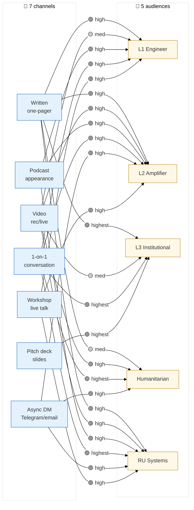
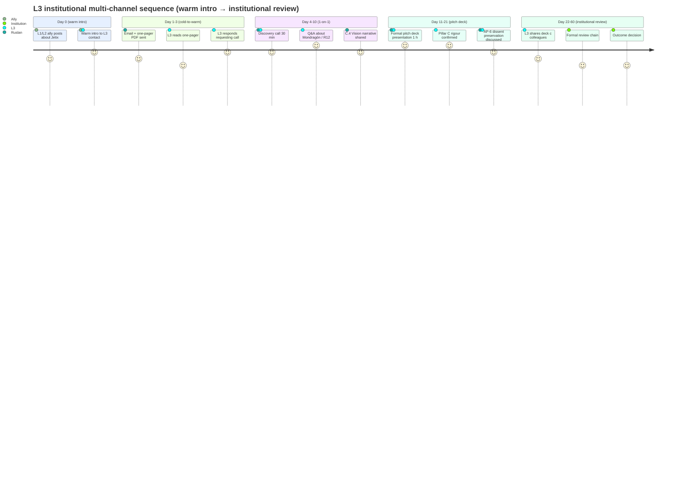

# Phase 5 — Mediation channels

> **Object:** 7 channels (written one-pager / video / podcast / 1-on-1 / async DM / pitch deck / workshop) с pros + cons + audience fit + multi-channel sequence design.

---

## §0 Intro

Channel selection drives signal-to-noise ratio (Shannon Phase 1 §1.2) + audience reach × depth tradeoff. Per Lasswell formula Phase 1 §4 «in which channel» = 3rd of 5 communication research dimensions. Phase 5 enumerates 7 channels relevant к Jetix outreach + maps to 5 audiences (Phase 4) + sequences multi-channel touch patterns.

---

## §1 Channel 1 — Written one-pager / brief

### §1.1 Properties

- **Bandwidth (Shannon):** medium-low; ~600-800 words shareable density
- **Latency:** zero (async); recipient reads on own schedule
- **Production cost:** medium (1-3 days drafting + Ruslan R1 prose authoring)

### §1.2 Pros

- Scannable / shareable / async
- Sender retains framing control (recipient reads exactly authored words)
- Archivable; persists; cross-cite-able
- Asynchronous = no scheduling overhead

### §1.3 Cons

- Requires recipient read commitment (cold reach attrition high)
- Passive; no back-and-forth feedback (Schramm interactive cycle absent)
- Risk of being filed-away-then-forgotten

### §1.4 Audience fit

| Audience | Fit |
|---|---|
| L1 engineer | 🟢 high (one-pager as GitHub README; PDF attachment to issue) |
| L2 amplifier | 🟢 high (shareable in Telegram channels) |
| L3 institutional | 🟢 highest (formal PDF; cited; cross-referenced) |
| Humanitarian | 🟡 medium (one-pager less personal; warmer formats preferred) |
| RU systems | 🟢 high (Aisystant-tier материал; cited) |

### §1.5 Best for

L1 engineer cohort recruiting (C.3 Tech brief attachment) + L3 institutional formal intro + archival.

---

## §2 Channel 2 — Video (recorded / live)

### §2.1 Properties

- **Bandwidth:** high (visual + audio + body language + emotion)
- **Latency:** recorded = zero; live = synchronous
- **Production cost:** high (lighting / audio / editing если рекордед)

### §2.2 Pros

- Emotional resonance (Heath Emotional + Aristotle pathos)
- Personality conveyance (Cialdini Liking; Aristotle ethos)
- Time-flexible (recorded shareable async)
- Body language adds bandwidth beyond text

### §2.3 Cons

- Production overhead high (Berlin solo setup; quality variance)
- Less searchable (transcript needed для indexing)
- Editing curates message (recipient sees Ruslan's edited version, не unfiltered)

### §2.4 Audience fit

| Audience | Fit |
|---|---|
| L1 engineer | 🟡 medium (engineering tribe ambivalent on video; Karpathy YouTube precedent positive) |
| L2 amplifier | 🟢 high (RU video / YouTube culturally native) |
| L3 institutional | 🟡 medium (formal video OK; casual video risky) |
| Humanitarian | 🟢 high (personality + emotion = humanitarian win) |
| RU systems | 🟢 high (Aisystant видео tradition) |

### §2.5 Best for

L2 amplifier + humanitarian + RU systems community.

---

## §3 Channel 3 — Podcast appearance

### §3.1 Properties

- **Bandwidth:** high (long-form audio); audience pre-built (host's audience)
- **Latency:** record async; release schedule depends on host
- **Production cost:** low for guest (high for host)

### §3.2 Pros

- Long-form (30 min - 2 h); deep substrate possible
- Conversational; less curated than recorded video monologue
- Audience pre-built (host's followers credibility-laundered)
- Cialdini Authority (via host endorsement)

### §3.3 Cons

- Dependent on host (host owns framing / pace / questions)
- Public scrutiny (recorded; permanent; misstatements live forever)
- Wait for invite; не send-on-demand
- Requires audience overlap (host's audience must include Jetix's target)

### §3.4 Audience fit

| Audience | Fit |
|---|---|
| L1 engineer | 🟢 high (Lex Fridman tier — technical + long-form) |
| L2 amplifier | 🟢 high (RU AI Telegram channel hosts) |
| L3 institutional | 🟡 medium (formal podcast OK; casual может dilute) |
| Humanitarian | 🟡 medium (long-form OK; finding right host) |
| RU systems | 🟢 high (Левенчук-adjacent podcast hosts) |

### §3.5 Best for

L1 engineer (Lex Fridman / Dwarkesh / Karpathy adjacent) + L2 amplifier (RU AI hosts).

---

## §4 Channel 4 — 1-on-1 conversation

### §4.1 Properties

- **Bandwidth:** highest (full sensory + interactive)
- **Latency:** synchronous (real-time)
- **Production cost:** time-cost only (no setup); but doesn't scale

### §4.2 Pros

- Highest fidelity (Schramm interactive cycle native)
- Iterative (claims tested + refined in real-time)
- R12 paired-frame trivially achievable (mutual sense-making)
- Cialdini Liking native (rapport real)

### §4.3 Cons

- Doesn't scale (1 sender × 1 receiver per session)
- Time-cost high (per Ruslan)
- Single recipient (no broadcast; no amplification per session)

### §4.4 Audience fit

| Audience | Fit |
|---|---|
| L1 engineer | 🟢 high (Workshop intro / GitHub Issue discussion → call) |
| L2 amplifier | 🟢 high (Telegram → call invitation) |
| L3 institutional | 🟢 highest (formal intro meeting; partner discovery) |
| Humanitarian | 🟢 highest (Дмитрий 1-on-1 = natural humanitarian channel) |
| RU systems | 🟢 highest (Левенчук pitch = 1-on-1 ideal) |

### §4.5 Best for

First-cohort partner discovery + Дмитрий / Левенчук pitch + high-stake decisions.

---

## §5 Channel 5 — Async DM (Telegram / email)

### §5.1 Properties

- **Bandwidth:** medium (text + maybe attachment)
- **Latency:** async; minutes to days response window
- **Production cost:** low (per-message)

### §5.2 Pros

- Low pressure (recipient responds when ready)
- Preserves context (chat history searchable)
- Easy follow-up
- R12 paired-frame friendly (slow-thinking allowed)

### §5.3 Cons

- Easy to ignore (inbox flood)
- Risk of being missed (notification fatigue)
- Tone harder to convey (no body language)
- Async cadence may stall (no response = ambiguous)

### §5.4 Audience fit

| Audience | Fit |
|---|---|
| L1 engineer | 🔴 low (cold DM unwelcome; warm intro OK) |
| L2 amplifier | 🟢 high (Telegram native в RU community) |
| L3 institutional | 🔴 low (formal email better; DM too casual) |
| Humanitarian | 🟢 high (personal DM personable; Дмитрий precedent) |
| RU systems | 🟢 high (Telegram native; Левенчук cluster) |

### §5.5 Best for

Warm-touch initial + weekly cadence + follow-ups + Дмитрий / Левенчук cold-warm bridge.

---

## §6 Channel 6 — Slide deck / pitch deck

### §6.1 Properties

- **Bandwidth:** medium (visual + minimal text); ~12-slide standard
- **Latency:** async (PDF share) or synchronous (live present)
- **Production cost:** high (design + iteration; 8-12 h drafting per C.2 estimate)

### §6.2 Pros

- Visual structure (helps Kahneman System 2 anchoring)
- Compresses complex idea (Heath Simple discipline forced)
- Reusable across meetings
- Cialdini Authority via institutional precedent (deck = serious)

### §6.3 Cons

- Requires pitch context (deck без presenter = brittle; reader misses delivery)
- Linear consumption (slide-by-slide; no skim)
- Production overhead high (PowerPoint / Keynote / Figma)
- Risk of templating: SV-pitch-deck cliché alienates L3 institutional + humanitarian

### §6.4 Audience fit

| Audience | Fit |
|---|---|
| L1 engineer | 🟡 medium (slide deck OK; tech brief preferred) |
| L2 amplifier | 🟡 medium (deck OK; long-form preferred) |
| L3 institutional | 🟢 highest (formal pitch deck expected) |
| Humanitarian | 🔴 low (deck = startup pitch cliché; humanitarian alienated) |
| RU systems | 🟡 medium (deck с substance OK; Aisystant deep-dive preferred) |

### §6.5 Best for

L3 institutional formal meetings (Berlin Senate / TU Berlin / Open Phil intro).

---

## §7 Channel 7 — Workshop / talk (live presentation)

### §7.1 Properties

- **Bandwidth:** highest (visual + audio + interactive + Q&A)
- **Latency:** synchronous; event-driven
- **Production cost:** highest (prep + venue + audience build + event coordination)

### §7.2 Pros

- High engagement (audience self-selected; physically present)
- Q&A built-in (Schramm interactive)
- Community-building catalyst
- Cialdini Unity (shared experience creates identity)
- Workshop = Hackathon Platform Tier-1 instantiation [src: 5 acked concept docs F2 + Education Layer]

### §7.3 Cons

- Prep overhead high (slides + script + venue + invitations)
- One-shot (live event не replayable except recording)
- Audience size limited (physical venue capacity)
- Cost of failure high (bad workshop damages reputation more than bad blog post)

### §7.4 Audience fit

| Audience | Fit |
|---|---|
| L1 engineer | 🟢 high (Engineer Workshop BL-1; first-cohort intake) |
| L2 amplifier | 🟢 high (RU community workshop) |
| L3 institutional | 🟡 medium (institutional unlikely to attend workshop; better for cohort) |
| Humanitarian | 🟡 medium (humanitarian-flavored workshop possible) |
| RU systems | 🟢 high (Aisystant-style методология workshop) |

### §7.5 Best for

Engineer Workshop (BL-1 Q3 2026) + RU systems community gathering.

---

## §8 Multi-channel sequence design

### §8.1 Cold → warm → engaged sequence (per audience)

**L1 engineer (Karpathy lineage):**
1. Twitter (X) — technical thread caught attention
2. GitHub — repo browse + README
3. Written brief (C.3) — depth doc downloaded
4. 1-on-1 → Workshop invitation
5. Engineer Workshop (Q3 2026) — first cohort

**L2 amplifier (RU AI):**
1. Telegram channel — Jetix mention by amplifier
2. Telegram DM (warm intro)
3. Video (RU YouTube long-form)
4. 1-on-1 conversation
5. Aisystant-tier collaboration

**L3 institutional (Open Phil / Berlin Senate):**
1. Warm intro from L1/L2 ally
2. Formal email + one-pager PDF
3. Discovery call (1-on-1)
4. Pitch deck presentation
5. Institutional review chain

**Humanitarian (Дмитрий-cluster):**
1. Personal DM / letter (Telegram)
2. 1-on-1 conversation
3. Video (personal statement) optional
4. Cohort intake / values workshop

**RU systems (Левенчук cluster):**
1. Левенчук distillation cross-cite (Telegram)
2. 1-on-1 Левенчук pitch (A-5)
3. Aisystant-tier material exchange
4. Workshop / podcast appearance

### §8.2 Cadence guidance

Per Distribution Plan §0.4: daily 10-20 touches/day; weekly 55-85 touches; manager attention budget max 20 active tasks [src: CLAUDE.md §4.2].

---

## §9 ⭐ Diagram 5.1 — Channel × audience preference matrix

**Diagram explainer:** 7 channels × 5 audiences preference matrix as bipartite graph. Edge labels show fit grade (🟢 highest / high / 🟡 med / 🔴 low). 1-on-1 = universal highest; written one-pager = universally high; pitch deck = L3-only highest.

---

## §10 ⭐ Diagram 5.2 — Multi-channel sequence (L3 institutional example)

**Diagram explainer:** 60-day multi-channel sequence for L3 institutional outreach. Channels used (in order): warm intro (1-on-1 indirect) → email + one-pager → 1-on-1 discovery call → pitch deck → institutional review. Score per stage = engagement quality.

---

## §11 Closure

- ✅ 7 channels enumerated (written / video / podcast / 1-on-1 / async DM / pitch deck / workshop) — exceeds minimum
- ✅ Per-channel: properties + pros + cons + audience fit + best for
- ✅ Multi-channel sequence design per audience (5 sequences)
- ✅ 2 mermaid diagrams (graph + journey) — meets phase requirement
- ✅ R6 provenance preserved
- ✅ Constitutional posture preserved
- ✅ Word count ~1100w (within target)
- ✅ Per prompt §6 commit: `[dr-33] Phase 5 mediation channels`

---

*Phase 5 closure 2026-05-21 evening. Brigadier-scribe. Next: Phase 6 Time-budget optimization (25-cell matrix).*
