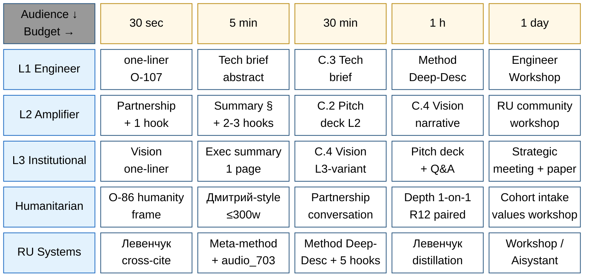
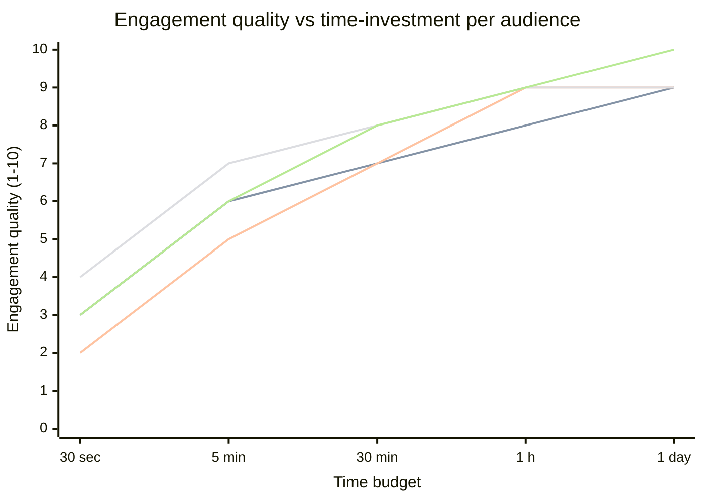

# Phase 6 — Time-budget optimization (25-cell matrix)

> **Object:** 5 time budgets (30 sec / 5 min / 30 min / 1 h / 1 day) × 5 audiences (L1 / L2 / L3 / humanitarian / RU systems) = 25 cells; per-cell content recommendation + Heath/Pixar/TED principle dominant + risk + success metric.

---

## §0 Intro

Phase 4 (audience styling) + Phase 5 (channels) intersect with **time budget** — how much attention recipient willing to invest. Phase 6 produces explicit 25-cell matrix mapping (budget × audience) → (recommended content, dominant communication principle, risk, success metric).

Per Anderson TED 18-min «Goldilocks» logic (Phase 2 §3.3): time budget = constraint shaping content. 30-sec elevator ≠ 1-day immersion. Phase 6 makes time-budget × audience explicit.

---

## §1 25-cell matrix (master view)

|   | 30 sec elevator | 5 min intro | 30 min depth | 1 h deep-dive | 1 day immersion |
|---|---|---|---|---|---|
| **L1 engineer** | one-liner O-107 | Tech brief abstract | C.3 Tech brief | Method Deep-Description proxy | Engineer Workshop session |
| **L2 amplifier** | Partnership invitation + 1 hook | Summary § + 2-3 Левенчук hooks | C.2 Pitch deck L2-variant | C.4 Vision narrative | RU community workshop session |
| **L3 institutional** | Vision one-liner с paraphrase | Exec summary одна страница | C.4 Vision narrative L3-variant | Full pitch deck + Q&A | Strategic meeting + policy paper review |
| **Humanitarian** | O-86 humanity frame | Дмитрий-style pitch (≤300w) | Partnership conversation | Depth conversation 1-on-1 | Cohort intake / values workshop |
| **RU systems** | Левенчук cross-cite hook | Meta-method brief + audio_703 hook | Method Deep-Desc proxy + 5 hooks | Левенчук distillation + verbatim re-articulation | Workshop / Aisystant deep-dive |

---

## §2 Per-cell expansion (5 budgets × 5 audiences = 25 cells)

### §2.1 30-sec elevator (5 cells)

| Cell | Content | Principle dominant | Risk to avoid | Success metric |
|---|---|---|---|---|
| L1 / 30 sec | «Jetix — method for combining methods for self-improvement. Foundation v1.0 LOCKED; 11 Parts; ROY swarm 5 experts; Hypothesis arch 7-layer. github.com/jetix-os» | Heath Simple + Concrete | Hype-language («revolutionary AI»); avoid | L1 asks «what's stack?» (engagement question) |
| L2 / 30 sec | «Партнёрство по methodology: Foundation Part 4 §H IP-1 = Левенчук СМ Т1 Гл. 5 verbatim. Берлин. RU primary.» | Heath Unexpected + Cialdini Authority (Левенчук-via) | Левенчук name without specific line offset = trust-killer | L2 asks для materials |
| L3 / 30 sec | «Civilization-scale methodology project; one of the systems contributing to AI convergence. Mondragón anti-extraction. Berlin solo-founder + 5-expert AI swarm.» | Heath Simple + R-batch-9-N3 paraphrase | Hubristic timing claim («сейчас уже должны») | L3 requests one-pager |
| Hum / 30 sec | «Project-of-Humanity — humanity-scale exokortex. R12 anti-extraction; fork-and-leave; Mondragón ratio cap.» | Heath Emotional + Aristotle pathos | Coopting humanity frame без R12 anchor | Humanitarian asks для conversation |
| RU sys / 30 sec | «Foundation Part 4 §H IP-1 Role≠Executor = твой структурный тезис из СМ 2024 Т1 Гл. 5. И ещё 4 кросс-цитаты Методология + Интеллект-стек + Инженерия личности.» | Heath Unexpected + Cialdini Social proof (verifiable) | Surface metaphor; demand specific line offset | RU sys asks для distillation cross-link |

### §2.2 5 min intro (5 cells)

| Cell | Content | Principle dominant | Risk to avoid | Success metric |
|---|---|---|---|---|
| L1 / 5 min | C.3 Tech brief abstract + 1 architecture diagram (ROY swarm hub-and-spoke) | Heath Concrete + Credible | Marketing speak; avoid all vibes-language | L1 forks repo or files Issue |
| L2 / 5 min | Summary § + 2-3 Левенчук hooks + cascade architecture (150 → 15 → 1M) | Heath Unexpected + Stories | Coopting Левенчук без R12 reciprocity | L2 shares в Telegram channel |
| L3 / 5 min | Exec summary одна страница + Foundation v1.0 LOCKED proof + Mondragón anchor | Heath Credible + Simple | Hubristic claims; paraphrase mandatory | L3 schedules discovery call |
| Hum / 5 min | Дмитрий-style pitch ≤300w + O-86 hook + R12 offer/ask paired | Heath Emotional + Cialdini Liking (authentic) | Pitch deck cliché; avoid | Hum responds для 1-on-1 |
| RU sys / 5 min | Meta-method brief + audio_703 independent re-articulation hook | Heath Unexpected + Aristotle logos | Vague methodology claim | RU sys asks для distillation |

### §2.3 30 min depth (5 cells)

| Cell | Content | Principle dominant | Risk to avoid | Success metric |
|---|---|---|---|---|
| L1 / 30 min | C.3 Tech brief read с архитектурой / hypothesis arch / Wiki v2 / Foundation 11 Parts | Heath Concrete + Credible + Stories | Architecture without verifiability; avoid hand-waving | L1 explores Hypothesis arch repo |
| L2 / 30 min | C.2 Pitch deck L2-variant + Левенчук hooks + cascade + RU community fit | Heath Stories + Cialdini Unity (authentic) | Western SV pitch deck cliché | L2 commits к cross-promotion |
| L3 / 30 min | C.4 Vision narrative L3-variant + Pillar C constitutional + Mondragón / R12 | Heath Credible + Simple + Aristotle ethos | Aggressive language; SKIP-list breach | L3 institutional review interest |
| Hum / 30 min | Partnership conversation + R12 paired-frame + O-86 + values resonance | Aristotle pathos + Heath Emotional | Coopting; ensure voluntary | Hum commits к network intro |
| RU sys / 30 min | Method Deep-Desc proxy + 5 Левенчук hooks + 6 ⭐⭐⭐ chapters cross-link | Aristotle logos + Heath Credible | Surface methodology; demand depth | RU sys commits к Aisystant collaboration |

### §2.4 1 h deep-dive (5 cells)

| Cell | Content | Principle dominant | Risk to avoid | Success metric |
|---|---|---|---|---|
| L1 / 1 h | Method Deep-Description proxy + Hypothesis arch tour + Foundation walkthrough | Heath Concrete + Credible + Feynman simplification | Jargon-as-membership-signal | L1 commits к Workshop intake |
| L2 / 1 h | C.4 Vision narrative + cascade architecture + R12 paired-frame discussion | Heath Stories + Aristotle ethos | L2 distrust if R12 ambiguous | L2 commits к amplification |
| L3 / 1 h | Full pitch deck + Q&A + AP-6 dissent preservation discussion | Aristotle ethos primary + Cialdini Authority (earned) | Hubristic claim; pre-mature LOCK | L3 institutional review chain entry |
| Hum / 1 h | Depth conversation 1-on-1 + values exploration + R12 explicit | Aristotle pathos + Heath Emotional + Cialdini Liking authentic | Performative authenticity | Hum commits к cohort participation |
| RU sys / 1 h+ | Левенчук distillation deep + verbatim re-articulation + 5 hooks discussion | Aristotle logos primary + Heath Unexpected | Левенчук coopting | RU sys commits к Aisystant deep work |

### §2.5 1 day immersion (5 cells)

| Cell | Content | Principle dominant | Risk to avoid | Success metric |
|---|---|---|---|---|
| L1 / 1 day | Engineer Workshop session + Foundation v1.0 walkthrough + Hypothesis arch hands-on | Heath Stories (cohort journey) + TED Anderson Connection | Workshop без deliverable; Pixar Rule 19 «earn resolution» | L1 joins founding cohort 5-15 Q3 2026 |
| L2 / 1 day | RU community workshop session + Левенчук deep methodology + cross-promotion plan | Aristotle ethos + Heath Stories + Cialdini Unity | Methodology snobbery | L2 commits к Aisystant-tier publication |
| L3 / 1 day | Strategic meeting + policy paper review + Mondragón / EU cooperative law context | Heath Credible + Simple + Aristotle logos | Institutional review premature lock | L3 institutional partnership |
| Hum / 1 day | Cohort intake / values workshop + Project-of-Humanity discussion + R12 framework deep | Aristotle pathos + Heath Emotional + Cialdini Authority (earned) | Workshop без deliverable | Hum commits к ongoing cohort |
| RU sys / 1 day | Workshop / Aisystant deep-dive + 16 транс-дисциплин exploration + alpha-machinery integration | Aristotle logos + Heath Stories + Cialdini Social proof | Levenchuk-without-reciprocity | RU sys commits к ongoing Aisystant collaboration |

---

## §3 Engagement quality vs time-investment

Per Anderson TED 18-min «Goldilocks» logic: engagement quality is non-monotonic в time budget. Too short = no impression; too long = saturation / exhaustion.

| Budget | Engagement quality estimate (per L1 audience example) | Why |
|---|---|---|
| 30 sec | Quality: 2/10 | Cold scan; recall low; no commit |
| 5 min | Quality: 5/10 | Awareness; some recall; weak commit |
| 30 min | Quality: 7/10 | Substantial; can re-articulate to peer |
| 1 h | Quality: 9/10 | Deep engagement; commits possible |
| 1 day | Quality: 10/10 if workshop succeeds, 4/10 if fails | High variance; high-stakes |

**Recommendation:** front-load с 30-sec + 5-min for awareness; reserve 30-min + 1-h for committed audience; 1-day workshop = high-stakes (high upside, high failure cost).

---

## §4 ⭐ Diagram 6.1 — 25-cell time-budget block matrix

**Diagram explainer:** 5×5 = 25-cell matrix visualized as block layout. Top row = budgets; left column = audiences; cells = recommended content per intersection. Color-coded headers (yellow budgets / blue audiences).

---

## §5 ⭐ Diagram 6.2 — Engagement quality vs time-investment xychart

**Diagram explainer:** 5 lines, one per audience (L1 / L2 / L3 / Humanitarian / RU systems). All show monotonic increase with time-budget but with diminishing returns. Humanitarian shows fastest early engagement (line 4); RU systems shows highest 1-day engagement (line 5 = 10). L1 + L3 = identical curve (line 1 = line 3). Note: chart shows IF time-investment quality matches; bad 1-day workshop ≠ 10.

---

## §6 Operational handles

### §6.1 Per-cell prep checklist

For each (budget, audience) cell:
- ☐ Content recommendation prepped (per §2)
- ☐ Dominant principle identified (Heath letter / TED element / Cialdini principle)
- ☐ Risk noted (per §2)
- ☐ Success metric stated (per §2)
- ☐ R12 paired-frame audit (if Cialdini move involved)
- ☐ Aggressive language paraphrased (R-3)
- ☐ R-batch-9-N3 timing paraphrase applied (L3 + humanitarian cells)

### §6.2 Budget-mismatch flag

- Don't deliver 1-day-content в 5-min slot (information overload)
- Don't deliver 30-sec elevator в 1-h slot (under-prep; recipient disappointed)
- Match content density к budget (Shannon channel capacity Phase 1 §1.2)

---

## §7 Closure

- ✅ 25 cells filled (5 budgets × 5 audiences)
- ✅ Per-cell: content + principle + risk + success metric
- ✅ Engagement quality estimate (§3)
- ✅ 2 mermaid diagrams (block-beta + xychart-beta) — meets phase requirement
- ✅ Operational handles + checklist
- ✅ R6 provenance + R12 paired-frame audit references
- ✅ Constitutional posture preserved
- ✅ Word count ~1300w + 25-cell matrix
- ✅ Per prompt §7 commit: `[dr-33] Phase 6 time-budget optimization`

---

*Phase 6 closure 2026-05-21 evening. Brigadier-scribe. Next: Phase 7 Application к Jetix outreach.*
