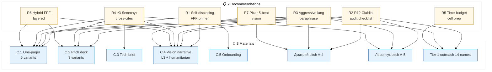
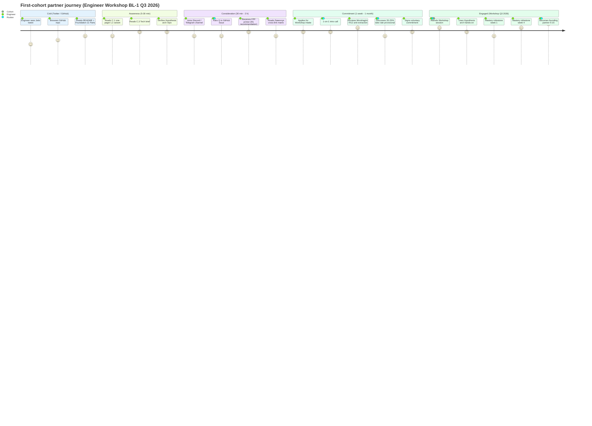

# Phase 7 — Application к Jetix outreach

> **Object:** Per-doc styling recommendations (C.1 one-pager / C.2 pitch deck / C.3 tech brief / C.4 vision narrative / C.5 onboarding / Дмитрий pitch / Левенчук pitch / Tier-1 outreach) + ≥5 specific recommendations in standardized format + recommendation memo (separate file) с 3-5 options для R1 ack.

---

## §0 Intro

Phase 1-6 = theory + frameworks + audience + channels + time-budget. Phase 7 = **application** к concrete Jetix outreach materials. Per prompt §8 mandate: ≥5 specific recommendations + recommendation memo для R1 ack.

**Constitutional posture:** brigadier surfaces options + recommendations; Ruslan R1 decides. No public lock; no auto-deploy. [per Pillar C §4.1 rule 1 + §4.2 A/B test discipline]

---

## §1 Per-doc styling recommendations

### §1.1 C.1 One-pager (3 variants L1/L2/L3 + humanitarian + RU systems)

| Aspect | Recommendation | Source/principle |
|---|---|---|
| Style | Hybrid (natural language + FPF selective annotations) | Phase 3 §5 hybrid approach |
| Length | 600-800w final | DISTRIBUTION-PLAN §1.1 + ONE-PAGER §10.7 |
| Heath dominant | Simple + Stories (universal); + Concrete (L1); + Emotional (humanitarian) | Phase 2 §1.4 |
| Channel | Written brief; shareable PDF / Markdown | Phase 5 §1.4 |
| Time-budget primary | 5 min skim + 30 min depth optional | Phase 6 §1 L1+L2+L3 row 5 min |
| Aggressive language | Paraphrase R-3 risk | ONE-PAGER §8 |
| O-107 anchor | First sentence Solution section | ONE-PAGER §4 |
| FPF mention | Explicit ≤50w (Slot §10.5) | ONE-PAGER §5 + §10.5 |
| Левенчук cross-cites | ≥3 mandatory | DISTRIBUTION-PLAN §1.1 |
| Variants | L1 / L2 / L3 / humanitarian / RU systems (5 variants) | EXPERTS-PACK §7.1 + Phase 4 |

### §1.2 C.2 Pitch deck v1 (3 audience variants L1/L3/humanitarian)

| Aspect | Recommendation | Source/principle |
|---|---|---|
| Structure | 12-slide TED-format inspired | DISTRIBUTION-PLAN §1 + K-2 §4 reference |
| Heath dominant | Concrete + Credible (L3 institutional emphasis); Concrete + Stories (L1 emphasis); Emotional + Stories (humanitarian) | Phase 2 §1.4 + Phase 4 §3.3+§4.3 |
| Visual | Minimal text per slide; ≥3 architecture diagrams (ROY swarm + Foundation 11 Parts + cascade) | Phase 2 §3.4 TED Explanation element |
| Channel | Pitch deck (synchronous present); PDF async fallback | Phase 5 §6.4 |
| Time-budget | 30-min skim + 1-h Q&A | Phase 6 §2.4 |
| Variants | L1 (engineering depth) / L3 (institutional formal) / Humanitarian (R12 + O-86 frame) | Phase 4 audience styling |
| FPF density | Selective footnotes per slide (L3); inline (L1); avoid (humanitarian) | Phase 3 §5.2 audience-adaptive |
| Take rate | Provisional language Option D (Mondragón-anchor) | ONE-PAGER §9.1 |

### §1.3 C.3 Technical brief (L1 engineer)

| Aspect | Recommendation | Source/principle |
|---|---|---|
| Focus | L1 engineer (Karpathy lineage / OSS / ML researchers) | Phase 4 §1 |
| FPF density | Prominent (signal epistemic discipline; engineering tribe rewards) | Phase 3 §5.2 |
| Length | 1500-2500w | DISTRIBUTION-PLAN §1 C.3 |
| Method Deep-Description cross-cite | Heavy (when exists; proxy substrate now) | Phase 0 §5 + §6 proxy substrate caveat |
| Heath dominant | Concrete + Credible | Phase 4 §1.3 |
| Channel | GitHub README + arxiv-style PDF | Phase 5 §1.4 + §1.5 |
| Code snippets | Include (Foundation 11 Parts inheritance / shared/schemas/ YAML / ROY routing-table.yaml) | Heath Concrete + Pinker classic style |
| Diagrams | ≥3 (ROY hub-and-spoke; Foundation Parts; Hypothesis arch 7-layer; Wiki v2 entities/edges) | Phase 2 §3.4 TED Explanation |
| Falsifiability | F-G-R per major claim; R refutation receipts explicit | Phase 3 §6.2 |

### §1.4 C.4 Vision narrative (L3 + humanitarian split versions)

| Aspect | Recommendation | Source/principle |
|---|---|---|
| L3 variant — Heath dominant | Credible + Simple (institutional ethos) | Phase 4 §3.3 |
| Humanitarian variant — Heath dominant | Emotional + Stories (Mother-Teresa effect; Pixar arc) | Phase 4 §4.3 |
| Length | 1000-1500w each variant | DISTRIBUTION-PLAN §1 C.4 |
| R-batch-9-N3 paraphrase | Timing-hubris mandatory paraphrase («one of the systems contributing to convergence») | ONE-PAGER §8.2 |
| O-86 hook | Primary (humanitarian variant); Secondary (L3 variant) | ONE-PAGER §3.2 |
| Story arc | Pixar 5-beat skeleton (Once upon a time / Every day / But one day / Because of that / Until finally) | Phase 2 §2.2 |
| FPF density | Selective footnotes (L3); avoid in humanitarian | Phase 3 §5.2 |
| Mondragón / R12 | Explicit (humanitarian variant primary; L3 variant institutional context) | Phase 4 §3.2+§4.2 |

### §1.5 C.5 Onboarding doc (first-cohort intake)

| Aspect | Recommendation | Source/principle |
|---|---|---|
| Focus | First-cohort 5-15 engineers (Q3 2026 Engineer Workshop BL-1) | DISTRIBUTION-PLAN §1 C.5 + Phase 4 §1 |
| Heath dominant | Simple + Concrete (day-by-day walkthrough) | Phase 2 §1.4 |
| Length | 2000-3000w | DISTRIBUTION-PLAN §1 C.5 |
| Day 1-30 walkthrough | Explicit per-day actions (per K-2 §4 + 5 acked concept docs / Education Layer / Hackathon Platform) | Heath Concrete + Pixar Rule 14 «why THIS story now» |
| Hypothesis arch hands-on | Include (cohort uses `/hypothesis-add` skill; sample H-001..H-005 walkthrough) | Hypothesis Architecture 7-layer canonical |
| Mastery milestones | Per-week milestones (week 1 / 2 / 4); Левенчук Гл. 1 mastery framework adapted | Levenchuk Инженерия личности Гл. 1 [src: research/levenchuk-books-distillation-2026-05-20/05-injeneriya-lichnosti-toc-highlights.md] |
| Mentor pairing | Explicit (per cohort member; 6-role taxonomy adapted; Mondragón-style anti-extraction) | Phase 2 §6 Cialdini R12-audited |
| FPF density | Selective (FPF primer day 1; F-G-R discipline introduced day 7) | Phase 3 §5.3 self-disclosing |

### §1.6 Дмитрий pitch (A-4)

| Aspect | Recommendation | Source/principle |
|---|---|---|
| Format | Telegram DM или короткий email | Phase 5 §4.4+§5.4 + DISTRIBUTION-PLAN §3 |
| Length | ≤300w | ONE-PAGER §10 + DISTRIBUTION-PLAN §1 |
| Audience | Humanitarian | Phase 4 §4 |
| Heath dominant | Emotional + Simple + Stories | Phase 4 §4.3 |
| O-86 frame | Primary | ONE-PAGER §3.2 |
| O-75 baseline | Secondary (pre-existing partnership framing) | ONE-PAGER §3.1 |
| R12 paired-frame | Mandatory (offer + ask + voluntary + fork-and-leave) | ONE-PAGER §6 + DISTRIBUTION-PLAN §6 |
| Aggressive language | Paraphrase / DELETE all profanity (R-3) | ONE-PAGER §8.1 |
| R12 8-item checklist | Pre-send mandatory | ONE-PAGER §6.4 |
| Cialdini audit | Liking (authentic) + Unity (O-86 humanity); Scarcity 🔴 avoid | Phase 2 §6.2 |

### §1.7 Левенчук pitch (A-5)

| Aspect | Recommendation | Source/principle |
|---|---|---|
| Format | Long-form letter или video script | Phase 5 §2+§3+§4 |
| Length | ~800-1000w | DISTRIBUTION-PLAN §3 |
| Audience | RU systems (Левенчук cluster) | Phase 4 §5 |
| Heath dominant | Unexpected + Credible + Concrete | Phase 4 §5.3 |
| audio_703 independent re-articulation hook | Primary (verbatim re-articulation Левенчук Методология Гл. 4) | research/levenchuk-books-distillation-2026-05-20/06-cross-link §2.1 |
| 5 Левенчук pitch hooks | All 5 integrated [src: ONE-PAGER §2 + cross-link matrix §4] | DISTRIBUTION-PLAN §3 |
| Substrate proof | Foundation v1.0 LOCKED + 5 acked concept docs + cross-link matrix 5 books × 8 sources | EXPERTS-PACK §4 |
| FPF density | Prominent (RU systems audience rewards) | Phase 3 §5.2 |
| Реcipрocity (Cialdini 🟢) | Genuine + R12 — Aisystant-tier collaboration offer if value-aligned | Phase 2 §6.2 + ONE-PAGER §6.2 |
| Aggressive language | Paraphrase R-3 | ONE-PAGER §8.1 |

### §1.8 Tier-1 outreach (14 names per KA-03)

| Aspect | Recommendation | Source/principle |
|---|---|---|
| Per-name channel preference | Research individual preference (GitHub vs Telegram vs Email) before outreach | Phase 5 + CRM 169 contacts data |
| Custom framing per audience tier | Apply Phase 4 audience styling map per individual classification | Phase 4 + EXPERTS-PACK §7.1 |
| Time-budget initial | 5-15 min initial outreach + 30-60 min follow-up | Phase 6 §2.2+§2.3 |
| Heath dominant per tier | Per Phase 4 audience styling | Phase 4 |
| R12 paired-frame | Mandatory all touches | ONE-PAGER §6 + DISTRIBUTION-PLAN §6 |
| Aggressive language | Universal paraphrase | ONE-PAGER §8.1 |
| Левенчук cross-cites | ≥3 per outreach material | DISTRIBUTION-PLAN §1.1 |
| Cadence | 10-20 touches/day; max 20 active tasks | CLAUDE.md §4.2 + DISTRIBUTION-PLAN §0.4 |

---

## §2 5+ specific recommendations (standardized format)

### §2.1 Recommendation R1 — Self-disclosing FPF primer

**Recommendation:** Introduce FPF naturally («I use a small discipline called Formality-Group-Reliability — F = how solid the claim is, G = where it applies, R = what would refute it») rather than dropping cryptic «F4 / G-systems / R-x» without primer.

**Source:** Phase 3 §5.3 + Pinker classic style + Heath Curse-of-knowledge.

**Application path:** All Jetix material к non-FPF-literate audiences (L3 institutional + humanitarian). Updates needed: one-pager §10.5 FPF mention slot; vision narrative L3-variant; cohort onboarding doc day 1.

**Risk if ignored:** Cold reach + skim audiences see FPF jargon → curse of knowledge confirmed → abandon. Estimated cost: 50-70% engagement drop on L3 + humanitarian.

**Test design:** A/B test одно-page variant с FPF primer vs without; measure 30-min recall + 1-week response rate. (Phase 2 А/B test deferred per prompt §10.)

---

### §2.2 Recommendation R2 — R12 paired-frame audit checklist per Cialdini move

**Recommendation:** Pre-send checklist для each Cialdini principle used in outreach material. 7-item audit; any 🔴 flagged item → DELETE before send.

**Source:** Phase 2 §6.4 Cialdini × R12 audit + Pillar C §4.1 rule 12.

**Application path:** All outreach materials (one-pager / Дмитрий pitch / Левенчук pitch / Tier-1 outreach). Updates needed: pre-send checklist added к ONE-PAGER §6.4 (already exists с 8 items; integrate Cialdini-per-principle audit as expansion).

**Risk if ignored:** Cialdini Scarcity 🔴 or Authority laundering manipulation slips into pitch material → recipient distrust → reputation damage. Long-tail trust cost > short-tail conversion gain.

**Test design:** Friday R12 review ritual (KA-07) includes Cialdini audit per outreach material sent в past week. (Per Pillar C §4.2 weekly cadence.)

---

### §2.3 Recommendation R3 — Aggressive language paraphrase pre-send discipline

**Recommendation:** Mandatory paraphrase pre-send for all aggressive verbatim в substrate (per ONE-PAGER §8.1 + §8.2 + §8.3). DELETE profanity; soften hubristic claims; apply R-batch-9-N3 timing paraphrase.

**Source:** Phase 4 §3.6 (L3 risk) + §4.6 (humanitarian risk) + ONE-PAGER §8 substrate ≠ pitch principle.

**Application path:** All outbound materials (one-pager / pitch deck / vision narrative L3 / Дмитрий / Левенчук / Tier-1 outreach). Updates needed: institutional paraphrase library expanded (currently 4 examples in ONE-PAGER §8.1; aim для 20+ per major aggressive theme).

**Risk if ignored:** L3 institutional disqualification + humanitarian disengagement + L1 engineering trust damage (hype = trust-killer).

**Test design:** Pre-send linter — grep pre-defined aggressive patterns; flag for paraphrase before send. (Could be skill `/dr-33-paraphrase-check`.)

---

### §2.4 Recommendation R4 — ≥3 Левенчук cross-cites per pitch material discipline

**Recommendation:** ≥3 specific Левенчук cross-cites per outreach material (one-pager / pitch / vision); cite include book + chapter + line offset (per research/levenchuk-books-distillation-2026-05-20/ format).

**Source:** Phase 1 §3.4 Schramm shared field + Phase 2 §1.4 Heath Credible + Phase 4 §5.3 RU systems primary + DISTRIBUTION-PLAN §1.1 acceptance criteria.

**Application path:** All outreach materials. Updates needed: ONE-PAGER §2 lists 5 hooks (already ≥3 capacity); ensure each material picks ≥3. Source citations include line offsets.

**Risk if ignored:** Heath Credible undermined (vague authority); RU systems trust-killer (Левенчук name без substance); Schramm shared field uncalibrated.

**Test design:** Pre-send checklist — count specific Левенчук line-offset citations; if <3 → augment before send. (Already in ONE-PAGER §6.4 8-item checklist; verified ✅.)

---

### §2.5 Recommendation R5 — Time-budget × audience cell prep discipline (per Phase 6 matrix)

**Recommendation:** Before each outreach, identify (audience × time-budget) cell; deliver content + dominant principle + risk per Phase 6 §2 matrix. Don't deliver 1-day-content в 5-min slot.

**Source:** Phase 6 §6.2 budget-mismatch flag + Anderson TED Goldilocks logic.

**Application path:** CRM-integrated cadence script. Updates needed: CRM `outreach_log.jsonl` schema augment с (budget, audience) tuple per touch; pre-send recommends content per Phase 6 §2 matrix.

**Risk if ignored:** Information overload (over-delivery) или under-prep (under-delivery); both = engagement quality loss.

**Test design:** Friday weekly review (KA-07 + R12 review) includes (audience × budget) mismatch audit.

---

### §2.6 Recommendation R6 — Hybrid FPF-natural language layered discipline

**Recommendation:** Apply Phase 3 §5.1 layered annotation discipline — natural language surface + FPF annotations selective (footnotes для contested claims / forecasts / public commitments).

**Source:** Phase 3 §5 hybrid approach.

**Application path:** All Jetix material — substrate stays full FPF; pitch material defaults к layered hybrid.

**Risk if ignored:** Quadrant 4 (Phase 3 §7 quadrant chart) — natural language without FPF discipline → unsupported claim inflation; or Quadrant 1 — full FPF без natural prose → engagement death.

**Test design:** Phase 3 §6.2 falsifiability conditions — 30-60 min comprehension test (deferred; Phase 2 A/B cascade).

---

### §2.7 Recommendation R7 — Pixar 5-beat skeleton applied для vision narrative

**Recommendation:** Apply Pixar 5-beat skeleton (Once upon a time / Every day / But one day / Because of that / Until finally) к C.4 Vision narrative + Дмитрий-style pitches.

**Source:** Phase 2 §2.2 Pixar Rule 4 + Phase 2 §9 Diagram 2.2.

**Application path:** C.4 Vision narrative L3-variant + humanitarian variant + Дмитрий pitch. Updates needed: explicit 5-beat structure in C.4 drafting + Дмитрий pitch.

**Risk if ignored:** Vision narrative becomes laundry-list (substrate dump) without character arc → reader doesn't see Ruslan-as-hero arc → no transmission of «why this story now».

**Test design:** Vision narrative reviewer (Ruslan R1) reads draft; can recipient name «character change» from Old self → New self? If no → revise.

---

## §3 ⭐ Diagram 7.1 — Recommendations × Jetix material × audience cross-reference



**Diagram explainer:** 7 recommendations × 8 materials cross-reference. R2 (R12 audit) + R3 (paraphrase) + R4 (Левенчук cross-cite) are universal (apply к most materials); R5 (time-budget) specific к Tier-1 outreach where audience varies; R7 (Pixar) specific к narrative-heavy materials.

---

## §4 ⭐ Diagram 7.2 — Дмитрий pitch flow (R12 paired-frame + Heath SUCCES)

```mermaid
%%{init: {'theme':'base','themeVariables':{'primaryColor':'#fff8e7','primaryBorderColor':'#b8860b'}}}%%
sequenceDiagram
    actor R as Ruslan<br/>(brigadier-scribe<br/>substrate compile)
    actor D as Дмитрий<br/>(humanitarian)

    Note over R: Substrate compile<br/>(ONE-PAGER §10 + Phase 7 R3+R4)

    R->>R: Draft pitch ≤300w<br/>Heath: Emotional + Simple + Stories<br/>Pixar 5-beat skeleton (R7)
    R->>R: Apply R3 paraphrase<br/>(aggressive lang)
    R->>R: Apply R4 ≥3 Левенчук<br/>cross-cites
    R->>R: Apply R2 Cialdini × R12 audit<br/>(Liking ✓ Unity ✓ Scarcity ✗)
    R->>R: R12 8-item checklist<br/>(ONE-PAGER §6.4)

    R->>D: Telegram DM personal<br/>O-86 humanity frame<br/>O-75 partnership baseline
    Note over R,D: First touch — humanitarian register;<br/>R12 paired-frame explicit;<br/>fork-and-leave language

    D-->>R: Read + respond
    alt Response positive
        D->>R: Ask for 1-on-1
        R->>D: Schedule 1-h depth conversation<br/>(Phase 4 §4.5 / Phase 6 §2.4)
        R->>D: R12 paired-frame deep<br/>Mondragón / fork-and-leave / values
        D->>R: Commit к network intro<br/>or cohort participation
    else Response neutral
        R->>D: Follow-up 1 week later<br/>(Phase 5 §5 async cadence)
        R->>D: Updated material<br/>(new Левенчук cross-cite or substrate)
    else No response
        R->>R: Log в CRM `paused`<br/>(per Pillar C §4.1 rule 11 default-deny — не aggressive follow-up)
    end
```

**Diagram explainer:** Дмитрий pitch flow — substrate compile с R3 + R4 + R2 + R12 8-item audit → Telegram DM personal с O-86 + O-75 → 3 outcomes (positive / neutral / no response) с appropriate follow-up. R12 paired-frame discipline throughout.

---

## §5 ⭐ Diagram 7.3 — Левенчук pitch flow (long-form + 5 hooks + verbatim re-articulation)

```mermaid
%%{init: {'theme':'base','themeVariables':{'primaryColor':'#e8f5e9','primaryBorderColor':'#2e7d32'}}}%%
sequenceDiagram
    actor R as Ruslan
    actor L as Левенчук<br/>(RU systems<br/>cluster)

    Note over R: Substrate compile<br/>(ONE-PAGER §2 5 hooks +<br/>research/levenchuk-books-<br/>distillation §3)

    R->>R: Draft long-form letter ~800-1000w<br/>Heath: Unexpected + Credible + Concrete<br/>(Phase 4 §5.3)
    R->>R: Integrate 5 Левенчук hooks<br/>(IP-1 + 5 регионов + 16 транс-дисциплин +<br/>графы создания + LXP exokortex)
    R->>R: audio_703 independent re-articulation<br/>hook («верubatim re-articulation твоего тезиса»)
    R->>R: Apply R3 paraphrase (no profanity)
    R->>R: Apply R6 hybrid FPF<br/>(FPF prominent — RU systems literate)
    R->>R: Cialdini × R12 audit<br/>(Authority earned ✓ Social proof verifiable ✓<br/>Reciprocity Aisystant-tier offer ✓)

    R->>L: Telegram DM + Aisystant material attach<br/>(Phase 5 §2.5)
    Note over R,L: First touch — methodology register;<br/>specific line offsets per cross-cite;<br/>R12 reciprocity explicit

    L-->>R: Response (warm / cold / neutral)
    alt Response warm
        L->>R: Ask for materials / video call
        R->>L: Send Method Deep-Description proxy + cross-link matrix
        R->>L: Schedule 1-h video<br/>(Phase 6 §2.4 RU sys row)
        L->>R: Deep methodology discussion<br/>(16 транс-дисциплин / 5 регионов / OMG Essence alpha-machinery)
        R->>L: Aisystant-tier collaboration proposal<br/>(R12 paired-frame: value-aligned co-authorship)
    else Response cold / delayed
        R->>R: Log CRM; defer Week 2-3<br/>(per Pillar C §4.2 max 20 active tasks)
        R->>L: Single follow-up Week 2<br/>(per Phase 5 §5)
    else No response after 3 touches
        R->>R: Archive `paused`<br/>(R12 fork-and-leave both directions —<br/>no aggressive pursuit)
    end
```

**Diagram explainer:** Левенчук pitch — long-form letter с 5 hooks + audio_703 hook + Aisystant material; 1-h video если warm; Aisystant-tier collaboration proposal с R12 reciprocity. Cold/no-response = archive (no aggressive follow-up).

---

## §6 ⭐ Diagram 7.4 — First-cohort partner journey (cold contact → enrolled)



**Diagram explainer:** Cohort partner journey from cold Twitter/GitHub touch к founding partner status. 5 stages × multi-channel touches. R12 paired-frame discussion (Mondragón / take rate) explicit moment — engineer sees voluntary opt-in; FPF primer (R1) explicit moment — curse of knowledge mitigated.

---

## §7 Closure

- ✅ Per-doc styling recommendations (8 materials: C.1-C.5 + Дмитрий + Левенчук + Tier-1)
- ✅ 7 specific recommendations enumerated в standardized format (≥5 minimum exceeded)
- ✅ Each recommendation: source / application path / risk / test design
- ✅ 4 mermaid diagrams (graph + 2× sequence + journey) — meets phase requirement
- ✅ R6 provenance + Phase 1-6 cross-references
- ✅ R12 paired-frame discipline maintained
- ✅ Constitutional posture preserved (R1 / IP-1 STRICT / EP-5 / R12)
- ✅ Word count ~2200w
- ✅ Per prompt §8 commit: `[dr-33] Phase 7 application к Jetix outreach`
- ✅ Companion file: `_RECOMMENDATION-MEMO-COMM.md` (3-5 options для R1 ack — separate file)

---

*Phase 7 closure 2026-05-21 evening. Brigadier-scribe. Next: Phase 8 Summary + final push + §APPEND cross-link.*
