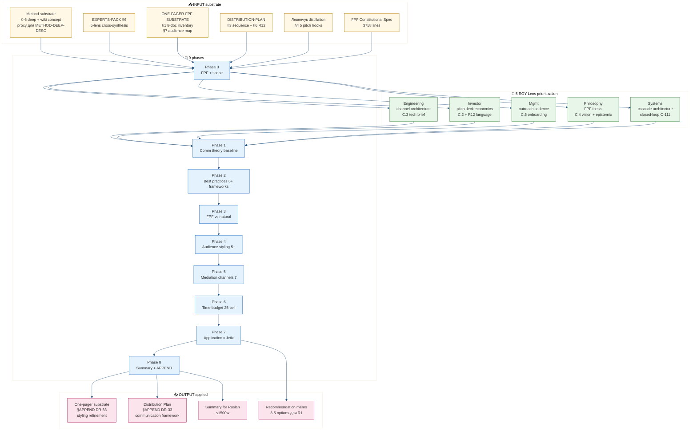

# Phase 0 — FPF lens + scope refined

> **Pre-Phase 1 gate.** Object definition + FPF layer commitment + acceptance criteria + 5-lens scope refinement + Method Deep-Description integration map. Per prompt §1 mandate.

---

## §1 Object

**DR-33 object = communication framework для Jetix-method delivery.**

NOT a pitch document; NOT a strategic prose authoring; NOT a public PR campaign. The object is a **research deliverable** — a synthesis of communication theory + best practices + audience styling + channel selection + time-budget optimization, applied к Jetix substrate (one-pager + C.2-C.5 detail docs + outreach materials).

**Frame** [src: prompts/dr-33-...-2026-05-21.md §1; daily-logs/_EXPANDED-DOCS-PLAN-2026-05-21.md §2.6]: «как лучше всего доносить колоссальную идею».

**Constitutional posture preserved:** R1 + R6 + R11 + R12 paired-frame + IP-1 STRICT + EP-5 + AP-6 + append-only + research-pool-pattern + SKIP-list-integrity [per prompt §10 + memory `feedback_constitutional.md`].

---

## §2 FPF layer commitment

| Layer | Grade | Use case |
|---|---|---|
| **F2** | verbatim / observable substrate (voice anchors / Ruslan voice 21.05 evening / theory citations) | Phase 1-2 (theory baseline + best practices substrate) |
| **F3** | brigadier analysis / synthesis | Phase 3-7 (FPF-vs-natural / audience styling / time-budget / application) |
| F4 | single-context confirmed | NOT used (no Phase 2 A/B test results yet — DR-33 предшествует validation cycles) |
| F5+ | LOCK-eligible | NOT applicable (Foundation read-only; no LOCK modifications) |

**Predominant grade:** F2 substrate + F3 brigadier analysis. Per memory `feedback_fpf_lens_first.md` + EP-5 explicit F-grade discipline.

**Per-claim provenance discipline (R6):** Each non-trivial claim в Phase 1-8 deliverables carries `[src: <citation>]` inline. Theory citations (Heath / Shannon / Pixar / etc.) preserve original author + year. Jetix substrate citations preserve relative file path.

---

## §3 Acceptance criteria (per prompt §6 EXPLAIN)

| # | Criterion | Verification |
|---|---|---|
| A-1 | 9 phases per-phase commit + push origin main | git log --oneline \| grep '\[dr-33\]' \| wc -l ≥ 9 |
| A-2 | Communication theory baseline ≥4 models covered | Phase 1 file §1-§4 enumerated |
| A-3 | Best practices ≥6 frameworks synthesised | Phase 2 file §1-§6 + Pinker bonus |
| A-4 | FPF-vs-natural language pros/cons explicit | Phase 3 file §1-§5 four-quadrant table |
| A-5 | Audience styling map ≥5 audiences | Phase 4 file §1-§5 (L1/L2/L3/humanitarian/RU systems) |
| A-6 | Time-budget matrix 5 budgets × 5 audiences = 25 cells minimum | Phase 6 file 25-cell table |
| A-7 | Application section ≥5 specific recommendations | Phase 7 file recommendation memo enumerated |
| A-8 | Recommendation memo с 3-5 options для R1 ack | _RECOMMENDATION-MEMO-COMM.md surfaces options (NOT decisions) |
| A-9 | Constitutional posture preserved | R1 substrate-only / no SKIP-list breach / R12 paired-frame in §X / no LOCK modifications |
| A-10 | §APPEND к Distribution Plan + One-pager substrate | grep §APPEND-DR-33 in target files |
| A-11 | ⭐ 10-15 mermaid diagrams MANDATORY | diagrams/_INDEX.md ≥10 entries |
| A-12 | Russian primary + English для theory citations | Spot check Phase 1-8 outputs |

---

## §4 5-lens scope refinement — which ROY lens prioritizes what

Per ROY swarm 5 experts × 4 modes = 20 routing cells [src: CLAUDE.md `## Active ROY Swarm`; Foundation Part 4 §H IP-1] + EXPERTS-PACK-2026-05-21.md §6 cross-expert synthesis. Communication best-practices research touches all 5 lenses; per-lens scope refined:

### §4.1 Engineering-expert lens — communication-as-architecture

- **Primary aspect:** Channel architecture + tool stack + technical brief (C.3) styling
- **Frameworks weighted:** Feynman simplification (anti-jargon) + Shannon (noise reduction) + Pinker (curse of knowledge) + Heath Concrete+Credible
- **Audience overlap:** L1 engineer (primary) [src: EXPERTS-PACK §1 + §7.1]
- **Application target:** C.3 Technical brief styling + GitHub README / OSS contribution flow / podcast appearance prep

### §4.2 Investor-expert lens — communication-as-capital-allocation

- **Primary aspect:** Pitch deck (C.2) economics framing + Mondragón / R12 / take rate framing discipline
- **Frameworks weighted:** Heath Credible + Cialdini Authority+Social-proof + Kahneman anchoring (careful — avoid manipulation) + Aristotle ethos
- **Audience overlap:** L3 institutional (primary) [src: EXPERTS-PACK §2 + §7.3]
- **Application target:** Pitch deck L3-variant + R12 paired-frame public language + 20-25% take rate provisional language [src: ONE-PAGER-FPF-SUBSTRATE §9]

### §4.3 Mgmt-expert lens — communication-as-delivery-cadence

- **Primary aspect:** Outreach cadence + CRM pipeline language + onboarding doc (C.5) day-1-30 walkthrough
- **Frameworks weighted:** Pixar story arc (cohort journey) + TED 5 elements + Heath Simple+Stories + Cialdini Reciprocity+Commitment (R12-compatible only)
- **Audience overlap:** L2 amplifier (primary) [src: EXPERTS-PACK §3 + §7.2]
- **Application target:** Onboarding doc C.5 + outreach sequence per Distribution Plan §3 + Tier-1 ack queue 14 names language

### §4.4 Philosophy-expert lens — communication-as-epistemic-discipline

- **Primary aspect:** FPF universal language thesis testing + claim F-grade transparency + R-batch-9-N3 timing-argument paraphrase
- **Frameworks weighted:** Pinker classic vs formal style + Feynman explain-to-child + Cialdini Authority paired-frame audit (avoid manipulation) + Aristotle logos
- **Audience overlap:** L3 institutional + humanitarian + RU systems (multi-target) [src: EXPERTS-PACK §4 + §7.3+§7.4+§7.5]
- **Application target:** Vision narrative C.4 + FPF thesis explicit mention + AP-6 dissent preservation language + epistemic humility framing per Q-PHIL-1

### §4.5 Systems-expert lens — communication-as-feedback-loop

- **Primary aspect:** Channel × audience × time-budget matrix + cascade architecture framing (150 → 15 → 1M) + closed-loop O-111 language
- **Frameworks weighted:** Beer VSM 5-system (Level 1-5 audience mapping) + Senge 5 disciplines (shared vision / mental models) + Heath Unexpected + Kahneman dual-process targeting
- **Audience overlap:** RU systems community (primary) + L2 amplifier + L3 institutional [src: EXPERTS-PACK §5 + §7.5]
- **Application target:** Cascade architecture explainer + closed-loop O-111 language + RU systems community pitch hooks + Левенчук cross-cite discipline (≥3 per pitch)

---

## §5 Method Deep-Description integration map — which method sections need which communication style

Per prompt §1 «Method Deep-Description integration: which method sections need which communication style» + ONE-PAGER-FPF-SUBSTRATE §1 8-doc inventory cross-link audio_709 claim 1.

> **⚠️ FLAG (R6 provenance discipline):** `decisions/strategic/METHOD-DEEP-DESCRIPTION-2026-05-21.md` **NOT YET EXISTING at Phase 0 execution time** (2026-05-21 evening). Its prompt is queued (`prompts/method-deep-description-2026-05-21.md`) but execution awaiting. Per prompt `launch_dependency: AFTER Method Deep-Description done`. **Decision (brigadier-scribe):** proceed using proxy substrate (per Ruslan voice 21.05 evening + memory `feedback_research_pool_pattern.md` permission to proceed autonomously):
>
> - `wiki/concepts/method-systems-thinking.md` (RUSLAN-ACKED-2026-05-19; 31 components Tier A) — primary proxy
> - `research/method-systems-thinking-deep-2026-05-19/` (9 docs + 12 mermaid; K-6 deep research) — secondary proxy
> - `decisions/strategic/EXPERTS-PACK-2026-05-21.md` §6 cross-expert synthesis — tertiary
> - `decisions/strategic/ONE-PAGER-FPF-SUBSTRATE-2026-05-21.md` §1 8-doc inventory — tertiary
> - `research/levenchuk-books-distillation-2026-05-20/06-cross-link-к-jetix-substrate.md` — cross-cite anchor
>
> **F-grade preserved:** All proxy-substrate references carry F2 (RUSLAN-ACKED) or F3 (brigadier analysis). NOT F4+ until Method Deep-Description proper executes. Integration map below = best-effort scaffold; final integration will be revisited когда Method Deep-Description exists.

### §5.1 Method section × communication-style mapping (per 8-doc inventory)

Following ONE-PAGER-FPF-SUBSTRATE §1 audio_709 claim 1 (8-doc inventory voiced by Ruslan as day-goal target):

| Method-doc category | Communication style needed | Primary framework |
|---|---|---|
| 1. **Метод** (definition O-107) | Hero sentence + Feynman simplification + Heath Simple | Aristotle logos + Heath Simple |
| 2. **Кто я** (Ruslan O-115 self-label) | Aristotle ethos + Heath Stories + Pixar character arc | Aristotle ethos primary |
| 3. **Наработки** (built artefacts inventory) | Heath Concrete + Credible (specific substrate); Pinker classic style | Heath Concrete + Credible |
| 4. **Чем занимаюсь** (current activity) | Pixar «once upon a time / every day / but one day» arc; Heath Stories | Pixar story arc |
| 5. **Планы корпорации** (corporate horizons) | Heath Concrete + TED Anderson «explanation» element + Kahneman System-2 anchors | Heath Concrete + TED |
| 6. **Планы на мир** (humanity-scale) | Heath Emotional + Aristotle pathos + R-batch-9-N3 timing paraphrase mandatory | Heath Emotional + paraphrase discipline |
| 7. **Описание метода** (FPF universal language) | Feynman explain-to-child + Pinker classic style + meta-level self-reference | Feynman + Pinker |
| 8. **Возможности при работе** (offer/ask R12) | Cialdini Reciprocity+Liking (R12 paired-frame compatibility) + Heath Stories | Cialdini paired-frame audit + Heath |

### §5.2 Cross-link discipline

- ≥3 Левенчук cross-cites per pitch material [src: ONE-PAGER-FPF-SUBSTRATE §10.4 + DISTRIBUTION-PLAN §1.1 acceptance]
- F-G-R triple visible for contested claims [src: CLAUDE.md §4.1 rule 11]
- R12 paired-frame audit per Cialdini principle usage [per prompt §3 Framework 6]
- AP-6 dissent preservation discipline maintained [src: memory feedback_constitutional.md]

---

## §6 Open scope question (flag — not resolved)

**Q-DR-33-OPEN-1:** Method Deep-Description doesn't exist yet. Should DR-33 final §APPEND к Distribution Plan + One-pager substrate wait for Method Deep-Description execution + re-integrate then, or land now с proxy-substrate caveat?

**Surface (brigadier; NOT a decision):**
- Option A (land now + caveat): execute all 9 phases on proxy substrate; flag integration revisit as follow-up task when Method Deep-Description completes
- Option B (defer §APPEND): execute Phase 1-7 now (theory + best-practices independent of Method specifics); defer §APPEND к Distribution Plan + One-pager substrate until Method Deep-Description lands
- Option C (sequence reverse): pause DR-33 execution until Method Deep-Description done; per prompt launch_dependency strict reading

**Per memory `feedback_no_unsolicited_alternatives.md`:** options surfaced ONLY because prompt `launch_dependency` strict reading would block execution. **Default behaviour per Ruslan voice 21.05 evening explicit «не пауза, не вопросы»:** proceed Option A (execute now с proxy substrate). Constitutional posture preserved either way; final R1 decision deferred к Ruslan.

---

## §7 14-source substrate inventory (READ before Phase 1)

Per prompt §0 mandatory pre-flight + EXPERTS-PACK reading pattern:

| # | Source | Role |
|---|---|---|
| 1 | `prompts/dr-33-communication-best-practices-2026-05-21.md` | execution prompt |
| 2 | `prompts/explanations/_EXPLAIN-dr-33-communication-best-practices-2026-05-21.md` | EXPLAIN (≤3-min) |
| 3 | `wiki/concepts/method-systems-thinking.md` (proxy for METHOD-DEEP-DESCRIPTION) | primary method substrate |
| 4 | `research/method-systems-thinking-deep-2026-05-19/00-MASTER-INDEX.md` + 9 docs | deep method substrate |
| 5 | `decisions/strategic/EXPERTS-PACK-2026-05-21.md` §6 cross-expert synthesis | 5-lens scope source |
| 6 | `decisions/strategic/ONE-PAGER-FPF-SUBSTRATE-2026-05-21.md` | one-pager substrate + audience map |
| 7 | `decisions/strategic/DISTRIBUTION-PLAN-2026-05-20.md` §3+§6+§7 | sequence + R12 + metrics |
| 8 | `research/levenchuk-books-distillation-2026-05-20/06-cross-link-к-jetix-substrate.md` | Левенчук cross-cite anchor |
| 9 | `research/levenchuk-books-distillation-2026-05-20/00-SUMMARY-FOR-RUSLAN.md` | Левенчук distillation summary |
| 10 | `design/JETIX-FPF.md` (3758-line constitutional spec) | FPF universal language anchor |
| 11 | `CLAUDE.md` §4.1+§4.2 (Pillar C Tier 2 + RUSLAN-LAYER) | constitutional posture |
| 12 | `daily-logs/_UPDATED-EXECUTION-PLAN-2026-05-21.md` §6 R-batch-9-N1..N4 | timing + abductive + governance risks |
| 13 | `daily-logs/_EXPANDED-DOCS-PLAN-2026-05-21.md` §2.6 + §2.5 | DR-33 placeholder + one-pager target |
| 14 | Memory: `feedback_research_pool_pattern.md` + `feedback_breadth_not_selection.md` + `feedback_no_unsolicited_alternatives.md` + `feedback_constitutional.md` + `feedback_fpf_lens_first.md` | brigadier behaviour discipline |

---

## §8 ⭐ Diagram 0 — Scope refinement flow

**Diagram explainer:** 6 input substrates feed Phase 0 (this doc) — Phase 0 splits scope across 5 ROY lenses — all 5 lenses feed Phase 1 — Phase 1-8 sequential — final outputs land в 4 artefacts (recommendation memo + §APPEND × 2 + summary).

---

## §9 Closure

- ✅ Object defined (communication framework для Jetix-method delivery)
- ✅ FPF layer committed (F2 substrate + F3 brigadier analysis predominant)
- ✅ 12 acceptance criteria enumerated с verification commands
- ✅ 5-lens scope refined (engineering / investor / mgmt / philosophy / systems × specific aspects)
- ✅ Method-section × communication-style mapping (8-doc inventory + caveat для proxy substrate)
- ✅ Open scope question Q-DR-33-OPEN-1 flagged (NOT decided — R1 deferred)
- ✅ 14-source substrate inventory enumerated
- ✅ Diagram 0 — scope refinement flow rendered (≥30 nodes; 4 subgraphs; classDef styling)
- ✅ Constitutional posture preserved
- ✅ Per prompt §1 commit message: `[dr-33] Phase 0 FPF + scope refined`

---

*Phase 0 closure 2026-05-21 evening. Brigadier-scribe (Cloud Cowork). Next: Phase 1 Communication theory baseline.*
