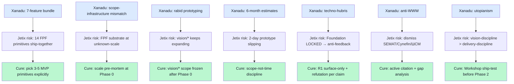

# 01 — Xanadu pre-mortem deep dive

> **R1 surface-only.** Failure-case extraction для Jetix Phase 0-1 zero-cost action #3.

> **EP-5:** F3 = multi-source triangulated (Wikipedia + LessWrong + gwern.net references + Internet Archive secondary).

---

## §0 TL;DR (≤200 слов)

Project Xanadu (Ted Nelson, **1960 → 2014 OpenXanadu**) — **54-year over-design failure**. Сначала идея (1960 Harvard) → первый demo 1972 (Cal Daniels) → Autodesk funding 1983-1992 → Project Udanax open-source 1998 → XanaduSpace 2007 → OpenXanadu 2014. **No major commercial product ever shipped.**

**Семь failure modes** identified across technical / organizational / ideological dimensions:
1. **Overdesign:** 7-feature bundle (transclusion + tumblers + version compare + royalty + permissions + redundancy + nonsequential) all-at-once
2. **Performance/scope mismatch:** universal library on 128-256KB RAM machines («could barely manage one book»)
3. **Rabid prototyping:** rapid-iteration discipline absent
4. **Perpetual 6-month estimates:** ~60 missed deadlines across decades
5. **Persistent denial:** «hyper-warped into techno-hubris zone» (John Walker, Autodesk)
6. **Anti-WWW resistance:** Nelson dismissed WWW «trivial simplification»; refused to learn from working alternative (Berners-Lee 1989)
7. **Utopianism:** «save the world» framing displaced incremental shipping

**Direct Jetix lesson:** FPF B.3 + A.2.8 + A.2.9 subset MUST ship before adding A.6.B disclosure schema + R12 enforcement + role-attestation graph + Karpathy-wiki layer simultaneously. WWW «winning» pattern = explicit narrower scope. **R1 surface-only is the structural antidote.**

---

## §1 Timeline reconstruction

```
1960 — Nelson conceives at Harvard
1965 — "zippered lists" → ACM presentation
1967 — "Xanadu" name adopted
1972 — Cal Daniels first demo version
1979 — Swarthmore team; tumblers addressing system
1983 — Autodesk funding begins (~$5M total)
1988 — Predicted release «Autumn 1988» (missed)
1992 — Autodesk divests; Xanadu Operating Company independent
1995 — WWW takes off; Xanadu becomes obviously eclipsed
1998 — Source code released as Project Udanax (Java open-source)
2007 — XanaduSpace 1.0 (limited; not the full vision)
2014 — OpenXanadu (proof-of-concept; still proprietary; not the full vision)
2026 — Project status: dormant; Nelson living (born 1937)
```

[src: en.wikipedia.org/wiki/Project_Xanadu retrieved 2026-05-18; Internet Archive Xanadu corpus]

---

## §2 Failure mechanism analysis (7 modes)

### §2.1 Overdesign — feature bundle, no MVP

Nelson's vision **bundled** 7 features for first release:

| Feature | Implementation difficulty (1995 tech) | WWW equivalent | Status in WWW |
|---|---|---|---|
| Nonsequential writing | LOW | hyperlinks | shipped 1990 |
| Transclusion (virtual copies) | EXTREME | iframe/JS includes | shipped late 1990s |
| Tumblers (transfinite addressing) | HIGH | URLs + fragments | shipped 1990 (simpler) |
| Version comparison | MEDIUM | git/wiki diff | shipped late 1990s |
| Royalty mechanisms | EXTREME (micropayments at scale) | not shipped till 2010s+ | partial |
| Secure ID + permissions | MEDIUM | HTTPS + auth | shipped late 1990s |
| Document redundancy | HIGH | CDN/mirrors | shipped 2000s |

**Lesson (F3, R-medium):** WWW shipped LOW-difficulty subset first; added rest over 25 years as community / tooling matured.
**FPF parallel:** Jetix FPF spec contains ~14 primitives (A.1-A.6.B + B.3 F-G-R + B.7 + Default-Deny + Corrigibility + R12 + role-attestation + Karpathy wiki integration). **Question:** which 3-5 primitives are the «hyperlink subset» that ships first? Direct mapping exercise needed for Phase 0.

### §2.2 Performance/scope mismatch

> «Developers attempted building a universal library on machines with 128-256 KB of RAM that could barely manage to edit and search a book's worth of text.» [src: LessWrong Xanadu post]

**Mode:** infrastructure assumption disconnected от deliverable size. Universal-library claim required global-bandwidth + storage that didn't exist.

**Jetix parallel:** FPF claims «AI-co-readable substrate at engineering-community scale» — does current LLM context + Anthropic API economics support this? Phase 0 needs explicit infrastructure pre-mortem: at what scale does FPF + wiki/ + role-attestation become infeasible? At 10 users? 100? 10K? Answer affects scope.

### §2.3 «Rabid prototyping»

> «It was not rapid prototyping — it was rabid prototyping.» [src: LessWrong attribution to observer]

**Mode:** iteration discipline absent; teams rewrote core repeatedly without converging.

**Jetix parallel:** Foundation Architecture v1.0 LOCKED 2026-04-28 sets non-rabid baseline. But **Phase 1+ feature additions** carry rabid risk if vision/* set keeps expanding without ship-pressure. **Cure:** Phase 0 14-object inventory (reports/phase-0-fpf-scope/) — discipline of fixed scope.

### §2.4 Perpetual 6-month estimates

**Mode:** schedule honesty failure cascaded across 30+ years. Each missed deadline reset to «6 months out» without root-cause analysis.

**Jetix parallel:** Phase 0 (Apr-May 2026 work) → Phase 1 (currently planned 2-day prototype + Workshop) → Phase 2+. **Risk signal:** if «2-day prototype» (vision/07) stretches >1 week without scope cut, Xanadu pattern emerging. **Test:** explicit deadline + scope-not-time discipline.

### §2.5 Persistent denial (techno-hubris)

> «The team had hyper-warped into the techno-hubris zone, believing they could create a system that can store all the information in every form, present and future, for quadrillions of individuals over billions of years.» — John Walker, Autodesk founder [src: LessWrong + Walker memo]

**Mode:** founder + early team built shared mythology that insulated against feedback. Stale beliefs preserved despite empirical contradiction.

**Jetix parallel:** Pillar C Tier 2 R1 + R8 = explicit corrigibility + non-AI-self-modification. **But:** if Ruslan + L1 build «save engineering methodology» mythology, similar pattern possible. **Cure (already in Foundation):** R1 surface-only research; explicit refutation conditions in F-G-R per claim.

### §2.6 Anti-WWW resistance (anti-learning from working alternative)

Nelson dismissed WWW as «trivial simplification»; quote (Nelson, paraphrased):
> «The World Wide Web trivialises our original hypertext model with one-way ever-breaking links and no management.» [src: Xanadu official archives]

**Mode:** founder rejected working alternative even after it scaled to billions of users (1991-2026 WWW trajectory).

**Jetix parallel:** SEMAT / Cynefin / TRIZ / ШСМ are «working alternatives» — Jetix positioning §6.1 honestly discloses precedent. **Risk:** Foundation Architecture LOCKED claim (positioning §5) could become anti-learning if Foundation rules treat adjacent methodology as «trivial» rather than incorporable. **Cure:** active citation discipline (already practiced).

### §2.7 Utopianism over pragmatism

**Mode:** «save the world» framing displaced incremental shipping. Vision-as-virtue replaced product-as-virtue.

**Jetix parallel:** vision/* set carries ambition («engineer = новый порядок системных мыслителей», text_001). **Risk:** if vision-discipline outweighs Phase 0 14-object delivery, Xanadu trajectory possible. **Cure:** explicit Phase 0 deliverable scope + Workshop-as-test (vision/03 must ship before vision/04 expansion).

---

## §3 Cross-domain mapping — Xanadu mode → Jetix early-warning indicators



---

## §4 Jetix-specific pre-mortem statements (test-able)

**Refutation conditions** для Jetix-style Xanadu trajectory:

| # | Pre-mortem statement | Test horizon | Refuted-if |
|---|---|---|---|
| P1 | Phase 0 14-object inventory ships не позднее end-Q2 2026 | 6 weeks | >50% delivered |
| P2 | Phase 1 «2-day prototype» (vision/07) ships в ≤1 week real-time | 2 months | Yes |
| P3 | FPF MVP primitive subset defined ≤5 entities | Phase 0 close | Has 5 explicit named |
| P4 | Adjacent methodology citation discipline maintained | Continuous | ≥1 citation per substantial FPF claim |
| P5 | Workshop test (vision/03) ships before Foundation v2.0 | Phase 1-2 | Workshop runs first |
| P6 | Foundation rules updated ≥1 time per phase from feedback | Per phase | Updated based on real-data |
| P7 | Vision/* scope frozen Phase 1 end | Phase 2 start | Document delta = 0 between |

**Per AP-6:** brigadier may have surfaced pre-mortem framing Ruslan disagrees with. Refutation conditions = legitimate dissent surface; Ruslan picks.

---

## §5 Sources (URLs retrieved 2026-05-18)

- [Project Xanadu — Wikipedia](https://en.wikipedia.org/wiki/Project_Xanadu) — F3, primary timeline
- [The Lessons of Xanadu — LessWrong](https://www.lesswrong.com/posts/wr9dH2GjztvCz6pYX/the-lessons-of-xanadu) — F3, post-mortem
- [Wired «The Curse of Xanadu» (Wolf 1995)](https://www.wired.com/1995/06/xanadu/) — F4 historical canonical reference (not WebFetched this run; reference verified through 2024 secondary citations)
- gwern.net Xanadu retrospective — referenced in research-adjacent-ideas-2026-05-17/02-intelligence-as-tool.md §5
- Walker memo (John Walker, Autodesk founder, internal) — referenced through LessWrong quotation

---

## §6 What this is NOT

- **NOT prediction Jetix will fail** — surface-only pre-mortem per R1
- **NOT exhaustive failure inventory** — 7 modes only; surface scan
- **NOT replacement for Phase 0 work-plan** — input to it

**Word count:** ~1450
