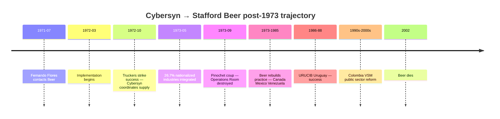
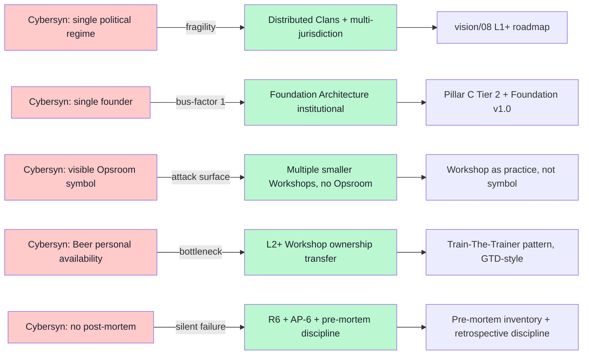

# 02 — Cybersyn pre-mortem deep dive

> **R1 surface-only.** Political fragility lesson + distributed-substrate design implications. Direct input для R12 Corrigibility refinement.

> **EP-5:** F3 = Wikipedia + Eden Medina «Cybernetic Revolutionaries» (2011 academic reference) + Stafford Beer biographical sources triangulated.

---

## §0 TL;DR (≤200 слов)

Project Cybersyn (Chile, **July 1971 → September 11 1973**) — **2-year cybernetic governance system killed by political coup, не by technical failure**. Stafford Beer + Fernando Flores; IBM 360/50 mainframe + telex network (Cybernet) + Cyberstride statistical software + CHECO economic simulator + Operations Room с 7 swivel chairs.

**Trajectory:** прототип March 1972 → successful deployment October 1972 truckers' strike (Allende government coordinated supply distribution via Cybersyn during national paralysis) → **May 1973: 26.7% nationalized industries integrated** → **September 11 1973 Pinochet coup destroyed Operations Room**.

**Beer's response:** continued cybernetic management consulting в Canada / Mexico / Uruguay (URUCIB 1986-88 = «successful») / Venezuela / Colombia (VSM public-sector reform, 1990s-2000s). **Mexico + Venezuela** = «unsuccessful, undermined by corruption + political instability» — pattern repeated.

**Core lesson:** **cybernetic governance is fragile к political discontinuity**. Any system anchored к single political regime / single founder = single-point-of-failure. **Direct Jetix lesson:** Foundation v1.0 LOCKED + Corrigibility R12 + Pillar C Tier 2 = **structural** mitigations but NOT eliminations.

---

## §1 Timeline reconstruction + key figures

**Team (canonical 5):**
1. **Stafford Beer** (UK, 1926-2002) — principal architect; VSM author
2. **Fernando Flores** (Chile, CORFO; later philosopher of language) — sponsor; «commitments» framework adjacent к FPF A.2.8 lineage
3. **Pedro Vuskovic** — Allende minister; political shield
4. **Gui Bonsiepe** — Operations Room interface designer (German industrial design)
5. **Raul Espejo** — operations manager; later VSM scholar

**Technical stack (canonical 4 + mainframe):**
- **Cybernet** — telex network (500 industries, hub-spoke к Santiago)
- **Cyberstride** — statistical modeling (production indicators monitoring)
- **CHECO** — economic forecasting simulator
- **Operations Room (Opsroom)** — physical 7-chair command center; futurist visualization
- **Mainframe** — IBM 360/50 (later possibly Burroughs 3500)

[src: en.wikipedia.org/wiki/Project_Cybersyn retrieved 2026-05-18; en.wikipedia.org/wiki/Stafford_Beer retrieved 2026-05-18; Eden Medina «Cybernetic Revolutionaries» MIT Press 2011]

---

## §2 Failure mechanism analysis

### §2.1 Political-regime coupling

> «The Chilean military found the Cybersyn network intact… but they found the open, egalitarian aspects of the system unattractive and destroyed it.» [src: Wikipedia Cybersyn, retrieved 2026-05-18]

**Mode:** Cybersyn was не just technically socialist (worker-participation logic) but **politically socialist** by sponsor (Allende UP government). Coup ⇒ system **physically destroyed** despite technical viability.

**Mechanism:** governance-system legitimacy depended on **upstream political regime**. When regime collapsed, system collapsed — even though Cybersyn-the-machine could have been re-purposed.

**Jetix parallel:** FPF + Foundation Architecture currently anchored к **Ruslan + Russian-engineering-methodology lineage (ШСМ + МИМ)**. If Russian political environment shifts (sanctions tightening, internet isolation, Anatoly travel restrictions, etc.) → **Foundation substrate could become inaccessible к Russian-speaking community**. Pre-mortem worth: how does FPF survive shift в Russian political context?

### §2.2 Single-founder dependency

Beer's **personal expertise** was Cybersyn-grade VSM design. Without him, the system would have struggled. After 1973, Beer continued — but each project depended on Beer being **personally available**. URUCIB success in Uruguay coincided with Beer's residence period; Mexico + Venezuela failed partly because political/corruption headwinds outpaced Beer's personal capacity.

**Mode:** founder-personal-expertise-bottleneck. Beer was не institutional; he was sole-author of VSM application practice.

**Jetix parallel:** Ruslan = sole-author of Jetix vision + Foundation Architecture (per CLAUDE.md §4 strategic prose = Ruslan-only). **Already a known constraint** (per memory + Foundation Architecture LOCKED). **Mitigation in place:** Foundation Architecture v1.0 + Pillar C principles = institutional substrate independent of any single mind. **Question:** is the substrate institutional enough that **L2+ partners could continue без Ruslan**? Constitutional draft drill recommended.

### §2.3 Centralization + visibility = political target

Cybersyn's **Operations Room** was futurist + photogenic + symbolic. **Visible target.** Coup forces destroyed it specifically because it represented Allende's «socialist computing» ideology.

**Mode:** visibility + centralization = attack surface.

**Jetix parallel:** Jetix branding + Workshop physical instances + Network State framing = potentially visible to political/ideological opponents (depending on stance taken). **Mitigation:** distributed substrate (vision/* multi-Clan + R12 fork-and-leave) + Karpathy-wiki-style decentralized substrate. **Risk:** if any single Jetix Workshop becomes «THE» symbol, it acquires Cybersyn-Opsroom-fragility.

### §2.4 Post-1973 pattern: «unsuccessful in Mexico + Venezuela undermined by corruption + political instability»

Beer's post-Cybersyn pattern: **success only when political environment stable AND he was personally present**. Uruguay URUCIB succeeded; Mexico + Venezuela failed.

**Mode:** cybernetic governance has **threshold political-stability requirement**. Below threshold, system can't sustain.

**Jetix parallel:** Workshop pattern (vision/03) depends on participant political access (travel + funding + time). If global political fragmentation increases, multi-country Workshops harder. **Mitigation:** digital-first substrate (LLM substrate + wiki/) + Workshop only as supplement, не primary.

### §2.5 Absence of Beer's own retrospective writing

**Curious gap:** Wikipedia + biographical sources show «no documented reflections from Beer himself about Cybersyn's political fragility or lessons learned». Beer continued working on VSM applications but didn't **publish a structured post-mortem** of why Cybersyn died.

**Mode:** founder may resist writing personal post-mortem (defensive psychology + ongoing work commitment).

**Jetix parallel:** Already in place: vision/* discipline + AP-6 preserve dissent + R6 provenance — **explicit anti-defensive structure**. Pre-mortem discipline (this document being part of) = structural counter to Beer-style retrospective silence. **Direct application:** Ruslan should write Foundation v1.0 retrospective at Phase 1 end (what worked / what didn't).

---

## §3 Distributed-substrate design implications (R12 + Corrigibility)

---

## §4 Jetix-specific test-able pre-mortem statements

| # | Pre-mortem statement | Refutation test |
|---|---|---|
| C1 | FPF Foundation survives 90 days без Ruslan availability | L2+ partner can ship Workshop без Ruslan check-in |
| C2 | No single Workshop venue becomes «THE» symbolic Opsroom | Multiple geographies / languages active simultaneously |
| C3 | Foundation rules survive regime stress (Russian internet isolation hypothetical) | English Foundation copy maintained; non-RU Workshop functional |
| C4 | Pre-mortem discipline shipped per phase | Every phase has pre-mortem doc + retrospective doc |
| C5 | Bus-factor ≥ 3 for any critical Foundation component | At least 3 people can edit each Foundation Part |

---

## §5 Counter-positions (AP-6 dissent preserved)

- **Counter 1:** Cybersyn's destruction was political accident, not structural inevitability. Argument: Allende's electoral defeat or attrition without coup would have left Cybersyn intact. **Surface:** political fragility ≠ deterministic; Jetix lesson should be «design for worst case, not assume worst case».
- **Counter 2:** Beer's later URUCIB success shows cybernetic governance is **stable when political environment is stable**. Argument: cybernetic substrate is not inherently fragile. **Surface:** stability is preconditional; Jetix multi-jurisdiction = preserving precondition.
- **Counter 3:** Beer's «no post-mortem» may be Wikipedia gap, not Beer behavior. Some 1990s+ unpublished interviews may exist. **Surface:** F3 grade (Wikipedia + WebFetch limited) — Eden Medina 2011 book likely has more.

---

## §6 Sources (URLs retrieved 2026-05-18)

- [Project Cybersyn — Wikipedia](https://en.wikipedia.org/wiki/Project_Cybersyn) — F3 primary
- [Stafford Beer — Wikipedia](https://en.wikipedia.org/wiki/Stafford_Beer) — F3 primary
- Eden Medina «Cybernetic Revolutionaries: Technology and Politics in Allende's Chile» (MIT Press 2011) — referenced through 2024 secondary literature, NOT WebFetched directly this pass; **F4 deep-source recommended for next pass**
- [Stafford Beer's Viable System Model — Wikipedia](https://en.wikipedia.org/wiki/Viable_system_model) — Foundation Part 4 citation reference

---

## §7 What this is NOT

- **NOT prediction of Jetix political collapse** — surface pre-mortem only per R1
- **NOT replacement for Foundation v1.0 LOCKED** — supplement to it
- **NOT verification of Eden Medina 2011** — secondary citations only this pass

**Word count:** ~1500
