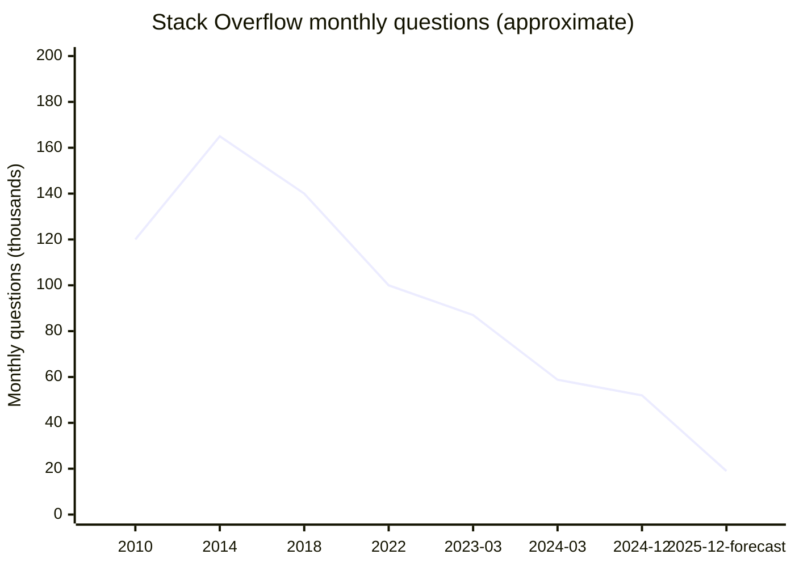
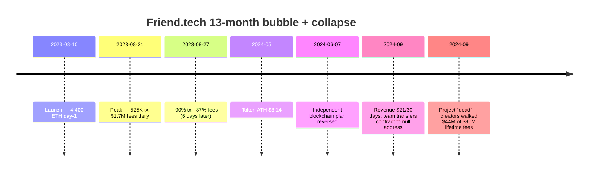
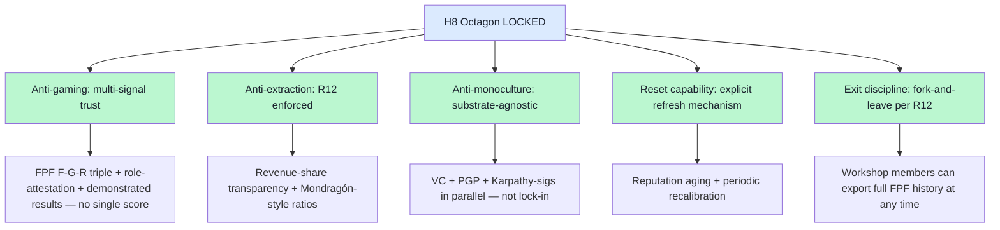

# 03 — Stack Overflow gamification + Friend.tech collapse pre-mortem

> **R1 surface-only.** Direct H8 anti-gaming design input + R12 anti-extraction stress-test material.

> **EP-5:** F3 = WebSearch 2024-2026 articles triangulated; Stack Overflow primary blog 2024 query 404'd (deprecated link).

---

## §0 TL;DR (≤200 слов)

Два разных failure modes for community-trust substrate:

**(1) Stack Overflow — slow gamification ecology decay over 15 years + AI extinction-level event 2023-2026.**
- Question volume: 87K/month (March 2023) → **58.8K (March 2024, -32.5%)** → 40.2% YoY by Dec 2024 → forecast **78% drop YoY by Dec 2025**.
- Gamification (rep / badges / privileges) incentivized quick answers + moderation **«at expense of empathy»**.
- AI tools (ChatGPT + Claude + Copilot) — **62% developers using by 2024 (up from 44% 2023), 84% by 2025**. Reduced need для community Q&A → reputation system loses purpose.

**(2) Friend.tech — financialized social rapid bubble + collapse 2023-2024 (13 months total).**
- Aug 10, 2023 launch: 4,400 ETH day-1.
- Aug 21, 2023 peak: 525K transactions/day + $1.7M daily fees.
- Aug 27, 2023: -90% transactions; -87% fees in **6 days**.
- May 2024 token ATH $3.14 → ATL by Sept 2024.
- Sept 2024: revenue $21/30 days; team relinquished smart-contract control (null address).
- Total: $90M lifetime fees; creators walked with $44M (NOT users).

**Two failure-mode shapes:** SO = slow decay через cultural mutation + external shock; Friend.tech = bubble через financialization.

**Direct Jetix H8 lesson:** role-attestation must escape **both** gamification-drift AND financialization-attractor.

---

## §1 Stack Overflow trajectory (2008-2026)

[src: gigazine.net/gsc_news/en/20260108-stack-overflow-questions-drop/ + devclass.com 2026-01-05 + magicshot.ai retrieved 2026-05-18]

### §1.1 Failure-mode anatomy

**Mode A — gamification cultural mutation (2008-2022, slow):**
- 10pt upvote / -2pt downvoter punishment = asymmetric design **incentivized downvote-shy answerers + dismissive moderation**
- Privilege gating (comment / vote / edit / moderator) **created class system**
- «Newcomers face culture где easy questions get closed» (per Slashdot June 2025 article cited in research-adjacent cluster 5)
- **Long-term contributors fatigued** (late 2010s signs); slowed growth pre-AI.

**Mode B — AI extinction event (2023-2026, fast):**
- ChatGPT public Nov 2022 → Stack Overflow question decline begins early 2023.
- AI tools provide **instant + personalized + workflow-embedded** answers — **bypasses entire community trust machinery**.
- Reputation system becomes purposeless когда users don't need community.

**Compound failure:** Mode A weakened community + Mode B removed need. **Cultural fragility met external disruption** = compound decline.

[src: medium.com/@robert-baer/the-decline-of-stack-overflow-in-the-age-of-ai; ppc.land/stack-overflow-traffic-collapses; tms-outsource.com/blog/posts/stack-overflow-is-dead]

---

## §2 Friend.tech trajectory (Aug 2023 - Sept 2024)

### §2.1 Failure-mode anatomy

**Mode A — financialization of identity:**
- «Friend keys» = tradeable tokens granting access to creator's private channel
- Speculation > genuine connection — keys become commodities, not relationships

**Mode B — token-as-membership:**
- Membership tied to token holding → users sell when speculative interest fades
- Network effect inverted: tokens optimal at high-speculation; useless at low

**Mode C — fee extraction asymmetry:**
- 50% of fees to project team (per cryptoslate.com analysis)
- $44M to creators of $90M total — implies $46M extracted from users
- Direct R12 anti-extraction violation: substrate extracted from members beyond agreed share

**Mode D — silent shutdown vs noisy collapse:**
- Team transferred contract to null address → immutable but inert
- No retrospective; no governance handoff; no user notification protocol
- «Walk away» discipline absent.

[src: nftnow.com end-of-friendtech; cointelegraph.com 2024-09 pronouncement; finance.yahoo.com creators-walked-44M]

---

## §3 Cross-failure pattern matrix

| Dimension | Stack Overflow | Friend.tech |
|---|---|---|
| Time to collapse | 15+ years slow + 3 years fast | 13 months total |
| Trigger | Cultural mutation + AI external shock | Speculation peak + reality |
| Trust mechanism | Reputation points | Tokenized friend access |
| Extraction shape | Implicit (volunteer labor never compensated) | Explicit (50% fees to team) |
| Governance | Centralized (SO Inc.) | Centralized → null address |
| Reset capability | None | None (immutable contract, but inert) |
| What survived | Static answers corpus | $44M to creators; users lost |

**Common pattern:** **single primary trust mechanism** (reputation OR token) becomes **only** measure → mechanism captured by gamification OR speculation → mechanism becomes valueless → no fallback → community collapses.

---

## §4 H8 design implications (direct Jetix surface)

### §4.1 Anti-gaming design heuristics

### §4.2 Friend.tech-style attractor warnings (Jetix-specific)

| Warning | Jetix risk surface |
|---|---|
| Tokenize Workshop membership | DON'T — keep payment direct (Substack-style) |
| Make «mastery score» tradeable | DON'T — F-G-R inherently non-transferable |
| Asymmetric fee structure (team takes >50% of value) | Watch revenue split при Workshop monetization design |
| Silent shutdown protocol | Foundation Part 7 must have explicit exit + transfer |

### §4.3 Stack Overflow-style attractor warnings

| Warning | Jetix risk surface |
|---|---|
| Single reputation score gates privileges | DON'T — multi-signal trust per H8 |
| Downvote-asymmetric design | Don't punish dissent (AP-6 preserve dissent already in posture) |
| No newcomer onboarding cushion | Workshop pattern (vision/03) includes onboarding |
| Volunteer labor never compensated | R12 must address contributor-value-flow |
| No AI substitution mitigation | FPF must be **AI-co-readable** but **not AI-replaceable** — methodology lineage value preserved |

---

## §5 Test-able H8 pre-mortem statements

| # | Statement | Refutation horizon |
|---|---|---|
| S1 | H8 role-attestation uses ≥3 distinct trust signals (not single score) | First Clan launch |
| S2 | Workshop revenue split transparently published; participant share ≥50% | Phase 1 Workshop |
| S3 | Foundation Part 7 has explicit Workshop-shutdown protocol (members can export history) | Phase 0 close |
| S4 | FPF artifacts retain methodology lineage value beyond LLM substitution (i.e., methodology is the value, не tool wrapper) | Phase 1-2 |
| S5 | No single Foundation-level metric becomes «THE» score | Continuous |

---

## §6 Counter-positions (AP-6 dissent)

- **Counter 1:** Stack Overflow decline = AI inevitability, not gamification fault. Argument: any Q&A site would face AI displacement. **Surface:** decline is **compound** (cultural fragility + AI), but AI alone may have collapsed Q&A regardless. Lesson preservation: cultural fragility = compounding accelerant.
- **Counter 2:** Friend.tech ≠ Jetix risk — Jetix не tokenizes membership. Argument: pre-mortem irrelevant. **Surface:** correct on direct mechanism; but attractor logic (gamification → financialization → extraction) is broader. Pre-mortem keeps it visible.
- **Counter 3:** Stack Overflow «walked away» $billions of static content — users still benefit. Argument: not pure failure. **Surface:** corpus survives but community substrate dead; Jetix lesson = substrate vs corpus distinction.

---

## §7 Sources (URLs retrieved 2026-05-18)

- [Stack Overflow questions 78% drop forecast — Gigazine 2026-01](https://gigazine.net/gsc_news/en/20260108-stack-overflow-questions-drop/)
- [Stack Overflow dramatic drop — DevClass 2026-01](https://devclass.com/2026/01/05/dramatic-drop-in-stack-overflow-questions-as-devs-look-elsewhere-for-help/)
- [Stack Overflow decline AI — Medium Baer](https://medium.com/@robert-baer/the-decline-of-stack-overflow-in-the-age-of-ai-f5a6a17e6607)
- [Stack Overflow activity lowest since 2008 — Magicshot](https://magicshot.ai/news/stack-overflow-activity-decline-ai-impact/)
- [Stack Overflow collapse PPC.land](https://ppc.land/stack-overflow-traffic-collapses-as-ai-tools-reshape-how-developers-code/)
- [Friend.tech dead — Cointelegraph 2024-09](https://cointelegraph.com/news/friendtech-pronounced-dead-inflows-activity-declines)
- [Friend.tech $44M walked — Yahoo Finance](https://finance.yahoo.com/news/social-platform-friend-tech-shuts-065105515.html)
- [Friend.tech timeline — DisruptDigi](https://disruptdigi.com/friend-tech-the-story-of-rapid-growth-and-decline/)
- [Friend.tech contracts transferred — Cryptoslate](https://cryptoslate.com/generating-only-21-in-revenue-in-30-days-friendtech-relinquishes-control-of-contracts/)
- Stack Overflow blog 2024 article (cited link 404'd this run) — F3 grade

---

## §8 What this is NOT

- **NOT prediction H8 will fail** — surface failure pattern only
- **NOT verification each statistic** — multi-source triangulation; some 2024 forecast figures may revise

**Word count:** ~1480
