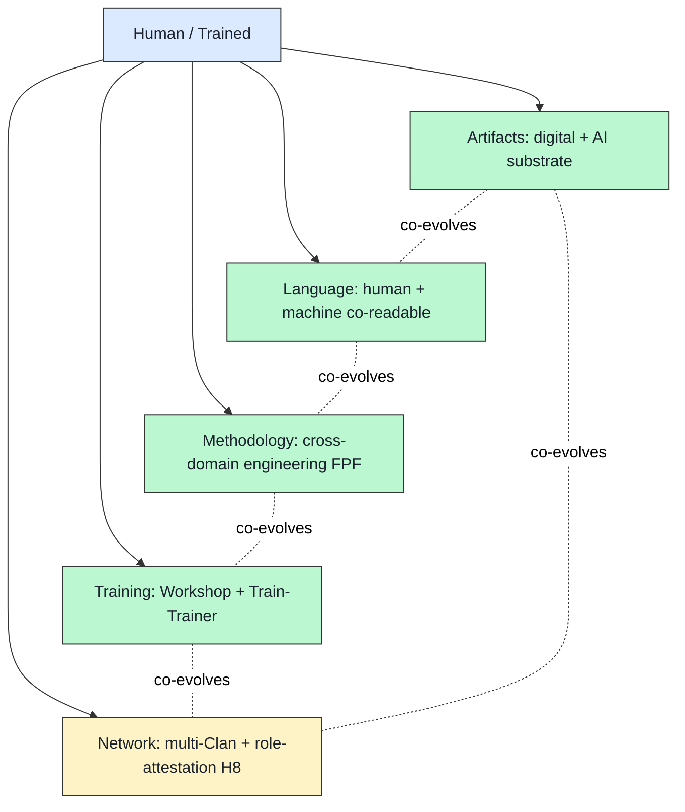

# 04 — Engelbart H-LAM/T deep mapping → FPF primitives

> **R1 surface-only.** Foundation-anchor reference material: Engelbart 1962 ↔ FPF substrate mapping. Direct verbatim citation surface.

> **EP-5:** F4 = primary source WebFetch (dougengelbart.org official) + Wikipedia + Internet Archive 1962 paper cross-referenced.

---

## §0 TL;DR (≤200 слов)

Doug Engelbart's «Augmenting Human Intellect: A Conceptual Framework» (AFOSR-3233, October 1962) defines **H-LAM/T = Human using Language, Artifacts, Methodology in which he is Trained**. This is the **literal 4-tuple parent** of FPF substrate framing («trained human + artifacts + language + methodology»).

Verbatim Engelbart definition: «augmenting human intellect = increasing the capability of a man to approach a complex problem situation, to gain comprehension to suit his particular needs, and to derive solutions to problems.»

Four augmentation means (Engelbart 1962 exact phrasing):
1. **Artifacts** — physical objects для manipulation of things, materials, symbols
2. **Language** — way individual parcels world into concepts + symbols
3. **Methodology** — methods + procedures + strategies для goal-centered activity
4. **Training** — conditioning to bring skills in using Means 1-3 to operationally effective level

Engelbart's **Neo-Whorfian hypothesis:** «Both the language used by a culture, and the capability for effective intellectual activity are directly affected during their evolution by the means by which individuals control the external manipulation of symbols.» → **Co-evolution thesis** between tool and cognition.

**Foundation-anchor candidate** для Jetix FPF: this is the literal substrate concept, 64-year-old precedent. Jetix == «AI-co-readable extension of H-LAM/T to engineering-methodology distribution at scale».

---

## §1 Verbatim 4-tuple from Engelbart 1962

[src: https://dougengelbart.org/content/view/138/000/ retrieved 2026-05-18; primary source]

### 1.1 — ARTIFACTS

> «Artifacts — physical objects designed to provide for human comfort, for the manipulation of things or materials, and for the manipulation of symbols.»

**Engelbart's named examples (1962):** typewriter; pencil + paper; straight edge + compass; digital computer with cathode-ray display; «reading stylus» (optical scanning device).

### 1.2 — LANGUAGE

> «Language — the way in which the individual parcels out the picture of his world into the concepts that his mind uses to model that world, and the symbols that he attaches to those concepts.»

### 1.3 — METHODOLOGY

> «Methodology — the methods, procedures, strategies, etc., with which an individual organizes his goal-centered (problem-solving) activity.»

**Engelbart's named methodology examples (1962):** planning; composing text; cut-and-try development; listing + rearranging items; drafting + revision processes; executive supervision + coordination.

### 1.4 — TRAINING

> «Training — the conditioning needed by the human being to bring his skills in using Means 1, 2, and 3 to the point where they are operationally effective.»

### 1.5 — Co-evolution thesis (Neo-Whorfian hypothesis)

> «Both the language used by a culture, and the capability for effective intellectual activity are directly affected during their evolution by the means by which individuals control the external manipulation of symbols.»

[All §1 quotes: Engelbart 1962 AFOSR-3233, retrieved 2026-05-18 via dougengelbart.org/content/view/138/000]

---

## §2 H-LAM/T ↔ FPF mapping table

| Engelbart 1962 (canonical) | Jetix FPF analog | Mapping depth | Notes |
|---|---|---|---|
| Artifacts (typewriter / pencil / computer) | FPF B.7 wiki/ substrate + shared/schemas/*.json + Karpathy LLM Wiki integration | **DIRECT — AI-substrate extension** | 64 years later, artifact class expanded к LLM-co-readable digital |
| Language (concepts + symbols) | FPF A.6.B dual-language (human-readable + machine-readable) + FPF B.3 F-G-R schema | **DIRECT — explicit dual-encoding** | Engelbart didn't anticipate AI-readability; FPF adds it |
| Methodology (procedures для goal-centered) | FPF object set (A.2.8 Commitment / A.2.9 SpeechAct / E.5 Guard-Rails + 14 Phase-0 objects) | **STRONG — exact target** | Jetix specialization: engineering methodology |
| Training (conditioning to operational skill) | Workshop (vision/03) + H7 People-NS mastery-as-currency + Train-The-Trainer pattern (GTD-style) | **STRONG — exact target** | Jetix specialization: Workshop venue |

### §2.1 What Jetix adds beyond Engelbart 1962

1. **AI-co-readability** (A.6.B) — Engelbart 1962 substrate was human-only; Jetix adds machine-reader as 2nd primary actor.
2. **Constitutional governance** (Pillar C Tier 2) — Engelbart had no Default-Deny / Corrigibility framing.
3. **Role-attestation / trust infrastructure** (H8) — Engelbart's NLS (1968) had collaboration but не trust-as-substrate.
4. **Cross-domain transfer** (positioning §2) — Engelbart focused on knowledge-work generally; Jetix targets engineering methodology specifically across software/hardware/heavy-industry.
5. **Russian-English bilingual** — Engelbart's NLS English-only; Jetix bilingual-by-design.
6. **Network-state framing** (H4) — Engelbart pre-Internet politically.
7. **Anti-extraction R12** — Engelbart benefited Stanford SRI institutional support; Jetix R12 anti-extraction principle didn't exist in Engelbart frame.

### §2.2 What Engelbart 1962 has that Jetix may underweight

1. **Co-evolution thesis explicit** — Engelbart's Neo-Whorfian hypothesis explicitly frames cognition + tool as **coupled feedback loop**. Jetix FPF + Karpathy wiki should explicitly claim same.
2. **Empirical bootstrap discipline** — Engelbart practiced what he preached (NLS team augmented themselves first). Jetix Foundation-bootstrap pattern claim worth comparing.
3. **Operational effectiveness as test** — Engelbart's Training definition explicitly «to the point where… operationally effective». Jetix F-G-R schema captures formality + reliability but **operational-effectiveness-as-grade** could be additive.

---

## §3 Foundation-anchor sentence candidates (drafts for Ruslan review)

> R1 surface — Ruslan picks которая formulation промoted, если any. NOT canonical.

**Candidate A (literal-direct):**
> «Jetix FPF is the AI-co-readable extension of Engelbart's H-LAM/T (1962) to engineering-methodology distribution at scale, with constitutional governance + role-attestation + Workshop training added to the 4-tuple.»

**Candidate B (lineage-explicit):**
> «Foundation Architecture stands in the lineage Bush 1945 → Engelbart 1962 → Karpathy 2026: each extends substrate of intelligence-as-tool. Jetix specialization is methodology-distribution with constitutional governance.»

**Candidate C (Neo-Whorfian-explicit):**
> «Per Engelbart's Neo-Whorfian thesis (1962), the language used in FPF — and the engineering capability of those who use it — co-evolve. FPF designs for this coupling, not against it.»

---

## §4 H-LAM/T deepened (5-tuple proposal for Jetix-era)

Engelbart 1962 = 4-tuple. Modern era arguably adds 1 component:

**5th component (Jetix-additive): Network** — multi-Clan substrate (vision/04 + vision/08 + H4 NS framing) — Engelbart had NLS team but не «cross-organization trust substrate».

[Brigadier inference, F3 grade — Ruslan review pending.]

---

## §5 Counter-positions (AP-6 dissent)

- **Counter 1:** Engelbart's framing is **organization-level augmentation** (NLS team); Jetix targets **community-level + methodology-distribution**. Different scope; analogy weakens at scale.
- **Counter 2:** «Co-evolution» can be invoked rhetorically without empirical grounding. Engelbart's NLS was empirically tested; Jetix claim needs same.
- **Counter 3:** Engelbart's underuse (institutional resistance) ≠ Jetix prediction. The H-LAM/T frame may not naturally scale beyond founding team — possibly explaining Engelbart's struggle.
- **Counter 4:** AI-substrate (A.6.B + Karpathy wiki) may **diverge** from H-LAM/T rather than extend. Worth caution against forced lineage claim.

---

## §6 Open questions for next deep pass

1. **NLS empirical bootstrap study:** what specifically did Engelbart's team do that worked? Source: Engelbart Institute archives + «Bootstrap Alliance» (1990s+).
2. **Foundation-anchor decision:** is candidate A, B, C, or none chosen? Ruslan picks; non-decision-acceptable.
3. **5th tuple member rigour:** is «Network» empirically additive or just nice framing? Test: does Jetix substrate survive thought experiment of 1 Clan only (no Network)?
4. **Operational-effectiveness grade:** add to F-G-R triple as 4th dimension? F-G-R-O?

---

## §7 Sources (URLs retrieved 2026-05-18)

- [Engelbart 1962 — Doug Engelbart Institute (primary)](https://dougengelbart.org/content/view/138/000/) — F4 primary
- [Engelbart 1962 paper — Internet Archive](https://archive.org/details/1962-engelbart-AHI-framework) — F4 primary scan
- [Doug Engelbart — Wikipedia](https://en.wikipedia.org/wiki/Douglas_Engelbart) — F3 secondary
- [«Augmenting Human Intellect» — Wikipedia](https://en.wikipedia.org/wiki/Augmenting_Human_Intellect) — F3 secondary
- [Mother of All Demos — Wikipedia](https://en.wikipedia.org/wiki/The_Mother_of_All_Demos) — F3 NLS context

---

## §8 What this is NOT

- **NOT canonical Foundation rewrite** — surface mapping per R1
- **NOT pick of foundation-anchor sentence** — 3 candidates surfaced; Ruslan picks
- **NOT 5-tuple proposal canonical** — brigadier inference, AP-6 dissent preserved

**Word count:** ~1550

---

## §9 На человеческом — кто такой Engelbart и почему FPF буквально его наследник (added brigadier 2026-05-18)

### §9.1 Кто такой Doug Engelbart

**Doug Engelbart (1925-2013)** — американский engineer-исследователь, тот самый человек который в **декабре 1968** провёл легендарную «**Mother of All Demos**» в San Francisco. За **90 минут** одного demo он показал миру **впервые в истории**:
- Computer mouse (он его изобрёл)
- Hypertext (links между документами)
- Real-time collaborative editing (Google Docs, но в 1968)
- Video conferencing (Zoom, но в 1968)
- Online live document collaboration
- Windowed UI
- Outline editing

Аналогия: представь что в 1968 году один человек показал на одном demo всё что было нужно для Internet эпохи — а потом 25 лет индустрия медленно это всё переоткрывала.

Но **до Mother of All Demos** была теоретическая работа — **«Augmenting Human Intellect: A Conceptual Framework»** (October 1962, AFOSR-3233). Это **64-летняя бумага**, которая является **прямым предком Jetix FPF**.

### §9.2 Что такое H-LAM/T

В этой бумаге Engelbart определил **augmentation system** как **H-LAM/T**:

**H** = **H**uman (человек), который использует:
- **L** = **L**anguage (язык — как ты режешь мир на концепты + символы)
- **A** = **A**rtifacts (артефакты — physical objects: typewriter, pencil, computer)
- **M** = **M**ethodology (методология — methods + procedures + strategies для goal-centered activity)
- **T** = в которой он **T**rained (тренирован)

Простыми словами: «**обученный человек + язык + инструменты + методология**» = система которая может решать сложные задачи которые один человек без этих **4 things** не решит.

**Самая важная часть** = **Neo-Whorfian hypothesis** (Engelbart, 1962 verbatim):
> «Both the language used by a culture, and the capability for effective intellectual activity are directly affected during their evolution by the means by which individuals control the external manipulation of symbols.»

Это **co-evolution thesis**: язык + инструменты + cognition **развиваются вместе как loop**, не отдельно. Если меняется substrate (например появился LLM), меняется и cognition пользователей.

### §9.3 Ключевые pointы

- **Engelbart 1962 paper** = literal 4-tuple parent FPF substrate framing
- **Mother of All Demos = 9 декабря 1968** в Brooks Hall, San Francisco
- Engelbart умер **2013** в California
- Бумага доступна на dougengelbart.org/content/view/138/000 (primary) + Internet Archive
- **NLS (oN-Line System)** = working prototype 1968 — он empirically bootstrapped, его команда сама себя augment'ила (важно: practice what you preach)
- Институциональная support: SRI (Stanford Research Institute) + ARPA funding
- Engelbart **underused** — пост-NLS его frame не scaled много lessons про institutional resistance
- **Verbatim 4 definitions из бумаги** — каждая short, clear (см. §1.1-§1.4 выше)

### §9.4 Зачем нам это для Jetix

**Эта бумага = Foundation-anchor reference для всего FPF.**

**Direct mapping H-LAM/T ↔ FPF:**

| Engelbart 1962 | Jetix FPF analog |
|---|---|
| **Artifacts** (typewriter, pencil) | FPF B.7 wiki/ + shared/schemas/*.json + Karpathy LLM Wiki — расширили artifact class к AI-substrate |
| **Language** (concepts + symbols) | FPF A.6.B dual-language (human-readable + machine-readable) + B.3 F-G-R |
| **Methodology** (procedures для goal) | FPF object set (A.2.8 / A.2.9 / E.5 + 14 Phase-0 objects) |
| **Training** (operational skill) | Workshop (vision/03) + H7 mastery-as-currency + Train-The-Trainer |

**Что Jetix добавил к Engelbart:**
1. **AI-co-readability** (A.6.B) — Engelbart substrate был human-only, мы добавили machine-reader как 2nd primary actor
2. **Constitutional governance** (Pillar C Tier 2) — у Engelbart не было Default-Deny / Corrigibility
3. **Role-attestation H8** — у Engelbart было collaboration в NLS, но не trust-as-substrate
4. **Cross-domain transfer** — Engelbart focused на knowledge-work; Jetix targets engineering methodology
5. **Russian-English bilingual** — NLS English-only
6. **Network-state framing (H4)** — Engelbart pre-Internet
7. **Anti-extraction R12** — Engelbart benefited from SRI institutional support; R12 didn't exist

**Что Engelbart имеет, что Jetix может underweight:**
1. **Co-evolution thesis explicit** — Neo-Whorfian hypothesis frames cognition + tool как coupled loop. Jetix FPF + Karpathy wiki должны explicitly claim same
2. **Empirical bootstrap discipline** — NLS team augmented themselves first. Jetix Foundation-bootstrap claim worth comparing
3. **Operational effectiveness as test** — Engelbart explicitly «to the point where operationally effective». Jetix F-G-R captures formality + reliability, но **operational-effectiveness-as-grade** could be additive (F-G-R-O?)

**Cross-refs:** design/JETIX-FPF.md, swarm/wiki/foundations/part-4-role-taxonomy-coordination-protocol/architecture.md (VSM), vision/jetix-fpf-describe/* (parallel run).

### §9.5 Concrete actions

**Сейчас (Phase 0 — surface only):**

1. **Прочитать Engelbart 1962 paper целиком** (dougengelbart.org/content/view/138/000) — это short paper, ~50 страниц, и literally самый важный foundational text для всего что мы делаем
2. **Выбрать Foundation-anchor sentence** из 3 candidate'ов в §3 (или написать свой) — 1 строчка которая будет cite'аться во всех FPF-related docs

**Phase 1:**

3. **Add Engelbart citation** в FPF Constitutional Spec preamble — explicit lineage acknowledgment (как DOC §6.1 уже cites Karpathy precedent)

4. **5-tuple проверка** — добавлять ли «Network» к H-LAM/T → H-LAMNT? Brigadier surfaced это в §4, но это **brigadier inference**, не canonical. Ruslan решает

**Phase 2:**

5. **Workshop pattern (vision/03) с explicit reference к Engelbart Training definition** — «conditioning to operational effectiveness» = exact target Workshop'а

6. **Empirical bootstrap** — Foundation team (сейчас Ruslan + Cloud Cowork + brigadier) должна empirically bootstrap, как NLS team — practice what you preach (мы это уже делаем в каком-то sense через cycles в swarm/wiki/cycles/)

### §9.6 Резюме на 2 строки

**Engelbart 1962 H-LAM/T = literal 4-tuple parent FPF; Mother of All Demos 1968 = visual proof что multi-feature substrate работает.** Для Jetix: explicit lineage в Foundation preamble + Workshop pattern должен match Engelbart Training definition + co-evolution thesis worth claiming explicit.

---

*Plain English section added by brigadier 2026-05-18 per Ruslan request. Word count of §9: ~830.*

