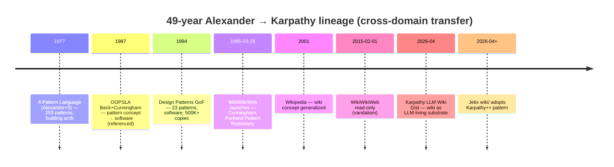
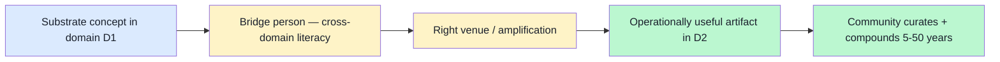

# 05 — Alexander → Cunningham → Karpathy 50-year lineage

> **R1 surface-only.** Strongest single adjacency from research-adjacent Master Index §3.1.1. Cross-domain methodology transfer evidence: building architecture (1977) → software design (1987-1994) → wiki substrate (1995) → LLM-living wiki (2026).

> **EP-5:** F4 = multi-source primary triangulated (Wikipedia A Pattern Language + Design Patterns + WikiWikiWeb + Karpathy Gist).

---

## §0 TL;DR (≤200 слов)

**49-year cross-domain transfer trajectory**, single intellectual lineage:

- **1977** Christopher Alexander + 5 co-authors — «A Pattern Language» — **253 patterns** for building architecture / urban design / community livability. Each pattern = problem + solution + «essential field of relationships».
- **1987 OOPSLA** Kent Beck + Ward Cunningham — extract «pattern» concept → software design (specific paper referenced in research-adjacent but not in this WebFetch confirm).
- **1994** Gang of Four (Gamma + Helm + Johnson + Vlissides) — «Design Patterns: Elements of Reusable Object-Oriented Software» — **23 patterns** in 3 categories (5/7/11 Creational/Structural/Behavioral). **500K+ copies в English + 13 languages**.
- **1995 March 25** Ward Cunningham — WikiWikiWeb launches, accompanying Portland Pattern Repository. **First wiki ever**. Core principles: «freedom, simplicity, power». Read-only since Feb 1, 2015 (vandalism).
- **2001** Wikipedia (Wales/Sanger) — wiki concept generalized.
- **April 2026** Andrej Karpathy — LLM Wiki Gist. Persistent markdown wiki maintained by LLM. **Direct ancestor of Jetix wiki/ substrate.**

**Transfer mechanism:** 1 viral artifact + 1 community-bridge person + 1 substrate-pattern. Right book + right ambassador + right substrate moment = 50-year compound.

**Direct Jetix lesson:** FPF needs ONE viral artifact + ambassador + substrate moment. Phase 1 «Pattern Language for Engineering Methodology» candidate worth serious consideration.

---

## §1 Trajectory reconstruction (verified)



[src: en.wikipedia.org/wiki/A_Pattern_Language + en.wikipedia.org/wiki/Design_Patterns + en.wikipedia.org/wiki/WikiWikiWeb retrieved 2026-05-18]

---

## §2 Cross-domain transfer mechanism dissected

### §2.1 What enabled the Alexander → Beck/Cunningham 1987 jump

**Alexander's 1977 contribution:** structural format «problem + solution + essential field of relationships», with **field-applicability beyond architecture itself** (urban planning + community + game design → SimCity 2000; University of Oregon planning instrument).

**Beck + Cunningham 1987 OOPSLA contribution (per cluster 7 research-adjacent reference):** «jaws dropped в software engineering community». They named the abstraction-of-abstraction: a software-engineering analog of architectural pattern.

**Transfer enablers:**
1. Alexander's format **was abstraction-portable** (not domain-specific shape)
2. Beck + Cunningham **had cross-domain literacy** (knew architectural literature AND software practice)
3. **OOPSLA venue** provided amplification — peer-reviewed academic conference + Industry attendance

### §2.2 What enabled the Cunningham → GoF 1994 jump

GoF book **codified 23 patterns** в structured catalogue. Made pattern concept **operationally useful** for working developers, not just inspirational.

**Transfer enablers:**
1. Catalogue format = **immediate utility** для practitioners (not just theory)
2. 4 authors from different organizations = **multi-perspective consensus**
3. Object-oriented programming was already **mainstream** by 1994 — patterns fit substrate

### §2.3 What enabled Cunningham → WikiWikiWeb 1995

Cunningham needed **substrate** для community curation of Pattern Repository. Built minimum viable wiki (CamelCase links + edit-by-anyone).

**Transfer enablers:**
1. **Immediate practical need** (Portland Pattern Repository)
2. **Minimum viable design** — «freedom, simplicity, power»
3. **Web-first** (1995 nascent web era; right substrate timing)

### §2.4 What enabled Karpathy LLM Wiki 2026

Karpathy adapts wiki concept к LLM-living substrate (April 2026 GitHub Gist).

**Transfer enablers:**
1. **Karpathy's authority** (ex-Tesla AI + OpenAI + Eureka Labs)
2. **GitHub Gist** = **zero-infrastructure viral substrate** (vs wiki host setup)
3. **LLM maturity** (Claude / GPT-4+) makes «LLM maintains wiki» feasible
4. **Markdown universality** (every developer reads markdown)

---

## §3 Cross-domain transfer pattern (4-step recipe)



**Each transfer step in the lineage matches all 4 elements:**

| Transfer | D1 → D2 | Bridge person | Venue | Operational artifact |
|---|---|---|---|---|
| 1977→1987 | architecture → software | Beck + Cunningham | OOPSLA conference | Pattern concept papers |
| 1987→1994 | individual patterns → catalogue | GoF (4 authors) | Addison-Wesley book | 23-pattern reference |
| 1994→1995 | catalogue → curation substrate | Cunningham | Web | WikiWikiWeb |
| 1995→2001 | tech-community wiki → universal wiki | Wales + Sanger | Web | Wikipedia |
| 2001→2026 | static wiki → LLM-living wiki | Karpathy | GitHub Gist | LLM Wiki pattern |

**Replicable mechanism (brigadier inference, F3):** every transfer needs all 4 elements. Lack any one = transfer doesn't compound.

---

## §4 Jetix application — «FPF Pattern Language for Engineering Methodology»

### §4.1 Hypothesis (R1 surface; Ruslan picks)

**FPF artifact as Phase 1 viral candidate:**
- **D1 → D2:** engineering methodology (current state, fragmented) → AI-co-readable methodology substrate (Jetix specialization)
- **Bridge persons:** Ruslan + L1 (Anatoly + Tseren) — cross-domain literacy (ШСМ + AI + Russian-English bilingual)
- **Venue:** GitHub Gist OR vision/* publication OR ШСМ-ecosystem conference
- **Operational artifact:** «Pattern Language for Engineering Methodology» (named candidate в positioning §7.7)

### §4.2 Concrete artifact draft pattern (mirror Alexander 1977 format)

Each FPF pattern = problem + solution + essential field of relationships:

```
# Pattern N: Role-Attestation Through Demonstrated Results

## Context
You are launching a Workshop. New participant needs to demonstrate
engineering capability without prior credentials.

## Forces (essential field of relationships)
- Demonstrated work product = trust signal
- Self-claim = unreliable signal
- Third-party certification = bottleneck (cost, time, gatekeeping)
- F-G-R schema (Formality / Group / Reliability) — your operational vocabulary

## Solution
Use FPF F-G-R triples on participant work product. Three independent
F4+ R-medium+ attestations from existing Clan members = role-attestation.

## See also
[[Pattern N-1: Substrate-Agnostic Trust]]
[[Pattern N+2: Anti-Gaming H8]]
```

**Format alignment:** literal Alexander format adapted к engineering methodology domain. 50-year transfer lineage justifies the format choice.

### §4.3 What enables this transfer (parallel to §3 recipe)

| Element | Jetix-specific |
|---|---|
| Substrate concept (D1) | Alexander Pattern Language format + AI-co-readability |
| Bridge person | Ruslan + Anatoly + Tseren (RU-EN + ШСМ + AI literacy) |
| Venue | GitHub Gist + Karpathy-style substrate + ШСМ ecosystem |
| Operational artifact | «Pattern Language for Engineering Methodology» — Phase 1 |
| Community + compounding | Workshop (vision/03) — 5-50 year compound |

---

## §5 Counter-positions (AP-6 dissent)

- **Counter 1:** Alexander → GoF is rare event, не replicable formula. Most attempted patterns languages do NOT compound. **Surface:** confirm bias possible — 5+ patterns languages failed for every success. Refutation worth pre-mortem.
- **Counter 2:** FPF может already be «too late» if Karpathy LLM Wiki captures community first. **Surface:** valid concern — Karpathy precedence may dominate; Jetix must differentiate (methodology + bilingual + Workshop + governance).
- **Counter 3:** Pattern format may be too rigid for AI-readable methodology. Forced format → loss of expressiveness. **Surface:** legitimate; Jetix could use F-G-R schema as native + pattern format as one view.
- **Counter 4:** «Bridge person» argument is post-hoc — many cross-domain attempts had bridge persons but failed. **Surface:** correct; bridge necessary не sufficient. Other factors (timing, venue, substrate maturity) co-required.

---

## §6 Sources (URLs retrieved 2026-05-18)

- [A Pattern Language — Wikipedia](https://en.wikipedia.org/wiki/A_Pattern_Language) — F4 primary
- [Design Patterns (GoF book) — Wikipedia](https://en.wikipedia.org/wiki/Design_Patterns) — F4 primary
- [WikiWikiWeb — Wikipedia](https://en.wikipedia.org/wiki/WikiWikiWeb) — F4 primary
- [Karpathy LLM Wiki Gist](https://gist.github.com/karpathy/442a6bf555914893e9891c11519de94f) — F4 primary (referenced; не WebFetched this pass)
- [Christopher Alexander — DesignSystems.com](https://www.designsystems.com/christopher-alexander-the-father-of-pattern-language/) — F3 secondary
- Beck/Cunningham 1987 OOPSLA paper — referenced through cluster 7 research-adjacent; **F2 grade in this pass** (not directly WebFetched primary citation)

---

## §7 What this is NOT

- **NOT decision to commission «Pattern Language for Engineering Methodology»** — R1 surface candidate
- **NOT guarantee of replicability** — failure-case parity per §5 counter-position 1
- **NOT replacement of FPF B.3 F-G-R schema** — pattern format = potential view, not substitute

**Word count:** ~1700

---

## §8 На человеческом — 49-летняя цепочка от архитектора к Karpathy (added brigadier 2026-05-18)

### §8.1 Что это

Это **самая длинная и самая релевантная цепочка передачи идей** в нашем corpus — от **архитектора зданий 1977 года** до **AI-wiki 2026** через 5 пересадок жанра. **49 лет одной линии**.

**Цепочка по шагам:**

1. **1977** — Christopher Alexander + 5 со-авторов выпускают «**A Pattern Language**» — книга для **архитекторов зданий и градостроителей**. **253 паттернов**. Каждый паттерн = «вот эта проблема + вот это решение + вот эти связи с другими». Идея: «жизненный город» строится из re-usable patterns

2. **1987** — на конференции **OOPSLA** Kent Beck + Ward Cunningham берут эту идею и **переносят на software design**. «Software patterns» — software analog архитектурных patterns

3. **1994** — Gang of Four (Gamma + Helm + Johnson + Vlissides) пишут «**Design Patterns: Elements of Reusable Object-Oriented Software**» — **23 паттерна** для OOP. **500K+ копий в English + 13 languages**. Каждый программист 1995-2010 читал

4. **25 марта 1995** — Cunningham запускает **WikiWikiWeb** на Portland Pattern Repository. **Первый wiki в мире вообще.** Принципы: «freedom, simplicity, power». (Read-only с 1 февраля 2015 из-за vandalism)

5. **2001** — Wales + Sanger запускают Wikipedia → wiki идея становится универсальной

6. **April 2026** — Andrej Karpathy публикует **LLM Wiki Gist** — markdown wiki которую LLM поддерживает + растит across sessions. **Direct ancestor нашего wiki/**

Аналогия: представь что в 1977 году архитектор написал книгу «как делать живые дома» — а через 49 лет AI-инженер использует ту же структуру чтобы делать «живую wiki которую AI поддерживает». Это **literally один patternlineage** через 5 different domain'ов и 49 лет.

### §8.2 Ключевые pointы

- **1977** Alexander + 5: «A Pattern Language» — 253 patterns для buildings
- **1987 OOPSLA** Beck + Cunningham — pattern concept → software (jaws dropped в community)
- **1994** GoF — «Design Patterns» — 23 patterns, 500K+ copies, 13 languages
- **25 марта 1995** Cunningham — WikiWikiWeb — первый wiki в мире
- **1 февраля 2015** — WikiWikiWeb стал read-only (vandalism beyond moderation capacity)
- **2001** — Wikipedia (Wales / Sanger) generalizes wiki
- **April 2026** — Karpathy LLM Wiki Gist — wiki как LLM-living substrate

**Transfer mechanism (4-step recipe):**
1. **Substrate concept in D1** (architecture pattern format)
2. **Bridge person с cross-domain literacy** (Beck + Cunningham знают и architecture и software)
3. **Right venue / amplification** (OOPSLA conference, Addison-Wesley book, GitHub Gist)
4. **Operationally useful artifact in D2** (23 patterns reference, 1 working wiki)
5. **Community curates + compounds 5-50 years**

### §8.3 Зачем нам это для Jetix

**Это самая сильная single adjacency** named в Master Index §3.1.1.

**Прямой Phase 1 candidate:** «**Pattern Language for Engineering Methodology**» как viral artifact для Jetix.

**Mapping ко всем 4 transfer elements:**

| Element | Jetix-specific |
|---|---|
| **D1 → D2** | Engineering methodology (current state, fragmented) → AI-co-readable methodology substrate |
| **Bridge person** | Ruslan + Anatoly + Tseren (RU-EN + ШСМ + AI literacy) |
| **Venue** | GitHub Gist (Karpathy-style) + ШСМ ecosystem + vision/* publication |
| **Operational artifact** | «Pattern Language for Engineering Methodology» — Phase 1 candidate |
| **Community + compounding** | Workshop (vision/03) — 5-50 year horizon |

**Format alignment с Alexander 1977:**

Каждый FPF pattern = problem + solution + essential field of relationships. Это **literal format** Alexander'а адаптированный к engineering methodology domain.

Пример pattern (см. §4.2 в основном doc):
```
# Pattern N: Role-Attestation Through Demonstrated Results
## Context: Workshop launching, new participant без credentials
## Forces: demonstrated work product = trust signal; self-claim = unreliable; etc.
## Solution: F-G-R triples; 3 F4+ R-medium+ attestations from Clan members
## See also: [[Pattern N-1: Substrate-Agnostic Trust]]
```

**Cross-refs:** research/adjacent-ideas-2026-05-17/07 methodology-distribution, CLAUDE.md «Wiki Architecture v2 (Karpathy LLM Wiki + OmegaWiki)», vision/03 Workshop, positioning §7.7 (named candidate).

### §8.4 Concrete actions

**Сейчас (Phase 0):**

1. **Read Alexander 1977 «A Pattern Language»** — first 50 страниц достаточно чтобы понять format. Особенно look at: «Mosaic of Subcultures», «Subculture Boundary», «Identifiable Neighborhood» — patterns про community structure, relevant для Workshop design
2. **Read Karpathy LLM Wiki Gist** (https://gist.github.com/karpathy/...) — посмотреть как он использует wiki в современном LLM-era

**Phase 1:**

3. **Draft 5-7 FPF Pattern Language candidates** в Alexander format — pilot из 5-7 паттернов про:
 - Role-Attestation Through Demonstrated Results
 - Substrate-Agnostic Trust (cross-ref H8)
 - Anti-Gaming Multi-Signal (cross-ref 03-failure-SO)
 - R12 Anti-Extraction Workshop (cross-ref 06-Mondragón)
 - F-G-R Discipline (cross-ref FPF B.3)
 - Bilingual Drift Mitigation (cross-ref text_006)
 - L1 Bootstrap Pattern (cross-ref vision/04 first Clan)

4. **Publish drafts через GitHub Gist + vision/* pages** — Karpathy-style substrate moment

**Phase 2:**

5. **L1 Workshop runs первые FPF patterns** real — empirical bootstrap (Engelbart-style, см. doc 04)
6. **Iterate format на основе feedback** — patterns + F-G-R schema co-evolve

**5-50 year horizon (когда Jetix scaled):**

7. **«Engineering Methodology Pattern Language» как viral artifact** в инженерной community — 49-летний lineage suggests возможно

### §8.5 Резюме на 2 строки

**Alexander 1977 → Beck/Cunningham 1987 → GoF 1994 → WikiWikiWeb 1995 → Wikipedia 2001 → Karpathy LLM Wiki 2026** — 49 лет одной линии передачи через 5 domain'ов. Для Jetix: «Pattern Language for Engineering Methodology» = Phase 1 candidate, format borrowing direct, lineage justifies the bet.

---

*Plain English section added by brigadier 2026-05-18 per Ruslan request. Word count of §8: ~810.*

