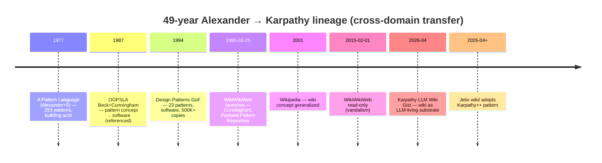
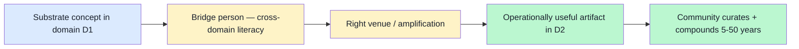

# 05 — Alexander → Cunningham → Karpathy 50-year lineage

> **R1 surface-only.** Strongest single adjacency from research-adjacent Master Index §3.1.1. Cross-domain methodology transfer evidence: building architecture (1977) → software design (1987-1994) → wiki substrate (1995) → LLM-living wiki (2026).

> **EP-5:** F4 = multi-source primary triangulated (Wikipedia A Pattern Language + Design Patterns + WikiWikiWeb + Karpathy Gist).

---

## §0 TL;DR (≤200 слов)

**49-year cross-domain transfer trajectory**, single intellectual lineage:

- **1977** Christopher Alexander + 5 co-authors — «A Pattern Language» — **253 patterns** for building architecture / urban design / community livability. Each pattern = problem + solution + «essential field of relationships».
- **1987 OOPSLA** Kent Beck + Ward Cunningham — extract «pattern» concept → software design (specific paper referenced in research-adjacent but not in this WebFetch confirm).
- **1994** Gang of Four (Gamma + Helm + Johnson + Vlissides) — «Design Patterns: Elements of Reusable Object-Oriented Software» — **23 patterns** in 3 categories (5/7/11 Creational/Structural/Behavioral). **500K+ copies в English + 13 languages**.
- **1995 March 25** Ward Cunningham — WikiWikiWeb launches, accompanying Portland Pattern Repository. **First wiki ever**. Core principles: «freedom, simplicity, power». Read-only since Feb 1, 2015 (vandalism).
- **2001** Wikipedia (Wales/Sanger) — wiki concept generalized.
- **April 2026** Andrej Karpathy — LLM Wiki Gist. Persistent markdown wiki maintained by LLM. **Direct ancestor of Jetix wiki/ substrate.**

**Transfer mechanism:** 1 viral artifact + 1 community-bridge person + 1 substrate-pattern. Right book + right ambassador + right substrate moment = 50-year compound.

**Direct Jetix lesson:** FPF needs ONE viral artifact + ambassador + substrate moment. Phase 1 «Pattern Language for Engineering Methodology» candidate worth serious consideration.

---

## §1 Trajectory reconstruction (verified)



[src: en.wikipedia.org/wiki/A_Pattern_Language + en.wikipedia.org/wiki/Design_Patterns + en.wikipedia.org/wiki/WikiWikiWeb retrieved 2026-05-18]

---

## §2 Cross-domain transfer mechanism dissected

### §2.1 What enabled the Alexander → Beck/Cunningham 1987 jump

**Alexander's 1977 contribution:** structural format «problem + solution + essential field of relationships», with **field-applicability beyond architecture itself** (urban planning + community + game design → SimCity 2000; University of Oregon planning instrument).

**Beck + Cunningham 1987 OOPSLA contribution (per cluster 7 research-adjacent reference):** «jaws dropped в software engineering community». They named the abstraction-of-abstraction: a software-engineering analog of architectural pattern.

**Transfer enablers:**
1. Alexander's format **was abstraction-portable** (not domain-specific shape)
2. Beck + Cunningham **had cross-domain literacy** (knew architectural literature AND software practice)
3. **OOPSLA venue** provided amplification — peer-reviewed academic conference + Industry attendance

### §2.2 What enabled the Cunningham → GoF 1994 jump

GoF book **codified 23 patterns** в structured catalogue. Made pattern concept **operationally useful** for working developers, not just inspirational.

**Transfer enablers:**
1. Catalogue format = **immediate utility** для practitioners (not just theory)
2. 4 authors from different organizations = **multi-perspective consensus**
3. Object-oriented programming was already **mainstream** by 1994 — patterns fit substrate

### §2.3 What enabled Cunningham → WikiWikiWeb 1995

Cunningham needed **substrate** для community curation of Pattern Repository. Built minimum viable wiki (CamelCase links + edit-by-anyone).

**Transfer enablers:**
1. **Immediate practical need** (Portland Pattern Repository)
2. **Minimum viable design** — «freedom, simplicity, power»
3. **Web-first** (1995 nascent web era; right substrate timing)

### §2.4 What enabled Karpathy LLM Wiki 2026

Karpathy adapts wiki concept к LLM-living substrate (April 2026 GitHub Gist).

**Transfer enablers:**
1. **Karpathy's authority** (ex-Tesla AI + OpenAI + Eureka Labs)
2. **GitHub Gist** = **zero-infrastructure viral substrate** (vs wiki host setup)
3. **LLM maturity** (Claude / GPT-4+) makes «LLM maintains wiki» feasible
4. **Markdown universality** (every developer reads markdown)

---

## §3 Cross-domain transfer pattern (4-step recipe)



**Each transfer step in the lineage matches all 4 elements:**

| Transfer | D1 → D2 | Bridge person | Venue | Operational artifact |
|---|---|---|---|---|
| 1977→1987 | architecture → software | Beck + Cunningham | OOPSLA conference | Pattern concept papers |
| 1987→1994 | individual patterns → catalogue | GoF (4 authors) | Addison-Wesley book | 23-pattern reference |
| 1994→1995 | catalogue → curation substrate | Cunningham | Web | WikiWikiWeb |
| 1995→2001 | tech-community wiki → universal wiki | Wales + Sanger | Web | Wikipedia |
| 2001→2026 | static wiki → LLM-living wiki | Karpathy | GitHub Gist | LLM Wiki pattern |

**Replicable mechanism (brigadier inference, F3):** every transfer needs all 4 elements. Lack any one = transfer doesn't compound.

---

## §4 Jetix application — «FPF Pattern Language for Engineering Methodology»

### §4.1 Hypothesis (R1 surface; Ruslan picks)

**FPF artifact as Phase 1 viral candidate:**
- **D1 → D2:** engineering methodology (current state, fragmented) → AI-co-readable methodology substrate (Jetix specialization)
- **Bridge persons:** Ruslan + L1 (Anatoly + Tseren) — cross-domain literacy (ШСМ + AI + Russian-English bilingual)
- **Venue:** GitHub Gist OR vision/* publication OR ШСМ-ecosystem conference
- **Operational artifact:** «Pattern Language for Engineering Methodology» (named candidate в positioning §7.7)

### §4.2 Concrete artifact draft pattern (mirror Alexander 1977 format)

Each FPF pattern = problem + solution + essential field of relationships:

```
# Pattern N: Role-Attestation Through Demonstrated Results

## Context
You are launching a Workshop. New participant needs to demonstrate
engineering capability without prior credentials.

## Forces (essential field of relationships)
- Demonstrated work product = trust signal
- Self-claim = unreliable signal
- Third-party certification = bottleneck (cost, time, gatekeeping)
- F-G-R schema (Formality / Group / Reliability) — your operational vocabulary

## Solution
Use FPF F-G-R triples on participant work product. Three independent
F4+ R-medium+ attestations from existing Clan members = role-attestation.

## See also
[[Pattern N-1: Substrate-Agnostic Trust]]
[[Pattern N+2: Anti-Gaming H8]]
```

**Format alignment:** literal Alexander format adapted к engineering methodology domain. 50-year transfer lineage justifies the format choice.

### §4.3 What enables this transfer (parallel to §3 recipe)

| Element | Jetix-specific |
|---|---|
| Substrate concept (D1) | Alexander Pattern Language format + AI-co-readability |
| Bridge person | Ruslan + Anatoly + Tseren (RU-EN + ШСМ + AI literacy) |
| Venue | GitHub Gist + Karpathy-style substrate + ШСМ ecosystem |
| Operational artifact | «Pattern Language for Engineering Methodology» — Phase 1 |
| Community + compounding | Workshop (vision/03) — 5-50 year compound |

---

## §5 Counter-positions (AP-6 dissent)

- **Counter 1:** Alexander → GoF is rare event, не replicable formula. Most attempted patterns languages do NOT compound. **Surface:** confirm bias possible — 5+ patterns languages failed for every success. Refutation worth pre-mortem.
- **Counter 2:** FPF может already be «too late» if Karpathy LLM Wiki captures community first. **Surface:** valid concern — Karpathy precedence may dominate; Jetix must differentiate (methodology + bilingual + Workshop + governance).
- **Counter 3:** Pattern format may be too rigid for AI-readable methodology. Forced format → loss of expressiveness. **Surface:** legitimate; Jetix could use F-G-R schema as native + pattern format as one view.
- **Counter 4:** «Bridge person» argument is post-hoc — many cross-domain attempts had bridge persons but failed. **Surface:** correct; bridge necessary не sufficient. Other factors (timing, venue, substrate maturity) co-required.

---

## §6 Sources (URLs retrieved 2026-05-18)

- [A Pattern Language — Wikipedia](https://en.wikipedia.org/wiki/A_Pattern_Language) — F4 primary
- [Design Patterns (GoF book) — Wikipedia](https://en.wikipedia.org/wiki/Design_Patterns) — F4 primary
- [WikiWikiWeb — Wikipedia](https://en.wikipedia.org/wiki/WikiWikiWeb) — F4 primary
- [Karpathy LLM Wiki Gist](https://gist.github.com/karpathy/442a6bf555914893e9891c11519de94f) — F4 primary (referenced; не WebFetched this pass)
- [Christopher Alexander — DesignSystems.com](https://www.designsystems.com/christopher-alexander-the-father-of-pattern-language/) — F3 secondary
- Beck/Cunningham 1987 OOPSLA paper — referenced through cluster 7 research-adjacent; **F2 grade in this pass** (not directly WebFetched primary citation)

---

## §7 What this is NOT

- **NOT decision to commission «Pattern Language for Engineering Methodology»** — R1 surface candidate
- **NOT guarantee of replicability** — failure-case parity per §5 counter-position 1
- **NOT replacement of FPF B.3 F-G-R schema** — pattern format = potential view, not substitute

**Word count:** ~1700
