# 06 — Mondragón 68-year mechanism (R12 + governance proof)

> **R1 surface-only.** Industrial-scale cooperative governance evidence для R12 + H8 + first-Clan continuity design.

> **EP-5:** F4 = Wikipedia primary + 2024 financial figures verified + critique literature surface (Chomsky 2012 + Navarro).

---

## §0 TL;DR (≤200 слов)

Mondragón Corporation (Basque Spain, April 14, **1956** → 2026 = **70 years**) — world's largest worker cooperative federation. Founded by Father José María Arizmendiarrieta with first cooperative **Talleres Ulgor** (paraffin heaters; later Fagor Electrodomésticos).

**2024 scale:**
- **70,085 workers** (30,660 Basque + 29,340 rest of Spain + ~10K abroad)
- **€11.213B revenue + €632M net income**
- **4 sectors:** Finance (Laboral Kutxa) / Industry (73% international sales) / Retail (Eroski) / Knowledge (university + 12 tech centers)

**Governance mechanisms:**
- **Cooperative Congress (1984)** approves operating rules by majority vote
- **Wage ratio caps 3:1 to 9:1** between executive + min-wage worker; average **5:1**
- **One worker = one vote** per cooperative
- Each cooperative decides own ratio periodically by member-owner vote

**Survived governance crises:**
- Ampo + Irizar departed 2008
- **Fagor Electrodomésticos bankruptcy 2013 (€1.1B debt)** — bought by Catalan Cata 2014
- ULMA Group + Orona departed **December 2022** rejecting governance reform (-13% workforce, -15% sales)

**Critiques:** Chomsky 2012 «embedded в capitalist system»; Navarro «two-tier system» (non-owner employees vs owners).

**Direct Jetix lesson:** **R12 anti-extraction at industrial scale is empirically possible** but **fragility + non-owner-employee creep are real risks**. Pillar C Tier 2 design choices anchored.

---

## §1 68-year longevity factor analysis

### §1.1 Cooperative Congress (1984) — institutionalization moment

**1956-1984: founder-charismatic phase.** Arizmendiarrieta died 1976. Federation operated informally for ~28 years.

**1984: Cooperative Congress established.** Formal multi-cooperative governance body. Approves rules by majority vote. This is the **institutionalization-after-charismatic-founder** transition that most cooperatives fail.

**Jetix parallel:** Foundation Architecture v1.0 LOCKED 2026-04-28 = **pre-charismatic-handoff institutionalization**. Mondragón took 28 years post-founding to institutionalize; Jetix did it at year 0. **Trade-off:** Jetix preserves founder-discipline before scaling; Mondragón discovered discipline through 28 years of crisis. Both valid; different timing.

### §1.2 Wage ratio cap (3:1 to 9:1, avg 5:1)

**Constitutional rule:** worker-owners can vote ratio, but rule constrains executive-minimum gap.

**Empirical effect:** 70 years of low Gini внутри organization vs free-market norm (in US tech, ratios easily 1000:1). **R12 anti-extraction in practice.**

**Jetix parallel:** Workshop monetization design (vision/03) — Mondragón ratio = direct design template. **Concrete Phase 1 question:** what is Jetix Workshop max revenue-share ratio? Mondragón empirical answer = 5:1 average sustainable; 9:1 high boundary; >9:1 = drift toward capitalist firm. Jetix may pick narrower (1:1 to 3:1) for L1 small-Clan; expand to 5:1 at L2+.

### §1.3 One worker = one vote (per cooperative)

**Each member-owner = 1 vote regardless of capital contribution.** Crucial: capital DOES NOT vote.

**Empirical effect:** prevents capital-concentration → governance-capture.

**Jetix parallel:** Pillar C Tier 2 R12 + Corrigibility = consistent direction. **Substrate-design surface:** when H8 + R12 implementations launch (Phase 1+), explicit «1 member 1 vote» баланс against «proven contributor higher weight» trade-off needs design.

### §1.4 Sectoral diversification + Mondragón University

**Catholic-rooted humanism + open-membership + worker-sovereignty + participatory-management + social-responsibility.**

**Education substrate (Mondragón University + 12 tech centers + business division):** **generations 2 + 3 + 4 trained inside system.** This is the **inter-generational continuity mechanism** that most cooperatives lack.

**Jetix parallel:** Workshop pattern (vision/03) **must** include training-the-trainer mechanism (GTD 3-extra-day model OR Mondragón University model OR hybrid). Otherwise Jetix faces **kibbutz 2nd-generation-loss pattern** (cluster 6 failure case).

### §1.5 Caja Laboral bank (1959) — capital substrate

**Year-3 milestone:** founder created **internal bank** (Caja Laboral) to fund new cooperative formation. **Empirical effect:** capital independence from external markets.

**Jetix parallel:** quick-money P1 project = early revenue substrate. **Question:** at what scale does Jetix need «internal capital allocation» mechanism (Caja Laboral analog)? Possibly Phase 2-3. Pre-Foundation design discussion worth.

---

## §2 Governance crises survived (mechanism stress tests)

### §2.1 Fagor Electrodomésticos bankruptcy 2013

**€1.1B debt + 5K+ employees.** Largest Mondragón cooperative collapsed. Catalan firm Cata bought it 2014.

**Mondragón system response:** other cooperatives **didn't collapse**; federation absorbed shock; some Fagor workers transferred к other coops.

**Lesson:** **federation > individual cooperative**. Failure of one entity ≠ system failure if federation has shock-absorption (worker reallocation + financial reserves + governance distance).

**Jetix parallel:** vision/08 L1+ multi-Clan = adopting same logic. Failure of one Workshop / Clan ≠ Jetix collapse if federation logic works. **R12 «fork-and-leave without penalty»** = same direction.

### §2.2 ULMA + Orona departure December 2022 (-13% workforce, -15% sales)

**Two major cooperatives left federation citing «pressure» + «interference».** -13% workforce equivalent to ~10K workers leaving simultaneously.

**Mondragón system response:** **federation survived**; remaining 70K continued. Departures absorbed по quarter.

**Lesson:** **fork-and-leave without penalty is real survivor mechanism, not theory**. R12 anti-extraction works empirically: members exit when conditions unmet; system doesn't punish or break.

**Jetix parallel:** R12 «members can fork-and-leave without penalty» is **load-bearing claim**. Mondragón 2022 = empirical proof at 10K-worker scale.

### §2.3 2008 departures (Ampo + Irizar)

Smaller departures; federation continued.

---

## §3 Mondragón ↔ Jetix mapping matrix

```mermaid
graph TD
  M1[Cooperative Congress 1984] -.maps to.- J1[Foundation Architecture LOCKED 2026]
  M2[Wage ratio 3:1-9:1] -.maps to.- J2[Workshop revenue split ratio TBD]
  M3[One worker one vote] -.maps to.- J3[Pillar C Tier 2 + Corrigibility]
  M4[Mondragón University + 12 tech centers] -.maps to.- J4[Workshop + Train-The-Trainer pattern]
  M5[Caja Laboral 1959] -.maps to.- J5[Internal capital allocation Phase 2-3]
  M6[Cooperative Congress majority rule] -.maps to.- J6[H8 governance protocol]
  M7[Departure tolerance Dec 2022] -.maps to.- J7[R12 fork-and-leave]
  M8[Catholic humanism] -.maps to.- J8[Pillar C Tier 1 manager principles]

  style M1 fill:#dbeafe,color:#1a202c
  style M2 fill:#dbeafe,color:#1a202c
  style M3 fill:#dbeafe,color:#1a202c
  style M4 fill:#dbeafe,color:#1a202c
  style M5 fill:#dbeafe,color:#1a202c
  style M6 fill:#dbeafe,color:#1a202c
  style M7 fill:#dbeafe,color:#1a202c
  style M8 fill:#dbeafe,color:#1a202c
  style J1 fill:#bbf7d0,color:#1a202c
  style J2 fill:#bbf7d0,color:#1a202c
  style J3 fill:#bbf7d0,color:#1a202c
  style J4 fill:#bbf7d0,color:#1a202c
  style J5 fill:#bbf7d0,color:#1a202c
  style J6 fill:#bbf7d0,color:#1a202c
  style J7 fill:#bbf7d0,color:#1a202c
  style J8 fill:#bbf7d0,color:#1a202c
```

---

## §4 Critiques as failure-mode warnings (AP-6 dissent)

### §4.1 Chomsky 2012 — «embedded в capitalist system»

> «Mondragón requires profit-driven decisions that harm external stakeholders.»

**Mode:** internal cooperative logic vs external market reality = tension. Mondragón cooperatives compete on global market → some decisions look indistinguishable from capitalist firm (Eroski supermarket pricing; auto-parts exports).

**Jetix parallel:** Workshop monetization (vision/03) → if Jetix Workshops compete on consulting market, may face same pressure. **Mitigation:** explicit R12 design + transparent revenue share.

### §4.2 Navarro — «two-tier system»

> «Growth in non-owner employees creates a two-tier system, potentially weakening solidarity.»

**Empirical pattern:** ~14% Mondragón workers abroad lack full membership (10K of 70K). Two-tier emerges от international expansion.

**Mode:** non-owner-employee creep diluting cooperative principles at scale.

**Jetix parallel:** L1 + L2 + L3 expansion (vision/08) — at what threshold do non-Clan-member contractors emerge? Pre-design needed: Jetix avoids two-tier OR explicitly limits to N% non-member.

### §4.3 2022 departures — «pressure + interference»

ULMA + Orona departed citing governance disagreements. **Mode:** federation governance can become **perceived as overreach** by component cooperatives.

**Jetix parallel:** Foundation Architecture must not be perceived as overreach by L2+ Clans. **Mitigation:** Pillar C subsidiarity (delegate decisions to lowest competent level) + Corrigibility (Clans can reject Foundation directives at policy level).

---

## §5 Jetix test-able statements

| # | Statement | Test horizon |
|---|---|---|
| MON1 | Workshop revenue ratio capped at Mondragón-like bound (5:1 or narrower) | Phase 1 monetization design |
| MON2 | Train-the-Trainer mechanism includes formal substrate (curriculum + cert) | Phase 1-2 |
| MON3 | At least 1 «fork-and-leave» test event Phase 1-2 | Phase 1-2 close |
| MON4 | Non-Clan-member contractor share documented Phase 2+ | Phase 2 |
| MON5 | Internal capital allocation mechanism considered Phase 2-3 | Phase 3 |
| MON6 | Foundation rules survive «component cooperative perceives overreach» stress | Continuous |

---

## §6 Sources (URLs retrieved 2026-05-18)

- [Mondragon Corporation — Wikipedia](https://en.wikipedia.org/wiki/Mondragon_Corporation) — F4 primary
- [Mondragon corporate site](https://www.mondragon-corporation.com/en/about-us/) — F4 primary referenced
- [Greg MacLeod «From Mondragón to America» (1997)](https://duckduckgo.com/?q=From+Mondrag%C3%B3n+to+America+Greg+MacLeod) — F4 academic; не WebFetched this pass
- [Mondragon University](https://www.mondragon.edu/en/) — F4 primary referenced
- Chomsky 2012 critique — referenced through Wikipedia article
- Navarro critique — referenced through Wikipedia article

---

## §7 What this is NOT

- **NOT replication of Mondragón structure** — Jetix is methodology + AI substrate, не worker-cooperative in classical sense
- **NOT decision on Workshop revenue ratio** — surface evidence; Ruslan picks
- **NOT promotion of Catholic-humanism framing** — Mondragón rooting noted, не Jetix template

**Word count:** ~1850
