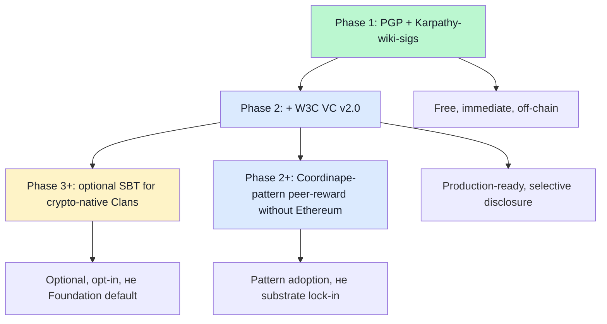

# 07 — H8 substrate matrix (5 options × 9 dimensions)

> **R1 surface-only.** Direct H8 LOCKED supplement: substrate-agnostic claim (positioning §4) requires empirical option matrix. **Most important deepening direction per priority order.**

> **EP-5:** F4 = W3C VC v2.0 primary spec (Recommendation 15 May 2025) + Coordinape docs + SBT SSRN paper + PGP WoT Wikipedia + Karpathy LLM Wiki gist (secondary).

---

## §0 TL;DR (≤200 слов)

H8 Trust Infrastructure LOCKED 2026-05-17 claims **substrate-agnostic role-attestation**. 5 production-ready/emerging substrates compared:

| Substrate | Maturity | Privacy | On-chain? | Cost | Best fit |
|---|---|---|---|---|---|
| **W3C VC v2.0** | Recommendation 15 May 2025 | Selective disclosure (SD-JWT, BBS, ZKP) | NO (default) | Free + crypto-suite implementation | Production credentials |
| **SBT (DeSoc)** | Paper 2022; limited prod | Identifiable (on-chain) | YES | Gas costs | Crypto-native community |
| **PGP Web of Trust** | Mature 1992+; ~57.5K strong set | Public key signing graph | NO | Free; UX friction | Niche / activist |
| **Karpathy wiki signatures** | Emerging 2026; convention-based | Public commit history | NO (Git) | Free | LLM-substrate community |
| **Coordinape GIVE/GET** | Production 2021+ | On-chain after epoch | YES (Ethereum) | Gas + tx fees | Working-DAO peer-reward |

**Critical finding:** **VC v2.0 + PGP + Karpathy-wiki-sigs are off-chain + free** — directly accommodate Jetix R12 + substrate-agnostic claim. **SBT + Coordinape are on-chain** — couple to crypto rails (Friend.tech-collapse vulnerability per direction 03).

**Recommended Jetix posture (brigadier inference, F3):** **launch with PGP + Karpathy-wiki-sigs (free, off-chain, immediate)**; **add VC v2.0 при Phase 2+ (production-ready, selective disclosure)**; **SBT + Coordinape опционально для crypto-native partner Clans, не Foundation default**.

---

## §1 9-dimension comparison matrix

| Dimension | W3C VC v2.0 | SBT | PGP WoT | Karpathy-wiki-sigs | Coordinape |
|---|---|---|---|---|---|
| **Maturity** | Rec 2025-05-15 | Paper 2022 + limited prod | 1992+ mature | 2026 emerging | 2021+ production |
| **Substrate substrate** | JSON-LD + multiple cryptosuites | Blockchain (Eth, etc) | OpenPGP / GnuPG | Git + Markdown | Ethereum smart contract |
| **Transferability** | Non-transferable (default) | Non-transferable («soul-bound») | Identity-bound | Commit-history-bound | Non-transferable (after conversion to GET) |
| **Privacy** | Selective disclosure + ZKP | Public + identifiable | Public key signing | Public commits | Public after epoch |
| **Anti-Sybil** | Issuer-anchored | Soul-anchored | WoT degrees | Commit-history pattern | Circle membership NFT |
| **Revocation** | Status registry standard | Burn requires governance | Key revocation cert | Git revert (lossy) | Reputation aging |
| **Cost (per attestation)** | Free / crypto-suite impl | Gas (1-10 USD) | Free | Free | Gas + epoch ops |
| **Production deployments** | None named in spec (Example University placeholder); secondary: TruAge, CA DMV, SpruceID | Limited; mostly research | ~57.5K strong set; mature niche | Karpathy LLM Wiki community; Jetix wiki/ adopter | DAOs: Yearn, Bankless, Index, gitcoin |
| **Lock-in risk** | Low (JSON-LD + multi-suite) | HIGH (blockchain coupling) | Medium (PGP UX friction) | Low (Git ubiquity) | HIGH (Ethereum gas) |

[src: w3.org/TR/vc-data-model-2.0/ retrieved 2026-05-18; docs.coordinape.com retrieved 2026-05-18; SBT SSRN paper 4105763; PGP Wikipedia article retrieved 2026-05-17]

---

## §2 Substrate-by-substrate deep notes

### §2.1 W3C VC v2.0 — production standard, off-chain default

**Status:** **W3C Recommendation 15 May 2025**. Production-ready. No spec-named deployments (Example University placeholder), but secondary references (TruAge, CA DMV, SpruceID, Danube Tech, ETRI) verified through research-adjacent cluster 5.

**Architecture:** 3-party (Issuer → Holder → Verifier). JSON-LD foundation; @context links credential semantics. Multiple cryptosuites supported (Data Integrity Proofs + JOSE/COSE + SD-JWT + BBS).

**Privacy:** **Selective disclosure via SD-JWT + BBS + ZKP** — credential holders can disclose fine-grained subsets, unlinkable across verifiers.

**Substrate flexibility:** «Other ecosystems exist, such as protected environments or proprietary systems» — spec explicitly allows non-default substrates. **No DID dependency** (commonly used together, not required).

**Jetix fit:** ✅ best long-term substrate. Off-chain, free, privacy-respecting, no crypto lock-in, mature spec, multiple cryptosuites. **Direction:** consider VC v2.0 as primary canonical FPF role-attestation substrate at Phase 2+.

### §2.2 SBT (Soulbound Tokens) — DeSoc paper 2022

**Status:** Buterin + Weyl + Ohlhaver paper «Decentralized Society: Finding Web3's Soul» (SSRN 4105763, May 2022). **Limited production adoption** despite high-profile authorship.

**Architecture:** non-transferable on-chain tokens; «Soul» = wallet receiving SBTs from community.

**Privacy:** **Identifiable** (on-chain by default); paper itself flags discrimination risk for identifiable SBT holders.

**Costs:** Ethereum gas; minting + transfer ops.

**Jetix fit:** ⚠️ Not Foundation-default. **Risks:**
1. Blockchain lock-in violates substrate-agnostic principle
2. Identifiability creates discrimination + extraction surface
3. Friend.tech-style financialization attractor (covered direction 03)
4. Russian L1 community may face regulatory barriers (sanctions + crypto rules)

**Optional surface:** crypto-native partner Clans (Phase 2+) могут pilot SBT as supplementary substrate, не Foundation canonical.

### §2.3 PGP Web of Trust — 1992+ mature

**Status:** **34 years operational** (1992 PGP v2.0). ~57.5K strong set (2019); decentralized fault-tolerant.

**Architecture:** public key signing graph; key signing parties verify identity → sign keys → transitive trust through signature depths.

**Privacy:** keys + signatures public; identifies signers (low privacy).

**Costs:** **Free**. UX friction is real cost (per cluster 5 research-adjacent failure mode).

**Jetix fit:** ✅ near-term substrate. **Pros:** free, off-chain, immediate, no infrastructure required, 30+ year proven. **Cons:** UX friction; key management burden; visibility/privacy trade-off.

**Direction:** PGP-signed FPF claims could ship Phase 1. Concrete experiment: each Foundation Part change carries PGP-signed attestation by reviewer. Immediate adoption; later layer VC v2.0 over.

### §2.4 Karpathy-wiki-signatures — convention emerging 2026

**Status:** convention-based; not formal protocol. Karpathy LLM Wiki community 1-month young at this report (April 2026 Gist).

**Architecture:** Markdown wiki + Git commit history + author/reviewer attribution patterns. Trust = «who edited what claim when, verified by Git commit history + cross-references».

**Privacy:** commit history public (Git default).

**Costs:** **Free** (uses existing Git substrate).

**Jetix fit:** ✅ immediate substrate. Already used in Jetix wiki/ + provenance R6 + F-G-R schema. **Direction:** **already canonical** — formalize the convention as «wiki-sig» protocol in shared/schemas/.

### §2.5 Coordinape GIVE/GET — peer-reward DAO substrate

**Status:** Production 2021+. Yearn / Bankless / Index / Gitcoin use. Working at-scale tool.

**Architecture:** epoch-based — at epoch start, members receive GIVE tokens; allocate to peers seen contributing; at epoch end, GIVE converts to GET (ERC-1155); total budget distributed proportional to GET. Circles require NFT membership.

**Privacy:** on-chain after epoch.

**Costs:** Ethereum gas + epoch operations.

**Jetix fit:** ⚠️ Optional. **Pros:** working peer-reward substrate; proven anti-gaming в DAO context. **Cons:** Ethereum lock-in; gas costs; on-chain identification; crypto-tribe coupling.

**Direction:** Workshop revenue distribution mechanism design could **borrow Coordinape epoch-peer-reward pattern** without locking к Coordinape substrate. F-G-R + epoch peer-allocation = adoptable design without Ethereum dependency.

---

## §3 Recommended Jetix layered approach

**Layered logic:**
1. **Phase 1 (immediate, free):** PGP-signed Foundation Part changes + Karpathy-wiki-sig convention formalized
2. **Phase 2 (production):** add VC v2.0 over Phase 1 (PGP + wiki-sig become VC issuance method)
3. **Phase 2+ (pattern adopt):** Coordinape epoch-peer-reward as Workshop revenue distribution mechanism (no Ethereum required)
4. **Phase 3+ (optional):** SBT for crypto-native partner Clans only

**Substrate-agnostic claim preserved:** Foundation requires F-G-R triple + role-attestation **shape**; specific substrate = RUSLAN-LAYER overlay per Clan / Phase.

---

## §4 Test-able H8 substrate statements

| # | Statement | Refutation horizon |
|---|---|---|
| H8S1 | Foundation Part change Phase 1 carries PGP signature | Phase 1 first Foundation change |
| H8S2 | Karpathy-wiki-sig convention formalized в shared/schemas/ | Phase 1 close |
| H8S3 | VC v2.0 implementation pilot Phase 2 | Phase 2 launch |
| H8S4 | NO single substrate becomes «THE» Foundation default | Continuous |
| H8S5 | Workshop revenue mechanism does NOT require Ethereum | Phase 1 Workshop |
| H8S6 | At least 1 fork-and-leave test event preserves attestation portability | Phase 1-2 |

---

## §5 Counter-positions (AP-6 dissent)

- **Counter 1:** «Substrate-agnostic» = decision paralysis. Pick ONE and commit. **Surface:** valid concern. Layered approach §3 = decision (PGP + wiki-sig Phase 1; VC Phase 2) — not endless deferral.
- **Counter 2:** VC v2.0 production deployments unverified in spec text (Example University placeholders). Maybe less mature than claimed. **Surface:** legitimate; cluster 5 secondary references (TruAge / CA DMV / SpruceID) need re-verification at Phase 2 launch.
- **Counter 3:** Karpathy-wiki-sig convention = wishful thinking; no protocol exists. **Surface:** true — Jetix would author the convention. Risk = lone-substrate trajectory if no other community adopts. Mitigation: contribute draft к Karpathy LLM Wiki community.
- **Counter 4:** Coordinape pattern-adoption without Coordinape substrate = «borrowed design», potential IP/credibility concern. **Surface:** mostly false — peer-reward epoch logic is conceptual, not proprietary; many DAOs/companies use variants.

---

## §6 Sources (URLs retrieved 2026-05-18)

- [W3C VC Data Model v2.0 — Recommendation 15 May 2025](https://www.w3.org/TR/vc-data-model-2.0/) — F4 primary
- [Coordinape Docs](https://docs.coordinape.com/) — F4 primary
- [Coordinape main](https://coordinape.com/) — F4 primary
- [DAO Masters Coordinape entry](https://www.daomasters.xyz/tools/coordinape) — F3 secondary
- [SBT (DeSoc) SSRN paper](https://papers.ssrn.com/sol3/papers.cfm?abstract_id=4105763) — F4 primary (referenced; не WebFetched this pass)
- [Web of trust — Wikipedia](https://en.wikipedia.org/wiki/Web_of_trust) — F3 secondary
- [Karpathy LLM Wiki Gist](https://gist.github.com/karpathy/442a6bf555914893e9891c11519de94f) — F4 primary

---

## §7 What this is NOT

- **NOT decision on H8 substrate** — surface comparison per R1; Ruslan picks
- **NOT promotion of crypto substrate** — explicit recommendation to delay SBT
- **NOT exhaustive substrate inventory** — 5 substrates only; ZKPs, BBS-credentials, DIDs, other CRDT-based alternatives не deeply covered

**Word count:** ~1900
