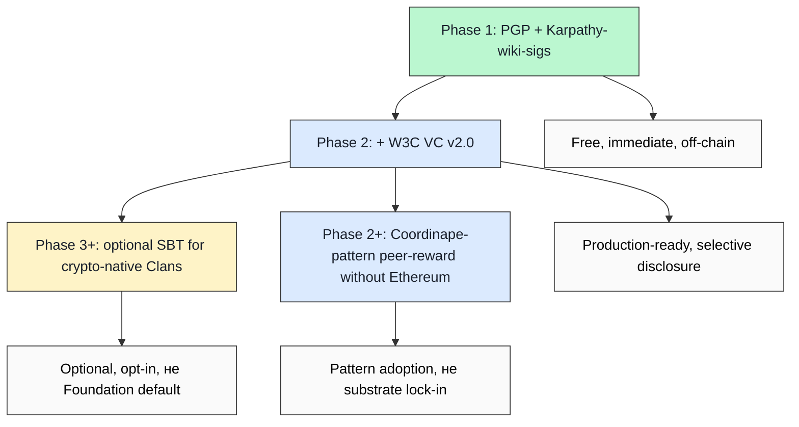

# 07 — H8 substrate matrix (5 options × 9 dimensions)

> **R1 surface-only.** Direct H8 LOCKED supplement: substrate-agnostic claim (positioning §4) requires empirical option matrix. **Most important deepening direction per priority order.**

> **EP-5:** F4 = W3C VC v2.0 primary spec (Recommendation 15 May 2025) + Coordinape docs + SBT SSRN paper + PGP WoT Wikipedia + Karpathy LLM Wiki gist (secondary).

---

## §0 TL;DR (≤200 слов)

H8 Trust Infrastructure LOCKED 2026-05-17 claims **substrate-agnostic role-attestation**. 5 production-ready/emerging substrates compared:

| Substrate | Maturity | Privacy | On-chain? | Cost | Best fit |
|---|---|---|---|---|---|
| **W3C VC v2.0** | Recommendation 15 May 2025 | Selective disclosure (SD-JWT, BBS, ZKP) | NO (default) | Free + crypto-suite implementation | Production credentials |
| **SBT (DeSoc)** | Paper 2022; limited prod | Identifiable (on-chain) | YES | Gas costs | Crypto-native community |
| **PGP Web of Trust** | Mature 1992+; ~57.5K strong set | Public key signing graph | NO | Free; UX friction | Niche / activist |
| **Karpathy wiki signatures** | Emerging 2026; convention-based | Public commit history | NO (Git) | Free | LLM-substrate community |
| **Coordinape GIVE/GET** | Production 2021+ | On-chain after epoch | YES (Ethereum) | Gas + tx fees | Working-DAO peer-reward |

**Critical finding:** **VC v2.0 + PGP + Karpathy-wiki-sigs are off-chain + free** — directly accommodate Jetix R12 + substrate-agnostic claim. **SBT + Coordinape are on-chain** — couple to crypto rails (Friend.tech-collapse vulnerability per direction 03).

**Recommended Jetix posture (brigadier inference, F3):** **launch with PGP + Karpathy-wiki-sigs (free, off-chain, immediate)**; **add VC v2.0 при Phase 2+ (production-ready, selective disclosure)**; **SBT + Coordinape опционально для crypto-native partner Clans, не Foundation default**.

---

## §1 9-dimension comparison matrix

| Dimension | W3C VC v2.0 | SBT | PGP WoT | Karpathy-wiki-sigs | Coordinape |
|---|---|---|---|---|---|
| **Maturity** | Rec 2025-05-15 | Paper 2022 + limited prod | 1992+ mature | 2026 emerging | 2021+ production |
| **Substrate substrate** | JSON-LD + multiple cryptosuites | Blockchain (Eth, etc) | OpenPGP / GnuPG | Git + Markdown | Ethereum smart contract |
| **Transferability** | Non-transferable (default) | Non-transferable («soul-bound») | Identity-bound | Commit-history-bound | Non-transferable (after conversion to GET) |
| **Privacy** | Selective disclosure + ZKP | Public + identifiable | Public key signing | Public commits | Public after epoch |
| **Anti-Sybil** | Issuer-anchored | Soul-anchored | WoT degrees | Commit-history pattern | Circle membership NFT |
| **Revocation** | Status registry standard | Burn requires governance | Key revocation cert | Git revert (lossy) | Reputation aging |
| **Cost (per attestation)** | Free / crypto-suite impl | Gas (1-10 USD) | Free | Free | Gas + epoch ops |
| **Production deployments** | None named in spec (Example University placeholder); secondary: TruAge, CA DMV, SpruceID | Limited; mostly research | ~57.5K strong set; mature niche | Karpathy LLM Wiki community; Jetix wiki/ adopter | DAOs: Yearn, Bankless, Index, gitcoin |
| **Lock-in risk** | Low (JSON-LD + multi-suite) | HIGH (blockchain coupling) | Medium (PGP UX friction) | Low (Git ubiquity) | HIGH (Ethereum gas) |

[src: w3.org/TR/vc-data-model-2.0/ retrieved 2026-05-18; docs.coordinape.com retrieved 2026-05-18; SBT SSRN paper 4105763; PGP Wikipedia article retrieved 2026-05-17]

---

## §2 Substrate-by-substrate deep notes

### §2.1 W3C VC v2.0 — production standard, off-chain default

**Status:** **W3C Recommendation 15 May 2025**. Production-ready. No spec-named deployments (Example University placeholder), but secondary references (TruAge, CA DMV, SpruceID, Danube Tech, ETRI) verified through research-adjacent cluster 5.

**Architecture:** 3-party (Issuer → Holder → Verifier). JSON-LD foundation; @context links credential semantics. Multiple cryptosuites supported (Data Integrity Proofs + JOSE/COSE + SD-JWT + BBS).

**Privacy:** **Selective disclosure via SD-JWT + BBS + ZKP** — credential holders can disclose fine-grained subsets, unlinkable across verifiers.

**Substrate flexibility:** «Other ecosystems exist, such as protected environments or proprietary systems» — spec explicitly allows non-default substrates. **No DID dependency** (commonly used together, not required).

**Jetix fit:** ✅ best long-term substrate. Off-chain, free, privacy-respecting, no crypto lock-in, mature spec, multiple cryptosuites. **Direction:** consider VC v2.0 as primary canonical FPF role-attestation substrate at Phase 2+.

### §2.2 SBT (Soulbound Tokens) — DeSoc paper 2022

**Status:** Buterin + Weyl + Ohlhaver paper «Decentralized Society: Finding Web3's Soul» (SSRN 4105763, May 2022). **Limited production adoption** despite high-profile authorship.

**Architecture:** non-transferable on-chain tokens; «Soul» = wallet receiving SBTs from community.

**Privacy:** **Identifiable** (on-chain by default); paper itself flags discrimination risk for identifiable SBT holders.

**Costs:** Ethereum gas; minting + transfer ops.

**Jetix fit:** ⚠️ Not Foundation-default. **Risks:**
1. Blockchain lock-in violates substrate-agnostic principle
2. Identifiability creates discrimination + extraction surface
3. Friend.tech-style financialization attractor (covered direction 03)
4. Russian L1 community may face regulatory barriers (sanctions + crypto rules)

**Optional surface:** crypto-native partner Clans (Phase 2+) могут pilot SBT as supplementary substrate, не Foundation canonical.

### §2.3 PGP Web of Trust — 1992+ mature

**Status:** **34 years operational** (1992 PGP v2.0). ~57.5K strong set (2019); decentralized fault-tolerant.

**Architecture:** public key signing graph; key signing parties verify identity → sign keys → transitive trust through signature depths.

**Privacy:** keys + signatures public; identifies signers (low privacy).

**Costs:** **Free**. UX friction is real cost (per cluster 5 research-adjacent failure mode).

**Jetix fit:** ✅ near-term substrate. **Pros:** free, off-chain, immediate, no infrastructure required, 30+ year proven. **Cons:** UX friction; key management burden; visibility/privacy trade-off.

**Direction:** PGP-signed FPF claims could ship Phase 1. Concrete experiment: each Foundation Part change carries PGP-signed attestation by reviewer. Immediate adoption; later layer VC v2.0 over.

### §2.4 Karpathy-wiki-signatures — convention emerging 2026

**Status:** convention-based; not formal protocol. Karpathy LLM Wiki community 1-month young at this report (April 2026 Gist).

**Architecture:** Markdown wiki + Git commit history + author/reviewer attribution patterns. Trust = «who edited what claim when, verified by Git commit history + cross-references».

**Privacy:** commit history public (Git default).

**Costs:** **Free** (uses existing Git substrate).

**Jetix fit:** ✅ immediate substrate. Already used in Jetix wiki/ + provenance R6 + F-G-R schema. **Direction:** **already canonical** — formalize the convention as «wiki-sig» protocol in shared/schemas/.

### §2.5 Coordinape GIVE/GET — peer-reward DAO substrate

**Status:** Production 2021+. Yearn / Bankless / Index / Gitcoin use. Working at-scale tool.

**Architecture:** epoch-based — at epoch start, members receive GIVE tokens; allocate to peers seen contributing; at epoch end, GIVE converts to GET (ERC-1155); total budget distributed proportional to GET. Circles require NFT membership.

**Privacy:** on-chain after epoch.

**Costs:** Ethereum gas + epoch operations.

**Jetix fit:** ⚠️ Optional. **Pros:** working peer-reward substrate; proven anti-gaming в DAO context. **Cons:** Ethereum lock-in; gas costs; on-chain identification; crypto-tribe coupling.

**Direction:** Workshop revenue distribution mechanism design could **borrow Coordinape epoch-peer-reward pattern** without locking к Coordinape substrate. F-G-R + epoch peer-allocation = adoptable design without Ethereum dependency.

---

## §3 Recommended Jetix layered approach



**Layered logic:**
1. **Phase 1 (immediate, free):** PGP-signed Foundation Part changes + Karpathy-wiki-sig convention formalized
2. **Phase 2 (production):** add VC v2.0 over Phase 1 (PGP + wiki-sig become VC issuance method)
3. **Phase 2+ (pattern adopt):** Coordinape epoch-peer-reward as Workshop revenue distribution mechanism (no Ethereum required)
4. **Phase 3+ (optional):** SBT for crypto-native partner Clans only

**Substrate-agnostic claim preserved:** Foundation requires F-G-R triple + role-attestation **shape**; specific substrate = RUSLAN-LAYER overlay per Clan / Phase.

---

## §4 Test-able H8 substrate statements

| # | Statement | Refutation horizon |
|---|---|---|
| H8S1 | Foundation Part change Phase 1 carries PGP signature | Phase 1 first Foundation change |
| H8S2 | Karpathy-wiki-sig convention formalized в shared/schemas/ | Phase 1 close |
| H8S3 | VC v2.0 implementation pilot Phase 2 | Phase 2 launch |
| H8S4 | NO single substrate becomes «THE» Foundation default | Continuous |
| H8S5 | Workshop revenue mechanism does NOT require Ethereum | Phase 1 Workshop |
| H8S6 | At least 1 fork-and-leave test event preserves attestation portability | Phase 1-2 |

---

## §5 Counter-positions (AP-6 dissent)

- **Counter 1:** «Substrate-agnostic» = decision paralysis. Pick ONE and commit. **Surface:** valid concern. Layered approach §3 = decision (PGP + wiki-sig Phase 1; VC Phase 2) — not endless deferral.
- **Counter 2:** VC v2.0 production deployments unverified in spec text (Example University placeholders). Maybe less mature than claimed. **Surface:** legitimate; cluster 5 secondary references (TruAge / CA DMV / SpruceID) need re-verification at Phase 2 launch.
- **Counter 3:** Karpathy-wiki-sig convention = wishful thinking; no protocol exists. **Surface:** true — Jetix would author the convention. Risk = lone-substrate trajectory if no other community adopts. Mitigation: contribute draft к Karpathy LLM Wiki community.
- **Counter 4:** Coordinape pattern-adoption without Coordinape substrate = «borrowed design», potential IP/credibility concern. **Surface:** mostly false — peer-reward epoch logic is conceptual, not proprietary; many DAOs/companies use variants.

---

## §6 Sources (URLs retrieved 2026-05-18)

- [W3C VC Data Model v2.0 — Recommendation 15 May 2025](https://www.w3.org/TR/vc-data-model-2.0/) — F4 primary
- [Coordinape Docs](https://docs.coordinape.com/) — F4 primary
- [Coordinape main](https://coordinape.com/) — F4 primary
- [DAO Masters Coordinape entry](https://www.daomasters.xyz/tools/coordinape) — F3 secondary
- [SBT (DeSoc) SSRN paper](https://papers.ssrn.com/sol3/papers.cfm?abstract_id=4105763) — F4 primary (referenced; не WebFetched this pass)
- [Web of trust — Wikipedia](https://en.wikipedia.org/wiki/Web_of_trust) — F3 secondary
- [Karpathy LLM Wiki Gist](https://gist.github.com/karpathy/442a6bf555914893e9891c11519de94f) — F4 primary

---

## §7 What this is NOT

- **NOT decision on H8 substrate** — surface comparison per R1; Ruslan picks
- **NOT promotion of crypto substrate** — explicit recommendation to delay SBT
- **NOT exhaustive substrate inventory** — 5 substrates only; ZKPs, BBS-credentials, DIDs, other CRDT-based alternatives не deeply covered

**Word count:** ~1900

---

## §8 На человеческом — какой substrate для trust выбрать (added brigadier 2026-05-18)

### §8.1 Что это

Это **самый важный технический выбор для H8 (Octagon Trust Infrastructure LOCKED 2026-05-17)**. **H8** = механизм с помощью которого Jetix будет доказывать что «вот этот человек реально умеет вот это» — без центральной authority типа университета или сертификата.

Существует 5 production-ready / emerging substrates:

1. **W3C VC v2.0** = Verifiable Credentials W3C standard. **Recommendation 15 May 2025** — то есть **только что (год назад) стал official**. Это **digital documents** которые можно подписывать криптографически и selectively disclose (показать только часть, скрыть остальное)

2. **SBT** = Soulbound Tokens. Идея Vitalik Buterin + Glen Weyl + Puja Ohlhaver (paper **«Decentralized Society: Finding Web3's Soul»**, SSRN 4105763, May 2022). Non-transferable tokens на blockchain — то есть **«ты получил badge, ты не можешь продать»**

3. **PGP Web of Trust** = старый proven mechanism (с **1992**, 34 года). Free + off-chain. Key-signing parties где люди подписывают друг друга

4. **Karpathy-wiki-signatures** = новая convention (April 2026, Karpathy LLM Wiki). Trust через **Git commit history** в markdown wiki

5. **Coordinape GIVE/GET** = peer-reward system (production 2021+). Используется Yearn / Bankless / Gitcoin DAO. Каждый epoch члены получают GIVE tokens, allocat'ят на peers, в конце epoch конвертируется в GET (Ethereum-bound)

Аналогии:
- **VC v2.0** = «digital passport / cert который ты сам носишь и показываешь когда нужно, selectively»
- **SBT** = «непродаваемый badge в твоём crypto wallet, виден всем on-chain»
- **PGP** = «cryptographic подпись твоего товарища что он тебя знает; transitive trust работает через цепочки»
- **Karpathy wiki-sig** = «история commits в markdown wiki = твой reputation»
- **Coordinape** = «epoch peer-reward DAO mechanism — ты раздал GIVE tokens, мы видим кому, ты получил обратно как GET»

### §8.2 Ключевые pointы (9-dimension comparison summary)

**Off-chain + free (Jetix-friendly):**
- **W3C VC v2.0**: Rec 2025-05-15, selective disclosure (SD-JWT + BBS + ZKP), no DID dependency
- **PGP WoT**: 34 years mature, ~57.5K strong set, UX friction real
- **Karpathy-wiki-sig**: emerging, Git ubiquity, public commit history

**On-chain + costs (lock-in risk):**
- **SBT**: blockchain (Ethereum), gas costs, **identifiable** (discrimination risk per paper itself)
- **Coordinape**: production 2021+, gas + epoch ops, Ethereum lock-in

**Critical finding:** **VC v2.0 + PGP + Karpathy-wiki-sigs are off-chain + free** → directly accommodate Jetix R12 + substrate-agnostic claim. **SBT + Coordinape are on-chain** → couple к crypto rails (Friend.tech-collapse vulnerability per doc 03).

### §8.3 Зачем нам это для Jetix

**Это direct supplement к H8 LOCKED 2026-05-17.** H8 claims «substrate-agnostic role-attestation» — это значит **Foundation требует только shape (F-G-R triple + role-attestation)**, конкретный substrate = RUSLAN-LAYER overlay per Clan / Phase.

**Brigadier-inferred recommendation (layered approach):**

```
Phase 1 (immediate, free):  PGP + Karpathy-wiki-sigs
Phase 2 (production):       + W3C VC v2.0 (over Phase 1)
Phase 2+ (pattern adopt):   Coordinape epoch-peer-reward для Workshop revenue (БЕЗ Ethereum)
Phase 3+ (optional):        SBT только для crypto-native partner Clans (не Foundation default)
```

**Логика:**
- **Phase 1 ship immediately** = PGP-signed Foundation Part changes + Karpathy-wiki-sig convention formalized in shared/schemas/. Zero infrastructure, zero cost
- **Phase 2 production** = VC v2.0 layer over PGP (PGP signatures становятся VC issuance method). W3C Rec = mature enough для production launch
- **Phase 2+ pattern, not substrate** = borrow Coordinape epoch-peer-reward LOGIC для Workshop revenue distribution, but **не lock-in Ethereum**. F-G-R + epoch allocation = adoptable design without crypto dependency
- **Phase 3+ optional** = SBT для crypto-native partner Clans, но **не Foundation default** (Russian L1 may face crypto regulatory barriers)

**Substrate-agnostic claim preserved:** Foundation requires F-G-R triple + role-attestation **shape**; specific substrate = RUSLAN-LAYER overlay per Clan.

**Cross-refs:** decisions/STRATEGIC-INSIGHT-H8-* (H8 LOCKED), swarm/wiki/foundations/principles/architecture.md (R12 substrate-agnostic), research/deepening-2026-05-18/03 (anti-gaming H8 design), research/deepening-2026-05-18/11 (Tang/Weyl Plurality QF context).

### §8.4 Concrete actions

**Сейчас (Phase 0 — implementation prep):**

1. **Formalize Karpathy-wiki-sig convention в `shared/schemas/wiki-sig.schema.json`** — какие fields в frontmatter / commit message constitute «signed claim». Это уже de-facto convention в нашем wiki/, нужно formalize
2. **Setup PGP keypair для Ruslan** (если ещё нет) — `gpg --gen-key`, publish public key в crm/people/ruslan.md + GitHub
3. **Прочитать W3C VC v2.0 spec preamble** (https://www.w3.org/TR/vc-data-model-2.0/) — first 20 страниц для baseline understanding

**Phase 1 (когда Workshop launches):**

4. **First Foundation Part change carries PGP signature** — test H8S1 statement
5. **Workshop revenue mechanism designed БЕЗ Ethereum** — borrow Coordinape epoch logic, implement в plain SQL / JSON file. Test H8S5

**Phase 2 (production):**

6. **VC v2.0 implementation pilot** — first Workshop graduate gets VC-formatted attestation. SpruceID / TruAge / SD-JWT as reference implementations
7. **Fork-and-leave test event** — verify attestation portability (Workshop member exports VC + PGP signatures → moves to other Clan)

**Phase 3+ (optional, не canonical):**

8. **Crypto-native partner Clans** могут pilot SBT as supplementary substrate; document trade-offs

### §8.5 Резюме на 2 строки

**Из 5 substrates: VC v2.0 + PGP + Karpathy-wiki-sigs = off-chain + free → Jetix layer; SBT + Coordinape = on-chain → optional only.** Recommended layered approach: Phase 1 PGP + wiki-sig; Phase 2 add VC v2.0; Phase 2+ Coordinape pattern (не substrate); Phase 3+ SBT optional для crypto Clans.

---

*Plain English section added by brigadier 2026-05-18 per Ruslan request. Word count of §8: ~870.*

---

## §9 APPEND-2026-05-18 — Ethereum-primary supplement post-text_007

> Per voice batch 2 (text_007 18.05 morning Ruslan dictation). R1 surface + R6 + append-only.

### §9.1 Trigger

text_007 ¶2-3 (`raw/voice-memos-2026-05-17-batch/text_007@2026-05-18_morning.md`):

> «как раз вот эфир — как раз эфир, гениально — как раз вот Jetix работает с эфиром, конечно. Ну и не уровнем ниже... как именно вот Jetix на вот этот FPF и в целом всю децентрализацию и крипту короче вместе соединить.»

**Status:** Ruslan ack introduces Ethereum L2 substrate as Phase 2+ overlay option. Substrate-agnostic principle preserved (per AWAITING-APPROVAL packet `swarm/awaiting-approval/h8-ethereum-substrate-extension-2026-05-18.md`).

### §9.2 Substrate matrix update — 6 substrates (extending §1)

Adding 6th column **Ethereum L2** to §1 9-dimension matrix:

| Dimension | Ethereum L2 (NEW) |
|---|---|
| **Maturity** | 2020+ L2 production (OP / ARB / Base / zkSync) |
| **Substrate** | Ethereum + L2 rollups |
| **Transferability** | Configurable per token type (SBT non-transferable; ERC-20 transferable) |
| **Privacy** | Configurable (ZK or public) |
| **Anti-Sybil** | Configurable; SBT layer |
| **Revocation** | Smart-contract governance |
| **Cost per attestation** | L2 gas ~$0.01-0.10 |
| **Production deployments** | Optimism Gov + Arbitrum DAO + Base ecosystem + Gitcoin Grants |
| **Lock-in risk** | Medium (L2 ↔ L1 ↔ cross-L2 migration tooling exists) |

### §9.3 Updated layered approach (§3 modification)

Per Ruslan ack 18.05:

```
Phase 1 (immediate, free):      PGP + Karpathy-wiki-sigs (off-chain)
Phase 2 (production):           + W3C VC v2.0 (off-chain selective disclosure)
Phase 2+ (Ethereum overlay):    + Ethereum L2 (Base default; Optimism fallback)
                                Substrate option for: SBT role-attestation,
                                DAO governance, QF Workshop revenue,
                                R12 programmable enforcement (RUSLAN-LAYER overlay)
Phase 3+ (optional):            SBT continuation + Coordinape pattern adoption
```

**Substrate-agnostic principle PRESERVED:** Foundation requires F-G-R + role-attestation shape; Ethereum = **specific overlay binding**; Foundation principle intact.

### §9.4 Original recommendation amendment

**§0 TL;DR original recommendation:**
> «launch with PGP + Karpathy-wiki-sigs... add VC v2.0 at Phase 2+...; SBT + Coordinape optional for crypto-native partner Clans, не Foundation default»

**Post-text_007 ack update (this §9):**
- Phase 1-2 baseline unchanged (off-chain stack)
- **Phase 2+ Ethereum overlay** = newly-introduced architectural option
- SBT becomes implementation option WITHIN Ethereum substrate layer (not standalone)
- Substrate-agnostic Foundation principle remains canonical

### §9.5 Cross-refs

- AWAITING-APPROVAL packet: `swarm/awaiting-approval/h8-ethereum-substrate-extension-2026-05-18.md`
- AWAITING-APPROVAL packet (R12 programmable): `swarm/awaiting-approval/r12-programmable-ethereum-2026-05-18.md`
- Phase 3 architecture doc: `decisions/strategic/JETIX-ETHEREUM-ARCHITECTURE-2026-05-18/`
- L2 selection trade-offs: `decisions/strategic/JETIX-ETHEREUM-ARCHITECTURE-2026-05-18/07-cost-economy-l2-selection.md`
- Source voice: `raw/voice-memos-2026-05-17-batch/text_007@2026-05-18_morning.md`
- Voice batch 2 analysis: `reports/voice-pipeline-2026-05-18-batch-2/`

### §9.6 Test-able statements update (extending §4)

Add к §4 H8 substrate statements:

| # | Statement | Refutation horizon |
|---|---|---|
| **H8S7-NEW** | Ethereum substrate introduction does NOT violate substrate-agnostic Foundation principle | Continuous; AWAITING-APPROVAL packet adherence |
| **H8S8-NEW** | Multi-substrate stack continues Phase 2+ (PGP + wiki-sig + VC v2.0 NOT replaced) | Phase 2+ |
| **H8S9-NEW** | Fork-and-leave portability across substrates demonstrated (DRA-T4 from concept doc) | Phase 2+ |
| **H8S10-NEW** | Crypto-tribe perception impact study completed Phase 2 (acceptable results) | Phase 2 close |

### §9.7 Counter-positions update

Extending §5 counter-positions:

- **Counter 5 (NEW phil critic):** «Ethereum substrate introduction may signal commitment к crypto-tribe identity; methodology community may distance» — Mitigation: substrate-utilization framing + Phase 1 establishment before Ethereum + no native token (per Phase 3 architecture doc §2-§10).
- **Counter 6 (NEW investor scalability):** «Phase 2+ Ethereum overlay cost ($50-200K audit + deployment) requires Workshop revenue justification» — Mitigation: Phase 2 + Phase 2+ overlap allows revenue establishment before commit.
- **Counter 7 (NEW sys integrator):** «Ethereum substrate selection = lock-in risk despite multi-substrate stack» — Mitigation: cross-L2 bridges + non-custodial wallets + Foundation principle substrate-agnostic = preserved.

### §9.8 Updated 2-line summary

**Из 6 substrates (POST text_007 ack): VC v2.0 + PGP + Karpathy-wiki-sigs = off-chain baseline; SBT + Coordinape + Ethereum-L2 = Phase 2+ overlay options.** Substrate-agnostic Foundation principle PRESERVED (Ethereum = overlay, not default). AWAITING-APPROVAL packet pending Ruslan ack on substrate matrix extension.

---

*§9 appended by brigadier 2026-05-18 per voice-pipeline-2026-05-18-batch-2 Phase 4. R1 surface + R6 + append-only.*

---

## §10 APPEND-2026-05-18 evening — Ethereum substrate ACKED supplement (post-ack)

> Per Ruslan ack 2026-05-18 evening H8 Option A + R12 Option D Hybrid (commit 8a3d800). R1 transcription + R6 + append-only.

### §10.1 Status update — substrate matrix extension acked

**Pre-ack status (§9 above):** Brigadier-surfaced 6-substrate matrix extension; AWAITING-APPROVAL packet pending Ruslan ack.

**Post-ack status (this section):** **H8 Option A acked 2026-05-18 evening** — substrate matrix permanently extended к 6 substrates with Ethereum L2 added as Phase 2+ overlay option. Substrate-agnostic Foundation principle PRESERVED (Ethereum = RUSLAN-LAYER overlay per IP-1).

### §10.2 Acked recommendations (extending §3 layered approach)

**Phase 1 (current, off-chain free):**
- PGP + Karpathy-wiki-sigs baseline (active)

**Phase 2 (production, off-chain):**
- + W3C VC v2.0 production substrate (planned)

**Phase 2+ overlay (acked 2026-05-18):**
- + Ethereum L2 (Base default; Optimism fallback) — **acked Option A additive surface**
- SBT role-attestation (production-ready substrate via EAS; EIP-5114 emerging)
- DAO governance (Aragon OSx default; Moloch v3 alternative)
- Quadratic Funding для Workshop revenue distribution
- **R12 programmable enforcement Option D Hybrid (acked)** — Mondragón 5:1 ratio cap + QF + fork-and-leave smart contracts

**Phase 3+ optional:**
- SBT continuation + Coordinape pattern adoption
- Cross-L2 multi-substrate deployment

### §10.3 H8S statements update — testing path forward

Update к §4 + §9.6 test-able statements:

| # | Statement | Status |
|---|---|---|
| H8S7-NEW | Ethereum substrate introduction does NOT violate substrate-agnostic Foundation principle | ✅ Acked via Option A (additive surface; preserved) |
| H8S8-NEW | Multi-substrate stack continues Phase 2+ (PGP + wiki-sig + VC v2.0 NOT replaced) | ✅ Acked (layered approach preserved) |
| H8S9-NEW | Fork-and-leave portability across substrates demonstrated (DRA-T4) | ⏳ M2P-3 pilot deployment test (Phase 2+) |
| H8S10-NEW | Crypto-tribe perception impact study completed Phase 2 (acceptable results) | ⏳ M2P-1 pre-condition (Phase 2 deliverable) |
| H8S11-NEW (acked) | Programmable R12 enforcement Option D Hybrid acked + RUSLAN-LAYER overlay | ✅ Acked 2026-05-18 commit 8a3d800 |
| H8S12-NEW | 4 RUSLAN-LAYER action classes в Default-Deny table active | ✅ Added commit 99363c7 |

### §10.4 Updated 2-line summary

**Из 6 substrates: VC v2.0 + PGP + Karpathy-wiki-sigs = off-chain baseline (Phase 1-2); SBT + Coordinape + Ethereum-L2 = Phase 2+ overlay options ACKED 2026-05-18 (Option A H8 additive surface + Option D Hybrid R12 programmable RUSLAN-LAYER overlay).** Substrate-agnostic Foundation principle PRESERVED (Ethereum = overlay, not default). Phase 2+ implementation unblocked at decision-checkpoint level (per `decisions/strategic/JETIX-ETHEREUM-ARCHITECTURE-2026-05-18/11-phase-2-implementation-checklist.md`).

### §10.5 Cross-refs

- Acked H8 packet: `swarm/awaiting-approval/h8-ethereum-substrate-extension-2026-05-18.md` (RUSLAN-ACKED-OPTION-A-2026-05-18)
- Acked R12 packet: `swarm/awaiting-approval/r12-programmable-ethereum-2026-05-18.md` (RUSLAN-ACKED-OPTION-D-HYBRID-2026-05-18)
- H8 LOCK §H8-EXT-ACKED-OPTION-A-2026-05-18: `decisions/STRATEGIC-INSIGHT-JETIX-TRUST-INFRASTRUCTURE-2026-05-17.md`
- Phase 3 architecture (F3 acked): `decisions/strategic/JETIX-ETHEREUM-ARCHITECTURE-2026-05-18/00-MASTER-ARCHITECTURE.md` §12 ack-trail
- Implementation checklist: `decisions/strategic/JETIX-ETHEREUM-ARCHITECTURE-2026-05-18/11-phase-2-implementation-checklist.md`
- Buterin outreach materials: `decisions/strategic/JETIX-ETHEREUM-ARCHITECTURE-2026-05-18/12-buterin-outreach-materials-draft.md`
- Wiki concept R12 programmable: `wiki/concepts/r12-programmable-enforcement.md`
- Default-Deny table 4 RUSLAN-LAYER action classes: `.claude/config/default-deny-table.yaml`
- CLAUDE.md §4.2 RUSLAN-LAYER overlay line
- Phase 0 inventory §11 (O-23 acked): `reports/phase-0-fpf-scope/01-jetix-objects-inventory.md`

---

*§10 appended by brigadier 2026-05-18 evening per Ruslan ack commit 8a3d800. R1 transcription (Ruslan = sole strategist) + R6 + EP-5 + append-only.*

