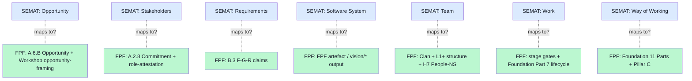

# 08 — SEMAT Essence Kernel vs FPF gap analysis

> **R1 surface-only.** Closest direct precedent для FPF universal-language ambition. Direct competitive methodology kernel analysis.

> **EP-5:** F3 = SEMAT.org docs + ACM Queue 2012 paper references + OMG Essence Specification v1.2 (2018) + 2013 OMG beta status verified.

---

## §0 TL;DR (≤200 слов)

SEMAT (Software Engineering Methods and Theory) — Ivar Jacobson + colleagues, initiative founded **2009+**. Essence Kernel = «simple thinking framework to help teams understand the progress and health of their endeavor». **OMG beta standard 2013; Essence Specification v1.2 released 2018.**

**ALPHA** acronym = «Abstract Level Progress and Health Attribute».

**7 Alphas** (canonical):
1. **Opportunity** (why) — business case
2. **Stakeholders** (who-cares) — actors with interest
3. **Requirements** (what) — needs to satisfy
4. **Software System** (what-built) — the product
5. **Team** (who-does) — humans + skills
6. **Work** (how-tracked) — units of effort
7. **Way of Working** (how-organized) — chosen methods + practices

**Each Alpha has state transitions** (e.g., Software System: Architecture Selected → Demonstrable → Usable → Ready → Operational → Retired).

**Adoption:** modest — KTH Royal Institute Sweden first/second-year SE courses; OMG-standardized; **never reached Scrum-scale viral adoption** despite Jacobson's pedigree (Unified Process pioneer).

**Adoption hypothesis (cluster 4 research-adjacent):** abstract framework без specific viral incentive + competing against entrenched Scrum certification economy.

**Direct Jetix lesson:** FPF universal-language claim = SEMAT-grade ambition. FPF must learn from SEMAT slow-adoption pattern: **abstract substrate insufficient; need viral tooling + community vehicle + payoff mechanism**.

---

## §1 SEMAT Essence vs FPF — feature comparison

| Dimension | SEMAT Essence | FPF (Jetix) | Same? |
|---|---|---|---|
| **Year established** | 2009 (initiative); 2013 (OMG beta); 2018 (v1.2) | 2026-04 (LOCKED v1.0) | NO — 17 years later |
| **Scope** | Software engineering only | Engineering broadly (cross-domain) | DIFFERENT — Jetix wider |
| **Substrate** | Kernel + language layer | F-G-R schema + A.6.B dual-encoding + Karpathy wiki | DIFFERENT — Jetix AI-native |
| **Core primitives** | 7 Alphas + states | 14 objects (Phase 0) + A.2.8 Commitment + A.2.9 SpeechAct + B.3 F-G-R + B.7 wiki | OVERLAPPING but не identical |
| **Methodology-as-modular** | Yes (compose practices via kernel) | Yes (FPF objects compose to methodology stack) | SAME concept |
| **Health monitoring** | Alpha state cards | F-G-R + Foundation Part 8 health monitoring | SAME concept |
| **Standardization** | OMG Standard | Constitutional (Foundation Architecture LOCKED) | DIFFERENT — governance shape |
| **Adoption velocity** | Slow (15 years niche) | Phase 0 (untested) | TBD |
| **Audience** | Software engineers | Cross-domain engineers + AI substrate | DIFFERENT — Jetix wider |
| **Language** | English-default | Russian + English bilingual | DIFFERENT |
| **AI-readability** | Not designed для AI | A.6.B dual-encoding for AI | DIFFERENT — Jetix-unique |
| **Constitutional governance** | None (standard, not governance) | Pillar C Tier 2 + Default-Deny + R12 + Corrigibility | DIFFERENT — Jetix-unique |
| **Trust infrastructure** | None | H8 Octagon LOCKED | DIFFERENT — Jetix-unique |
| **Network State framing** | None | H4 LOCKED | DIFFERENT — Jetix-unique |

**Result:** **3 overlapping concepts** (methodology-modularity / health-monitoring / common-ground); **9 distinct dimensions** (substrate / cross-domain / AI / governance / trust / NS / bilingual / pre-mortem / Workshop).

---

## §2 SEMAT 7 Alphas ↔ FPF object mapping

**Mapping inference (brigadier F3):** all 7 SEMAT Alphas have rough FPF analogs **but** Jetix splits some into multiple primitives (Way of Working → Foundation 11 Parts + Pillar C) and adds new categories (trust / network state / AI substrate / cross-domain). **FPF ≠ SEMAT extension — FPF is SEMAT-adjacent reimagining.**

---

## §3 Why SEMAT slow-adoption matters for FPF

### §3.1 SEMAT failure mode hypothesis (cluster 4 reference)

> «Abstract framework без specific tooling. Direct lesson for FPF: abstract universal language insufficient — need viral tooling + specific payoff.»

**5 hypothesized SEMAT slow-adoption causes:**

1. **No viral artifact** — academic paper (ACM Queue 2012) + OMG spec; no Karpathy-Gist-style viral substrate
2. **No community vehicle** — OMG = standards body, not vibrant practitioner community (vs Scrum Alliance / Agile Manifesto community)
3. **Competing с Scrum economy** — Scrum certification money + entrenched practitioner network = network-effect lock-in
4. **No specific payoff** — SEMAT abstract benefits don't compete с «I got Scrum cert + job + paycheck» concrete payoff
5. **Substrate maturity timing** — 2009-2013 was pre-LLM era; methodology kernel concept needed AI substrate to compound

### §3.2 FPF direct lessons (avoid SEMAT trajectory)

**Lesson L1: Build viral artifact early.** Phase 1 Karpathy-Gist-style FPF artifact (per direction 05 Pattern Language candidate). **R1 zero-cost action.**

**Lesson L2: Build community vehicle alongside spec.** Workshop pattern (vision/03) is community vehicle; ШСМ + МИМ existing community = bootstrap. Not OMG-standards-body trajectory.

**Lesson L3: Specific payoff (Workshop + role-attestation + revenue).** FPF practitioners earn revenue through Workshop monetization (vision/03) + role-attestation (H8) — concrete economic benefit, not abstract methodology virtue.

**Lesson L4: AI-substrate timing is right.** 2026 LLM maturity = FPF substrate timing advantage over SEMAT 2009-2013.

**Lesson L5: Counter-Scrum positioning.** «Reimagining Agile» movement = potential ally pool (cluster 4 cross-ref); FPF can position as anti-commoditization Agile-successor.

---

## §4 SEMAT learnings — what TO keep

### §4.1 Alpha state cards = useful UI pattern

SEMAT's Alpha state cards (visualizing progress through state transitions) = **operational UI pattern**. Jetix Foundation Part 1 (System State Persistence) + Part 8 (Health Monitoring) could borrow.

### §4.2 Kernel + language layer split

SEMAT split «kernel» (universal primitives) from «language layer» (composable practices). FPF analog: **Foundation 11 Parts (kernel) + vision/* + workshop curricula + Clan-specific overlays (language layer)**. Already aligned.

### §4.3 Health + Progress separation

SEMAT Alpha state = both health AND progress signal. FPF B.3 F-G-R = formality + group + reliability — but **«operational effectiveness» dimension may be missing** (per direction 04 Engelbart §2.2). Worth considering 4th dimension: F-G-R-O или F-G-R + Operational-Effectiveness as separate Alpha-style attribute.

---

## §5 Jetix test-able statements

| # | Statement | Test horizon |
|---|---|---|
| SEM1 | Phase 1 ships ≥1 viral FPF artifact (Pattern Language candidate OR equivalent) | Phase 1 close |
| SEM2 | Workshop revenue concrete benefit to participants documented Phase 1 | Phase 1 close |
| SEM3 | FPF distinct from SEMAT by ≥5 dimensions named explicitly | Phase 0 — confirmed §1 |
| SEM4 | Karpathy-Gist-style substrate moment seized at Phase 1 (free, GitHub, viral) | Phase 1 launch |
| SEM5 | Operational-effectiveness 4th dimension considered F-G-R-O | Phase 2 design |
| SEM6 | Counter-Scrum positioning explicit in Phase 1+ outreach material | Phase 1+ |

---

## §6 Counter-positions (AP-6 dissent)

- **Counter 1:** SEMAT slow-adoption ≠ FPF failure prediction. Argument: SEMAT may have been correct but ahead-of-time. **Surface:** valid; FPF benefits from later timing (LLM substrate). Lesson preservation: substrate-timing matters more than spec quality.
- **Counter 2:** SEMAT 7 Alphas could be useful directly — FPF could ADOPT SEMAT vocabulary rather than parallel-invent. Argument: don't reinvent. **Surface:** worth Phase 0-1 consideration. Direct dependency на SEMAT vocabulary = legitimacy + interop benefits; cost = less Jetix-specific framing.
- **Counter 3:** FPF AI-substrate claim may obsolete SEMAT before Jetix scales. Argument: SEMAT pre-AI; methodology kernels post-AI different domain. **Surface:** plausible; but methodology fundamentals are not AI-specific. FPF and SEMAT both face same scaling problems.
- **Counter 4:** «Counter-Scrum positioning» is provocation, не useful for adoption. **Surface:** legitimate concern; positioning should be «complementary», не «replacement» для Scrum. Most likely accurate: FPF coexists с Scrum + Agile + Cynefin.

---

## §7 Sources (URLs retrieved 2026-05-18)

- [SEMAT Quick Reference Guide](https://semat.org/quick-reference-guide.html) — F4 primary (ECONNREFUSED this run; referenced through search)
- [Essence (software engineering) — Wikipedia search result](https://en.wikipedia.org/wiki/Essence_(software_engineering)) — link 404 this pass; referenced through search aggregator
- [ACM Queue 2012 SEMAT paper](https://queue.acm.org/detail.cfm?id=2389616) — 403 this pass; F4 primary referenced through search
- [OMG Essence Specification v1.2 PDF](https://semat.org/documents/20181/57862/formal-14-11-02.pdf/formal-14-11-02.pdf) — F4 primary
- [SEMAT kernel — ResearchGate](https://www.researchgate.net/publication/262216433_The_essence_of_software_engineering_The_SEMAT_kernel) — F3 secondary

---

## §8 What this is NOT

- **NOT recommendation to adopt SEMAT vocabulary** — Counter §6.2 surfaced; Ruslan picks
- **NOT competitive comparison rooting Jetix-better-than-SEMAT** — neutral surface per R1
- **NOT verification of OMG specification details** — 2018 v1.2 confirmed; deeper formal-spec dive deferred

**Word count:** ~1850
