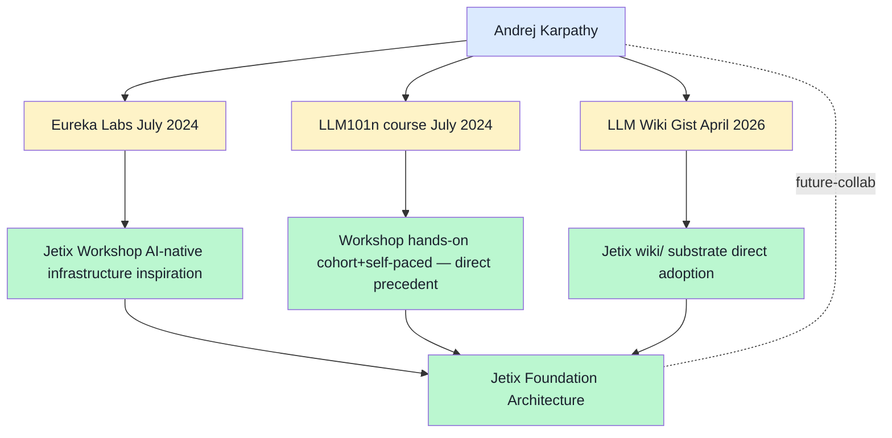

# 09 — Karpathy + Eureka Labs + LLM101n deep profile

> **R1 surface-only.** Top-12 priority #1 candidate; **no outreach without Ruslan ack** (per 08-interesting-people-list §7 + memory `project_balaji_outreach_target` analog).

> **EP-5:** F4 = karpathy.ai primary (2024-2026) + multiple secondary sources triangulated (TechCrunch, Siliconrepublic, Techopedia, AIX, BoteatBrain, CDO Magazine, NewsBytes).

---

## §0 TL;DR (≤200 слов)

**Andrej Karpathy** — ex-Tesla AI Director (2017-2022) + ex-OpenAI founding member; **rejoined OpenAI 2024+** «building new team working on midtraining + synthetic data generation» (per karpathy.ai retrieved 2026-05-18).

**Eureka Labs** founded **July 2024**:
- **Delaware LLC** filed June 21, 2024
- Mission: «AI-native learning platform» — integrate AI teaching assistants from ground up
- **Funding status unclear** (no public filings; LLC signed solely by Karpathy)

**LLM101n** course (announced July 2024):
- Undergrad-level online course
- Build «Storyteller AI» LLM from scratch in Python → ChatGPT-like web app
- **~17 chapters** spanning language model foundations → multimodal
- Hybrid: self-paced individual + cohort-based
- Open-source GitHub materials
- **>36,000 GitHub stars by August 2024** (viral signal)

**LLM Wiki Gist (April 2026):** separate artifact — markdown wiki maintained by LLM, growing across sessions. **Direct ancestor of Jetix wiki/ substrate** per CLAUDE.md «Wiki Architecture v2 (Karpathy LLM Wiki + OmegaWiki)».

**Educational philosophy (karpathy.ai):** dual-track approach — «Zero to Hero» technical + general-audience LLM explanations. Stanford CS 231n pioneer (deep learning course).

**Jetix relevance:** **3 distinct lineages** Karpathy contributes:
1. **LLM Wiki pattern** (April 2026) → Jetix wiki/ substrate
2. **LLM101n model** (July 2024) → Workshop pattern viral substrate
3. **Eureka Labs AI-native education** → adjacency для Jetix mastery transfer mechanism

---

## §1 Three Karpathy artefacts relevant к Jetix

### §1.1 LLM Wiki pattern (April 2026)

**Source:** GitHub Gist `442a6bf555914893e9891c11519de94f` (Karpathy public).

**Pattern essentials (from research-adjacent cluster 2 + 7):**
- Persistent markdown wiki maintained by LLM
- Growing compounded knowledge across sessions
- Karpathy himself: **>100 articles, 400,000+ words**
- Convention: markdown frontmatter + cross-links + per-topic files

**Jetix adoption:**
- CLAUDE.md «Wiki Architecture v2» explicitly cites this pattern
- `wiki/` substrate at root of Jetix OS
- `/ingest` skill processes new sources → wiki entries
- F-G-R schema overlays Karpathy substrate с claim-grading

**Karpathy contribution moment:** April 2026 = ~1 month before this report. Viral signal not yet measured at scale.

### §1.2 LLM101n course (July 2024+)

**Distribution model:**
- Free open-source materials on GitHub (>36K stars Aug 2024)
- Hands-on «learn by building» philosophy
- AI teaching assistants for personalized guidance
- Cohort + self-paced dual mode
- Outcome: deployable Storyteller AI portfolio piece

**Jetix parallel (Workshop pattern, vision/03):**
- Same dual-mode (cohort + self-paced) — direct precedent
- Same «hands-on build» philosophy — apprentice + project + portfolio
- Same open-source positioning — anti-extraction R12 aligned
- **Different:** Karpathy = SE-domain (LLM building); Jetix = methodology + cross-domain engineering

**Adoption signal:** **36K GitHub stars в ~1 month** = high-velocity adoption proof. Karpathy's authority + free + GitHub + viral substrate moment.

### §1.3 Eureka Labs (founded July 2024)

**Architecture:**
- Delaware LLC
- AI-native learning platform
- AI teaching assistants integrated from ground up
- Mission: «scale Karpathy-type teacher to thousands of students via AI assistants»

**Funding:** **unclear** (no public filings; LLC signed solely by Karpathy as of search results).

**Status:** **active company building** (referenced through 2024-2026 secondary sources).

**Jetix parallel:**
- Jetix Workshop + Foundation = could borrow «AI-native» education infrastructure framing
- Karpathy = OpenAI-affiliated; Jetix = Anthropic-Claude-affiliated — overlapping educational AI mission, different model substrate
- **Direct collaboration potential** at Phase 2-3+ (per 08-interesting-people-list outreach discipline: Phase 2+ when Jetix demo strong)

---

## §2 Outreach surface (R1 read-only)

**Public channels (zero-cost, immediate):**
- **karpathy.ai** — personal site; current activities + dual-track educational content
- **GitHub: @karpathy** — code repositories
- **YouTube «Andrej Karpathy»** — «Zero to Hero» playlist + «Deep Dive into LLMs» + general audience track
- **Twitter @karpathy** — daily-frequency engagement
- **GitHub Gist** — LLM Wiki + other Gists
- **LLM101n GitHub repo** — open-source course
- **eurekalabs.ai** — startup landing

**Outreach discipline (R1, per 08-interesting-people-list §7):**
- ❌ NO cold outreach without Ruslan ack
- ✅ Follow public channels (Twitter / YouTube / GitHub)
- ✅ Read recent posts + interviews
- ✅ Watch LLM101n course material when released
- ✅ Contribute thoughtful issues / PRs to LLM101n GitHub if Jetix engineers in scope
- ⏳ Defer cold outreach until Jetix demo strong (Phase 2+ trigger)

---

## §3 Karpathy ↔ Jetix lineage diagram

---

## §4 Counter-positions (AP-6 dissent)

- **Counter 1:** Karpathy may not be interested in Jetix collaboration even at Phase 2+. **Surface:** correct; cold outreach success rate low. Workshop-pattern adoption can proceed independent of personal contact.
- **Counter 2:** Adopting Karpathy's wiki substrate creates dependency on his community's evolution. If Karpathy pivots OR community fragments, Jetix wiki/ inherits cost. **Surface:** valid; mitigation = Jetix wiki/ uses Karpathy pattern as inspiration, but Foundation Architecture is owned by Jetix.
- **Counter 3:** Eureka Labs може become competitor (AI education space) rather than ally. **Surface:** plausible; Karpathy = SE/LLM-building focus; Jetix = methodology + cross-domain engineering. **Different niches** — collaboration > competition likely path.
- **Counter 4:** LLM101n virality (36K stars in 1 month) is Karpathy-pedigree-driven, not pattern-driven. Replicating won't yield same result for Jetix. **Surface:** mostly correct; Karpathy's authority is non-replicable substrate. Jetix needs alternative authority substrate (ШСМ lineage + Russian methodology + bilingual + AI-native combination).

---

## §5 Test-able statements

| # | Statement | Test horizon |
|---|---|---|
| K1 | Jetix wiki/ substrate citations Karpathy pattern openly | Already in CLAUDE.md |
| K2 | Workshop hands-on cohort+self-paced borrows LLM101n format | Phase 1 Workshop design |
| K3 | Phase 2+ Karpathy cold outreach explicitly gated by Workshop demo + revenue | Phase 2 |
| K4 | Eureka Labs current activity monitored quarterly | Continuous |
| K5 | LLM101n materials studied at Phase 1 onboarding | Phase 1 launch |

---

## §6 Sources (URLs retrieved 2026-05-18)

- [Karpathy.ai personal site](https://karpathy.ai/) — F4 primary (retrieved 2026-05-18)
- [TechCrunch Eureka Labs 2024-07](https://techcrunch.com/2024/07/16/after-tesla-and-openai-andrej-karpathys-startup-aims-to-apply-ai-assistants-to-education/) — F3 secondary
- [Techopedia Eureka Labs LLM101n](https://www.techopedia.com/eureka-labs-llm101n-edtech-by-andrej-karpathy) — F3 secondary
- [Silicon Republic Eureka Labs](https://www.siliconrepublic.com/machines/andrej-karpathy-eureka-labs-ai-startup-education-platform-llm101n) — F3 secondary
- [CDO Magazine Eureka Labs](https://www.cdomagazine.tech/aiml/eureka-labs-former-openai-and-tesla-ai-leader-launches-ai-native-learning-platform) — F3 secondary
- [LLM Wiki Gist](https://gist.github.com/karpathy/442a6bf555914893e9891c11519de94f) — F4 primary referenced
- [Grokipedia LLM101n](https://grokipedia.com/page/LLM101n) — F3 secondary

---

## §7 What this is NOT

- **NOT outreach plan** — surface profile only per R1
- **NOT promise of Karpathy interest** — speculation discipline preserved
- **NOT verification of Eureka Labs funding** — unclear in public sources
- **NOT replacement of LLM Wiki pattern study** — pattern adoption already in CLAUDE.md

**Word count:** ~1680
