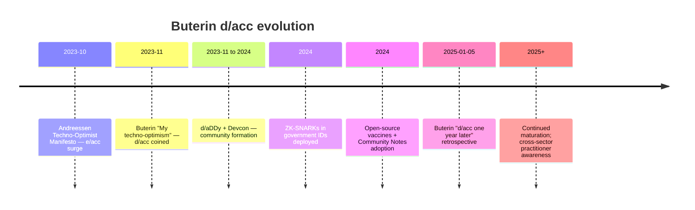

# 10 — Buterin d/acc trajectory + m/acc positioning hook

> **R1 surface-only.** Vitalik Buterin's Nov 2023 + Jan 2025 retrospective + Jetix «m/acc» positioning option surfacing.

> **EP-5:** F4 = vitalik.eth.limo primary source «d/acc: one year later» (Jan 5, 2025) directly WebFetched.

---

## §0 TL;DR (≤200 слов)

**d/acc origin:** Vitalik Buterin's «My techno-optimism» blog post **November 2023** — response к e/acc (effective accelerationism — Andreessen + Beff Jezos/Verdon Oct-Dec 2023). Core formula: **«Decentralized, democratic, defensive (and differentiated) acceleration.»**

**«d/acc: one year later»** blog post **January 5, 2025** — retrospective by Buterin.

**What worked (per Buterin Jan 2025):**
- Open-source vaccines with verifiable proof systems
- Community Notes effectiveness at information verification
- Prediction markets gaining mainstream attention
- ZK-SNARKs deployed in government ID + social media
- Open-source medical imaging + BCI applications
- Account abstraction securing Ethereum wallets

**What didn't work:** Buterin doesn't explicitly catalog failures; emphasizes «philosophy matured significantly» through dialogue + real-world testing.

**Revised d/acc definition (Jan 2025 verbatim):**
> «Accelerate technology, but differentially focus on technologies improve our ability to defend, rather than our ability to cause harm, and in technologies that distribute power.»

**Historical anchor (Buterin):** «democratic Switzerland and quasi-anarchist Zomia» rather than feudal concentration.

**Community event:** «d/acc Discovery Day» (d/aDDy) at Devcon — speakers from all pillars.

**Jetix «m/acc» (methodology accelerationism) positioning hook:** brigadier-surfaced naming candidate — methodology + AI substrate as **defensive + distributive** technology for engineering communities. Aligned с d/acc values; orthogonal к specific d/acc focus areas (bio/physical/cyber).

---

## §1 d/acc trajectory anchored

---

## §2 d/acc core principles (Buterin verbatim Jan 2025)

> «Accelerate technology, but differentially focus on technologies improve our ability to defend, rather than our ability to cause harm, and in technologies that distribute power.» [src: vitalik.eth.limo/general/2025/01/05/dacc2.html retrieved 2026-05-18]

**4 elements:**
1. **Accelerate** technology (NOT decelerate — distinct from precautionary movements)
2. **Differentially** = not all tech equally; pick categories
3. **Defense over offense** (offense/defense balance tilted к defense)
4. **Distribute power** (NOT concentrate)

**Domains Buterin names (Jan 2025):**
- **Bio:** open-source vaccines, healthy indoor air, BCI
- **Physical:** open-source medical imaging
- **Cyber:** ZK-SNARKs, account abstraction, prediction markets, Community Notes
- **Info:** Community Notes verification

---

## §3 d/acc ↔ Jetix overlap matrix

| Buterin d/acc element | Jetix analog | Overlap depth |
|---|---|---|
| **Differential acceleration** | FPF prioritizes substrate-agnostic + R12-aligned tech selections | **STRONG** |
| **Defense over offense** | Pre-mortem discipline (cluster 1-7 failure cases) + Default-Deny + R11 | **STRONG** |
| **Distribute power** | R12 anti-extraction + Corrigibility + L1+ multi-Clan substrate | **DIRECT** |
| **Open-source ethos** | wiki/ + Karpathy substrate + Anthropic free courses analog | **STRONG** |
| **Democratic verification (Community Notes parallel)** | F-G-R provenance + AP-6 preserve dissent + role-attestation | **MEDIUM** |
| **Historical anchor (Switzerland + Zomia)** | Mondragón + Kibbutz + similar non-feudal lineage | **DIRECT analogy** |

**Brigadier inference (F3):** d/acc values ⊆ Jetix values. Differences =:
- d/acc = **tech-acceleration framing**; Jetix = **methodology-substrate framing**
- d/acc = **crypto-native primary substrate**; Jetix = **substrate-agnostic**
- d/acc = **decentralized infrastructure** focus; Jetix = **engineering community** focus

---

## §4 «m/acc» (methodology accelerationism) — naming candidate

### §4.1 The proposal

Brigadier-surfaced positioning option (per cluster 6 §7.1 open question): **Jetix Cantonment positions as «m/acc» = methodology accelerationism**, alongside but distinct from e/acc + d/acc tribal differentiation.

**m/acc proposed thesis (draft, F2):**
> «Accelerate engineering methodology distribution + AI co-readability + role-attestation, defensively + distributively, so that methodology mastery scales beyond entrenched certification economies.»

**Element-by-element alignment:**
- **Accelerate (yes — methodology distribution velocity)**
- **Differentially (yes — pick AI-co-readable + cross-domain + governance-anchored)**
- **Defense (yes — anti-gaming + anti-extraction + pre-mortem)**
- **Distribute power (yes — R12 + multi-Clan + open-source)**

### §4.2 Pros (brigadier inference F2)

1. **Tribal positioning hook** — gives Jetix tribal substrate in existing meta-discourse
2. **Naming compounds** — m/acc + d/acc shared vocabulary increases recognition
3. **Counter-Scrum positioning enabler** — m/acc as anti-commoditization Agile-successor
4. **Russian-English bilingual fit** — «м/уск» (м/ускорение) Russian transliteration works

### §4.3 Cons (brigadier inference F2)

1. **Crypto-tribe perception risk** — m/acc inherits crypto-adjacent association from e/acc + d/acc lineage; може repel non-crypto methodology community (ШСМ + INCOSE + SEMAT etc.)
2. **Acceleration framing може conflict с methodology depth** — methodology mastery is slow; «accelerate» framing may misalign
3. **Beff Jezos disclosure parallel** — e/acc tribe shows anonymous-persona risk; tribal positioning carries identity-management cost
4. **Naming-vs-substance** — «m/acc» might become more memorable than Jetix substance (cluster 7 «Six Sigma loss of soul» analog)

### §4.4 Refutation conditions

- If «m/acc» framing triggers more confusion than recognition в Phase 1 outreach → naming refuted
- If methodology-community (ШСМ + SEMAT + Cynefin) actively distances from «m/acc» branding → refuted
- If Jetix substance overshadowed by tribal framing → counter-productive

---

## §5 Buterin outreach surface (R1 read-only)

**Public channels (zero-cost):**
- **vitalik.eth.limo** — primary blog (Jan 2025 retrospective + others)
- **Twitter @VitalikButerin** — high-engagement
- **Ethereum Foundation talks** — recent Devcon + EthCC
- **Plurality book co-author** (см. direction 11 Tang/Weyl)

**Outreach discipline (R1):**
- ❌ NO cold outreach без Ruslan ack
- ✅ Follow public channels
- ✅ Read all Buterin blog posts touching methodology / governance / distribution
- ✅ Consider d/aDDy attendance Phase 2+ if Jetix demo strong

---

## §6 Counter-positions (AP-6 dissent)

- **Counter 1:** «m/acc» is naming gimmick, не substance. Jetix should stand on FPF + Foundation Architecture без tribal-positioning bait. **Surface:** legitimate; m/acc opt-in, не Foundation-required. Pre-mortem of naming worth one-week test.
- **Counter 2:** Buterin's d/acc is crypto-native; methodology community largely не crypto-aligned. Adopting d/acc-derivative framing alienates target community. **Surface:** strong concern (cf. §4.3 con 1). Mitigation: m/acc could be **methodology accelerationism** explicitly distinct from crypto-acc lineage.
- **Counter 3:** d/acc retrospective shows what works (ZK-SNARKs, prediction markets, vaccines); Jetix substrate doesn't yet have comparable concrete delivery. Premature to position alongside. **Surface:** correct — m/acc only viable after Jetix has concrete deliverable (Workshop + revenue + role-attestation working).
- **Counter 4:** Buterin avoids direct e/acc criticism in Jan 2025 retrospective; suggests tribal framing has limits. **Surface:** valid pattern; reinforces opt-in nature of m/acc.

---

## §7 Test-able statements

| # | Statement | Test horizon |
|---|---|---|
| B1 | Buterin d/acc retrospective explicitly read + cited in Phase 0-1 | Already done this direction |
| B2 | «m/acc» naming candidate evaluated Phase 1 (yes/no) | Phase 1 close |
| B3 | NO substrate-decision rooted в crypto rails per d/acc lineage | Continuous |
| B4 | Open-source ethos + R12 alignment monitored against d/acc evolution | Continuous |
| B5 | Phase 2+ Buterin cold-outreach gated on Workshop revenue + Plurality reading | Phase 2 |

---

## §8 Sources (URLs retrieved 2026-05-18)

- [«d/acc: one year later» — vitalik.eth.limo Jan 5 2025](https://vitalik.eth.limo/general/2025/01/05/dacc2.html) — F4 primary
- [«My techno-optimism» Nov 2023 blog](https://vitalik.eth.limo/general/2023/11/27/techno_optimism.html) — F4 primary referenced (not WebFetched this run)
- [Defiant on d/acc](https://thedefiant.io/news/people/vitalik-buterin-proposes-d-acc-philosophy-in-post-on-techno-optimism) — F3 secondary
- [e/acc Bloomberg 2023-12](https://www.bloomberg.com/news/newsletters/2023-12-06/effective-accelerationism-and-beff-jezos-form-new-tech-tribe) — F3 secondary
- [Effective accelerationism — Wikipedia](https://en.wikipedia.org/wiki/Effective_accelerationism) — F3 secondary

---

## §9 What this is NOT

- **NOT decision to adopt «m/acc» framing** — surface candidate per R1; Ruslan picks
- **NOT promotion of crypto substrate** — d/acc values align; substrate selection per direction 07 matrix
- **NOT outreach plan to Buterin** — R1 read-only

**Word count:** ~1880
