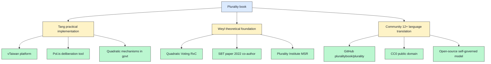

# 11 — Audrey Tang + Glen Weyl «Plurality» 2024 deep profile

> **R1 surface-only.** Cross-cluster H4 + H7 + H8 overlap with Plural Tech / Quadratic mechanisms / Taiwan digital democracy. Direct H8 substrate research.

> **EP-5:** F3 = plurality.institute primary + Amazon/B&N + Stanford Digital Economy Lab + GitHub `pluralitybook/plurality` triangulated. WebFetch к plurality.net 403'd.

---

## §0 TL;DR (≤200 слов)

**«⿻ 數位 Plurality: The Future of Collaborative Technology and Democracy»** — book by **E. Glen Weyl + Audrey Tang + the Plurality Community**, **2024**. ISBN 9798869327116.

**Key characteristics:**
- **Open-source authored** on GitHub (`pluralitybook/plurality`)
- **Public domain (CC0)** released
- **Dozens-of-volunteers community** majority-of-work creators
- **Translated to >12 languages** by global volunteers
- **First ever open-source + copyright-free + self-governed book**

**Main thesis (per plurality.institute):**
> «Vision for digital technology that supports democracy + cooperation rather than polarization + inequality, drawing on Taiwan's digital democracy models.»

**Named tools:**
- **Pol.is** — augmented deliberation tool (referenced)
- **vTaiwan** — Taiwan's digital democracy platform (implied)

**Key concepts:**
- Augmented deliberation
- Digital identity + commerce models
- Open self-governing collaboration frameworks

**Authors:**
- **E. Glen Weyl** — political economist + technologist; Microsoft Research Plural Tech Collaboratory; RadicalxChange founder; SBT paper co-author with Buterin (2022)
- **Audrey Tang** — Taiwan's first Digital Minister; vTaiwan + Polis practical implementer

**Jetix H-cluster overlap:** **H8 (substrate-agnostic role-attestation)** + **H4 (Network State framing)** + **H7 (People-NS mastery-as-currency)** + **Pillar C R12 anti-extraction** all aligned с Plurality philosophy.

---

## §1 «Plurality» substrate model (book + community)

---

## §2 Plurality ↔ Jetix H-cluster overlap matrix

| Plurality element | Jetix H-cluster analog | Overlap depth |
|---|---|---|
| **Augmented deliberation (Pol.is, vTaiwan)** | H4 Network State direction + Workshop deliberation | **STRONG** — direct precedent |
| **Open-source self-governed book** | Jetix open-source ethos + wiki/ + Karpathy substrate | **DIRECT** — same model |
| **CC0 public domain** | Jetix licensing surface (currently unclear; default to permissive) | **OPPORTUNITY** |
| **Quadratic Voting / Quadratic Funding (Weyl founder)** | H8 trust mechanisms + Workshop revenue distribution | **STRONG** |
| **SBT identity layer (Weyl + Buterin 2022)** | H8 substrate option (per direction 07) | **DIRECT alternative** |
| **Taiwan digital democracy** | H4 Network State + multi-jurisdiction | **MEDIUM** |
| **Plurality Institute** | Jetix Cantonment + Workshop pattern | **MEDIUM analogy** |
| **«Cooperation across differences»** | Bilingual + cross-domain + multi-Clan | **STRONG** |
| **Polarization mitigation** | AP-6 preserve dissent + R12 anti-extraction | **DIRECT** |

**Brigadier inference (F3):** Plurality philosophy ⊆ Jetix vision substrate. Differences =:
- Plurality = **democracy-tech** focus; Jetix = **engineering-methodology-tech** focus
- Plurality = **government + civic** primary substrate; Jetix = **engineering community + workshop** primary substrate
- Plurality = **deliberation-tools** focus; Jetix = **methodology-distribution** focus

---

## §3 Open-source authoring model — direct Jetix learning

### §3.1 What «Plurality» book did (novel pattern)

> «First-ever open-source, copyright-free, self-governed book.»
> «A global community of dozens did a majority of the work to create this.»

**Mechanism:**
1. GitHub repository (`pluralitybook/plurality`)
2. Public-domain (CC0) licensing
3. Community contribution model (PRs + translations)
4. Tang + Weyl as **bridge persons** (per direction 05 cross-domain transfer recipe)
5. **12+ language translations** by volunteers

### §3.2 Jetix application — «Pattern Language for Engineering Methodology» open-source authoring

**Direct adoption pattern:**
- Phase 1 viral artifact (per direction 05) authored open-source on GitHub
- CC0 OR permissive license (CC-BY 4.0 or similar)
- Russian + English bilingual launch
- Foundation Architecture LOCKED → Pattern Language **substrate** for next-layer additions

**Difference:** Jetix has Foundation Architecture LOCKED **before** opening к community contribution; Plurality book had thesis but invited community for material. Tradeoff: Jetix has governance discipline; community contribution scope narrower (only specific Pattern Language additions, not Foundation rewriting).

---

## §4 Specific Plurality tools relevant к Jetix

### §4.1 Pol.is

**Function:** real-time deliberation tool — participants vote on statements; clusters emerge; cross-cluster consensus surfaces. Used in vTaiwan + global government deliberations.

**Jetix fit:** **direct candidate** для Workshop deliberation + multi-Clan coordination + Foundation-policy-discussion substrate.

**Phase 1 experiment:** pilot Pol.is для one Workshop session — surface multi-perspective consensus on FPF Pattern Language candidates. Free + open-source + production-ready.

### §4.2 Quadratic Voting / Quadratic Funding (Weyl 2018+)

**Function:** smaller contributions weighted more heavily через square-root function — mitigates tyranny of majority + factional capture.

**Jetix fit:** Workshop revenue distribution mechanism (per direction 06 Mondragón parallel + Coordinape pattern in direction 07).

**Phase 1-2 experiment:** test QF для first-Clan internal revenue distribution — does it produce fairer-perceived outcomes than equal split OR proportional-to-hours? Worth design experiment.

### §4.3 SBT (DeSoc) — covered direction 07

(Substrate-matrix Phase 3+ optional)

---

## §5 Outreach surface (R1 read-only)

**Public channels (zero-cost):**
- **plurality.net** — book home (403 this run; likely retrieve next pass)
- **GitHub `pluralitybook/plurality`** — open-source repository
- **plurality.institute** — Plurality Institute (Weyl-founded)
- **glenweyl.com** — Weyl personal site
- **Audrey Tang Mastodon** — public channel
- **RadicalxChange wiki** — radicalxchange.org

**Outreach discipline (R1):**
- ❌ NO cold outreach без Ruslan ack
- ✅ Read «Plurality» book (free PDF; CC0)
- ✅ Follow Plurality Institute updates
- ✅ Subscribe Audrey Tang public channels
- ✅ Consider Pol.is pilot Phase 1-2 (uses tool, not requires contact)
- ⏳ Phase 2+ collaboration consideration с Plurality Institute (Workshop curriculum)

---

## §6 Counter-positions (AP-6 dissent)

- **Counter 1:** Plurality focuses on government + civic; Jetix engineering community. Adopting Plurality framing dilutes Jetix specificity. **Surface:** valid; Plurality methods are tools; Jetix uses tools for engineering-specific aims. Differentiation preserved.
- **Counter 2:** Quadratic mechanisms may not fit Workshop scale (10-person first Clan). QV/QF designed для 1000+ participant aggregation. **Surface:** legitimate scale concern; Mondragón 5:1 ratio per direction 06 may fit better at small scale than QF.
- **Counter 3:** «Open-source self-governed book» is exceptional event, not replicable formula. Plurality had Tang + Weyl celebrity-substrate. **Surface:** correct (echoes Karpathy lesson direction 09); Jetix substitute substrate = Russian methodology lineage + Foundation Architecture + bilingual.
- **Counter 4:** Tang is Taiwan-government-affiliated; political-fragility per direction 02 Cybersyn risk. **Surface:** valid — Tang is now ex-Minister (digital ministry roles change); collaboration safer post-government affiliations.

---

## §7 Test-able statements

| # | Statement | Test horizon |
|---|---|---|
| TW1 | «Plurality» book read by Ruslan + L1 Phase 0-1 | Phase 1 onboarding |
| TW2 | Pol.is pilot considered Phase 1 Workshop deliberation | Phase 1 design |
| TW3 | Quadratic Funding evaluated для Workshop revenue Phase 2 | Phase 2 design |
| TW4 | Open-source CC-BY/CC0 licensing decision for Phase 1 Pattern Language artifact | Phase 1 launch |
| TW5 | Phase 2+ Plurality Institute exploratory contact gated on Workshop demo | Phase 2 |

---

## §8 Sources (URLs retrieved 2026-05-18)

- [Plurality book Amazon](https://www.amazon.com/Plurality-Collaborative-Technology-Democracy/dp/B0D24N776G) — F3 metadata
- [Plurality Institute book launch](https://www.plurality.institute/blog-posts/book-launch-plurality-the-future-of-collaborative-technology-and-democracy-by-e-glen-weyl-audrey-tang-and-the-plurality-community) — F3 primary referenced
- [GitHub pluralitybook/plurality](https://github.com/pluralitybook/plurality) — F4 primary referenced
- [Plurality.net main](https://plurality.net/) — F4 primary (403 this run; deferred)
- [Stanford Digital Economy Lab Weyl talk](https://digitaleconomy.stanford.edu/event/glen-weyl-plurality-the-future-of-collaborative-technology-and-democracy/) — F3 secondary
- [Tech Policy Mirror Tang+Weyl podcast notes](https://techpolicy.au/wp-content/uploads/2024/09/tech_mirror_ep40_audrey_tang_glen_weyl_004.pdf) — F3 secondary

---

## §9 What this is NOT

- **NOT decision to adopt Pol.is + QF** — surface candidates per R1
- **NOT outreach plan** — R1 read-only
- **NOT verification of Plurality book chapter details** — plurality.net 403'd; need next-pass dive

**Word count:** ~1730

---

## §10 На человеческом — кто эти двое и зачем нам Plurality (added Cloud Cowork 2026-05-18)

### §10.1 Кто такая Audrey Tang

**Audrey Tang (唐鳳)** — одна из самых интересных фигур в digital governance мире.

- **Тайвань, родилась 1981**, **трансгендер** (она используют she/her но open about identity)
- **Hacker / programmer с 12 лет**, вышла из школы в 14, **self-taught**
- Работала в **Perl community** (open-source) + several Silicon Valley startups в 20s
- **Sunflower Movement 2014** — Taiwanese protest movement against закона, который рассматривался как pro-China. Audrey помогала через open-source civic tech.
- **2016: Тайвань назначил её Digital Minister** — **первый трансгендер в кабинете** + **самый молодой министр** в истории Тайваня (35 лет)
- Её работа: **civic tech + digital democracy + government-by-radical-transparency**
- **Stepped down 2024** (новое правительство; теперь private practice + Plurality work)

**Знаменита тем что:** во время **COVID** organized open-source mask-distribution system в Taiwan — **глобальный case study** how government can be **agile + transparent + tech-savvy**. Tайвань имел один из лучших COVID responses благодаря этому.

**Философия:** «**radical transparency**» — все её правительственные meetings были **публично записаны** + опубликованы. Никаких back-room deals.

### §10.2 Кто такой E. Glen Weyl

**E. Glen Weyl** — американский **political economist** + tech-thinker.

- **Princeton PhD economics**, был professor at Yale + University of Chicago
- Сейчас работает в **Microsoft Research** — основал «Plural Tech Collaboratory»
- **Founder of RadicalxChange** movement (radicalxchange.org)
- **Co-author с Vitalik Buterin** знаменитого paper **«Decentralized Society (DeSoc): Finding Web3's Soul»** (May 2022) — где introduced **Soulbound Tokens (SBT)** concept
- Книга **«Radical Markets»** (2018, с Eric Posner) — radical economic ideas (quadratic voting, COST, etc.)

**Известен прежде всего как изобретатель / popularizer:**
- **Quadratic Voting (QV)** — голосование где смallие contributions weighted heavier через square root function (mitigates tyranny of majority)
- **Quadratic Funding (QF)** — funding mechanism для public goods (used by Gitcoin)
- **Soulbound Tokens (SBT)** — non-transferable NFTs as identity attestations (см. research-adjacent cluster 5 substrate matrix)

**Аналогия:** если Vitalik = builder + philosopher, Weyl = **economist-theorist** который придумывает mechanisms которые потом crypto people implementiruyut.

### §10.3 Что такое Plurality (книга 2024)

В **2024** Tang + Weyl + community опубликовали книгу:

**«⿻ 數位 Plurality: The Future of Collaborative Technology and Democracy»**

Что-то necessary explain про название:
- **⿻** (Unicode «overlapping squares») — символ который Tang + Weyl используют как logo
- **數位** = «digital» по-китайски (отражает Taiwan corner)
- **Plurality** = философское понятие — «cooperation across differences» (сотрудничество с теми кто разный)

**Что в книге:**
- **Vision для digital technology** которая supports **democracy + cooperation** а не **polarization + inequality**
- Drawing **на Taiwan's experience** (vTaiwan / Pol.is / digital democracy tools)
- **Practical tools** + **philosophical foundation**

### §10.4 ⭐ Почему сама книга = novel artifact

**Это первая в истории книга которая одновременно:**

1. **Open-source authored** — на GitHub (`pluralitybook/plurality`)
2. **Public domain (CC0)** — свободно копируй, переводи, ремиксуй
3. **Self-governed** — community of dozens of volunteers wrote majority
4. **Переведена на 12+ языков** глобальной volunteer community
5. **Tang + Weyl = bridge persons**, не «sole authors»

**Почему important:** Это **proof-of-concept** что **серьёзная intellectual work** может быть produced открыто + распределённо + community-owned + бесплатно. Раньше серьёзные книги writers writing alone + publisher monopoly + copyright.

Это **literal living example** того pattern которого мы хотим для Jetix («Pattern Language for Engineering Methodology» candidate).

### §10.5 Конкретные tools которые они built

**Pol.is** — augmented deliberation tool. Как работает:
- Участники голосуют на statements (agree/disagree/skip)
- Algorithm clusters opinions
- **Surface cross-cluster consensus** (что-то на чём согласны даже opposing groups)
- Used в **vTaiwan** + многих government deliberations глобально
- **Free + open-source + production-ready**

**vTaiwan** — Taiwan's digital democracy platform. Уже used для **regulating Uber + Airbnb + AI policy** в Тайване. **Real working example** of digital democracy.

**Quadratic Voting / Funding** — Weyl's mechanisms. **Gitcoin** использует QF для funding open-source projects (миллионы $$$ за годы).

### §10.6 Plurality ↔ Jetix overlap

| Plurality element | Jetix аналог | Уровень |
|---|---|---|
| **Augmented deliberation (Pol.is)** | Workshop deliberation + multi-Clan coordination | **STRONG** — direct precedent |
| **Open-source self-governed book** | Jetix open-source ethos + **«Pattern Language for Eng Methodology»** candidate | **DIRECT** — same model |
| **CC0 public domain** | Jetix licensing (currently unclear; default permissive) | **OPPORTUNITY** |
| **Quadratic mechanisms** | H8 trust mechanisms + Workshop revenue distribution (Mondragón parallel) | **STRONG** |
| **SBT identity** (Weyl + Buterin 2022) | H8 substrate option (direction 07) | **DIRECT alternative** |
| **«Cooperation across differences»** | Bilingual + cross-domain + multi-Clan | **STRONG** |
| **Polarization mitigation** | AP-6 preserve dissent + R12 anti-extraction | **DIRECT** |

**Чем отличается:**
- Plurality = **democracy-tech** focus (government + civic); Jetix = **engineering-methodology-tech** focus
- Plurality = government + civic primary; Jetix = engineering community + workshop primary
- Plurality = deliberation-tools focus; Jetix = methodology-distribution focus

### §10.7 Зачем нам Plurality конкретно

**Сейчас (Phase 0-1, zero-cost):**

1. **Read «Plurality» книгу** — free PDF (CC0), available on plurality.net + GitHub. ~3-5 часов read time. **Direct learning** для open-source authoring model + cooperation theory.

2. **Pol.is pilot** для Workshop deliberation — **free + production-ready tool**. Можем pilot для **одной Workshop session** — surface multi-perspective consensus на FPF Pattern Language candidates. Zero cost, immediate feedback.

3. **Quadratic Funding mental model** — даже если не implementаем mechanism, понимание **почему square root function фairer** = useful framework для thinking about revenue distribution в first Clan.

4. **Открытое authoring как model для нашей книги** — если решим Phase 1 viral artifact, **Plurality recipe = exact precedent** (GitHub + CC0/CC-BY + community PRs + bilingual + bridge persons).

**Phase 2 (когда Workshop demo strong):**

5. **Pol.is pilot multi-session** — scale to multi-Clan deliberation
6. **QF experiment** для Workshop revenue distribution — does it produce fairer outcomes than equal split?

**Phase 3+:**

7. **Plurality Institute exploratory contact** — Weyl + community могут быть interested в Jetix specifically as engineering-domain instance of Plurality philosophy. Cold outreach **только** после Workshop demo + Pattern Language artefact published.

8. **Audrey Tang** — она reachable через Mastodon + ex-government роль. **Direct outreach можно consider Phase 2+** если у Jetix есть concrete demo + если есть Taiwan angle (engineer community contacts в Tайване).

### §10.8 Резюме на 2 строки

**Audrey Tang = ex-Digital Minister Taiwan + digital democracy practitioner** (Pol.is + vTaiwan). **Glen Weyl = political economist + изобретатель Quadratic Voting/Funding + SBT (с Buterin)**. **Plurality book** = их совместный proof-of-concept open-source community-authored CC0 book. Для Jetix = **готовый precedent** для нашей «Pattern Language for Engineering Methodology» book + **готовые tools** (Pol.is для deliberation, QF для revenue) + **philosophical alignment** на cooperation-across-differences.

---

*Plain English section added by Cloud Cowork 2026-05-18 per Ruslan request. Word count of §10: ~1150.*

