# 13 — EVE Online 20-year virtual tribe lessons

> **R1 surface-only.** vision/04 first Clan + vision/08 L1+ multi-Clan organizational pattern + R12 anti-extraction stress test.

> **EP-5:** F4 = EVE University wiki primary + Wikipedia B-R5RB Battle primary + CCP Games official news + 10-year retrospective (Ancient Gaming Noob 2024).

---

## §0 TL;DR (≤200 слов)

EVE Online (CCP Games, **2003 → 2026 = 23 years**) — sandbox MMO с sustained tribal substrate. **20-year sustained Alliance + Corporation governance pattern** demonstrably stable through major crises.

**Structural primitives:**
- **Corporation** = in-game player organization
- **Alliance** = group of corporations holding sovereignty («capabilities individual corporations cannot achieve alone, particularly hold sovereignty»)
- **Executor Corporation** = chosen by member CEOs to manage alliance: pays «Alliance Maintenance Bill 2M ISK / member corp monthly»; sets diplomatic standings; requires **≥50% member corp CEO support** to maintain status; lost support → alliance dissolves
- **Empire Control skill level V** required для sovereignty
- **Direct vote mechanism:** CEO clicks «Declare Support» in Corporation window

**Famous stress test (B-R5RB Battle, January 27 2014):**
- **21 hours single battle** — 7,548 player characters, peak 2,670 в system
- **576 capital ships lost, 75 Titans**
- **11 trillion ISK** = **~$300,000 USD** real money equivalent
- **CFC/Russian alliances vs N3/Pandemic Legion**
- Trigger: scheduled CONCORD payment missed by H A V O C corp (Nulli Secunda member)
- **CCP erected permanent monument «The Titanomachy»** — non-salvageable capital ship wrecks remain in system

**10-year retrospective (Jan 2024):** «remains EVE's most iconic event». Battle catalyzed alliance reorganization but EVE community persisted.

**Jetix lesson:** **20-year virtual tribe persistence is possible** через explicit governance + sovereignty mechanics + voluntary alliance membership + executor accountability + visible failure events that **don't kill** the substrate.

---

## §1 EVE Alliance/Corporation governance primitives → Jetix vision/04 + vision/08 mapping

```mermaid
graph TD
  EVE_C[EVE Corporation] -.maps to.- J_C[Jetix Clan vision/04 first 10]
  EVE_A[EVE Alliance] -.maps to.- J_A[Jetix L1+ multi-Clan vision/08]
  EVE_E[EVE Executor Corp] -.maps to.- J_E[Jetix lead Clan / brigadier role]
  EVE_50[≥50% CEO support to executor] -.maps to.- J_50[Foundation Pillar C consent mechanism]
  EVE_BILL[2M ISK/member alliance bill] -.maps to.- J_BILL[Workshop revenue split for Foundation upkeep]
  EVE_SOV[Sovereignty + Empire Control V] -.maps to.- J_SOV[H4 Network State substrate qualifications]
  EVE_DEC[Declare Support button] -.maps to.- J_DEC[Explicit consent protocol — Foundation Part 6b]
  EVE_DISS[Lost support = alliance dissolves] -.maps to.- J_DISS[R12 fork-and-leave penalty-free]

  style EVE_C fill:#dbeafe,color:#1a202c
  style EVE_A fill:#dbeafe,color:#1a202c
  style EVE_E fill:#dbeafe,color:#1a202c
  style EVE_50 fill:#dbeafe,color:#1a202c
  style EVE_BILL fill:#dbeafe,color:#1a202c
  style EVE_SOV fill:#dbeafe,color:#1a202c
  style EVE_DEC fill:#dbeafe,color:#1a202c
  style EVE_DISS fill:#dbeafe,color:#1a202c
  style J_C fill:#bbf7d0,color:#1a202c
  style J_A fill:#bbf7d0,color:#1a202c
  style J_E fill:#bbf7d0,color:#1a202c
  style J_50 fill:#bbf7d0,color:#1a202c
  style J_BILL fill:#bbf7d0,color:#1a202c
  style J_SOV fill:#bbf7d0,color:#1a202c
  style J_DEC fill:#bbf7d0,color:#1a202c
  style J_DISS fill:#bbf7d0,color:#1a202c
```

---

## §2 8 design lessons for Jetix vision/04 + vision/08

### §2.1 Sovereignty requires composition (Corporation → Alliance)

**EVE:** Single Corporation cannot hold sovereignty; must compose into Alliance. Sovereignty = sustained power-projection capability.

**Jetix:** First-Clan 10-person (vision/04) cannot alone constitute «Network State substrate» (H4); requires L1+ multi-Clan composition (vision/08). **Direct parallel.**

### §2.2 Executor with conditional support

**EVE:** Executor Corp holds operational power **conditional on ≥50% member CEO support**. Lose support → dissolution. **Not unilateral; not democracy; meritocratic delegation с recall.**

**Jetix:** Foundation Pillar C corrigibility = analogous «recall» mechanism. **Concrete design surface:** at what threshold do member Clans recall Foundation-level direction? Per Pillar C Tier 2 R7 (no autonomous contradiction negotiation), recall = human-gated.

### §2.3 Maintenance bill as commitment device

**EVE:** 2M ISK/member-corp/month = operational cost; failure to pay → alliance closes at next downtime.

**Jetix:** Workshop revenue split + Foundation upkeep — analogous «pay or dissolve» mechanism may strengthen commitment. **Phase 2-3 design surface:** what is Jetix Foundation upkeep cost; how is it shared.

### §2.4 Explicit support declaration

**EVE:** «Declare Support» button = explicit consent, не implicit membership.

**Jetix:** Pillar C R1-R12 + Foundation Part 6b human gate = analogous explicit-consent pattern. **Already aligned.**

### §2.5 Sovereignty skill requirement (Empire Control V)

**EVE:** Cannot exercise sovereignty без skill investment.

**Jetix:** H7 People-NS «mastery as currency» — analogous skill-gating of NS participation. **Already aligned.**

### §2.6 Visible failure без substrate collapse (B-R5RB 2014)

**EVE:** Largest battle in gaming history (576 capital ships, $300K USD equivalent lost). Triggered by **administrative error** (CONCORD payment missed). **EVE community persisted; alliance reorganized; substrate intact.**

**Jetix:** Foundation Architecture LOCKED → must survive **«administrative error»** stress events (e.g., constitutional rule violation, role-attestation fraud, Workshop revenue dispute) **without substrate collapse**. R12 fork-and-leave preserves substrate stability.

### §2.7 Permanent monument for collective memory

**EVE:** «Titanomachy» monument in system B-R5RB = sovereignty event preserved permanently in shared memory.

**Jetix:** Foundation audit log + decisions/* substrate + cycles/* directory = analogous **permanent memory** of constitutional events. **Already aligned.**

### §2.8 Real-money externality is real (≥$300K USD on one battle)

**EVE:** Players invest real money + years of time. Loss is **real psychological + emotional cost**, even though «just game». Per cluster 6 §4: «EVE betrayal harm = real psychological harm.»

**Jetix:** Workshop participants invest real time + money + reputation. Workshop substrate must respect this. **R12 anti-extraction + exit-discipline are real-economic protections, не theory.**

---

## §3 Failure mode catalog (EVE-specific to Jetix-relevant)

| EVE failure mode | Description | Jetix risk surface |
|---|---|---|
| **Betrayal arcs** | Member corp infiltrates alliance + steals assets | First-Clan trust verification + role-attestation gating |
| **Administrative error** | Missed CONCORD payment cascades to mega-battle | Foundation Part 8 health monitoring + Halt-Log-Alert |
| **Alliance dissolution** | Executor loses ≥50% support | R12 fork-and-leave preservation |
| **Power consolidation** | One coalition dominates large nullsec area | Anti-monopoly mechanisms in Jetix Foundation-level |
| **Real-money fraud** | Players steal others' assets | KYC + role-attestation + revenue-share transparency |
| **Burnout + decline** | Long-time corp members fatigue | Sabbatical / rotation patterns; non-mandatory participation |
| **CCP intervention** | Game developer changes rules unilaterally | Foundation Architecture LOCKED + Pillar C Corrigibility (Ruslan-equivalent of CCP role; constitutional limits matter) |

---

## §4 20-year longevity factors (brigadier inference F3)

1. **Sandbox + player-driven content** — CCP не dictates outcomes; players generate narratives
2. **Real economic substrate** — ISK + plex + real-money convertibility creates real stakes
3. **Permanent consequences** — destroyed Titans don't respawn cheaply; loss is real
4. **Diversity of playstyles** — combat / industry / exploration / espionage / diplomacy все valid
5. **CCP narrative respect** — game developer treats player history as canonical (Titanomachy monument)
6. **Long form events** — major battles last hours-to-days; deep investment rewarded
7. **Anti-griefing mechanisms balance** — losing to better player accepted; losing to exploit not
8. **Cross-corporation diplomacy substrate** — Alliance-level diplomacy + standings + treaties

**Jetix parallel applications:**
- Workshop pattern = sandbox + practitioner-driven
- F-G-R provenance = «real consequence» of claim-grading
- Constitutional Foundation Architecture = «CCP narrative respect» analog
- AP-6 preserve dissent = diversity of methodology-domains
- Long-form Workshop curricula = «deep investment rewarded»

---

## §5 Counter-positions (AP-6 dissent)

- **Counter 1:** EVE Online is **game**, не professional methodology community. Lessons may not transfer beyond entertainment context. **Surface:** legitimate but partial — governance + sovereignty + composition primitives are structural, not domain-specific.
- **Counter 2:** EVE Alliance dissolution rate is high (most don't last 20 years; only persistent few do). Survivorship bias. **Surface:** true; lesson preservation should be «**structure enables 20yr but doesn't guarantee**».
- **Counter 3:** Real-money stakes drive engagement в EVE; Jetix Workshop should NOT replicate gambling-like high-stakes dynamic. **Surface:** correct; Jetix Workshop = professional-development + revenue, not loss-aversion-driven entertainment.
- **Counter 4:** CCP's central control role = single-point-of-failure analog к Cybersyn lesson (direction 02). **Surface:** valid concern; Foundation Architecture LOCKED + Pillar C Corrigibility = explicit anti-CCP-overreach mechanism.

---

## §6 Test-able statements

| # | Statement | Test horizon |
|---|---|---|
| EVE1 | vision/08 L1+ multi-Clan composition follows EVE Alliance pattern (executor + ≥X% support) | Phase 2 design |
| EVE2 | First-Clan recall mechanism explicit + tested | Phase 1 Workshop |
| EVE3 | Foundation upkeep cost-sharing mechanism designed Phase 2-3 | Phase 2-3 |
| EVE4 | At least one «administrative error stress» drill в Phase 1-2 | Phase 1-2 |
| EVE5 | Foundation audit log preserves all constitutional events (Titanomachy analog) | Continuous |
| EVE6 | NO real-money speculation tied к Workshop participation (anti-Friend.tech, anti-EVE-gambling) | Continuous |

---

## §7 Sources (URLs retrieved 2026-05-18)

- [EVE University Alliances wiki](https://wiki.eveuniversity.org/Alliances) — F4 primary
- [Battle of B-R5RB — Wikipedia](https://en.wikipedia.org/wiki/Battle_of_B-R5RB) — F4 primary
- [CCP Games official B-R5RB news](https://www.eveonline.com/news/view/the-bloodbath-of-b-r5rb) — F4 primary
- [The Battle of B-R5RB Decade Down (Ancient Gaming Noob 2024-01)](https://tagn.wordpress.com/2024/01/29/the-battle-of-b-r5rb-a-decade-down-the-road/) — F3 retrospective
- [Engadget B-R5RB analysis (2014-02)](https://www.engadget.com/2014-02-02-eve-evolved-the-bloodbath-of-b-r5rb) — F3 contemporary
- [Know Your Meme B-R5RB](https://knowyourmeme.com/memes/events/eve-online-the-bloodbath-of-b-r5rb) — F2 community

---

## §8 What this is NOT

- **NOT recommendation для Jetix к literal EVE-Online-style mechanic** — pattern abstraction per R1
- **NOT promotion of gamification approach** — direction 03 explicitly warned against
- **NOT verification of EVE Alliance dissolution rate** — survivorship bias acknowledged

**Word count:** ~1880
