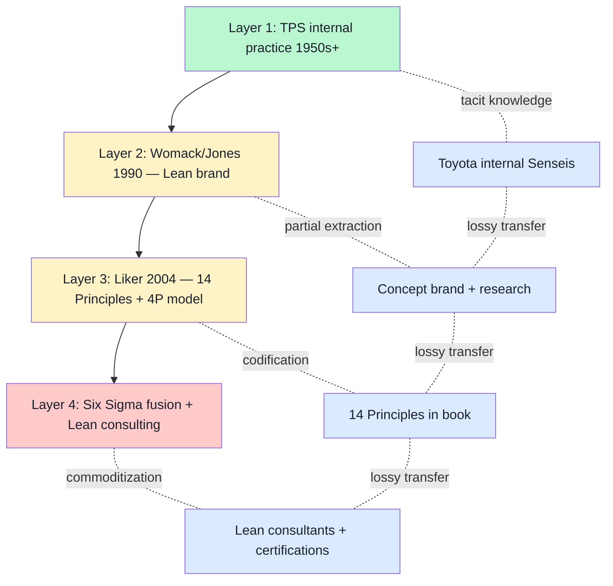

# 14 — TPS tacit→explicit transfer mechanism

> **R1 surface-only.** Workshop curriculum design + mastery transfer mechanism research. How Toyota distributes opaque process knowledge over 70 years.

> **EP-5:** F3 = Liker «The Toyota Way» (2004) + Toyota Way Wikipedia + secondary management literature. Primary Liker PDF не WebFetched.

---

## §0 TL;DR (≤200 слов)

**Toyota Production System (TPS)** = 1950s+ Japanese manufacturing methodology. Toyota practiced TPS internally **decades before formal external documentation**.

**Tacit→explicit transmission attempts:**
- **«The Machine That Changed the World»** (Womack/Jones/Roos 1990) — first major external articulation. Coined «Lean Manufacturing» brand.
- **«The Toyota Way» (Liker 2004)** — **14 Management Principles** organized в **4P model: Philosophy / Process / People+Partners / Problem Solving**

**14 Principles in 2 categories:**
1. **Continuous improvement:** long-term vision, step-by-step challenges, root-cause analysis, ongoing innovation
2. **Respect for human resources:** stable personnel, slow promotion + careful succession, mentorship pairing, internal leader growth

**Key tacit→explicit mechanisms** (per Liker 2004 + management literature):
- **Mentorship pairing** — experienced + newer team members
- **Slow promotion + careful succession** — knowledge protection
- **Internal leader growth** — «грow next generation of leaders internally to make sure they embrace same Philosophy»
- **Coaching manager role** — manager as coach, не command-control
- **Genchi Genbutsu** — go-and-see at actual work site
- **Hansei** — reflection ritual
- **Kaizen** — continuous improvement micro-loop

**Failure pattern (cluster 7 research-adjacent):** «Toyota Way published 2004 vs internal TPS practice gap. Even owner of methodology can struggle to externalize practice into transmissible form.»

**Direct Jetix lesson:** Workshop pattern needs **apprenticeship + mentorship + slow-progression discipline** to handle tacit-knowledge load. F-G-R + AI-substrate помогают, но **не заменяют** mentor-pairing.

---

## §1 TPS tacit→explicit mechanism (4 layers)

**Lossy transfer pattern:** Each layer loses signal — Toyota internal Senseis carry most; «Lean consultants» carry least. This is the **canonical tacit→explicit decay**.

---

## §2 The Toyota Way 14 Principles → FPF Workshop mapping (brigadier inference F3)

| Toyota principle (Liker 2004) | FPF Workshop pattern analog | Mapping |
|---|---|---|
| **P1: Long-term philosophy** | Foundation Architecture v1.0 LOCKED — long-term constitutional posture | DIRECT |
| **P2: Continuous flow** | F-G-R per claim + provenance R6 — continuous flow of evidence | MEDIUM |
| **P3: Pull system** | Workshop demand-driven curriculum (vision/03) | MEDIUM |
| **P4: Level workload (Heijunka)** | Phase 0-3 cadence; not all-at-once | MEDIUM |
| **P5: Stop-and-fix culture (Jidoka)** | Halt-Log-Alert + Default-Deny + Pillar C R11 | DIRECT |
| **P6: Standardized tasks** | F-G-R schema + Foundation 11 Parts + Pillar A/B/C | DIRECT |
| **P7: Visual control** | wiki/ + Karpathy substrate + niche/ symlinks + health monitoring Part 8 | DIRECT |
| **P8: Reliable tested technology** | Substrate-agnostic H8 + careful tech selection (cf. direction 07) | DIRECT |
| **P9: Grow leaders internally** | Workshop apprenticeship + Train-the-Trainer (GTD analog) | DIRECT — Jetix opportunity |
| **P10: Develop people + teams** | H7 People-NS «mastery as currency» | DIRECT |
| **P11: Respect extended network (suppliers/partners)** | L1+ multi-Clan collaboration + R12 | DIRECT |
| **P12: Genchi Genbutsu (go-and-see)** | Workshop physical + AI-substrate hybrid | MEDIUM |
| **P13: Decision by consensus, implement rapidly (Nemawashi)** | A.2.9 SpeechAct + AWAITING-APPROVAL packet + AP-6 dissent | MEDIUM |
| **P14: Learning organization (Hansei + Kaizen)** | Pre-mortem discipline + retrospective + Compound Learning Part 5 | DIRECT |

**Mapping result (F3):** **10 of 14 DIRECT, 4 MEDIUM, 0 absent.** TPS 14 Principles strongly resonate с Jetix Workshop + Foundation design.

---

## §3 What TPS has that Jetix Workshop underweights

### §3.1 Mentor-pairing discipline (P9 + P10)

**Toyota Sensei system:** experienced practitioner mentors newer — long-form (years). **«Grow next generation of leaders internally to make sure they embrace same Philosophy.»**

**Jetix gap:** Workshop pattern (vision/03) currently focuses on curriculum + demonstration; **mentor-pairing protocol may be implicit, not explicit**. Phase 1-2 design surface: explicit mentor-pairing matching mechanism + duration discipline.

### §3.2 Slow promotion + careful succession (P10)

**Toyota:** promotions take years; succession planned carefully across generations.

**Jetix gap:** Foundation Architecture LOCKED 2026; no «succession protocol» explicit yet (cf. direction 02 Cybersyn single-founder lesson). Phase 1-2 surface: explicit Pillar C extension с succession protocol для Foundation maintainership.

### §3.3 Genchi Genbutsu — go-and-see (P12)

**Toyota:** managers physically go to work-site to understand reality.

**Jetix gap:** Workshop pattern partially captures this; AI-substrate (wiki/) reduces need to physically go. **Risk:** «too much в LLM, не enough genchi-genbutsu». Phase 1-2 design surface: physical Workshop component (vision/03) explicit + AI-substrate complement.

### §3.4 Hansei + Kaizen rituals (P14)

**Toyota:** **explicit reflection rituals** — Hansei (humble reflection on mistakes); Kaizen (continuous improvement micro-loops).

**Jetix gap:** pre-mortem + retrospective discipline mentioned in vision but **ritualized cadence** not yet explicit (e.g., daily / weekly / per-cycle rhythm). Phase 1+ surface: explicit Hansei + Kaizen-style cadence rituals в Workshop curriculum + Foundation operations.

---

## §4 TPS distribution failure modes (cluster 7 references)

### §4.1 Lean brand dilution (Womack 1990 → 2000s+)

**Pattern:** «Lean» became loose label; many self-declared Lean consultants without TPS depth.

**Jetix risk:** FPF brand dilution as scale increases. **Mitigation:** explicit FPF certification disсipline (analog to TOCICO model); role-attestation gates «certified» claim.

### §4.2 Six Sigma backlash (2010s+)

**Pattern:** «Six Sigma killed innovation» — process-over-people critique.

**Jetix risk:** Foundation Architecture LOCKED → potential rigidity perception. **Mitigation:** Pillar C Tier 1 manager principles + Corrigibility = explicit anti-rigidity; AP-6 preserve dissent = built-in dissent surface.

### §4.3 Published book vs internal practice gap

**Pattern:** «Toyota Way» published 2004; internal TPS practice 50 years deeper. **Documentation insufficient для transmission.**

**Jetix risk:** Foundation v1.0 LOCKED ≠ practice mastery. **Mitigation:** Workshop pattern explicit; mentor-pairing; Hansei + Kaizen cadence.

---

## §5 Test-able statements

| # | Statement | Test horizon |
|---|---|---|
| TPS1 | Workshop curriculum includes explicit mentor-pairing protocol | Phase 1 Workshop design |
| TPS2 | Foundation succession protocol drafted Phase 1-2 | Phase 1-2 |
| TPS3 | Physical Workshop component preserved (genchi-genbutsu) | Phase 1+ Workshops |
| TPS4 | Hansei + Kaizen-style cadence rituals defined Phase 1 | Phase 1 |
| TPS5 | FPF certification discipline considered Phase 2+ | Phase 2+ |
| TPS6 | «Lean dilution»-style FPF risk monitored | Continuous |

---

## §6 Counter-positions (AP-6 dissent)

- **Counter 1:** Toyota Japanese-cultural context (loyalty + long-term + collective) does не transfer to multilingual + cross-cultural Jetix. **Surface:** legitimate; ШСМ Russian-roots + Catholic-humanism Mondragón + multilingual mix vs Toyota mono-cultural. Adaptation needed.
- **Counter 2:** Pure mentor-pairing breaks at scale (Workshop > 1000 participants). Toyota employed thousands; Jetix at first-Clan 10. Pattern may не scale. **Surface:** correct — Train-the-Trainer (GTD analog) is scale solution; mentor-pairing for first Clan only.
- **Counter 3:** AI-substrate (LLM + wiki/) replaces some mentor functions (instant Q&A; knowledge access). Genchi-genbutsu may be less critical в AI era. **Surface:** partly true; but **physical practice + tacit knowledge** still не fully LLM-replicable.
- **Counter 4:** Liker 2004 «Toyota Way» is interpretation, не direct TPS. Tacit-explicit gap acknowledged by Liker himself. Using Liker as reference inherits the gap. **Surface:** valid; Liker = secondary; primary Toyota practice still tacit + Japanese-internal.

---

## §7 Sources (URLs retrieved 2026-05-18)

- [The Toyota Way — Wikipedia](https://en.wikipedia.org/wiki/The_Toyota_Way) — F3 secondary
- [Liker «The Toyota Way» Amazon](https://www.amazon.com/Toyota-Way-Management-Principles-Manufacturer/dp/0071392319) — F4 primary referenced (book, не WebFetched)
- [Toyota Way 14 Principles Flevy](https://flevy.com/blog/14-principles-of-lean-toyota-production-system-tps/) — F3 secondary
- [TechTarget Toyota Way](https://www.techtarget.com/whatis/definition/Toyota-Way) — F3 secondary
- [ResearchGate 14 Principles summary](https://www.researchgate.net/publication/290007864_The_14_principles_of_the_Toyota_way_An_executive_summary_of_the_culture_behind_TPS) — F3 academic
- [MudaMasters Toyota Way summary](https://www.mudamasters.com/en/lean-production/toyota-way-j-liker-summary) — F3 secondary

---

## §8 What this is NOT

- **NOT replication of Toyota Production System** — surface mapping per R1
- **NOT promotion of 14 Principles as Jetix Foundation** — adjacency, not adoption
- **NOT verification of Toyota internal practice** — tacit-explicit gap acknowledged

**Word count:** ~1830

---

## §9 На человеческом — как Toyota передавал tacit knowledge 70 лет (added brigadier 2026-05-18)

### §9.1 Что это

**Toyota Production System (TPS)** — японская manufacturing methodology, разработана **с 1950-х** в Toyota. **70+ лет** Toyota practice'ла TPS внутри, **decades before formal external documentation**. Это **canonical case** of «**tacit knowledge → explicit knowledge transfer**» — как передать opaque process knowledge через десятилетия + поколения.

**Известные попытки externalization:**

1. **1990 — «The Machine That Changed the World»** (Womack / Jones / Roos, MIT IMVP) — first major external articulation. Coined «**Lean Manufacturing**» brand
2. **2004 — «The Toyota Way»** (Jeffrey Liker) — **14 Management Principles** organized в **4P model: Philosophy / Process / People+Partners / Problem Solving**

**14 Principles в 2 категориях:**
- **Continuous improvement:** long-term vision / step-by-step challenges / root-cause analysis / ongoing innovation
- **Respect for human resources:** stable personnel / slow promotion + careful succession / mentorship pairing / internal leader growth

**Ключевые tacit→explicit mechanisms:**
- **Mentorship pairing** — experienced + newer team members
- **Slow promotion + careful succession** — knowledge protection
- **Internal leader growth** — «grow next generation of leaders internally»
- **Coaching manager role** — manager as coach, не command-control
- **Genchi Genbutsu** = «go-and-see» (managers physically visit work-site)
- **Hansei** = humble reflection on mistakes (ritual)
- **Kaizen** = continuous improvement micro-loops

**Failure pattern:** «Toyota Way published 2004 vs internal TPS practice gap. **Even owner of methodology can struggle to externalize practice into transmissible form.**»

Аналогия: представь что у Toyota есть рецепт супер-effective manufacturing который **работает 70 лет** — но когда они пытаются написать книгу «вот как мы это делаем», 50% знания **теряется** при transfer, потому что значительная часть = **tacit** (то что в головах опытных мастеров, не в текстах). И **Lean consultants** copy книгу но не имеют **Sensei lineage** → diluted version.

### §9.2 Ключевые pointы

- **1950s+** TPS internal practice begins
- **1990** Womack/Jones/Roos «The Machine That Changed the World» — first external
- **2004** Liker «The Toyota Way» — 14 Principles + 4P model
- **2010s+** Six Sigma backlash («process killed innovation»)
- **«Lean dilution»** — many self-declared Lean consultants без TPS depth
- **Lossy transfer pattern (4 layers):** Toyota internal Senseis → Lean brand → Liker 14 Principles → Six Sigma + consulting commoditization

### §9.3 Зачем нам это для Jetix

**Это direct input для Workshop curriculum design + mastery transfer mechanism** (vision/03 Workshop / Мастерская).

**Mapping 14 Principles → FPF Workshop:**
- **10 of 14 DIRECT** mapping
- **4 of 14 MEDIUM** mapping
- **0 of 14 absent**

**TPS 14 Principles strongly resonate с Jetix Workshop + Foundation design.** Direct examples:
- **P1 Long-term philosophy** ↔ Foundation Architecture v1.0 LOCKED
- **P5 Stop-and-fix (Jidoka)** ↔ Halt-Log-Alert + Default-Deny + Pillar C R11
- **P6 Standardized tasks** ↔ F-G-R schema + Foundation 11 Parts
- **P7 Visual control** ↔ wiki/ + Karpathy substrate + Part 8 health monitoring
- **P8 Reliable tested technology** ↔ Substrate-agnostic H8 (cf. direction 07)
- **P9 Grow leaders internally** ↔ Workshop apprenticeship + Train-the-Trainer
- **P10 Develop people** ↔ H7 People-NS «mastery as currency»
- **P11 Respect extended network** ↔ L1+ multi-Clan + R12
- **P14 Learning organization (Hansei + Kaizen)** ↔ Pre-mortem + retrospective + Compound Learning Part 5

**4 Jetix-underweight gaps (TPS strengths we miss):**

1. **Mentor-pairing discipline (P9 + P10)** — Toyota Sensei system: experienced practitioner mentors newer long-form (years). **Jetix gap:** Workshop currently focuses on curriculum + demonstration; mentor-pairing protocol implicit. **Phase 1-2 design surface:** explicit mentor-pairing matching + duration discipline

2. **Slow promotion + succession (P10)** — Toyota promotions take years; succession planned across generations. **Jetix gap:** Foundation Architecture LOCKED 2026 но no «succession protocol» explicit (cf. Cybersyn single-founder lesson, doc 02). **Phase 1-2:** Pillar C extension с succession protocol

3. **Genchi Genbutsu — go-and-see (P12)** — managers physically visit work-site. **Jetix risk:** «too much в LLM, не enough genchi-genbutsu» — AI-substrate reduces need to physically go. **Phase 1-2:** physical Workshop component explicit + AI-substrate complement (не substitute)

4. **Hansei + Kaizen rituals (P14)** — Toyota: **explicit reflection rituals** (Hansei humble reflection on mistakes; Kaizen continuous improvement micro-loops). **Jetix gap:** pre-mortem + retrospective mentioned, но **ritualized cadence** not yet explicit (daily / weekly / per-cycle rhythm). **Phase 1+:** explicit Hansei + Kaizen-style cadence в Workshop curriculum

**3 failure-mode warnings для Jetix:**

| TPS failure | Jetix risk | Mitigation |
|---|---|---|
| **Lean brand dilution** | FPF brand dilution at scale | Explicit FPF certification (TOCICO-style); role-attestation gates «certified» claim |
| **Six Sigma backlash** | Foundation rigidity perception | Pillar C Tier 1 + Corrigibility = explicit anti-rigidity; AP-6 dissent built-in |
| **Published book vs internal practice gap** | Foundation v1.0 ≠ practice mastery | Workshop pattern explicit; mentor-pairing; Hansei + Kaizen cadence |

**Cross-refs:** vision/jetix-fpf-describe/03 Workshop / Мастерская, research/adjacent-ideas-2026-05-17/07 (methodology distribution), research/deepening-2026-05-18/06 (Mondragón Train-the-Trainer parallel), research/deepening-2026-05-18/02 (Cybersyn single-founder anti-pattern).

### §9.4 Concrete actions

**Сейчас (Phase 0):**

1. **Прочитать Liker «The Toyota Way» summary** (Wikipedia article + Flevy summary) — overview 14 Principles, 4P model
2. **Identify 4 Jetix-underweight gaps** для Phase 1 design — mentor-pairing / succession / genchi-genbutsu / Hansei+Kaizen rituals

**Phase 1 (Workshop design):**

3. **Explicit mentor-pairing protocol** в Workshop curriculum — matching mechanism + duration (e.g., 3 months minimum); test TPS1
4. **Hansei + Kaizen cadence rituals** определены — weekly retrospective + daily standup analog. Test TPS4
5. **Physical Workshop component preserved** (genchi-genbutsu) — Workshop = physical + AI-substrate hybrid, не pure-online. Test TPS3

**Phase 1-2:**

6. **Foundation succession protocol drafted** — Pillar C extension; bus-factor ≥ 3 для каждого critical Foundation component. Test TPS2

**Phase 2+:**

7. **FPF certification discipline** considered — analog TOCICO; role-attestation gates «certified» claim — anti-Lean-dilution. Test TPS5

**Continuous:**

8. **«Lean dilution»-style FPF brand monitoring** — periodic check (e.g., quarterly): сколько self-declared FPF practitioners без F-G-R discipline?

### §9.5 Резюме на 2 строки

**TPS = 70-летний empirical case что tacit knowledge **частично** externalizable через 14 Principles + mentor-pairing + Hansei/Kaizen rituals, но lossy transfer real.** Для Jetix Workshop: 10/14 principles already align; 4 gaps (mentor-pairing / succession / genchi-genbutsu / rituals) = Phase 1 design priorities.

---

*Plain English section added by brigadier 2026-05-18 per Ruslan request. Word count of §9: ~870.*

