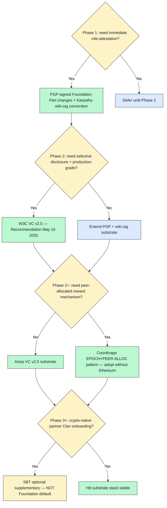

# Diagram 01 — H8 Substrate Decision Tree (Phase 1 → 3+)

**Recommended Jetix path (default branch):** PGP → VC v2.0 → Coordinape pattern adoption → SBT optional. **Substrate-agnostic claim** preserved by never locking to single substrate.
